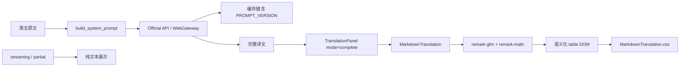

# Markdown 表格译文渲染与提示词约束：轻量软件设计文档

## 文档状态

| 字段 | 值 |
|---|---|
| 状态 | Approved |
| 版本 | 0.2 |
| 最后更新 | 2026-09-03 |
| 目标项目/模块 | easyT 前端 Markdown 译文渲染与共享翻译 Prompt |
| 预期实施者 | Model-neutral coding agent |
| 相关需求 | FR-001～FR-006 / NFR-001～NFR-004 |
| 代码版本 | Working tree（未提交；基线 HEAD 为 `4a0cb3b`） |

> 本文是实现前设计。除非评审者明确批准，否则 coding agent MUST NOT 开始业务代码实现，也不得将本文状态改为 `Approved`。

## 1. 模块设计

### 1.1 目标

让完整译文中的 GitHub Flavored Markdown（GFM）表格被渲染为语义化 HTML 表格，同时在共享翻译系统提示词中明确要求模型：遇到原文表格或明显的行列数据时输出 GFM 表格，而不是使用空格或换行模拟列。

该功能必须覆盖当前译文和已加载的历史译文，保留现有公式、代码、粗体、链接安全处理、流式输出和复制原始文本行为。

### 1.2 非目标

- 不实现自定义 Markdown 解析器或表格字符串分割器。
- 不把流式译文或未完成译文提前交给 Markdown 渲染器；这仍按现有设计显示原始纯文本。
- 不支持任意原始 HTML 渲染，不启用 `rehypeRaw`。
- 不改变翻译后端、IPC 请求/响应结构、历史数据库 schema、复制格式或术语表行为。
- 不引入 UI 框架、表格组件库或新的 UI runtime dependency。
- 不进行与表格功能无关的 UI Kit、Tailwind、翻译流程或缓存重构。

### 1.3 已验证现状

以下是从仓库实际代码确认的事实，不是设计假设：

- `src/components/translation/MarkdownTranslation.tsx` 已使用 `react-markdown`、`remark-math` 和 `rehype-katex`，但 `remarkPlugins` 未包含 `remark-gfm`。
- `package.json` 和 `package-lock.json` 中没有 `remark-gfm`；`react-markdown` 默认按 CommonMark 解析，表格需要 GFM 插件。
- `src/components/translation/TranslationPanel.tsx` 仅在 `mode="complete"` 时加载 Markdown 渲染器；`streaming` 和 `partial` 仍使用纯文本。
- `src/components/translation/TranslationRecord.tsx` 的历史译文通过 `TranslationPanel mode="complete"` 渲染，因此共享 Markdown 组件即可覆盖历史正文。
- `src/components/translation/MarkdownTranslation.css` 当前有段落、列表、代码和 KaTeX 样式，没有表格专属样式。
- `src-tauri/src/translation_backend/prompt.rs` 的 `build_system_prompt` 是 Official API 与 WebGateway 共用的 Prompt 构造入口，当前 `PROMPT_VERSION` 为 2。
- `src-tauri/src/translation_backend/cache/key.rs` 使用 `PROMPT_VERSION` 参与缓存键；Prompt 内容或格式约束变化时需要提升版本。
- 现有验证命令已在设计前运行通过：`npm run typecheck`、`npm test`（21 个文件/124 个测试）和 `npm run build`。
- 当前工作树已有用户修改：`package-lock.json` 仅缺少末尾换行；coding agent MUST 保留该修改，不得用本需求顺手重写整个 lockfile。

### 1.4 设计假设与约束

| ID | 类型 | 内容 | 若不成立的影响 |
|---|---|---|---|
| ASM-001 | 假设 | 继续使用当前 `react-markdown` 10.x、Unified/remark 生态。 | 需要重新评估插件接口与依赖兼容性。 |
| ASM-002 | 假设 | `remark-gfm` 可作为普通前端运行时依赖安装，并与现有 `remark-math` 共用。 | 需要评估等价的 GFM 解析方案；不得自行写表格解析器。 |
| CON-001 | 约束 | 翻译结果字符串必须保持原始 Markdown/LaTeX，渲染只是展示层行为。 | 不能通过后处理把表格转成 HTML 或改写复制文本。 |
| CON-002 | 约束 | Prompt 通过共享 `build_system_prompt` 进入两个翻译后端。 | 不得在某一个 adapter 中单独加入表格要求。 |

### 1.5 模块关系



### 1.6 运行流程

正常流程：

1. `build_system_prompt` 在既有基础要求中加入 GFM 表格输出规则。
2. `PROMPT_VERSION` 从 2 提升到 3，使新 Prompt 不复用旧 Prompt 版本的缓存键。
3. 翻译后端返回包含 GFM 表格的完整译文字符串。
4. `TranslationPanel` 在完整模式下懒加载 `MarkdownTranslation`。
5. `remark-gfm` 将表头、分隔行和数据行解析为 table AST；`react-markdown` 输出 `<table>`、`<thead>`、`<tbody>`、`<th>` 和 `<td>`。
6. `MarkdownTranslation.css` 为表格提供 token 化的边框、间距和窄窗口横向滚动样式。

异常与降级流程：

- 表格语法不完整、列数不一致或模型返回普通文本时，Markdown 解析器按其标准规则降级为段落/文本；不得抛出影响译文页面的异常。
- `remark-gfm` 加载失败时，现有 `Suspense` fallback 仍显示原始完整文本；coding agent MUST 不得删除该安全降级。
- 流式或未完成内容继续走纯文本路径，避免半截表格形成误导性的结构化展示。
- 历史正文折叠时继续卸载 Markdown 渲染树；展开后按同一完整译文路径渲染表格。

## 2. 接口契约

### 2.1 前端 Markdown 渲染契约

现有公开组件接口保持不变：

```text
MarkdownTranslation(props: { text: string }): JSX.Element
```

契约要求：

- `text` MUST 被视为 Markdown/LaTeX 源字符串，组件不得修改其业务文本内容；现有 `normalizeTaggedEquations` 仅继续承担 KaTeX 编号公式兼容处理。
- 解析插件 MUST 同时保留现有数学能力并新增 GFM 能力，目标配置为 `remark-gfm` 与 `remark-math` 共存。
- 对合法 GFM 表格，DOM MUST 包含 `<table>`，表头 MUST 使用 `<th>`，数据单元格 MUST 使用 `<td>`，单元格中的 `**...**` MUST 继续成为 `<strong>`。
- 表格中的链接仍遵守当前 `a: ({ children }) => <span>{children}</span>` 安全展示契约，不得因启用 GFM 改为可点击外链。
- 不启用原始 HTML 透传；输入中的 HTML 仍按当前安全策略处理。

### 2.2 共享 Prompt 契约

现有函数签名保持不变：

```text
build_system_prompt(target_language: &str, termbase: &EffectiveTermbase) -> String
```

契约要求：

- 表格规则 MUST 位于共享基础 Prompt 中，并适用于 Official API 与 WebGateway。
- 当原文是表格或包含明显的行列数据时，模型 MUST 输出 GFM Markdown 表格；不能用多个空格、制表符或普通换行模拟列。
- GFM 表格 MUST 包含表头、分隔行和每行的 `|` 分隔符；不得放入代码围栏，不得改为 HTML table。
- 模型 MUST 保持原文的行列对应关系、数值、单位和 Markdown 粗体等格式语义；单元格中本身需要显示的 `|` MUST 转义为 `\|`。
- 如果输入不是表格，不得为满足该规则而强行改写成表格。
- 表格规则 MUST 不削弱已有的公式、代码标识符、术语、只输出译文和不解释翻译过程约束。
- Prompt 内容变化后 `PROMPT_VERSION` MUST 为 3；术语块仍按现有逻辑追加在基础 Prompt 之后。

建议加入的中文 Prompt 文案应保持短而明确，至少表达以上契约；具体句号、编号可按现有 `prompt.rs` 风格调整，但不得减少语义覆盖。

为避免模型只理解“使用表格”而未理解具体语法，Prompt 文案 SHOULD 同时给出最小格式示例：

```text
| 列名 A | 列名 B |
| --- | --- |
| 值 A | 值 B |
```

该示例是 Prompt 约束的一部分，不是要求模型在每次译文中额外输出的固定内容。

### 2.3 兼容与缓存契约

- `BackendRequest`、Tauri Command、adapter 请求体和前端状态接口 MUST NOT 改变。
- Prompt 版本 2 的缓存条目不删除、不迁移；版本 3 通过缓存键自然形成新命中空间。
- 已有历史记录不依赖重新翻译即可在新前端中获得表格渲染，只要保存的译文文本本身符合 GFM。

## 3. 数据变更

本阶段不涉及持久化 schema、字段、数据库迁移或敏感数据处理。唯一相关状态变化是 `PROMPT_VERSION` 从 2 到 3，属于既有缓存键版本兼容机制，不需要数据回填或删除。

回滚时可回退前端插件/样式和 Prompt 代码；若保留版本 3，回退后的旧代码可能无法命中版本 3 缓存，这是可接受的版本隔离结果。coding agent MUST 在最终报告中说明实际回滚策略（如执行了回滚）。

## 4. 设计决策与取舍

| ID | 决策 | 理由 | 考虑过的替代方案 | 后果 |
|---|---|---|---|---|
| ADR-001 | 使用 `remark-gfm` 解析表格。 | 与当前 `react-markdown` 链路一致，能同时处理表格及其他 GFM 语法，避免自定义解析器。 | 手写按行/竖线分割；风险是公式、转义、空单元格和嵌套 Markdown 易被破坏。 | 新增一个 Markdown 解析依赖，并需更新 lockfile 与 bundle 测量。 |
| ADR-002 | 表格样式归属 `MarkdownTranslation.css`。 | 表格是 Markdown 领域展示能力，不属于通用 UI Kit 表格组件。 | 新建通用 Table UI module；当前只有一个领域调用方，不满足复用条件。 | 只影响翻译 Markdown 展示，保持 UI Kit 目录边界。 |
| ADR-003 | 在共享 Prompt 中规定“遇到表格才输出 GFM 表格”。 | 同时解决模型输出格式和前端解析格式，避免所有段落被强制表格化。 | 只依赖前端猜测/修复扁平文本；无法可靠恢复行列关系。 | Prompt 版本必须提升，新的请求会自然错过旧 Prompt 缓存。 |
| ADR-004 | 窄窗口采用表格外层滚动容器。 | 保留语义 table DOM，同时避免 360px 窗口撑破页面。 | 直接给 table 设置 `display:block`；可能影响原生 table layout。 | 需要在 Markdown renderer 的 `table` 映射或等价样式边界中维护一个展示容器。 |

## 5. 组件变更设计

### 5.1 `src/components/translation/MarkdownTranslation.tsx`

- **变更类型：** Modify
- **职责：** 在现有 Markdown/KaTeX 渲染链路中启用 GFM，并为表格提供必要的窄窗口展示边界。
- **需求：** FR-001、FR-002、FR-003、NFR-001、NFR-002
- **允许变更：** import、`remarkPlugins`、`components` 中与 table 展示直接相关的映射；不得重写现有公式归一化、链接安全处理或懒加载边界。
- **实现要求：**
  - 添加 `remark-gfm` 导入并与 `remarkMath` 一并传入 `remarkPlugins`。
  - 若采用 ADR-004 的滚动容器，使用语义化 `<div>` 包裹 `<table>`；不得把表格内容转换为字符串或手工拆列。
  - 保持 ReactMarkdown 默认的未知/不安全 HTML 处理策略。

### 5.2 `src/components/translation/MarkdownTranslation.css`

- **变更类型：** Modify
- **职责：** 管理翻译 Markdown 子元素的表格视觉和窗口适配。
- **需求：** FR-002、NFR-001、NFR-002、NFR-003
- **实现要求：**
  - 为表格滚动容器设置最大宽度和横向溢出处理。
  - 为 table、thead、th、td、tbody、tr 提供紧凑阅读间距、对齐和分隔线。
  - 使用现有语义 token/Tailwind 类（例如 `border-line`、`surface-soft`、`ink` 等），不得新增十六进制、RGB/HSL 实际颜色值。
  - 不覆盖 GFM 产生的列对齐语义；数字列的右对齐应由 Markdown 对齐语法产生的 DOM 属性/样式保留。
  - 在 520×390 和 360×200 窗口下不得造成页面主体横向溢出；表格自身允许横向滚动。

### 5.3 `package.json` 与 `package-lock.json`

- **变更类型：** Modify
- **职责：** 声明并锁定 `remark-gfm` 运行时依赖。
- **需求：** FR-001、NFR-004
- **实现要求：**
  - 只增加与 `remark-gfm` 直接相关的依赖变更；不得升级无关依赖或重排 lockfile。
  - 保留工作树中已有的 `package-lock.json` 末尾换行修改，实施后报告 lockfile 差异。

### 5.4 `src-tauri/src/translation_backend/prompt.rs`

- **变更类型：** Modify
- **职责：** 为两个翻译后端提供统一的表格输出约束并维护 Prompt 版本。
- **需求：** FR-004、FR-005、FR-006、NFR-004
- **实现要求：**
  - 将 `PROMPT_VERSION` 从 2 提升到 3，并更新附近注释说明版本变化原因。
  - 在共享基础 Prompt 中加入 GFM 表格要求，覆盖第 2.2 节契约。
  - 保持 `build_system_prompt` 签名、术语块追加顺序和空术语表行为。

### 5.5 测试文件

- `src/components/translation/MarkdownTranslation.test.tsx`：补充完整 GFM 表格的 DOM、表头、行数、粗体和对齐验证。
- `src-tauri/src/translation_backend/prompt.rs` 的现有 `#[cfg(test)] mod tests`：补充表格 Prompt 文案、GFM 关键格式和“不强行表格化”约束验证；现有公式/术语测试必须保留。
- `src-tauri/src/translation_backend/cache/key.rs` 的缓存版本和固定向量测试：同步 Prompt 版本 3 导致的测试期望值变化；不得修改生产缓存编码算法。
- 如实现引入 table wrapper 的可观察 class 或组件映射，测试只断言语义 DOM 和必要的滚动容器，不锁定内部 Tailwind class map。

## 6. 验证与可追溯性

### 6.1 功能需求

| ID | 需求 | 验收标准 |
|---|---|---|
| FR-001 | 完整译文 MUST 支持 GFM 表格解析。 | 给 `MarkdownTranslation` 传入本需求中的三列表格时，DOM 含 1 个 `<table>`、1 个 `<thead>`、对应 `<th>` 和 `<tbody>` 数据行。 |
| FR-002 | 表格 MUST 保留 Markdown 单元格语义。 | `**0.8966**` 和 `**0.1329**` 渲染为 `<strong>`；列对齐标记不会被清除。 |
| FR-003 | 表格 MUST 适配当前翻译页面和历史正文。 | 当前成功译文与展开的历史译文均使用 `TranslationPanel mode="complete"` 的同一 Markdown renderer；流式/未完成译文仍为纯文本。 |
| FR-004 | 共享 Prompt MUST 明确规定表格输出形式。 | `build_system_prompt("简体中文", empty)` 的结果包含 GFM 表格要求、表头/分隔行/竖线要求、禁止代码围栏或 HTML table 的要求。 |
| FR-005 | Prompt MUST 保持普通文本与表格边界。 | Prompt 测试断言表格规则仅针对原文为表格或明显行列数据的情况，不要求普通段落表格化。 |
| FR-006 | Prompt 版本 MUST 与缓存兼容机制同步。 | `PROMPT_VERSION == 3`；缓存键继续引用该常量；不修改缓存 schema。 |

### 6.2 非功能需求

| ID | 类别 | 需求 | 度量/验收方式 |
|---|---|---|---|
| NFR-001 | 可访问性 | MUST 使用语义 table/head/body/cell 元素。 | DOM 检查 `<thead>`, `<th>`, `<tbody>`, `<td>`；不以 div 网格替代表格。 |
| NFR-002 | 窗口适配 | MUST 支持默认 520×390 与最小 360×200。 | 手工检查窄窗口；页面主体不被表格撑出，表格可局部横向滚动。 |
| NFR-003 | UI Kit/安全 | MUST 复用现有 token；不得启用原始 HTML 或新增通用 UI module。 | 静态搜索实际颜色值、`rehypeRaw`、新增 UI dependency 和跨 seam 深层 import。 |
| NFR-004 | 性能/兼容 | MUST 保持 Markdown 懒加载和现有翻译行为；新增依赖体积需可测量。 | `npm run build` 成功，记录 Markdown chunk 与 CSS gzip 变化；全量测试通过。 |

### 6.3 测试映射

| 测试 ID | 层级 | 文件/命令 | 场景 | 覆盖需求 |
|---|---|---|---|---|
| T-001 | 前端组件 | `src/components/translation/MarkdownTranslation.test.tsx` | 使用本需求的三列表格 fixture；生成 1 个 table、1 个 thead、3 个表头单元格和 7 个 tbody 数据行。 | FR-001、NFR-001 |
| T-002 | 前端组件 | `src/components/translation/MarkdownTranslation.test.tsx` | 表格内粗体、数字和对齐标记保留。 | FR-002 |
| T-003 | 前端领域回归 | `src/components/translation/TranslationPanel.test.tsx` 及既有 TranslationPage/历史测试 | complete 使用 Markdown；streaming/partial 不使用 Markdown。 | FR-003 |
| T-004 | Rust 单元 | `src-tauri/src/translation_backend/prompt.rs` | Prompt 包含 GFM 表格要求且不破坏公式/术语块。 | FR-004、FR-005 |
| T-005 | Rust 单元/静态 | `src-tauri/src/translation_backend/cache/key.rs` 现有测试与 `rg` | Prompt 版本提升，缓存键继续使用版本常量。 | FR-006 |
| T-006 | 构建回归 | `npm run typecheck`, `npm test`, `npm run build`, `cargo test --manifest-path src-tauri/Cargo.toml` | 全量编译、测试和构建。 | NFR-004 |

### 6.4 手工验证

使用本需求表格作为固定 fixture，通过真实翻译结果或开发 fixture 验证：

1. 完整译文显示“译文”标签后，内容呈现表头、列和行，而不是显示 `|` 与 `---`。
2. 表格中粗体数值仍为粗体，长表格在 360×200 下仅表格区域横向滚动。
3. 流式输出期间仍显示原始文本；翻译完成后才切换为 Markdown 表格。
4. 展开一条已有历史译文时，正文按同一规则渲染；折叠时 Markdown 渲染树卸载。
5. 复制结果仍是原始 Markdown/LaTeX 文本，而非 HTML 或视觉文本。
6. 表格内链接仍不是可点击外链，原始 HTML 不被透传。

## 7. 实施计划（交给 coding agent）

### P1：依赖与 Prompt 契约

- **前置条件：** SDD 已明确批准；工作树检查完成；确认 `package-lock.json` 现有末尾换行修改属于用户工作。
- **文件/符号：** `package.json`、`package-lock.json`、`src-tauri/src/translation_backend/prompt.rs` 的 `PROMPT_VERSION`、`build_system_prompt` 和 Rust tests。
- **动作：** 添加 `remark-gfm`；将 Prompt 版本设为 3；加入精确覆盖第 2.2 节的 GFM 表格规则；补充 Prompt 回归测试。
- **要求：** FR-004～FR-006、NFR-004。
- **验证：** `cargo test --manifest-path src-tauri/Cargo.toml translation_backend::prompt`（若过滤器与仓库测试命名不匹配，coding agent MUST 记录实际命令并运行完整 cargo test）；检查 Prompt 版本与文本断言。
- **完成标准：** Prompt 测试通过，函数签名和术语块行为未变，依赖只包含必要变更。

### P2：前端 GFM 渲染与样式

- **前置条件：** P1 的依赖安装和 Prompt 测试通过。
- **文件/符号：** `src/components/translation/MarkdownTranslation.tsx` 的插件/组件配置；`src/components/translation/MarkdownTranslation.css` 的 Markdown 子元素样式。
- **动作：** 启用 `remark-gfm`；必要时为 table 增加语义 wrapper；加入 token 化表格样式和局部横向滚动；不改 complete/streaming/partial 状态分支。
- **要求：** FR-001～FR-003、NFR-001～NFR-003。
- **验证：** 先补充并运行 `MarkdownTranslation.test.tsx` 表格测试，再运行 `npm run typecheck` 和目标 Vitest 测试。
- **完成标准：** 合法表格产生语义 DOM，公式/粗体/链接现有测试通过，窄窗口不会产生页面级横向溢出。

### P3：领域回归、视觉检查与发布验证

- **前置条件：** P2 通过；不再存在未解释的前端失败。
- **文件/符号：** 只更新与 P1/P2 直接相关的测试、必要文档或基线记录；不得扩展到无关领域。
- **动作：** 验证当前译文、历史译文、流式/未完成译文、复制和安全处理；记录 bundle 变化。
- **要求：** FR-003、NFR-002～NFR-004。
- **验证命令：**
  - `npm run typecheck`
  - `npm test`
  - `npm run build`
  - `cargo fmt --manifest-path src-tauri/Cargo.toml --all -- --check`
  - `cargo test --manifest-path src-tauri/Cargo.toml`
  - `cargo build --release --manifest-path src-tauri/Cargo.toml`
  - 仓库未定义 `npm run lint`，不得伪造该命令成功；如执行其他已有格式/lint 命令，报告实际命令。
- **完成标准：** 所有已验证命令退出码为 0；手工检查覆盖 520×390 与 360×200；报告 changed files、需求覆盖、验证证据、偏差和剩余工作。

## 8. 风险、开放问题与偏差规则

### 8.1 风险

| ID | 风险 | 可能性/影响 | 缓解措施 |
|---|---|---|---|
| RISK-001 | 模型仍返回空格对齐或不完整表格。 | 中/中 | Prompt 明确 GFM 规则；前端对非法 Markdown 安全降级，不做脆弱后处理；以固定 fixture 回归。 |
| RISK-002 | 新插件增加 Markdown 异步 chunk 体积。 | 中/低 | 保持 `TranslationPanel` lazy import；记录构建前后 gzip；若超过 UI Kit 预算，报告并停在偏差评审。 |
| RISK-003 | 表格长单元格撑破窄窗口。 | 中/中 | 使用外层局部滚动容器；在 360×200 手工检查。 |
| RISK-004 | Prompt 变化使新请求缓存命中率短期下降。 | 高/低 | 提升版本是既有缓存契约要求；旧条目保留，新版本自然隔离。 |

### 8.2 开放问题

| ID | 问题 | 阻塞性 | 默认决策 |
|---|---|---|---|
| Q-001 | 表格标题是否需要转换为 HTML `<caption>`？ | 否 | 本阶段不新增 caption 规则；标题/说明继续作为普通 Markdown 内容，表格本身保持语义结构。 |
| Q-002 | 是否需要支持 GFM 表格之外的完整 GFM 功能？ | 否 | 依赖按标准 `remark-gfm` 启用，但需求和测试只锁定表格；不得借机扩展产品行为。 |

### 8.3 偏差处理

如果仓库实际状态与本文冲突，coding agent MUST 在受影响阶段停止并记录：`DEV-001` 起始的编号、SDD 设计、精确文件/符号/命令证据、最小调整、受影响需求、影响和需要的批准。不得静默把表格改造为别的方案。

## Coding Agent Execution Protocol

### 1. Execution Objective

只实现本文已批准的表格渲染、共享 Prompt 表格约束、Prompt 版本兼容和相关验证范围。保留范围外的 easyT 行为，并满足全部 FR/NFR 验收标准。

### 2. Authority and Conflict Resolution

按以下顺序处理冲突：

1. 用户最新明确指令。
2. 本 SDD 及其已批准修订。
3. `AGENTS.md`、`CONTEXT.md`、UI Kit 文档和其他仓库贡献规则。
4. 现有公开接口、缓存契约和测试。
5. 最近邻代码的既有约定。
6. coding agent 的个人实现偏好。

出现冲突时不得静默选择。涉及数据丢失、公共接口、安全边界、缓存兼容或超出本 SDD 的依赖变更时，必须停止并走偏差协议。

### 3. Allowed Scope

#### Files Expected to Change

| 文件 | 符号/职责 | 允许变更 | 需求 |
|---|---|---|---|
| `package.json` | dependencies | 添加 `remark-gfm` | FR-001、NFR-004 |
| `package-lock.json` | lockfile entry | 锁定直接/传递依赖；保留已有末尾换行修改 | FR-001、NFR-004 |
| `src/components/translation/MarkdownTranslation.tsx` | `MarkdownTranslation` | 启用 GFM、必要 table wrapper | FR-001～FR-003 |
| `src/components/translation/MarkdownTranslation.css` | Markdown 子元素样式 | 添加 table 样式/窄窗口滚动 | FR-002、NFR-001～NFR-003 |
| `src/components/translation/MarkdownTranslation.test.tsx` | 组件测试 | 添加表格行为测试 | FR-001～FR-003 |
| `src-tauri/src/translation_backend/prompt.rs` | Prompt 常量/构造函数/Rust tests | Prompt 版本 3、表格规则、回归断言 | FR-004～FR-006 |
| `src-tauri/src/translation_backend/cache/key.rs` | `cache_key_and_prompt_versions_are_current`, `fixed_key_vectors_are_stable_snapshots` | 同步 Prompt 版本 3 的测试期望值，不改编码逻辑 | FR-006 |

#### Files That Must Not Change

- `src-tauri/src/translation_backend/models.rs`、adapter、Tauri commands、cache schema 和历史数据库代码。
- `src-tauri/src/translation_backend/cache/key.rs` 的生产缓存键编码逻辑；仅允许更新本需求导致失效的测试期望值。
- `src/components/ui`、`src/components/patterns` 及与本需求无关的页面/领域模块。
- `src/index.css`、设计 token 实际值和全局 UI recipe。
- 生成目录 `dist`、`target`、`node_modules` 以及任何 vendored 文件。

#### Permitted Supporting Changes

只允许为编译、测试或依赖锁定所需的直接支持变更；任何新增文件、额外依赖、格式化 churn 或测试重构都必须在最终报告中列出并解释。

### 4. Mandatory Preflight

编辑前 coding agent MUST：

1. 读取本文全文、`AGENTS.md`、`CONTEXT.md` 和 [`docs/UI-Kit需求与架构共识文档.md`](docs/UI-Kit需求与架构共识文档.md)。
2. 检查工作树，确认并保留已有 `package-lock.json` 末尾换行修改。
3. 检查本文列出的每个文件、符号、依赖和命令仍存在。
4. 检查 `docs/adr/`；若目录不存在，按仓库 domain 规则继续，不创建无关 ADR。
5. 输出简短 preflight 报告：已读文件、计划变更、假设、冲突、阶段和检查命令。
6. 本文状态不是 `Approved`、存在阻塞问题或发现阻塞冲突时，不得开始实现。

### 5. Execution Phases

按 P1 → P2 → P3 顺序执行；每阶段完成其验证和出口标准后才能进入下一阶段。若某阶段失败，先在本范围内诊断；不得带着未解释失败进入下一阶段。

### 6. Implementation Rules

- 遵守 easyT 现有目录 seam、UI Kit、TypeScript/Rust 格式和最近邻测试风格。
- 不执行无关依赖升级、视觉改版、Markdown 全面重构或缓存清理。
- 不启用 `rehypeRaw`，不手写表格解析器，不改变复制源文本。
- 不删除现有 Suspense fallback、流式/partial 纯文本分支或 KaTeX/链接安全行为。
- 若设计发生批准后的变化，必须同步更新本文、版本/修订历史和最终报告。

### 7. Deviation Protocol

无法按本文实现时，立即停止受影响阶段并报告：

| 字段 | 必填内容 |
|---|---|
| Deviation ID | `DEV-001`、`DEV-002`…… |
| Planned design | 本文要求的设计 |
| Repository evidence | 精确文件、符号、测试或命令输出 |
| Proposed change | 最小可行调整 |
| Requirements affected | FR/NFR ID |
| Impact | API、数据、兼容、安全、性能、测试和进度影响 |
| Approval needed | 是否需要项目负责人批准 |

只有不改变契约、需求或行为、且仅为编译/格式所需的局部调整可以不停顿执行，但仍必须在最终报告中记录。

### 8. Stop Conditions

以下情况必须停止并请求方向：

- 本文未获批准。
- 依赖、路径、符号、命令或既有契约与本文有实质差异。
- 需要改变公共 API、持久化数据、安全边界、复制语义或缓存兼容保证。
- 测试结果与本文要求矛盾，且不能在本范围内修复。
- 需要新增未经批准的 UI dependency、原始 HTML 或跨领域模块。
- 继续操作可能覆盖用户未提交的工作。

### 9. Verification Contract

coding agent MUST 运行并报告实际结果：

| 检查 | 命令 | 结果要求 |
|---|---|---|
| Rust format | `cargo fmt --manifest-path src-tauri/Cargo.toml --all -- --check` | 退出码 0；无格式差异 |
| Typecheck | `npm run typecheck` | 退出码 0 |
| Frontend tests | `npm test` | 全部测试通过，包含新增表格测试 |
| Frontend build | `npm run build` | 退出码 0；记录 bundle gzip 变化 |
| Rust tests | `cargo test --manifest-path src-tauri/Cargo.toml` | 全部测试通过 |
| Release build | `cargo build --release --manifest-path src-tauri/Cargo.toml` | 退出码 0 |
| Manual UI | 520×390、360×200 fixture 检查 | 表格渲染、局部滚动、流式降级和历史展开符合本文 |

仓库没有 `npm run lint` 脚本；不得声称该检查已运行或通过。

### 10. Completion Report Contract

最终报告 MUST 包含：

1. **Outcome：** completed、partially completed 或 blocked。
2. **Changed files：** 每个文件及符号/行为变化。
3. **Requirement coverage：** FR/NFR ID 与对应测试。
4. **Verification evidence：** 实际命令和简短结果。
5. **Deviations：** 所有 `DEV-*`，包括批准的和局部调整。
6. **Remaining work：** 跳过的检查、开放问题、风险或后续工作。
7. **SDD update：** 是否更新本文、更新原因和版本。

不得只写“实现完成”而不提供上述证据。

## 9. Living Document Plan

- **评审人：** 项目负责人/维护 easyT 翻译与前端架构的评审者。
- **批准门槛：** 确认 `remark-gfm` 依赖、Prompt 表格规则、`PROMPT_VERSION` 3、窄窗口交互和测试范围。
- **文档路径：** `SDD-markdown-table-rendering.md`
- **更新触发：** 任何接口、模块边界、Prompt 文案/版本、缓存兼容、样式行为、依赖、验证命令或回滚策略变化。
- **同步规则：** 代码变更与本文同一变更提交；新增或修改设计必须先记录修订并重新评审。

### 修订历史

| 版本 | 日期 | 摘要 |
|---|---|---|
| 0.1 | 2026-09-03 | 初始设计：启用 GFM 表格、补充表格样式、共享 Prompt 约束和版本兼容方案。 |
| 0.2 | 2026-09-03 | 用户明确批准按本文实现。 |
| 0.3 | 2026-09-03 | 根据实现阶段发现，允许同步缓存固定向量测试期望值并修正 Rust 格式命令路径。 |
| 0.4 | 2026-09-03 | 记录实现完成、验证结果和 bundle 体积变化；仓库级 Rust 格式检查保留既有无关文件差异。 |

### 实施记录

- 已启用 `remark-gfm`，并在 `MarkdownTranslation` 中保留 `remark-math`、KaTeX 和链接安全处理。
- 已在共享 Prompt 中加入 GFM 表格格式、最小示例、转义和“不强行表格化”要求；`PROMPT_VERSION` 已为 3。
- `npm run build` 的 Markdown chunk gzip 从 119.37 KiB 增至 130.25 KiB（约 +10.88 KiB），超过 UI Kit 10 KiB 提醒阈值；原因是引入完整 `remark-gfm` 能力，需在评审/发布记录中确认该体积取舍。表格 CSS gzip 增量约 0.10 KiB。
- `rustfmt --edition 2021 --check src-tauri/src/translation_backend/prompt.rs src-tauri/src/translation_backend/cache/key.rs` 通过；仓库级 `cargo fmt --manifest-path src-tauri/Cargo.toml --all -- --check` 仍命中 `termbase`、其他翻译后端等既有无关格式差异，未对其执行格式化。
- 已验证通过：目标前端测试 4/4、前端全量测试 21 个文件/125 个测试、Rust 全量测试 297 个、`npm run typecheck`、`npm run build` 和 `cargo build --release --manifest-path src-tauri/Cargo.toml`。
