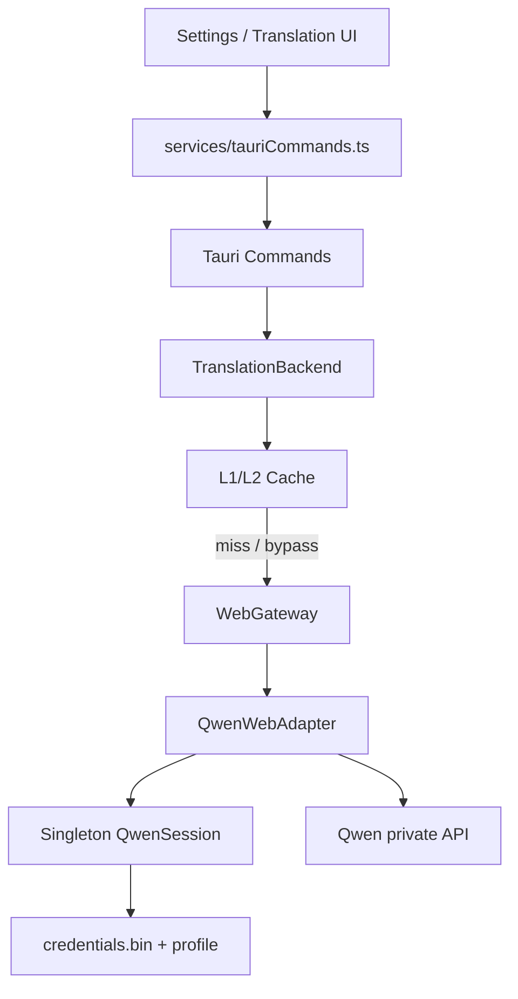
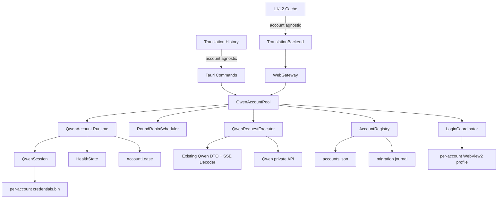
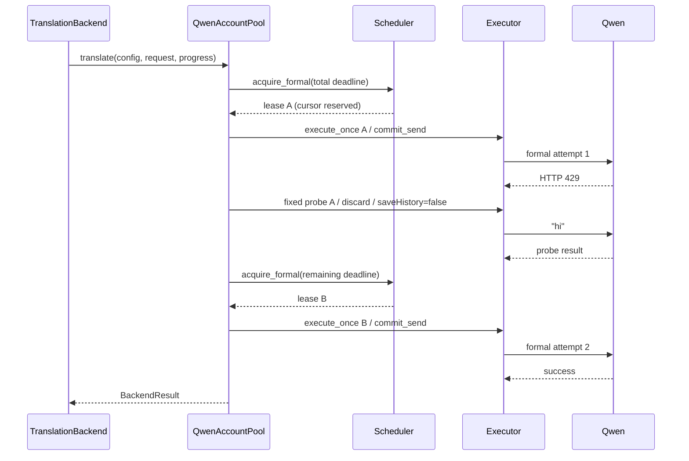
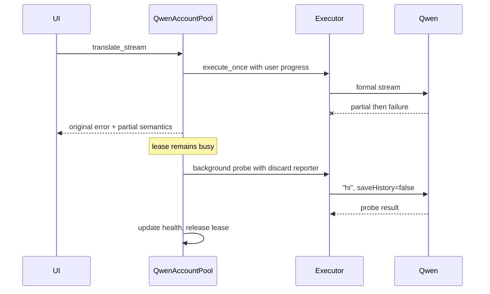
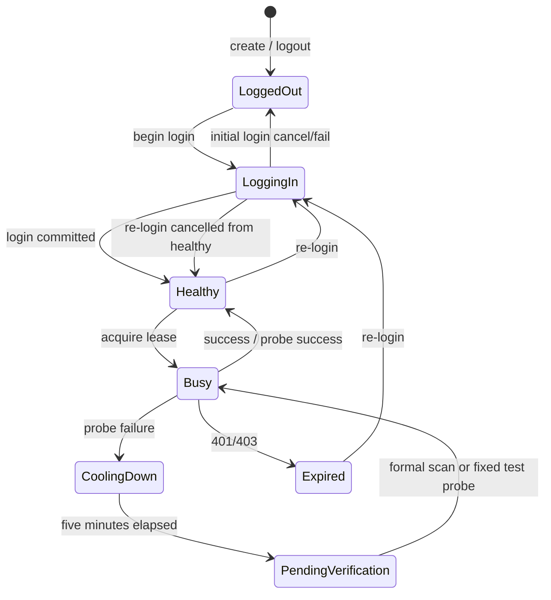

# easyT Qwen 多账号轮询 Software Design Document

## 0. 文档控制

| 字段 | 值 |
|---|---|
| 状态 | Approved |
| 版本 | 0.8 |
| 最后更新 | 2026-08-16 |
| 目标项目 | easyT 2.4.0 / Qwen WebGateway |
| 预期实施者 | Model-neutral coding agent |
| 需求来源 | `docs/Qwen多账号轮询需求与架构共识文档.md` v1.0 |
| 设计基线 | `521281b0077c4511be3937793f84578d17fd39ef` |
| 实现提交 | `44816fdefa06ca7a925f90cf2802879cf1072298` |
| 当前版本提交 | `acf0757` |
| canonical 路径 | `SDD-qwen-multi-account-round-robin.md` |
| 实施状态 | Implemented; 自动验证完成，待授权真实账号与窄窗口人工验收；见 0.5、0.6 和 15.2。 |

### 0.1 修订历史

| 版本 | 日期 | 摘要 |
|---|---|---|
| 0.1 | 2026-08-16 | 初始完整设计：账号池、持久化、迁移、调度、复检、IPC、UI、错误码和执行协议 |
| 0.2 | 2026-08-16 | Ticket 01 implementation record: registry, migration, recovery, and read-only account-pool inventory. |
| 0.3 | 2026-08-16 | Ticket 02 implementation record: isolated account creation, account-bound session/login IPC, and settings onboarding. |
| 0.4 | 2026-08-16 | Tickets 03-04 implementation record: account lifecycle IPC/UI, staged local cleanup, account leases, basic Round Robin pool routing, and one-shot executor boundary. |
| 0.5 | 2026-08-16 | Ticket 05 implementation record: Qwen stable error codes, one-shot retry/probe orchestration, runtime cooldown/pending snapshots, and manual account test IPC/UI. |
| 0.6 | 2026-08-16 | Ticket 06 implementation record: single-attempt streaming failures with tracked discard probes and non-blocking Qwen pool shutdown. |
| 0.7 | 2026-08-16 | Ticket 07 release verification: full Rust/frontend tests, typecheck, frontend build, clippy, format, release build, diff hygiene, capability check, and explicit manual-validation gaps. |
| 0.8 | 2026-08-16 | Final implementation record for easyT 2.4.0: refreshed full-suite/build evidence, implementation deviations, residual manual acceptance, and historical-design labeling. |

### 0.2 Tickets 03-04 implementation evidence

The as-built account lifecycle is owned by `QwenAccountPool`: registry mutations return full snapshots, and logout/delete acquire a fixed non-cursor lease before staging account-local credentials/profile or the full account directory. A cleanup failure returns `QW-STORAGE-007` and preserves staged or restored diagnostic data; unrelated account directories, cache, history, and progress contracts are not changed. The settings controller uses the IPC snapshot as authority and the UI uses the established `Dialog`, `ConfirmDialog`, `Switch`, `Button`, and `IconButton` modules.

Basic Ticket 04 routing is `TranslationBackend -> WebGateway -> QwenAccountPool -> QwenRequestExecutor`. One-shot and streaming output are passed independently to the executor. The cursor is committed immediately before its one actual HTTP send, after request construction and credential borrowing. Ticket 05 retry, probe, cooldown, pending-verification scheduling, and per-account test policy are intentionally not included in this implementation record.

### 0.3 Ticket 05 implementation evidence

`QwenRequestExecutor::execute_once` remains a one-send protocol boundary. `QwenAccountPool` now owns one-shot total-deadline orchestration: a sent Qwen 429 or 5xx can run one fixed-account discard `hi` probe and, only after the first formal attempt, one new Round Robin formal attempt. The probe sets `saveHistory=false`, does not commit the cursor, and does not update user progress. Other typed Qwen request failures are probed without gaining a formal retry; typed 401/403 persist `Expired` without a probe. The one-shot deadline bounds scheduling, sends, probe, backoff, body consumption, and retry; no remaining budget marks the account pending verification.

Cooldown is a Rust runtime state with a five-minute deadline, resolved lazily from snapshots or selection into pending verification. Snapshots include `coolingDown`, `cooldownRemainingSeconds`, `pendingVerification`, `busy`, and the authoritative actions matrix. Global tests choose healthy accounts and commit only their actual send; fixed-account tests acquire no cursor reservation and return `QW-POOL-009` if already busy. Both use `hi`, discard progress, and disable remote history. Frontend command errors retain optional `code`; Qwen errors render as `{message} [{code}]`, while Official API errors retain existing code-free behavior.

Verification on 2026-08-16: `cargo fmt --manifest-path src-tauri/Cargo.toml -- --check`; `cargo test --manifest-path src-tauri/Cargo.toml qwen --no-fail-fast` (68 passed); focused `translation_backend::tests`, `cache`, `history`, and `progress` Rust tests; `npm run typecheck`; targeted settings/translation/service Vitest suites (19 passed); and `git diff --check`. A controlled loopback fixture verified formal 429 -> fixed probe -> next-account formal retry, including probe `temporary=true`. No real Qwen credential/network request was used. Separate controlled coverage for every network/timeout/auth/5xx/redacted-body branch remains required before release acceptance.

Verification on 2026-08-16: `cargo fmt --manifest-path src-tauri/Cargo.toml -- --check`; `cargo test --manifest-path src-tauri/Cargo.toml qwen --no-fail-fast` (64 passed); `cargo test --manifest-path src-tauri/Cargo.toml translation_backend::tests --no-fail-fast` (16 passed); `npm run typecheck`; `npm test -- --run src/components/settings/useSettingsController.test.tsx` (11 passed); and `git diff --check`. No real Qwen credential, network request, or manual 360x200 visual check was performed.

### 0.4 Ticket 06 implementation evidence

`QwenAccountPool::translate_stream` sends one formal streaming request only. After a sent non-auth Qwen failure, it returns the original error immediately, retains the account lease, and starts exactly one fixed-account `hi` probe with `TranslationProgressReporter::discard()`, `saveHistory=false`, no cursor commit, and a bounded current `timeoutSeconds` budget. A successful probe makes the account healthy; a normal failure enters cooldown; 401/403 persists `Expired`. User cancellation does not schedule a probe or penalize the account.

The pool owns background probe abort handles. Its shutdown marks scheduling unavailable, cancels the active login watcher, aborts probes without awaiting upstream network, and releases all leases; a probe interrupted before its health commit leaves its previous health unchanged. The tray shutdown invokes this pool cleanup before closing the login window and continuing existing cache/history cleanup. Controlled loopback tests cover partial streaming output/error preservation, exactly one formal request plus one discard probe, busy exclusion, progress isolation, success/cooldown/expired outcomes, user and latest-wins cancellation, tracked task cleanup, and shutdown lease release. Verification on 2026-08-16: `cargo fmt --manifest-path src-tauri/Cargo.toml -- --check`; `cargo test --manifest-path src-tauri/Cargo.toml qwen --no-fail-fast` (74 passed); focused translation backend/cache/history/progress tests (16/12/1/3 passed); `npm run typecheck`; targeted settings/service Vitest suites (13 passed); and `git diff --check`. No real Qwen credential/network was used; Ticket 07 release verification, full test/build/clippy/release-build, and real-account manual validation remain unexecuted.

### 0.5 Final implementation record for 2.4.0

`44816fd` delivered the Qwen account-pool implementation and `acf0757` released it as easyT 2.4.0. The runtime route is now `TranslationBackend -> WebGateway -> QwenAccountPool -> QwenRequestExecutor`. The pool owns registry-backed account inventory, account-local sessions/credentials/profiles, fixed and Round Robin leases, health transitions, one-shot retry/probe orchestration, streaming background probes, and shutdown cleanup. The settings surface consumes authoritative account snapshots and exposes account create, login, rename, enable, reorder, logout, delete, global test, and fixed-account test commands.

Final automated evidence on 2026-08-16:

- `cargo check --manifest-path src-tauri/Cargo.toml` passed.
- `cargo test --manifest-path src-tauri/Cargo.toml --lib` passed: 225 tests.
- `cargo clippy --manifest-path src-tauri/Cargo.toml --all-targets --all-features -- -D warnings` passed.
- `cargo fmt --manifest-path src-tauri/Cargo.toml -- --check` passed.
- `cargo build --release --manifest-path src-tauri/Cargo.toml` passed.
- `npm run typecheck` passed.
- `npm test -- --run` passed: 18 files and 95 tests.
- `npm run build` passed. Current output reports `index-*.js` gzip 81.19 KiB and `index-*.css` gzip 4.66 KiB; this is an output record, not a pre/post bundle-growth comparison.
- `git diff --check` passed before the implementation and version commits.

No real Qwen credential or network request was made. The remaining release-acceptance work is authorized real-account/profile isolation and A/B/A validation, manual rendering/accessibility validation at 520x390 and 360x200, and explicit evidence for the cache/history/progress regression cases listed in Ticket 07.

### 0.6 Implementation deviations and compatibility residue

The following records are authoritative for the as-built implementation. They prevent this SDD from claiming design conformance that has not been demonstrated.

| ID | Approved design | As-built evidence | Impact and required disposition |
|---|---|---|---|
| DEV-001 | Section 6.5 required a preflight proving deletion of the target WebView profile Cookie before re-login. | `qwen/session.rs::is_fresh_login_ticket` rejects a ticket equal to the already persisted credential; no WebView2 Cookie-deletion API prototype or implementation exists. | Identical stale tickets are rejected, but this is not equivalent to clearing the profile Cookie. Owner approval is required before claiming the re-login contract fully satisfied. |
| DEV-002 | The consensus error directory reserves `QW-POOL-010` for mixed unavailable accounts and `QW-STORAGE-006` for profile initialization failure. | `qwen/error.rs` currently maps mixed unavailable to `QW-POOL-006`; it has no separate `QW-POOL-010` or `QW-STORAGE-006` variant. | Public error-code semantics differ from the approved directory. Reconcile the code and the consensus document in a follow-up before treating the error catalog as release-final. |
| DEV-003 | The consensus document prohibits retaining two long-term account-management paths after migration. | `WebGateway` retains `legacy_qwen_session` and the old `begin_web_login`, `get_web_login_status`, and `logout_web_account` commands as a facade over the first enabled account while new account commands are present. | Translation uses the account pool, but legacy IPC remains. Remove or formally approve this compatibility surface before a later major cleanup. |

### 0.7 Reading this document after implementation

Sections 1 through 17 preserve the approved design and implementation protocol used to create the feature. Headings such as "current system context", "proposed design", and the phased coding-agent instructions are historical design-baseline material, not a statement that the repository remains pre-implementation. For current release status, verification evidence, deviations, and manual-acceptance gaps, use Sections 0.5, 0.6, and 15.2.

## 1. 执行摘要

本设计把当前单一 `QwenSession + credentials.bin + profile` 升级为 WebGateway 内部的 `QwenAccountPool`。账号池持有最多 10 个独立账号、注册表、Round Robin 游标、账号 lease、健康状态和唯一登录流程；现有 Qwen 私有协议请求逻辑下沉为不感知账号池的单次请求执行器。

缓存命中发生在账号选择之前，因此不消耗轮询位置。一次性输出继续只对 429/5xx 最多正式重试一次，但第二次正式尝试重新 Round Robin；错误账号按规则复检。流式失败立即返回用户错误，再使用丢弃 sink 后台复检，不正式重试。账号信息不进入缓存键、翻译历史、译文或进度事件。

设置页增加账号列表、账号级登录/测试/启停/排序/删除，并保留全局测试。Rust 返回已经解析的权威状态和操作能力矩阵，React 不复制状态机。所有 Qwen 错误通过独立 `code` 字段提供稳定、用户可见的错误码。

## 2. 范围

### 2.1 目标

- 将单账号 Qwen WebGateway 无损迁移为最多 10 个独立账号的账号池。
- 对每次真实 Qwen 正式尝试和全局测试执行稳定 Round Robin。
- 保证单账号同一时间最多一项 Qwen 网络操作。
- 建立可持久化的登录过期/健康判定、运行时冷却和待验证恢复。
- 建立崩溃可恢复的旧单账号迁移和注册表损坏恢复。
- 保持 TranslationBackend、缓存、历史、进度、latest-wins 与 Official API 边界。
- 提供完整账号管理 UI、结构化错误码和可复现验证。

### 2.2 非目标

- 不实现加权、随机、最少连接、配额感知或可配置调度算法。
- 不实现流式正式重试、跨账号续传或 Official API 自动回退。
- 不读取或验证远端真实身份，不阻止两个槽位登录同一 Qwen 身份。
- 不实现主动批量探测、后台保活、请求统计或配额报表。
- 不实现凭证加密、账号导入导出、云同步或跨设备共享。
- 不按账号隔离缓存，不向翻译历史或进度事件增加账号字段。
- 不修改 Prompt、Qwen 私有 DTO 语义、模型白名单或翻译历史 schema。
- 不新增 UI dependency 或扩大远程 Qwen WebView capability。
- 不实施术语表。

### 2.3 已验证事实、假设与约束

| ID | 类型 | 陈述 | 不成立时的影响 |
|---|---|---|---|
| FACT-001 | 已验证事实 | `TranslationBackend::translate` 在进入 `WebGateway` 前完成缓存决策。 | 缓存命中不选账号可以保持为结构性保证。 |
| FACT-002 | 已验证事实 | 当前 `QwenWebAdapter` 同时拥有 session、HTTP、重试和 SSE 消费。 | 必须拆分调度策略与单次协议执行。 |
| FACT-003 | 已验证事实 | 当前凭证和 profile 固定在 `web_gateway/qwen/`，且凭证为 UTF-8 明文。 | 需要一次持久化迁移，安全模型不在本次升级。 |
| FACT-004 | 已验证事实 | `TranslationProgressReporter::discard()` 已提供丢弃进度/正文的基础。 | 复检无需增加公开进度类型。 |
| FACT-005 | 已验证事实 | `AppError`、`TranslationCommandError` 和前端 `CommandError` 均没有 `code`。 | 前后端错误合同必须同时扩展。 |
| FACT-006 | 已验证事实 | Tauri capability 仅授权 `main` 窗口。 | 动态登录窗口无需且不得加入 capability。 |
| FACT-007 | 已验证事实 | 已有 Tokio、Serde、UUID、zeroize 和 Windows 原子移动能力。 | 设计不要求新增 Rust dependency。 |
| ASM-001 | 假设 | easyT 的账号注册表由单个应用进程写入；本功能不提供跨进程并发编辑协议。 | 若允许多实例同时运行，需要另行批准进程锁或单实例机制。 |
| ASM-002 | 假设 | Qwen 登录 Cookie 名与允许 host 保持当前合同。 | 协议变化按稳定登录/协议错误处理，不在本功能猜测修复。 |
| CON-001 | 约束 | `AppConfig.webGateway` 继续只保存 provider/model/saveHistory。 | 账号池不得进入 `config.json`。 |
| CON-002 | 约束 | 新依赖需要项目所有者明确批准。 | 优先使用现有 std/Tokio/Serde/UI Kit。 |
| CON-003 | 约束 | 一次性输出是总超时；流式输出是正文静默超时。 | 两种模式 MUST 使用不同复检调度。 |
| CON-004 | 约束 | 真实账号测试会产生 Qwen 请求。 | 未经明确授权不得由 agent 自动执行。 |
| CON-005 | 约束 | `tsconfig.json` 当前存在用户未提交修改。 | 实施者不得恢复、覆盖或夹带该无关修改。 |

## 3. 需求

### 3.1 功能需求

| ID | 需求 | 优先级 | 验收标准 |
|---|---|---|---|
| FR-001 | 系统 MUST 管理 0 至 10 个本地 Qwen 账号槽位，名称允许重复但必须通过校验。 | Must | 第 10 个可创建；第 11 个返回 `QW-POOL-002`；1～40 Unicode 字符可用，空白/NUL/控制字符被拒绝。 |
| FR-002 | 每个账号 MUST 使用独立 UUID、凭证文件和 WebView2 profile。 | Must | 两账号路径不同；登录、退出和删除不修改另一账号目录。 |
| FR-003 | 系统 MUST 持久化账号名称、启用状态、顺序、登录过期和最后健康判定。 | Must | 重启后字段恢复；游标、占用和冷却截止时间不恢复。 |
| FR-004 | 系统 MUST 将旧单账号数据崩溃安全地迁移为“默认账号”。 | Must | 所有中断点最终恢复为完整旧布局或一个完整注册账号，无重复账号和凭证丢失。 |
| FR-005 | 注册表损坏时系统 MUST 保留账号目录并重建禁用恢复条目。 | Must | 不删除凭证/profile；恢复条目默认禁用并可由用户确认后启用。 |
| FR-006 | 正式 Qwen 尝试 MUST 在健康、登录、启用且空闲账号间按显示顺序 Round Robin。 | Must | 连续三次真实尝试在两个健康账号上按 A/B/A；缓存命中不改变下一账号。 |
| FR-007 | 轮询游标 MUST 只在真实网络请求即将发送时提交。 | Must | 选择后但发送前取消、构造失败或借凭证失败不推进游标。 |
| FR-008 | 单账号 MUST 通过 lease 限制为一次 Qwen 网络操作；全部候选忙碌时按超时等待。 | Must | 并发任务不能获得同一账号；lease drop/abort 唤醒等待者；调度等待耗尽返回 `QW-POOL-007`。 |
| FR-009 | 一次性输出 MUST 只对第一次 429/5xx 保留一次正式重试，第二次重新轮询。 | Must | 最多两次正式发送；其他错误不正式重试；无其他账号时可再次选择原账号。 |
| FR-010 | 一次性错误 MUST 在剩余总超时内同步固定账号复检，并按结果更新健康。 | Must | 复检不推进游标、不写缓存/历史；总超时耗尽则不复检并转待验证；复检可耗尽正式重试预算。 |
| FR-011 | 流式错误 MUST 先返回用户错误，再以独立 `timeoutSeconds` 后台固定账号复检。 | Must | 不正式重试；账号复检期间为使用中；复检正文/阶段不进入用户状态；退出取消不处罚账号。 |
| FR-012 | 401/403 MUST 直接持久化登录过期且不复检；普通复检失败 MUST 冷却五分钟。 | Must | 401/403 重启后仍过期；普通冷却结束转待验证；逐账号测试可提前恢复。 |
| FR-013 | 系统 MUST 提供全局测试和逐账号测试。 | Must | 全局测试轮询健康账号并推进一次游标；逐账号测试固定账号且不推进；两者均不写远端历史、缓存或本地历史。 |
| FR-014 | 系统 MUST 提供账号添加、重命名、启停、排序、登录、重新登录、退出、测试和删除。 | Must | 操作矩阵符合账号状态；忙碌时禁止重登/退出/删除；退出和删除二次确认。 |
| FR-015 | 全局同一时间 MUST 只有一个登录流程，重新登录失败 MUST 保留旧凭证和状态。 | Must | 第二个登录返回 `QW-LOGIN-001`；取消重登后旧凭证可继续使用或保持原过期状态。 |
| FR-016 | 每次正式尝试 MUST 遵守当前 saveHistory；测试和复检 MUST 强制关闭。 | Must | 429/5xx 两次正式尝试均携带当前值；测试/复检固定 false。 |
| FR-017 | Qwen 功能错误 MUST 返回结构化稳定错误码并在 UI 文案末尾显示。 | Must | IPC 有独立 `code`；Qwen 错误显示 `{message} [{code}]`；Official API 行为不变。 |
| FR-018 | Rust MUST 返回权威账号状态、冷却时间和可用操作，前端不得重建状态机。 | Must | 八种状态均由 Rust DTO 决定；React 只按 `status/actions` 渲染。 |
| FR-019 | 缓存、翻译历史和主进度合同 MUST 保持账号无关。 | Must | cache key/history schema/progress payload 无账号字段；复检使用 discard reporter；正式重试才产生新的连接 sequence。 |
| FR-020 | 应用退出 MUST 取消登录 watcher 和后台复检并释放 lease。 | Must | 退出不等待网络；中断复检恢复复检前健康；不遗留登录窗口或运行任务。 |

### 3.2 非功能需求

| ID | 类别 | 需求 | 度量/验证 |
|---|---|---|---|
| NFR-001 | 数据完整性 | 注册表、凭证替换和迁移 journal MUST 原子、可恢复。 | 故障注入覆盖每个持久化边界；恢复后满足唯一稳定终态。 |
| NFR-002 | 安全 | ticket/Cookie/Header/原文/译文/response body MUST NOT 进入 IPC、注册表或日志。 | 序列化和日志测试；人工搜索敏感 fixture。 |
| NFR-003 | 隔离 | 远程登录 WebView MUST NOT 获得 Tauri command capability。 | `capabilities/default.json` 仍只包含 `main`。 |
| NFR-004 | 并发 | 调度选择、lease 获取和游标保留 MUST 无竞态；锁内不得执行文件 I/O 或 await。 | 并发/abort 单元测试；代码审查。 |
| NFR-005 | 性能 | 不得增加永久健康 timer；账号扫描 MUST 为 O(n)，n ≤ 10。 | 代码审查；设置页不可见时无冷却 UI timer。 |
| NFR-006 | 兼容 | Official API、缓存 schema/key、历史 schema、Prompt 和 Qwen DTO MUST 保持兼容。 | 既有自动测试全量通过；相关文件无非必要行为变化。 |
| NFR-007 | 可访问性 | 账号管理 MUST 键盘可达、焦点可见、状态可读、Dialog 可恢复焦点。 | Testing Library 行为测试；默认/最小窗口人工验收。 |
| NFR-008 | UI | MUST 复用 UI Kit，零新增 UI dependency，支持 520×390 和 360×200。 | package lock 无新 UI 包；截图/人工检查无重叠溢出。 |
| NFR-009 | 可观察性 | 日志 MUST 只记录错误码、类别、HTTP 状态和脱敏账号短标识。 | 日志测试和代码审查。 |
| NFR-010 | 可维护性 | 账号池、注册表、调度、session 和单次协议执行 MUST 有明确所有权。 | 依赖图符合本文；不出现前端调度或 adapter 持久化注册表。 |
| NFR-011 | 体积 | 前端 JS gzip 增长超过 10 KiB 或 CSS gzip 超过 5 KiB MUST 解释并评审。 | 实施前后 production bundle 记录。 |

## 4. 实施前系统上下文（设计基线）

### 4.1 当前调用路径



### 4.2 已验证的限制

- `src-tauri/src/translation_backend/web_gateway/mod.rs::WebGateway` 只拥有一个 `QwenWebAdapter`。
- `qwen/adapter.rs::QwenWebAdapter` 同时负责 session、凭证借用、HTTP、重试和 SSE，无法在第二次尝试重新选择账号。
- `qwen/session.rs::QwenSession` 不绑定账号路径，状态只有 `LoggedOut/LoggingIn/Ready/Expired`。
- `credential_store.rs` 路径固定，必须保留 legacy helper 仅供迁移。
- `commands/web_gateway.rs` 只有单账号登录、状态和退出 command，登录窗口 label 固定。
- `lib.rs` 启动恢复和退出清理都只处理一个 session。
- `test_api_connection` 返回纯字符串，前端 catch 后丢失结构化 kind/code。
- `TranslationCommandError` 与 `AppError` 没有稳定 Qwen `code`。
- `useSettingsController` 维护单一登录状态和一个 logout intent。
- `WebGatewayPanel` 只展示单账号状态。

### 4.3 保持不变的边界

- `src-tauri/src/config/models.rs::WebGatewayConfig` 不增加账号字段。
- `translation_backend/cache/key.rs` 和 L2 schema 不增加账号字段或版本。
- `translation_history` models/worker/database 不增加账号字段。
- `BackendRequest`、`BackendResult`、`BackendSource` 不增加账号字段。
- `TranslationProgressEvent` 不增加账号或复检事件。
- Qwen `sse_decoder.rs` 保持协议解码职责，只调整错误映射接口所需的最小代码。
- `src-tauri/capabilities/default.json` 继续只授权 `main`。

## 5. 批准设计（实施基准）

### 5.1 架构总览



依赖规则：

- `QwenAccountPool` MAY 依赖 registry/scheduler/session/executor；这些模块 MUST NOT 依赖 React、Tauri页面或缓存。
- `QwenRequestExecutor` MUST NOT 选择账号、持久化健康或执行跨账号重试。
- `AccountRegistry` MUST NOT 发网络请求或创建 WebView。
- Tauri command 负责 AppHandle/WebView 生命周期，并通过 pool 的账号级合同更新状态。
- 前端只依赖 IPC DTO，不知道 ticket、目录或调度锁。

### 5.2 关键设计决策

| ID | 决策 | 理由 | 替代方案 | 后果 |
|---|---|---|---|---|
| DD-001 | 账号注册表独立于 `AppConfig`。 | 凭证生命周期和配置保存事务不同，避免账号管理污染设置草稿。 | 放入 `config.json`。 | 新增独立 schema、迁移和恢复。 |
| DD-002 | Rust 返回 resolved status 和 actions。 | 避免 React 复制登录/健康/占用优先级。 | 前端组合多个字段。 | DTO 更明确，后端测试承担状态矩阵。 |
| DD-003 | 使用 RAII `AccountLease` 和 `Notify`。 | abort/drop 可靠释放，不需要全局串行。 | bool busy + 轮询 timer。 | lease 不得跨不必要的本地工作持有。 |
| DD-004 | 游标在首个 `.send()` 前提交。 | “每次真实调用”与用户决策一致。 | 选择时推进。 | lease 需要保留未提交候选位置。 |
| DD-005 | 现有 adapter 拆为 pool orchestration + executor。 | 第二次尝试必须重新选账号，复检必须固定账号。 | 在 adapter 内嵌账号数组。 | 文件增加，但职责变深而清晰。 |
| DD-006 | 一次性复检同步，流式复检后台。 | 同时保持严格总超时和流式静默超时。 | 两种模式统一等待复检。 | 流式失败后账号会短暂继续 busy。 |
| DD-007 | 复检使用 `TranslationProgressReporter::discard()`。 | 防止 `"hi"` 译文和阶段污染用户状态。 | 新建复检阶段。 | 主进度合同无需修改。 |
| DD-008 | 迁移使用 journal + staging + reconciliation。 | 多文件移动与注册表提交无法成为单一文件事务。 | 启动时直接 move。 | 实施和故障测试成本增加。 |
| DD-009 | 错误码作为独立字段贯穿 Rust/TS。 | 文案可变而错误码稳定，前端不解析中文。 | 把码拼进后端 message。 | 所有错误转换路径需兼容扩展。 |
| DD-010 | 不新增 dependency。 | 现有库已满足 UUID、同步、序列化和原子移动。 | async-trait/tempfile/新状态库。 | 测试使用现有手工临时目录和具体/泛型 seam。 |

### 5.3 权威状态优先级

Rust 的 `QwenAccountSnapshot.status` MUST 按以下优先级解析，解决状态重叠：

```text
disabled
> loggingIn
> loggedOut
> expired
> busy
> coolingDown
> pendingVerification
> available
```

说明：

- 停用是用户最需要看到的主状态，即使底层凭证已过期。
- 登录中优先于旧登录状态。
- 无凭证优先于健康信息。
- busy 只可能发生在已取得 lease 的账号；操作完成后再展示冷却/待验证。
- snapshot 同时返回 `actions`，UI 不根据 status 自行判断禁用矩阵。

### 5.4 混合账号池调度规则

- 如果至少一个健康账号空闲，立即选择。
- 如果没有空闲账号，但至少一个健康账号 busy，则等待账号释放，即使池内同时存在停用/过期/冷却账号。
- 如果没有健康 busy 账号，则尝试已到期的待验证账号。
- 若仍失败，按池的事实集合选择最具体错误：空池、全停用、全未登录、全过期、全冷却/验证失败，否则 `QW-POOL-010`。
- 新建且从未登录账号的持久化 `lastHealth` 固定为 `unknown`；注册表 schema 使用三态 `unknown | healthy | unhealthy`。`unknown` 不等于待验证，因未登录而不可调度；首次登录成功原子改为 `healthy`。

## 6. 详细组件设计

### 6.1 `account.rs`: 领域模型与 DTO

- **位置：** 新增 `src-tauri/src/translation_backend/web_gateway/qwen/account.rs`
- **职责：** 定义账号 ID、持久化字段、运行时状态、权威快照、操作能力和测试结果。
- **需求：** FR-001～003、FR-012、FR-018，NFR-010。

提议合同：

```text
AccountId(String)                       // validated UUID v4 string
PersistedHealth = Unknown | Healthy | Unhealthy
PersistedLogin = LoggedOut | Ready | Expired
RuntimeHealth = Healthy | CoolingDown{until} | PendingVerification
QwenAccountDisplayStatus = Disabled | LoggedOut | LoggingIn | Available |
                           Busy | CoolingDown | PendingVerification | Expired

QwenAccountSnapshot {
  accountId, displayName, enabled, order, status,
  cooldownRemainingSeconds?, actions
}
QwenAccountActions {
  canRename, canToggleEnabled, canMoveUp, canMoveDown,
  canLogin, canLogout, canTest, canDelete
}
QwenAccountPoolSnapshot {
  accounts, maximumAccounts, loginAccountId?, warning?
}
QwenAccountTestResult { accountId, displayName, message }
```

`AccountId::parse` MUST reject non-canonical UUID strings and path separators. `displayName` validation MUST trim and count Unicode scalar values using `.chars().count()`; normalization beyond trimming is not required.

### 6.2 `registry.rs`: 注册表与账号目录

- **位置：** 新增 `src-tauri/src/translation_backend/web_gateway/qwen/registry.rs`
- **职责：** `accounts.json` schema、原子读写、顺序约束、目录恢复、账号 CRUD 持久化。
- **需求：** FR-001～005、FR-014～015，NFR-001～003。

提议 schema：

```json
{
  "schemaVersion": 1,
  "accounts": [
    {
      "accountId": "uuid-v4",
      "displayName": "默认账号",
      "enabled": true,
      "loginState": "ready",
      "lastHealth": "healthy"
    }
  ]
}
```

数组顺序即显示和轮询顺序，不另存 `order`，避免双重权威。加载时 MUST 校验：schema version、最大 10、ID 唯一、名称合法、目录在 qwen root 下、枚举合法。未知更高 schema version MUST 返回恢复/兼容错误，不能覆盖。

提议 API：

```text
AccountRegistry::open(qwen_root: PathBuf) -> Result<Self, QwenError>
snapshot(&self) -> Vec<PersistedAccount>
create_account(&mut self, name: String) -> Result<PersistedAccount, QwenError>
update_account(&mut self, mutation: RegistryMutation) -> Result<(), QwenError>
remove_account(&mut self, id: &AccountId) -> Result<(), QwenError>
recover_corrupt_registry(&mut self) -> Result<RecoveryReport, QwenError>
account_dir(&self, id: &AccountId) -> PathBuf
```

所有 mutation MUST 先在内存副本校验，再写临时文件、flush、原子 replace，成功后替换内存状态。禁止在持有 pool state lock 时执行这些 I/O；pool 使用“准备变更 -> I/O -> 短锁提交/回滚”的单操作序列化锁。

### 6.3 `migration.rs`: 旧单账号迁移

- **位置：** 新增 `src-tauri/src/translation_backend/web_gateway/qwen/migration.rs`
- **职责：** 在普通 registry 加载前执行 legacy migration reconciliation。
- **需求：** FR-004～005，NFR-001、NFR-006。

提议 journal：

```text
LegacyMigrationJournal {
  schemaVersion: 1,
  accountId,
  sourceCredentialPath,
  sourceProfilePath,
  stagingPath,
  targetPath,
  phase: Prepared | CredentialsStaged | ProfileStaged |
         DirectoryPublished | RegistryCommitted
}
```

启动顺序 MUST 为：

1. 读取并 reconcile journal。
2. 检测 legacy 文件并开始/继续迁移。
3. 确认 journal 已清理或进入保留失败态。
4. 才允许 `AccountRegistry::open` 做普通加载/损坏恢复。

每个 phase 都 MUST 有 source/staging/target/registry 组合表测试。无法证明可安全前进或回滚时，保留全部现存数据并返回 `QW-STORAGE-008`，不得调用 `remove_dir_all` 清理证据。

### 6.4 `credential_store.rs`: 账号绑定凭证

- **位置：** 修改 `src-tauri/src/translation_backend/web_gateway/credential_store.rs`
- **职责：** 参数化账号目录的凭证/profile 操作，保留 legacy helpers 仅供 migration。
- **需求：** FR-002、FR-004、FR-015，NFR-001～002。

合同：

```text
credentials_path(account_dir: &Path) -> PathBuf
profile_path(account_dir: &Path) -> PathBuf
save_ticket_atomic(account_dir: &Path, ticket: &str) -> Result<(), QwenError>
load_ticket(account_dir: &Path) -> Result<Option<TicketSecret>, QwenError>
delete_account_secrets(account_dir: &Path) -> Result<(), QwenError>
legacy_credentials_path(app_data: &Path) -> PathBuf
legacy_profile_path(app_data: &Path) -> PathBuf
```

`TicketSecret` 继续 Drop zeroize。路径只能来自 validated registry，不接受前端路径。重新登录先写临时凭证并完成 registry 状态提交，最后替换旧凭证；任何失败恢复旧凭证和旧状态。

### 6.5 `session.rs`: 单账号登录状态

- **位置：** 修改 `src-tauri/src/translation_backend/web_gateway/qwen/session.rs`
- **职责：** 维护一个 account-bound session，不再自行定位全局 app data。
- **需求：** FR-002～003、FR-012、FR-015、FR-020。

`QwenSession::new(account_id, account_dir, persisted_login)` MUST 明确绑定路径。session 内锁只保护短状态，不得做 I/O/await/WebView。`mark_expired(status)` 通过 pool/registry transaction 持久化，不允许 session 静默修改磁盘。

重新登录开始前 MUST 记录旧 ticket 的不可逆安全指纹或先清除 profile 中目标 Cookie，防止 watcher 把已有旧 Cookie 当作新登录成功。设计选择为：在 WebView 打开前删除目标 profile 中现有 `tongyi_sso_ticket` Cookie，但保留凭证文件；取消后旧凭证文件仍有效。若 Tauri Cookie API 无法可靠删除，实施者 MUST 触发 deviation，不得以“读取到任意非空旧 Cookie”为成功。

### 6.6 `scheduler.rs`: Round Robin 与 lease

- **位置：** 新增 `src-tauri/src/translation_backend/web_gateway/qwen/scheduler.rs`
- **职责：** 账号过滤、游标、atomic lease、busy wait 和 cursor commit。
- **需求：** FR-006～008、FR-013，NFR-004～005。

提议合同：

```text
acquire_formal(deadline: Deadline) -> Result<AccountLease, QwenError>
acquire_global_test(deadline: Deadline) -> Result<AccountLease, QwenError>
try_acquire_fixed(account_id: &AccountId) -> Result<AccountLease, QwenError>
notify_account_available()

AccountLease::account_id() -> &AccountId
AccountLease::borrow_ticket() -> Result<TicketSecret, QwenError>
AccountLease::commit_send()
Drop(AccountLease) -> release + notify
```

`Deadline` MUST 明确区分：`NonStreamingTotal(Instant)`、`StreamingWait(Instant)`、`ManualTest(Instant)`。scheduler 不解释 HTTP 超时。`commit_send` 幂等且只能执行一次；fixed lease 不拥有 cursor reservation。

### 6.7 `executor.rs` 与 `adapter.rs`: 单次协议执行与 orchestration

- **位置：** 新增 `qwen/executor.rs`；修改 `qwen/adapter.rs` 和 `qwen/mod.rs`。
- **职责：** executor 发送恰好一次 Qwen 请求；adapter/pool 编排选择、复检、重试与健康反馈。
- **需求：** FR-009～013、FR-016、FR-019，NFR-002、NFR-006、NFR-010。

单次执行合同：

```text
QwenRequestExecutor::execute_once(
  config: &AppConfig,
  request: &BackendRequest,
  ticket: &TicketSecret,
  progress: Arc<TranslationProgressReporter>,
  mode: OutputMode,
  save_history: bool,
  timeout: AttemptTimeout,
) -> Result<BackendResult, QwenError>
```

不变量：

- `execute_once` MUST NOT retry、选择账号、更新健康或持久化 session。
- 正式尝试传 `config.web_gateway.save_history`；test/probe 固定 false。
- 非 2xx MUST 保留实际 status 用于具体 code，但不得保留 response body 到公开错误。
- 401 与 403 MUST 分开映射；500～599 映射共同 code 但可保留安全 status。
- probe 使用固定 `BackendRequest { text: "hi", target_language }` 和 discard reporter。

一次性 orchestration：一个外层 `Instant deadline` 覆盖调度、attempt 1、同步 probe、250ms backoff 和 attempt 2。第一次 429/5xx 才进入 attempt 2；同步 probe先执行并可能耗尽 deadline。

流式 orchestration：调度等待使用 `timeoutSeconds`，正式执行维持现有正文静默 timeout；失败结果先返回，再由 pool spawn 一个持有原 lease 的 bounded probe。spawn handle MUST 注册到 pool shutdown set。

### 6.8 `pool.rs` 与 `web_gateway/mod.rs`

- **位置：** 新增 `qwen/pool.rs`；修改 `translation_backend/web_gateway/mod.rs`。
- **职责：** 聚合 registry、runtime account、scheduler、login coordinator、executor 和后台任务。
- **需求：** FR-001～020，NFR-001～010。

提议入口：

```text
QwenAccountPool::open(app_data: &Path, client: reqwest::Client) -> Result<Self, QwenError>
snapshot() -> QwenAccountPoolSnapshot
translate(config, request, progress) -> Result<BackendResult, BackendError>
translate_stream(config, request, progress) -> Result<BackendResult, BackendError>
test_global(config) -> Result<QwenAccountTestResult, BackendError>
test_account(account_id, config) -> Result<QwenAccountTestResult, QwenError>
shutdown()
```

账号 mutation 使用单一 async operation mutex 串行，避免 registry I/O 交错；网络翻译不持有该 mutex。`WebGateway` 继续显式 `match WebProviderKind::Qwen`，不建设供应商插件注册表。

### 6.9 `qwen/error.rs`、`translation_backend/error.rs` 与 `app_error.rs`

- **位置：** 新增 `qwen/error.rs`；修改统一错误文件。
- **职责：** 保留 Qwen code/status/安全消息，向现有统一 kind 映射。
- **需求：** FR-017，NFR-002、NFR-009。

提议：

```text
QwenError { code: QwenErrorCode, kind: QwenErrorKind, safe_message, diagnostic }
BackendError::Qwen(QwenError)
AppError::Qwen(QwenPublicError)
ErrorResponse { kind, message, code? }
TranslationCommandError { kind, message, code?, totalElapsedMs? }
```

`code` 对 Official API 和非 Qwen 本地错误为 `None`，保持兼容。完整 code 目录以共识文档 §14.2 为权威，不能在 SDD 另建不同编号。`diagnostic` 仅允许无敏感上下文的内部分类；日志 helper 统一控制字段。

### 6.10 `commands/web_gateway.rs` 与 `lib.rs`

- **位置：** 修改 command 和应用生命周期。
- **职责：** 暴露账号级 IPC、管理唯一登录窗口、启动迁移/恢复和退出取消。
- **需求：** FR-001～005、FR-013～015、FR-020，NFR-001～003。

命令合同见 §7。登录窗口继续固定 label `qwen-login`，因为全局只允许一个登录流程；pool 保存 active `accountId`。关闭事件按 active ID 调用 `cancel_login`。窗口仍不在 capability 中。

`lib.rs` setup MUST 在构造 backend 前完成 migration reconciliation 和 registry open；初始化失败不得回退成“无账号”并覆盖数据。退出顺序：标记 pool shutting down -> cancel watcher/background probes -> close login window -> 继续现有 window/shortcut/cache/history shutdown。

### 6.11 前端 types/service/controller

- **位置：** 修改 `src/types/index.ts`、`src/services/tauriCommands.ts`、`src/components/settings/useSettingsController.ts`；可新增 `useQwenAccountsController.ts`。
- **职责：** 类型化 IPC、保留 code、管理账号异步操作和可见期轮询。
- **需求：** FR-013～018，NFR-007～010。

前端 `CommandError` 增加 `code?: string`；提供唯一 formatter：

```text
formatCommandError(err) -> err.code ? `${err.message} [${err.code}]` : err.message
```

`toFriendlyError` MUST 保留 Qwen code，不能用 kind-based 文案覆盖后丢码。推荐 `FriendlyError` 增加 `code?`，最终展示层统一格式化，而不是把码提前拼进状态字符串。

账号 controller SHOULD 独立为 `useQwenAccountsController`，原因是账号 CRUD、登录 polling、逐行 pending、Dialog intents 和 cooldown 可见计时已经形成独立职责。它只在 WebGateway 设置可见时获取/轮询 snapshot；至少存在 `loggingIn`、`busy` 或 `coolingDown` 时按 1 秒刷新，否则 mutation 完成后按需刷新，不建立永久 timer。

### 6.12 前端展示组件

- **位置：** 修改 `WebGatewayPanel.tsx`、`SettingsPage.tsx`、settings barrel；新增 `QwenAccountSection.tsx`、`QwenAccountRow.tsx`、`QwenAccountNameDialog.tsx`。
- **职责：** 紧凑账号管理 UI。
- **需求：** FR-014、FR-017～018，NFR-007～008、NFR-011。

`QwenAccountRow` MUST 直接使用 snapshot `actions` 禁用操作。排序使用 `IconButton` + Lucide ArrowUp/ArrowDown；启停使用 `Switch`；添加/重命名使用 `Dialog + FormField + Input`；退出/删除使用一个顺序呈现的 `ConfirmDialog`。不创建嵌套 Dialog，不使用 `window.confirm`、浏览器 prompt 或新 menu dependency。

账号行不复用当前水平 `SettingsRow`，因为其 `whitespace-nowrap` 不适合 360px；使用 settings 领域原生语义布局。更多操作可以使用换行的显式文字按钮组，不手写下拉菜单的键盘/焦点复杂度。

## 7. 接口与集成合同

### 7.1 Tauri commands

所有账号 mutation 成功后返回完整权威 `QwenAccountPoolSnapshot`，避免前端乐观更新竞态。

| Command | 请求 | 成功响应 | 主要错误 |
|---|---|---|---|
| `get_qwen_account_pool` | 无 | `QwenAccountPoolSnapshot` | STORAGE/INTERNAL |
| `create_qwen_account` | `{ displayName }` | snapshot；同时启动登录 | POOL-002/011, STORAGE, LOGIN |
| `rename_qwen_account` | `{ accountId, displayName }` | snapshot | POOL-008/011 |
| `set_qwen_account_enabled` | `{ accountId, enabled }` | snapshot | POOL-008, STORAGE |
| `move_qwen_account` | `{ accountId, direction: up|down }` | snapshot | POOL-008/012 |
| `begin_qwen_account_login` | `{ accountId }` | snapshot | POOL-008/009, LOGIN |
| `logout_qwen_account` | `{ accountId }` | snapshot | POOL-008/009, STORAGE |
| `delete_qwen_account` | `{ accountId }` | snapshot | POOL-008/009, STORAGE |
| `test_qwen_account` | `{ accountId, config }` | `QwenAccountTestResult` | POOL-008/009, AUTH/NET/UPSTREAM |
| `test_api_connection` | `{ config }` | Official: existing string; Qwen: `ConnectionTestResult` | existing API or Qwen code |

`ConnectionTestResult` 统一为：

```text
{ message: string, accountId?: string, displayName?: string }
```

Official API 的 optional account 字段缺失。该返回类型变化是内部 Tauri contract，同一 release 同步更新前端；不保留旧 string 双轨。

### 7.2 错误 IPC

```json
{
  "kind": "BackendNetwork",
  "message": "网络请求失败",
  "code": "QW-NET-001",
  "totalElapsedMs": 1234
}
```

- `code` 仅 Qwen 错误必填，其他错误可省略。
- message 不包含 `[code]`，展示层统一追加。
- `totalElapsedMs` 只在翻译 command 已开始计时时出现。
- 账号命令使用相同 `{kind,message,code}` 基础结构，不返回 Rust Display diagnostic。

### 7.3 注册表版本与兼容

- schema version 初始为 1。
- 缺少 `accounts.json` 且无 legacy 数据表示空账号池。
- 更高未知版本 MUST 只读失败，不能隔离后重建覆盖。
- version 1 内未知字段由 Serde 忽略以允许前向附加；缺少必填字段视为损坏。
- registry 恢复生成的账号 `enabled=false`、`loginState` 由凭证存在性决定、`lastHealth=unhealthy`，确保首次启用前必须验证。

### 7.4 第三方 Qwen 合同

- 登录 URL、allowlist、Cookie 名、API URL、DTO 和 Header 保持当前 qwen module 私有。
- 429/5xx 只影响一次性现有重试范围。
- 正式每次尝试使用当前 saveHistory；probe/test 固定 false。
- response body 只允许读取长度用于日志，不能进入错误。

## 8. 数据设计

### 8.1 文件分类

| 数据 | 路径 | 敏感性 | 保留/删除 |
|---|---|---|---|
| 注册表 | `web_gateway/qwen/accounts.json` | 本地账号元数据 | 删除最后账号仍保留空 registry MAY；不含凭证 |
| 凭证 | `accounts/<uuid>/credentials.bin` | 高，明文 ticket | 退出和删除必须移除 |
| profile | `accounts/<uuid>/profile/` | 高，可能含 Cookie/cache | 退出和删除必须移除 |
| migration journal | qwen root 下固定安全文件名 | 路径/阶段元数据 | 稳定提交后删除；失败时保留恢复 |
| quarantined registry | qwen root 下时间戳安全名 | 本地账号元数据 | 最多保留一份，不能含新增敏感日志 |

### 8.2 一致性不变量

- registry 中每个 ID 唯一且顺序唯一由数组表达。
- 正常 Ready 账号必须有可读取凭证；不一致时降为 LoggedOut/损坏警告，不能假装健康。
- 账号目录可以暂时存在于 journal migration 中；普通 loader 必须先 reconcile。
- registry 恢复绝不自动启用账号。
- 删除先把目录原子 rename 到 operation staging，再提交 registry 删除，最后清理 staging；清理失败返回 STORAGE-007 并保留可重试标记。不得先永久删除凭证再发现 registry 写入失败。
- 退出登录同样先准备可恢复 staging，提交 LoggedOut 后清理；失败必须能恢复旧状态或明确重试，不能产生 Ready-without-ticket。

### 8.3 回滚

成功迁移后旧版 binary 不再识别账号目录，因此 binary downgrade 不是透明回滚。发布回滚 MUST 使用兼容本 schema 的构建，或提供单独经批准的 reverse migration；本功能不得长期复制 legacy 凭证。

## 9. 运行时流程

### 9.1 缓存未命中与 429 重试



### 9.2 流式失败后台复检



### 9.3 账号状态



`enabled=false` 是覆盖展示/调度的独立用户属性，不复制为状态节点；停用不取消 Busy，完成后仍保持底层健康结果。

## 10. 横切要求

### 10.1 错误与韧性

- 错误码目录完全引用共识文档 §14.2。
- pool 分类错误必须确定性；不得把所有不可用折叠成 LoginRequired。
- registry/迁移错误不得自动用空注册表覆盖。
- probe 最多一次且禁止递归。
- 后台 probe task 必须被 shutdown 跟踪，不允许 detached 泄漏。
- 不自动 fallback Official API。

### 10.2 安全与隐私

- 路径由 registry 生成，前端只传 UUID。
- 登录窗口 host allowlist 保持；query/fragment 不记日志。
- ticket 内存副本继续 zeroize。
- 日志账号标识使用 UUID 前 8 个 ASCII hex 字符，仅用于本地关联；不记录 displayName。
- 账号恢复和删除均不得跟随账号根目录外的符号链接/重解析点。Windows 实施时 MUST 验证最终操作路径仍位于账号 root；无法保证时停止并报告。

### 10.3 性能

- 最多 10 个账号，调度线性扫描。
- 无定时网络探测。
- 前端 1 秒 snapshot polling 只在设置页可见且有动态状态时运行。
- registry 写入只发生在账号 mutation、登录/健康持久化和恢复，不发生在每次成功翻译游标推进。

### 10.4 可访问性与国际化

- 状态不能只依赖颜色。
- IconButton 必须 label/title；Switch 有账号名称上下文的 aria-label。
- Dialog 初始焦点进入名称 Input，关闭恢复触发按钮。
- 错误使用 StatusBanner 合适 live region；cooldown 每秒变化不使用 assertive 播报。
- Unicode 名称按字符计数；错误码保持 ASCII，不本地化。

### 10.5 可观察性

建议结构化日志事件：

```text
qwen_account_operation_failed { operation, code, account_ref? }
qwen_formal_attempt_failed { attempt, code, http_status?, account_ref }
qwen_probe_completed { outcome, code?, account_ref }
qwen_registry_recovered { recovered_count }
qwen_legacy_migration { phase, outcome }
```

不得记录 duration 之外的请求内容。第一版不建设 metrics、traces 或 dashboard。

### 10.6 算法与 AI

本阶段不涉及训练、模型选择或 AI 评估；Round Robin 是确定性调度算法。其正确性以顺序、公平性、跳过规则、游标提交点和并发 lease 测试衡量。

## 11. 兼容、迁移与发布

### 11.1 发布顺序

单一桌面包内必须同时发布 Rust schema/commands、前端 DTO/UI 和 migration。不得分阶段发布不兼容的 IPC 两端。

### 11.2 发布门槛

- migration fault-injection 全部通过。
- 既有 Official API、缓存、历史、流式和进度测试通过。
- 两个真实账号的 profile 隔离必须人工验证，或明确标为未执行且阻止宣称完整发布验收。
- 安装包前至少完成 release build。

### 11.3 回滚触发

- 凭证/profile 丢失或串号。
- registry 无法恢复或迁移产生重复账号。
- 远程 WebView 获得 command capability。
- cache/history/progress 出现账号污染。
- 正式尝试超过批准次数或流式发生正式重试。
- ticket/账号名称/正文进入日志或 IPC。

## 12. Coding Agent 实施计划

### Step 1：错误、账号模型与注册表

- **文件：** 新增 `qwen/error.rs`、`qwen/account.rs`、`qwen/registry.rs`；修改 `qwen/mod.rs`、`credential_store.rs`、`translation_backend/error.rs`、`app_error.rs`。
- **符号：** `QwenErrorCode`、`QwenAccountSnapshot`、`AccountRegistry`、账号路径 API、optional `code` 序列化。
- **行为：** 完成纯模型、校验、原子 registry、错误目录映射和脱敏。
- **需求：** FR-001～003、FR-017～018；NFR-001～003、009～010。
- **测试：** 名称/UUID/上限/schema/原子替换/错误序列化/redaction。
- **完成标准：** 不接入翻译前，新增单元测试通过，现有 AppError 测试保持。

### Step 2：迁移与恢复

- **文件：** 新增 `qwen/migration.rs`；扩展 registry/credential tests。
- **符号：** `LegacyMigrationJournal`、`reconcile_legacy_migration`、`recover_corrupt_registry`。
- **行为：** 先 reconcile 后普通加载；覆盖每个 journal 中断边界；恢复条目默认禁用。
- **需求：** FR-004～005；NFR-001、006。
- **测试：** source/staging/target/registry 组合矩阵、重复启动、写入失败、未知 schema。
- **完成标准：** 故障注入无数据丢失，legacy helper 不被普通 runtime 使用。

### Step 3：账号 runtime、scheduler 与 lease

- **文件：** 新增 `qwen/scheduler.rs`、`qwen/pool.rs`；修改 `qwen/session.rs`。
- **符号：** `QwenAccountPool`、`AccountLease`、`RoundRobinScheduler`、resolved snapshot/actions。
- **行为：** 状态优先级、混合池等待、fixed/global/formal acquire、游标 commit、shutdown。
- **需求：** FR-006～008、FR-012、FR-018、FR-020；NFR-004～005、010。
- **测试：** A/B/A、skip、busy wait、abort/drop、发送前失败、待验证、冷却、重启。
- **完成标准：** 并发测试无双 lease，所有等待可取消且无永久 task。

### Step 4：单次 executor、正式重试与复检

- **文件：** 新增 `qwen/executor.rs`；修改 `qwen/adapter.rs`、`web_gateway/mod.rs`、必要的 `sse_decoder.rs` 错误映射。
- **符号：** `execute_once`、一次性/流式 orchestration、probe helper。
- **行为：** 移除 executor 内 retry；一次性外层最多两次；流式后台 probe；discard sink；saveHistory 规则。
- **需求：** FR-009～013、FR-016、FR-019；NFR-002、006、010。
- **测试：** 401/403/429/5xx/network/timeout/protocol/partial、deadline、response body redaction、后台取消。
- **完成标准：** 每种错误的发送次数、账号序列、健康结果和 code 可精确断言。

### Step 5：账号 IPC、登录窗口与应用生命周期

- **文件：** 修改 `commands/web_gateway.rs`、`commands/translate.rs`、`commands/mod.rs`（若导出需要）、`lib.rs`。
- **符号：** §7.1 全部 commands、`ConnectionTestResult`、pool setup/shutdown、active login account。
- **行为：** 账号 CRUD/login/test、唯一窗口、旧 Cookie 防误判、结构化错误、启动/退出顺序。
- **需求：** FR-001～005、FR-013～017、FR-020；NFR-001～003、006、009。
- **测试：** command DTO、code、权限不变、登录取消、忙碌操作、shutdown。
- **完成标准：** Rust 命令合同测试通过，`default.json` 无新增窗口。

### Step 6：前端合同与 controller

- **文件：** 修改 `types/index.ts`、`services/tauriCommands.ts`、`useSettingsController.ts`；建议新增 `useQwenAccountsController.ts` 及测试。
- **符号：** snapshots/status/actions、账号 service functions、`CommandError.code`、formatter、controller intents/pending。
- **行为：** 结构化错误不丢 code；动态状态可见期 polling；mutation 后使用权威 snapshot。
- **需求：** FR-013～018；NFR-007～010。
- **测试：** stale response、timer cleanup、pending matrix、Qwen/Official 错误兼容。
- **完成标准：** `npm run typecheck` 和 controller tests 通过。

### Step 7：设置页 UI

- **文件：** 新增三个账号组件；修改 `WebGatewayPanel.tsx`、settings `index.ts`、`SettingsPage.tsx` 及测试。
- **符号：** `QwenAccountSection`、`QwenAccountRow`、`QwenAccountNameDialog`、单一 confirm intent。
- **行为：** 八状态、10 上限、操作矩阵、错误码、remote history 重试警告、UI Kit/accessibility。
- **需求：** FR-014、FR-017～018；NFR-007～008、011。
- **测试：** 行为测试、键盘/焦点、Dialog/Confirm、360px 布局人工检查。
- **完成标准：** 前端全量测试/build 通过，无新 dependency 或实际颜色。

### Step 8：跨层回归、文档同步与发布验证

- **文件：** `translation_backend/mod.rs` tests、相关 command/runner/page tests、本文实施记录。
- **行为：** cache hit 不推进、history 单记录、progress 无 probe、Official API 不变、bundle 记录。
- **需求：** FR-006～019；全部 NFR。
- **测试：** §13 完整矩阵。
- **完成标准：** 所有命令通过；真实凭证检查未获授权时明确列为未执行，不虚报。

## 13. 验证策略

### 13.1 自动测试矩阵

| ID | 层级 | 目标文件 | 场景 | 需求 | 预期 |
|---|---|---|---|---|---|
| T-001 | Rust unit | `account.rs` | 名称、UUID、10 上限 | FR-001 | 合法接受，边界返回稳定 code |
| T-002 | Rust unit | `registry.rs` | round-trip/unknown schema/corrupt | FR-003/005 | 不覆盖未知数据，恢复默认禁用 |
| T-003 | Rust fault | `migration.rs` | 每个 journal phase 中断 | FR-004 | 两种稳定终态之一，无丢失 |
| T-004 | Rust unit | `scheduler.rs` | A/B/A、skip、cursor commit | FR-006/007 | 真实 send 才推进 |
| T-005 | Rust async | `scheduler.rs` | 双并发、drop、abort、wait timeout | FR-008 | 无双 lease，正确唤醒/code |
| T-006 | Rust unit | `pool.rs` | 状态优先级/混合池/actions | FR-012/018 | snapshot 符合固定矩阵 |
| T-007 | Rust integration | adapter/executor | 429/5xx | FR-009/010 | 最多 2 次，第二次重新轮询 |
| T-008 | Rust integration | adapter/executor | network/timeout/protocol | FR-010 | 同步 probe，无正式 retry |
| T-009 | Rust integration | adapter/executor | streaming partial/error | FR-011 | 先返回，后台 discard probe |
| T-010 | Rust unit | pool/session | 401/403/cooldown/pending | FR-012 | 过期持久化，冷却恢复正确 |
| T-011 | Rust command | web_gateway commands | global/fixed test | FR-013 | 游标与健康变化正确，无历史/cache |
| T-012 | Rust command | web_gateway commands | CRUD/login/relogin | FR-014/015 | 忙碌保护、旧凭证保留 |
| T-013 | Rust serialization | errors/commands | 全部 QW code | FR-017 | code 独立、安全 message |
| T-014 | Rust regression | translation_backend | cache/Refresh/Bypass | FR-006/019 | hit 不选账号，其他按规则 |
| T-015 | Rust regression | history/progress | retry/probe success/fail | FR-019 | 一条历史，无账号/探测进度 |
| T-016 | Frontend unit | tauriCommands | code parsing/formatting | FR-017 | Qwen 保码，Official 兼容 |
| T-017 | Frontend hook | Qwen controller | polling/stale/pending/intents | FR-013～018 | 权威 snapshot，无 timer 泄漏 |
| T-018 | Frontend component | account components | 八状态/actions/10 上限 | FR-014/018 | 正确控件和禁用矩阵 |
| T-019 | Frontend a11y | dialogs/rows | keyboard/focus/live region | NFR-007 | 可键盘完成、焦点恢复 |
| T-020 | Frontend regression | runner/page | Qwen translation error code | FR-017 | friendly text 不丢 `[code]` |
| T-021 | Security | Rust/capability | redaction/remote window | NFR-002/003/009 | 无敏感字段，capability 不扩大 |

### 13.2 人工验证

1. 在明确授权真实 Qwen 请求后，登录两个不同账号，检查 profile 目录和 Cookie 不串号。
2. 关闭缓存或使用不同原文连续翻译，确认显示顺序 A/B/A。
3. 重复相同原文命中缓存，确认下一次网络翻译仍选择原本下一账号。
4. 全局测试推进游标；逐账号测试不推进。
5. 验证停用、退出、过期、冷却、待验证和重新登录取消。
6. 验证退出删除 profile，再登录不恢复旧 Cookie。
7. 开启 Qwen 网页历史，确认每次正式尝试遵守开关；测试/复检不留下历史。
8. 在 520×390 和 360×200 检查无重叠、错误码换行、滚动、键盘和焦点。
9. 检查日志不含账号名称、ticket、正文或 response body。

### 13.3 验证命令

```powershell
cargo fmt --manifest-path src-tauri/Cargo.toml -- --check
cargo clippy --manifest-path src-tauri/Cargo.toml --all-targets -- -D warnings
cargo test --manifest-path src-tauri/Cargo.toml
npm run typecheck
npm test
npm run build
cargo build --release --manifest-path src-tauri/Cargo.toml
git diff --check
```

仓库没有 npm lint script，不得伪造。真实供应商测试需要用户明确允许；未授权时标记未执行。

## 14. 需求追踪矩阵

| 需求 | 设计 | 实施步骤 | 测试 |
|---|---|---|---|
| FR-001～003 | 6.1～6.2, 8 | 1 | T-001～002 |
| FR-004～005 | 6.3, 8.2 | 2 | T-002～003 |
| FR-006～008 | 5.4, 6.6 | 3 | T-004～005, T-014 |
| FR-009～010 | 6.7, 9.1 | 4 | T-007～008 |
| FR-011 | 6.7, 9.2 | 4 | T-009 |
| FR-012 | 5.3, 6.1/6.8 | 3～4 | T-006, T-010 |
| FR-013 | 6.8, 7.1 | 4～6 | T-011, T-017 |
| FR-014～015 | 6.5, 6.10～6.12 | 5～7 | T-012, T-017～019 |
| FR-016 | 6.7, 7.4 | 4 | T-007～011 |
| FR-017 | 6.9, 7.2 | 1, 5～7 | T-013, T-016, T-020 |
| FR-018 | 5.3, 6.1/6.11 | 3, 6～7 | T-006, T-017～018 |
| FR-019 | 4.3, 6.7, 11 | 4, 8 | T-014～015 |
| FR-020 | 6.8/6.10 | 3, 5 | T-005, T-009～012 |
| NFR-001 | 6.2～6.4, 8 | 1～2 | T-002～003, T-012 |
| NFR-002～003 | 6.4/6.9/6.10, 10.2 | 1, 4～5 | T-013, T-021 |
| NFR-004～005 | 6.6/6.8, 10.3 | 3～4 | T-004～006 |
| NFR-006 | 4.3, 11 | 4～8 | T-007～015, full suite |
| NFR-007～008 | 6.11～6.12, 10.4 | 6～7 | T-017～019, manual |
| NFR-009 | 6.9, 10.5 | 1, 4～5 | T-013, T-021 |
| NFR-010 | 5.1, 6 | 1～7 | architecture review |
| NFR-011 | 6.12 | 7～8 | production bundle record |

## 15. 风险与开放项

### 15.1 风险

| ID | 风险 | 概率 | 影响 | 缓解 |
|---|---|---|---|---|
| RISK-001 | 多文件迁移在断电/进程终止时半完成。 | 中 | 高 | journal、staging、启动优先 reconciliation、故障注入。 |
| RISK-002 | WebView2 profile 句柄延迟释放导致退出/删除失败。 | 中 | 中 | 关闭窗口、有限重试、可恢复 staging 和具体 STORAGE code。 |
| RISK-003 | 旧 Cookie 被重新登录 watcher 误认为新凭证。 | 中 | 高 | 登录前清目标 Cookie；无法可靠实现时阻塞 deviation。 |
| RISK-004 | latest-wins abort 遗留 lease 或后台 task。 | 中 | 高 | RAII lease、tracked task set、abort tests。 |
| RISK-005 | Qwen 私有协议变化导致所有账号被误判不健康。 | 中 | 中 | 协议错误仍复检；错误码区分；不批量主动探测。 |
| RISK-006 | Round Robin 被用于规避服务限制。 | 中 | 高 | 固定合法账号用途、无配额规避功能、429 仍有限重试/冷却。 |
| RISK-007 | IPC 变更导致前后端版本不匹配。 | 低 | 高 | 单包原子发布、无双轨、全量 typecheck/command tests。 |
| RISK-008 | 多实例同时修改 registry。 | 低/未知 | 高 | 本版声明单进程写入假设；若产品允许多实例，先批准单实例/文件锁设计。 |

### 15.2 开放问题

| ID | 问题 | 决策来源 | 阻塞 | 默认设计 |
|---|---|---|---|---|
| Q-001 | 项目是否保证同一数据目录只有一个 easyT 进程写账号注册表？ | 项目所有者/运行模型 | 否，当前 SDD 评审项 | 当前按单进程；若不保证，SDD 批准前升级为阻塞并设计进程锁。 |
| Q-002 | Tauri/WebView2 API 能否在保留凭证文件时可靠删除 profile 中目标 Cookie？ | 实施 preflight/prototype | 是 | 未完成；已登记为 DEV-001。不得以当前相同-ticket 检查替代该 API 能力的验证。 |
| Q-003 | 真实双账号凭证是否可用于发布前人工验证？ | 项目所有者 | 否，代码实施不阻塞 | 未授权；真实账号/profile 隔离和轮询验收未执行，不能宣称完成。 |

## 16. Coding Agent 执行约束

- MUST 遵守仓库 `AGENTS.md`、根 `CONTEXT.md`、共识文档、UI Kit 文档及本 SDD。
- MUST 保留工作区无关修改，不恢复或夹带其他用户变更。
- MUST NOT 进行依赖升级、视觉改版、Prompt/缓存/历史 schema 重构或 Qwen DTO 顺手重写。
- MUST 先实施并测试合同/数据，再接入网络和 UI。
- MUST 在发现仓库与 SDD 冲突时执行 deviation protocol，不得静默解释。
- MUST NOT 使用真实凭证或产生真实 Qwen 请求，除非用户在实施会话中明确批准。

## 17. 评审与活文档计划

- **必需评审者：** 项目所有者；安全/持久化变更由实施评审同时核对。
- **批准门槛：** §5～§8 的状态、IPC、schema、迁移、错误和超时合同明确接受；Q-001 默认假设接受；Q-002 被标记为实施 preflight 阻塞验证。
- **批准动作：** 已完成。后续仅能通过同一变更更新本文、修订历史和适用的 deviation record。
- **更新触发：** module ownership、command/DTO、schema、错误码、状态优先级、重试/复检、timeout、migration、security、rollback 或测试命令变化。
- **同步规则：** 批准后的设计变化必须与代码同 commit 更新本文及修订历史。

# Coding Agent Execution Protocol

## 1. 执行目标

只实施本文批准范围。保持范围外行为，满足每个 FR/NFR、验收标准和验证合同。不得依赖生成本文时的隐藏对话上下文。

## 2. 权威顺序与冲突处理

按以下顺序应用指令：

1. 用户最新明确指令。
2. 状态为 `Approved` 的本 SDD 及批准修订。
3. `docs/Qwen多账号轮询需求与架构共识文档.md` 和 `CONTEXT.md`。
4. 仓库 `AGENTS.md`、UI Kit 文档和其他适用共识文档。
5. 现有公开合同、schema 和测试。
6. 最近相关代码的既有约定。
7. coding agent 自己的实现偏好。

发生冲突时不得静默选择。安全、数据丢失、破坏性操作、持久化 schema、错误码和公开 IPC 冲突均为阻塞项。

## 3. 允许范围

### 3.1 预期变更文件

| 文件 | 符号 | 允许变更 | 需求 |
|---|---|---|---|
| `src-tauri/src/translation_backend/web_gateway/qwen/{account,error,registry,migration,scheduler,pool,executor}.rs` | 新模块 | Add | FR-001～020 |
| `.../qwen/{mod,adapter,session,sse_decoder}.rs` | exports/orchestration/error mapping | Modify | FR-002, 009～020 |
| `.../web_gateway/credential_store.rs` | account-bound paths/atomic ops | Modify | FR-002～005, 015 |
| `.../web_gateway/mod.rs` | pool ownership/delegation | Modify | FR-006～013 |
| `translation_backend/error.rs`, `app_error.rs` | Qwen structured code | Modify | FR-017 |
| `commands/web_gateway.rs`, `commands/translate.rs`, `commands/mod.rs`, `lib.rs` | IPC/login/lifecycle | Modify | FR-001～005, 013～020 |
| `src/types/index.ts`, `src/services/tauriCommands.ts` | DTO/error contracts | Modify | FR-013～018 |
| `src/components/settings/*`、`src/pages/SettingsPage.tsx` | controller/account UI/tests | Add/Modify | FR-013～018 |
| `src/services/translationRunner.ts` 及测试、必要翻译展示测试 | preserve Qwen code | Modify | FR-017 |
| 本 SDD | revision/evidence | Modify | living document |

### 3.2 必须不变

- `AppConfig`/`WebGatewayConfig` 的账号无关 schema。
- cache key、cache database schema/capacity/epoch。
- translation history database schema。
- Prompt 内容和版本。
- Qwen 请求 DTO 语义和模型 allowlist，除非完成 DEV 并获批。
- `src-tauri/capabilities/default.json` 的窗口范围不得增加登录窗口。
- 无关用户修改和 generated/vendored 文件。

### 3.3 允许的支持性变更

仅允许为编译、测试、格式化、barrel export 或本文合同集成所需的最小改动。每项必须在最终报告列出。新增 dependency、feature flag 或 capability 不属于支持性变更，必须先批准。

## 4. 强制 Preflight

编辑代码前，coding agent MUST：

1. 完整读取本文、共识文档、`CONTEXT.md`、`AGENTS.md` 和 UI Kit 文档。
2. 检查 `git status`、`git diff`，保留所有无关修改。
3. 检查 §3.1 每个目标及其最近测试。
4. 验证代码基线偏差、命令、依赖和 capability。
5. 验证 Q-002：用最小 throwaway test/prototype 确认目标 Cookie 清除能力；不得使用真实用户凭证。
6. 输出简短 preflight 报告：读取文件、计划符号、依赖假设、冲突、阶段和检查。

当 SDD 未 Approved、Q-002 未解决、发现数据丢失风险或存在阻塞冲突时，不得开始实施。

## 5. 执行阶段

| Phase | 目标 | 文件/符号 | 需求 | 验证 | 退出条件 |
|---|---|---|---|---|---|
| P1 | 类型、错误、registry | Step 1 | FR-001～003,017～018 | targeted cargo tests | 纯合同与原子 registry 通过 |
| P2 | migration/recovery | Step 2 | FR-004～005 | fault-injection tests | 每个边界恢复稳定 |
| P3 | pool/scheduler/session | Step 3 | FR-006～008,012,020 | async concurrency tests | 无双 lease/泄漏 |
| P4 | executor/retry/probe | Step 4 | FR-009～013,016,019 | scripted HTTP tests | 发送次数/账号/code 精确 |
| P5 | commands/login/lifecycle | Step 5 | FR-013～017,020 | command/lifecycle tests | IPC 与 shutdown 完整 |
| P6 | frontend contracts/UI | Step 6～7 | FR-013～018 | typecheck/Vitest/build | UI 行为与 a11y 通过 |
| P7 | regression/release | Step 8 | 全部 | full commands/manual | 无回归，证据完整 |

每个 phase 开始前确认上个 phase 通过；不得跨 phase 累积已知失败。

## 6. 实施规则

- 按批准合同实现，不先添加 convenience fallback。
- 锁内只做短状态操作；文件 I/O、WebView、HTTP 和 await 在锁外。
- 手工编辑必须遵循仓库工具约束；格式化只处理受影响文件。
- 不用 snapshot 大段替代行为测试。
- 不记录真实凭证 fixture；测试 ticket 使用明显假的值并验证 redaction。
- 设计变化先修订本文并获得批准，再改实现。

## 7. 偏差协议

无法按 SDD 实施时停止受影响 phase，报告：

| 字段 | 内容 |
|---|---|
| Deviation ID | `DEV-001` |
| 计划设计 | 本文要求 |
| 仓库证据 | 精确文件、符号、测试或命令输出 |
| 建议调整 | 最小可行修改 |
| 影响需求 | FR/NFR IDs |
| 影响 | API、数据、安全、兼容、性能、测试、进度 |
| 需要批准 | 是/否及批准者 |

只有不改变合同/行为、纯编译或格式所需的局部调整可以继续，并必须在最终报告记录。其他偏差必须先批准。

## 8. 停止条件

- 本 SDD 状态不是 `Approved`。
- Q-002 无法验证或旧 Cookie 可能被误接纳。
- 目标路径、合同、dependency 或命令与本文实质不同。
- 需要新增 dependency、扩大 capability 或修改未批准 schema。
- 测试证明现有行为与批准设计冲突。
- migration/删除/退出路径可能丢失凭证或 profile。
- 需要真实凭证、真实服务或用户决策但未获得。
- 会覆盖无关用户工作。

普通的范围内测试失败不是自动停止条件；应诊断并修复。

## 9. 验证合同

| 检查 | 命令 | 必须结果 | 需求 |
|---|---|---|---|
| Rust format | `cargo fmt --manifest-path src-tauri/Cargo.toml -- --check` | exit 0 | NFR-010 |
| Rust lint | `cargo clippy --manifest-path src-tauri/Cargo.toml --all-targets -- -D warnings` | exit 0 | NFR-010 |
| Rust tests | `cargo test --manifest-path src-tauri/Cargo.toml` | all pass | FR/NFR Rust |
| TS typecheck | `npm run typecheck` | exit 0 | FR-013～018 |
| Frontend tests | `npm test` | all pass | FR/NFR frontend |
| Frontend build | `npm run build` | exit 0 | NFR-008/011 |
| Rust release | `cargo build --release --manifest-path src-tauri/Cargo.toml` | exit 0 | NFR-006 |
| Diff hygiene | `git diff --check` | no errors | all |

每条验收标准必须有自动测试或可复现人工检查。不得在没有命令证据时声称通过。

## 10. 完成报告合同

最终报告 MUST 包含：

1. **Outcome：** completed、partially completed 或 blocked。
2. **Changed files：** 每个文件和变更符号/行为。
3. **Requirement coverage：** FR/NFR 与对应测试。
4. **Verification evidence：** 实际命令和简洁结果。
5. **Migration evidence：** fault-injection 边界和恢复结果。
6. **Security evidence：** capability、redaction、凭证/profile 隔离。
7. **Deviations：** 所有 `DEV-*` 和局部调整。
8. **Remaining work：** 未执行真实账号检查、风险和后续事项。
9. **SDD update：** 本文是否更新以及原因。

不得只写“实施完成”而缺少证据。
