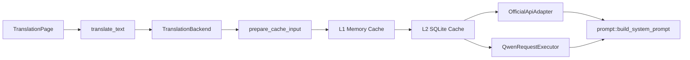
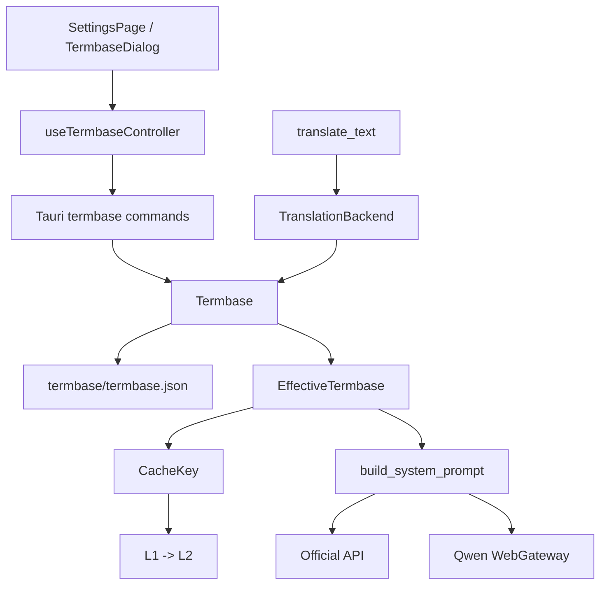
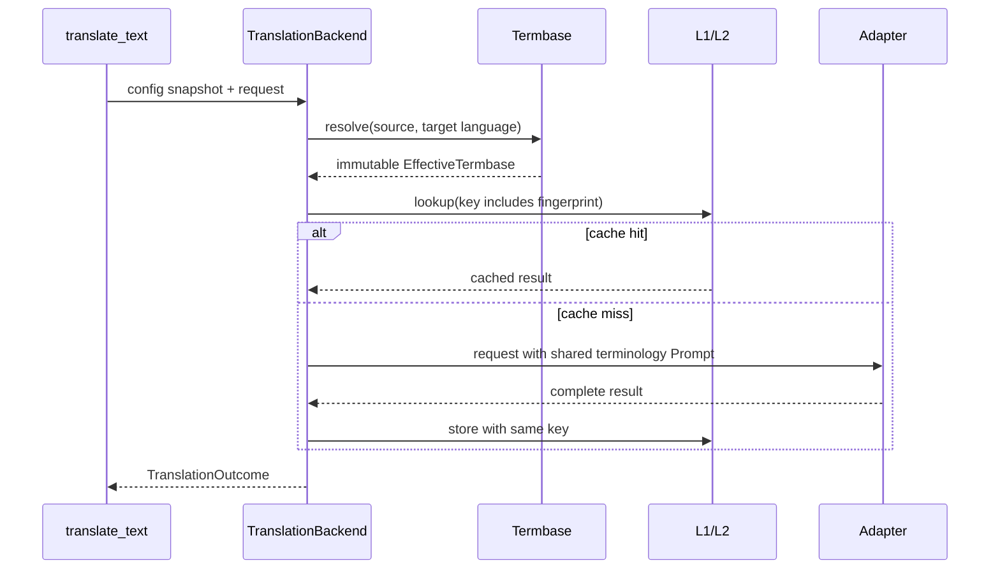
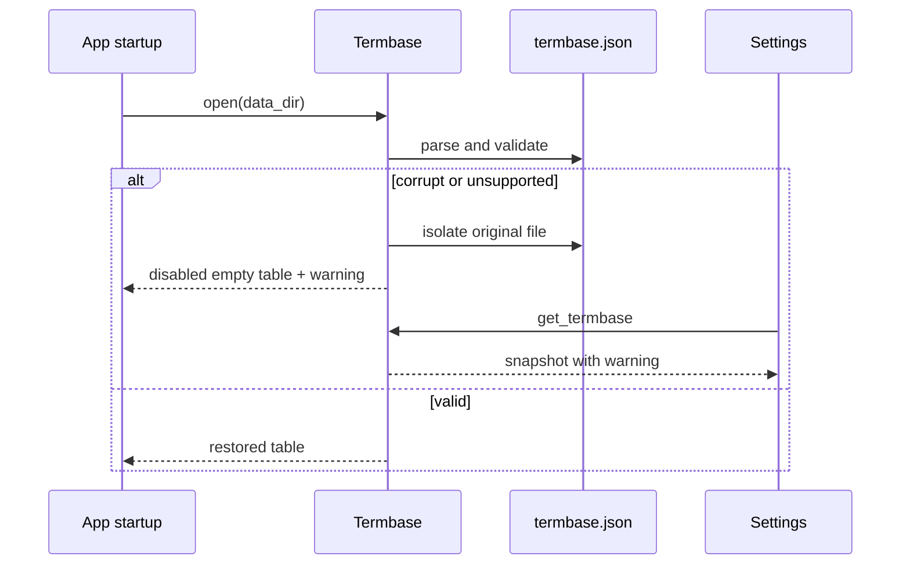

# easyT 术语表 Software Design Document

## 0. 文档控制

| 字段 | 值 |
|---|---|
| 状态 | Approved |
| 版本 | 0.2 |
| 最后更新 | 2026-08-17 |
| 目标项目 | easyT 2.x / 翻译后端、缓存与设置页 |
| 预期实施者 | Model-neutral coding agent |
| 需求来源 | `docs/术语表需求与架构共识文档.md` v1.0 |
| 设计基线 | `acf0757` |
| canonical 路径 | `SDD-termbase.md` |

### 0.1 修订历史

| 版本 | 日期 | 摘要 |
|---|---|---|
| 0.1 | 2026-08-17 | 初始实施设计与执行协议。 |
| 0.2 | 2026-08-17 | 项目所有者批准；补充 CacheKey 编码、初始化、匹配边界、错误映射和执行合同。 |

> 项目所有者已在 2026-08-17 明确批准本文档。后续涉及接口、数据、Prompt、缓存身份、匹配规则、错误语义或执行范围的变化，必须按本文偏差协议处理并同步修订历史。

## 1. 执行摘要

本变更为 easyT 增加本地术语表。用户维护英文源术语到指定译法的条目；每个翻译请求开始时，后端固定术语表快照，解析出本次有效术语集，并将其同时用于共享 Prompt 与 L1/L2 的共用缓存键。

设计选择 Prompt 注入而非译文后替换。术语条目在语义适用时约束模型优先采用指定译法，不直接改写模型输出。Official API 与 Qwen 网页实验模式 MUST 使用同一份术语 Prompt；缓存 MUST 以有效术语集区分，确保当前术语规则优先于冲突的旧缓存译文。

## 2. 范围

### 2.1 目标

- 用户 MUST 能管理最多 200 条本地术语条目，支持添加、编辑、删除和单条启停。
- 术语表总开关 MUST 默认关闭，且开关、单条启停和 CRUD MUST 立即原子持久化。
- 正式翻译 MUST 只注入当前原文、目标语言和启用状态实际匹配到的全部术语，不得本地截断。
- 官方 API 与 Qwen 网页实验模式 MUST 接收语义相同的共享术语 Prompt。
- 当前有效术语集不同的请求 MUST 使用不同 CacheKey；总开关关闭、空表或零命中 MUST 复用无术语约束缓存。
- 设置页 MUST 通过现有 Dialog、ConfirmDialog、Switch、Button、Input、Select 与 UI Kit 约束提供术语管理，支持本地搜索和每页 20 条分页。
- 术语表文件损坏或不兼容时，翻译 MUST 降级为无术语约束并显示一次非阻断恢复提示。

### 2.2 非目标

- 不做译文后替换、强制替换或模型遵守检测。
- 不支持非英文源术语、正则、模糊匹配、词形还原、手工优先级或术语分组。
- 不做 CSV/TBX 导入导出、云同步、协作、自动抽取、统计或历史术语版本追溯。
- 不改变翻译历史 schema 或恢复历史记录重新翻译功能。
- 不新增第三方依赖、UI dependency、后台探测、永久 timer 或 API capability。

### 2.3 已验证事实、假设与约束

| ID | 类型 | 陈述 | 不成立时的影响 |
|---|---|---|---|
| FACT-001 | 已验证 | `TranslationBackend::translate` 在 `src-tauri/src/translation_backend/mod.rs` 中先调用 `prepare_cache_input`，再执行 L1 -> L2 -> Adapter。 | 必须在该缓存查询前取得有效术语集。 |
| FACT-002 | 已验证 | `prompt::build_system_prompt(target_language)` 是 Official API 和 Qwen 当前共同使用的 Prompt 构造入口。 | 不得让 Adapter 各自实现术语匹配或 Prompt 格式。 |
| FACT-003 | 已验证 | 当前 `CacheKey` 已包含 `output_affecting_parameters` 的预留 `u32` 字段，现值为 0；`KeyEncoder` 的变长字段使用 `u32` 长度前缀。 | 术语表需要扩展键编码并提升 `CACHE_KEY_VERSION`。 |
| FACT-004 | 已验证 | `easyT_Data` 已用于 config、L2 cache、翻译历史和 Qwen 数据；配置使用临时文件和原子替换。 | Termbase JSON 使用相同应用数据根和持久化方式。 |
| FACT-005 | 已验证 | 术语表正式共识要求不设置本地 Prompt 字节上限，并注入全部命中术语。 | 不得擅自截断；上游失败必须按本 SDD 的错误规则处理。 |
| CON-001 | 约束 | `docs/术语表需求与架构共识文档.md` 与根 `CONTEXT.md` 是术语和产品行为权威。 | 与其冲突时停止并请求决定。 |
| CON-002 | 约束 | 现有工作区包含与本功能无关的修改，尤其 `SDD-qwen-multi-account-round-robin.md` 与 `WebGatewayPanel.tsx`。 | MUST 保留，不得回退或夹带重构。 |
| ASM-001 | 假设 | 当前 `TARGET_LANGUAGES` 是前端唯一的可选目标语言列表，Rust 端会建立与其一致的受控白名单。 | 若 Rust 没有可复用的同一列表，需记录 DEV 并建立单一权威来源；不得接受前端任意字符串。 |

## 3. 需求

### 3.1 功能需求

| ID | 需求 | 优先级 | 验收标准 |
|---|---|---|---|
| FR-001 | 系统 MUST 持久化最多 200 条术语条目和术语表总开关。 | Must | 第 200 条可保存；第 201 条返回可见校验错误；重启后条目和开关恢复。 |
| FR-002 | 条目 MUST 包含源术语、指定译法、目标语言、启用状态和大小写敏感状态。 | Must | 1-120 字符源术语与 1-240 字符指定译法可保存；空白、控制字符、超长和不支持的目标语言被拒绝。 |
| FR-003 | 翻译 MUST 只匹配英文原文，按目标语言筛选，并遵循完整单词、精确子串、大小写敏感例外和长术语优先规则。 | Must | `function` 不匹配 `functional`；`china` 默认项与 `China` 敏感例外按共识结果解析。 |
| FR-004 | 每次翻译 MUST 在请求开始时固定有效术语集。 | Must | 流式请求进行中编辑术语表不影响该请求；后续请求使用新规则。 |
| FR-005 | 有效术语集 MUST 以共享 Prompt 注入 Official API 与 Qwen，且两端术语语义一致。 | Must | 两个请求体都包含同一术语块；未命中时不注入术语段。 |
| FR-006 | 当前术语表 MUST 优先于冲突的旧缓存；L1/L2 MUST 以有效术语集指纹区分。 | Must | 无术语缓存 `function -> 功能` 在 `function -> 函数` 有效时不命中；术语关闭后可命中无术语记录。 |
| FR-007 | 有效术语集不变时缓存 MUST 保持命中。 | Must | 修改未命中条目、UUID 或时间字段不改变 CacheKey；删除后恢复相同规则可重用对应缓存。 |
| FR-008 | 术语管理 MUST 立即保存并返回权威快照；设置页 MUST 提供搜索、每页 20 条、总开关、CRUD 与删除确认。 | Must | 搜索匹配源术语和指定译法；改变查询回到第 1 页；取消编辑不落盘；删除需 ConfirmDialog。 |
| FR-009 | 术语表损坏或不兼容时 MUST 隔离原文件、创建关闭的空表、继续翻译并提供一次非阻断警告。 | Must | 损坏文件不被覆盖；启动后翻译按无术语约束继续；设置页面可见恢复提示。 |
| FR-010 | 上游返回可识别的上下文/Prompt 过长错误时 MUST 显示专项提示；通用上游错误 MUST 保持真实错误分类并建议暂时关闭术语表后重试。 | Must | 已知错误映射到专项文案；网络、认证等分类不被错误改写为“术语过长”。 |

### 3.2 非功能需求

| ID | 类别 | 需求 | 验证 |
|---|---|---|---|
| NFR-001 | 一致性 | 规范化有效术语集的 Prompt 内容和缓存指纹 MUST 一一对应且顺序稳定。 | 匹配、排序、Prompt 和 key 固定向量测试。 |
| NFR-002 | 隐私 | 日志 MUST 不记录术语正文、Prompt、原文、译文或凭证。 | 代码审查和日志测试。 |
| NFR-003 | 性能 | 200 条上限内匹配 MUST 在请求启动时同步完成，不增加常驻任务或影响 L1/L2 的锁约束。 | 单元测试和代码审查；匹配为 O(n * source length)。 |
| NFR-004 | 可用性 | 存储异常不得把正常翻译变为失败。 | 损坏/不可用存储测试。 |
| NFR-005 | 无障碍 | Dialog、搜索、分页、Switch、编辑和删除确认 MUST 可通过键盘操作并保持焦点语义。 | Testing Library 行为测试和 520x390/360x200 手工检查。 |
| NFR-006 | 兼容性 | 旧安装无 `termbase.json` 时 MUST 表现为关闭的空术语表；旧缓存和历史不得损坏。 | 启动、缓存和历史回归测试。 |

## 4. 当前系统上下文

当前调用链：



- `src-tauri/src/commands/translate.rs::translate_text` 取得 `AppState` 配置快照，并以现有 latest-wins manager 调用 `TranslationBackend`。
- `src-tauri/src/translation_backend/mod.rs::TranslationBackend::translate` 是缓存策略唯一入口；页面和 Adapter 均不应直接操作缓存。
- `src-tauri/src/translation_backend/cache/key.rs::prepare_cache_input` 目前接收原文和目标语言，编码 prompt/cache key version 及输出参数预留字段。
- `src-tauri/src/translation_backend/prompt.rs::build_system_prompt` 不读取配置、不做 I/O，是共享 Prompt seam。
- `src-tauri/src/config/storage.rs` 提供应用数据目录与原子 JSON 写入模式；但术语表不得放入 `AppConfig`。
- 前端 settings 使用 `SettingsPage` + `useSettingsController`；跨目录 UI 只能从 `@/components/ui` 和 `@/components/patterns` seam 导入。

## 5. 提议设计

### 5.1 架构与所有权



依赖规则：

- `Termbase` MUST 拥有持久化、校验、匹配、冲突解析、Prompt 数据和指纹。
- `TranslationBackend` MUST 仅调用 `Termbase::resolve`，再将同一 `EffectiveTermbase` 交给缓存键和 Prompt。
- 缓存层 MUST 接收已经解析的指纹，不读取 Termbase。
- Prompt module MUST 接收已经排序的术语数据，不读取 Termbase 或做匹配。
- Adapter MUST 不读取 Termbase、拼接私有术语格式或改变指纹。
- React MUST 不复制 Rust 的匹配、冲突或排序状态机。

### 5.2 关键决定

| ID | 决定 | 理由 | 拒绝方案 |
|---|---|---|---|
| DD-001 | 使用共享 Prompt 注入。 | 保留上下文理解，统一两个后端。 | 译文后替换会破坏语境、代码、Markdown 与公式。 |
| DD-002 | `Termbase` 是独立 JSON 模块。 | 条目 CRUD 与 AppConfig 保存事务独立，未来可扩展导入导出。 | 将条目嵌入 `config.json`。 |
| DD-003 | CacheKey 采用有效术语集指纹，而非全表版本。 | 无关条目编辑不降低命中率，同时保持准确性。 | 全表版本导致无意义 miss。 |
| DD-004 | 大小写敏感例外优先。 | 支持 `china` / `China` 不同译法且不注入冲突规则。 | 忽略大小写后一律唯一，或同时注入冲突项。 |
| DD-005 | 200 条内全量注入，不设本地字节上限。 | 已批准的可见性承诺：不静默忽略已命中条目。 | 本地截断或预先拒绝。 |
| DD-006 | 总开关默认关闭并立即保存。 | 升级不改变既有行为；关闭时复用无术语缓存。 | 默认开启或随 AppConfig 保存。 |

## 6. 详细模块设计

### 6.1 `termbase` Rust 深模块

- **位置：** 新增 `src-tauri/src/termbase/{mod.rs,model.rs,storage.rs,matcher.rs}`。
- **职责：** 术语表状态、原子存储、校验、匹配、有效术语集、Prompt 数据和缓存指纹。
- **需求：** FR-001 至 FR-007、FR-009、NFR-001 至 NFR-004、NFR-006。

#### 公开 interface

```text
Termbase::open(data_dir: &Path) -> Result<(Termbase, Option<TermbaseWarning>), TermbaseError>
Termbase::snapshot(&self) -> TermbaseSnapshot
Termbase::create(&self, input: TermEntryInput) -> Result<TermbaseSnapshot, TermbaseError>
Termbase::update(&self, id: &str, input: TermEntryInput) -> Result<TermbaseSnapshot, TermbaseError>
Termbase::delete(&self, id: &str) -> Result<TermbaseSnapshot, TermbaseError>
Termbase::set_enabled(&self, enabled: bool) -> Result<TermbaseSnapshot, TermbaseError>
Termbase::set_entry_enabled(&self, id: &str, enabled: bool) -> Result<TermbaseSnapshot, TermbaseError>
Termbase::resolve(&self, source_text: &str, target_language: &str) -> EffectiveTermbase
```

`TermbaseSnapshot` MUST contain `enabled`, ordered entries, `maximumEntries=200`, and optional one-time warning. It MUST never contain filesystem paths, raw storage errors or Prompt content. The warning MUST be safe for direct UI display.

`EffectiveTermbase` is Rust-internal and MUST contain only final winning entries, a stable Prompt-ready representation, and a `[u8; 32]` BLAKE3 fingerprint. An empty effective set MUST use a fixed all-zero fingerprint and an empty Prompt block.

#### Validation and conflict logic

- `TermEntryInput` contains `source_term`, `target_language`, `target_term`, and `case_sensitive`; `enabled` is created true by default and independently mutated afterwards.
- Validate target language against a Rust-side authoritative supported list. If current frontend `TARGET_LANGUAGES` cannot be shared without new duplication, stop and record a deviation before choosing an authority; do not accept arbitrary frontend strings.
- Reject fields outside the character limits, all-whitespace strings and Unicode control characters.
- Allow sensitive `China` and insensitive `china` together. Reject duplicate sensitive exact source terms within a target language and duplicate insensitive case-folded source terms within a target language.
- Resolve sensitive exact candidates first, then insensitive candidates. Resolve overlapping terms by source length descending. A source span claimed by a higher-priority entry MUST suppress lower-priority conflicting matches.
- Sort winners by source length descending, normalized source, case mode, then target term before rendering and hashing. If equal-length candidates overlap, this order MUST select one deterministic winner and MUST NOT render conflicting entries together.

#### Persistence and recovery

Store `easyT_Data/termbase/termbase.json` as:

```text
TermbaseDocument { schemaVersion: 1, enabled: false, entries: [PersistedTermEntry] }
```

Mutation MUST hold a Termbase-local operation mutex, validate an in-memory candidate, write a temporary JSON file, `sync_all`, atomically rename, then publish the new in-memory state. Do not hold the short snapshot/matcher lock across filesystem I/O.

Missing file creates an in-memory disabled empty table and MAY persist it lazily on first mutation. Corruption, invalid entries or unsupported schema MUST rename the document to `termbase.json.corrupt-YYYYMMDD-HHMMSS`, create a disabled empty table, and yield a warning. If isolation fails, the original file MUST NOT be deleted or overwritten. Failure to create the replacement table MUST still expose a disabled in-memory empty table and a warning; translation MUST continue. Recovery MUST happen once during application startup, not on every translation request.

### 6.2 Translation backend, Prompt and CacheKey

- **位置：** 修改 `translation_backend/mod.rs`, `translation_backend/prompt.rs`, `translation_backend/cache/key.rs`, `official_api/adapter.rs`, `web_gateway/qwen/adapter.rs`。
- **职责：** 在缓存前固定有效术语集，以同一数据生成 Prompt 和 CacheKey。
- **需求：** FR-004 至 FR-007、FR-010、NFR-001、NFR-003、NFR-006。

#### Contracts

```text
TranslationBackend::new(http_client, cache, termbase, app_data) -> Result<Self, QwenError>
build_system_prompt(target_language: &str, termbase: &EffectiveTermbase) -> String
prepare_cache_input(text: &str, target_language: &str, termbase_fingerprint: &[u8; 32]) -> NormalizedCacheInput
```

The coding agent MAY introduce a narrow `TranslationPromptContext` if it reduces duplicated parameter threading, but it MUST contain the same immutable effective set and MUST not own storage or matching.

`TranslationBackend::translate` and `translate_stream` MUST resolve once before cache policy lookup. `TranslationBackend` MUST hold an `Arc<Termbase>` or equivalent immutable shared owner. `test_connection` MUST use an empty effective set and Bypass behavior.

Increment `CACHE_KEY_VERSION` from 1 and replace the existing fixed zero output parameter with an explicitly length-prefixed 32-byte effective termbase fingerprint using the existing `KeyEncoder::write_bytes` contract. Increment `PROMPT_VERSION` because the shared template gains a conditional terminology instruction. Update all fixed key vector tests and add a regression asserting empty terminology uses a deterministic fixed value.

The Prompt renderer MUST use a single stable compact block. It MUST render no terminology instruction when the set is empty. It MUST preserve current prompt content apart from adding the conditional section and must treat entry content as delimited data, not executable instructions.

Both adapters MUST receive the constructed Prompt/context through their existing request builders. No protocol DTO, Qwen ticket handling, account selection or response decoding changes are permitted beyond threading the shared Prompt argument.

### 6.3 Tauri commands and frontend contracts

- **位置：** 新增 `src-tauri/src/commands/termbase.rs`; 修改 `commands/mod.rs`, `lib.rs`, `src/services/tauriCommands.ts`, `src/types/index.ts`。
- **职责：** 暴露类型化术语表快照和 mutation command，保持 Rust 为权威。
- **需求：** FR-001、FR-002、FR-008、FR-009、NFR-005、NFR-006。

#### Commands

```text
get_termbase() -> TermbaseSnapshot
create_termbase_entry(input: TermEntryInput) -> TermbaseSnapshot
update_termbase_entry(id: String, input: TermEntryInput) -> TermbaseSnapshot
delete_termbase_entry(id: String) -> TermbaseSnapshot
set_termbase_enabled(enabled: bool) -> TermbaseSnapshot
set_termbase_entry_enabled(id: String, enabled: bool) -> TermbaseSnapshot
```

All commands MUST map user-correctable `TermbaseError` variants to `AppError::ConfigInvalid`. Storage and recovery failures MUST map to a safe, non-sensitive operation error; the coding agent MUST inspect `app_error.rs` and reuse the smallest existing-compatible serialization path. Adding an `ErrorKind` is allowed only if a distinct UI behavior is needed and MUST update Rust/TS contracts together. Raw paths and filesystem diagnostics MUST never cross IPC.

Proposed camelCase frontend DTO:

```text
TermbaseSnapshot { enabled, entries, maximumEntries, warning? }
TermEntry { id, sourceTerm, targetLanguage, targetTerm, enabled, caseSensitive, createdAtUtcMs, updatedAtUtcMs }
TermEntryInput { sourceTerm, targetLanguage, targetTerm, caseSensitive }
TermbaseWarning { kind: "storageRecovered" | "storageUnavailable", message }
```

### 6.4 Settings domain UI

- **位置：** 新增 `src/components/settings/TermbaseDialog.tsx`, `src/components/settings/useTermbaseController.ts`, and co-located tests; 修改 `components/settings/index.ts`, `pages/SettingsPage.tsx`。
- **职责：** 管理 Dialog 的 fetch/mutation state、客户端搜索与分页、表单草稿和删除意图。
- **需求：** FR-001、FR-002、FR-008、FR-009、NFR-005。

`SettingsPage` MUST render one compact `SettingsRow`: title “术语表”, description containing the persisted entry count, and an outline Button “管理术语表”. It MUST NOT inline all entries into the settings page.

`TermbaseDialog` MUST use existing `Dialog`, `ConfirmDialog`, `FormField`, `Input`, `Select`, `Switch`, `Button`, `IconButton`, `Spinner` and `StatusBanner`. It MUST NOT create a page-local modal, use `window.confirm`, introduce a UI dependency, or override UI module recipes.

UI state:

```text
loading | ready | failed
query: string
page: number
editing: null | create | entryId
deleting: null | entryId
pendingMutation: boolean
```

Search MUST match `sourceTerm` and `targetTerm` by case-insensitive containment. After query or mutation, reset to page 1; paginate filtered results at 20 entries. The frontend MAY sort only for display if Rust snapshot ordering is explicitly specified; otherwise preserve snapshot order. All mutation success paths MUST replace the entire snapshot returned by Rust.

## 7. 数据与兼容性

| 数据 | 路径 | 敏感性 | 兼容与保留 |
|---|---|---|---|
| 术语表 JSON | `easyT_Data/termbase/termbase.json` | 用户本地术语，可能敏感 | 新文件；缺失视为关闭空表；损坏隔离，不删除。 |
| L1/L2 键 | 内存 / SQLite | 哈希 | `CACHE_KEY_VERSION` 升级后旧条目不可达，按 LRU 淘汰。 |
| 翻译历史 | `translation_history/history.sqlite` | 原文和译文 | 不修改 schema，不回写记录。 |

Rollback to a build without Termbase leaves `termbase/` 未引用但不删除；旧 CacheKey 版本无法读取新增版本缓存，属于可接受的缓存回退。升级前无术语缓存将在 key version 变更后不可达，不得承诺继续命中。

## 8. 运行时流程

### 8.1 普通翻译



### 8.2 Storage degradation



## 9. 横切要求

### 9.1 错误与韧性

- Known upstream context-length errors SHOULD be identified in existing status/error mapping without exposing body text. The exact recognized status/message patterns MUST be documented in tests after inspecting both adapters' safe error mapping.
- Generic failures MUST retain their existing error kind and only append the approved, non-assertive suggestion when the request had a non-empty effective set.
- A failed termbase mutation MUST leave the prior in-memory snapshot and persisted file unchanged.
- A cancelled/latest-wins request MUST not retain a mutable reference to Termbase state.

### 9.2 隐私与安全

- Validate all text before persistence and Prompt rendering; reject control characters.
- Do not log raw entry content, Prompt text, source text, translation text, API keys, Cookie or ticket.
- Termbase paths MUST be generated internally; no Tauri command accepts a filesystem path.
- No encryption is added in this feature. The SDD does not claim storage-at-rest protection.

### 9.3 性能

- At most 200 entries, no index or worker is required for first version.
- Resolve only at request start. No interval polling, preload of Prompt strings, or background matching.
- Cache lookup and write policy remain unchanged apart from key material.
- Pagination is local to the Dialog and has no IPC search endpoint.

### 9.4 无障碍与窗口

- Dialog opening focuses the search input or the first enabled action according to existing `Dialog` behavior.
- All icon-only controls MUST use `IconButton` with labels.
- Page changes, search feedback, validation errors and storage warnings MUST be readable without color-only meaning.
- Verify 520x390 and 360x200; list content scrolls inside the Dialog and control labels do not overlap.

### 9.5 可观察性

- MAY log only safe structured categories: `termbase_storage_recovered`, `termbase_storage_unavailable`, `termbase_prompt_context_error`.
- Logs MUST omit entry values, Prompt, source text, translation and credentials.
- No metrics, remote telemetry or dashboard is introduced.

### 9.6 算法与 AI

本阶段不涉及模型训练、评估或 AI 算法。术语匹配是确定性规则：目标语言过滤、敏感例外优先、完整词/子串匹配、重叠解析与稳定排序。模型是否采用 Prompt 约束不进行事后判定。

## 10. 实施计划

### P1. Termbase 数据与持久化

- **前置条件：** SDD 已批准；阅读 `CONTEXT.md`、术语表共识、`config/storage.rs`、Qwen registry/pool 的恢复模式。
- **文件：** 新增 `src-tauri/src/termbase/*`；修改 `src-tauri/src/lib.rs`。
- **行为：** 实现模型、验证、原子 JSON、损坏隔离、快照与 CRUD；在启动时构建并 `app.manage(Arc<Termbase>)`。
- **测试：** 新增 Termbase 单测，覆盖边界、重复、`china/China`、排序、恢复、原子写失败。
- **完成标准：** `cargo test --manifest-path src-tauri/Cargo.toml termbase --no-fail-fast` 通过；翻译未接线前保持原行为。

### P2. 翻译、Prompt 与缓存接线

- **前置条件：** P1 通过，`Termbase::resolve` 和空集指纹合同稳定。
- **文件：** 修改 `translation_backend/mod.rs`, `prompt.rs`, `cache/key.rs`, Official API/Qwen adapter 测试与必要 request builders。
- **行为：** 请求开始时固定有效术语集；共享 Prompt 条件渲染；CacheKey 加指纹并升级两个版本常量；连接测试保持空术语和 Bypass。
- **测试：** Prompt、key 固定向量、L1/L2 命中/miss、无关编辑、删除/恢复、流式快照和两个 Adapter 请求体。
- **完成标准：** `cargo test --manifest-path src-tauri/Cargo.toml translation_backend --no-fail-fast` 通过；旧缓存因 key version 变化不命中是预期结果。

### P3. Tauri IPC 与设置页

- **前置条件：** P1/P2 通过，DTO 和 error mapping 经审查。
- **文件：** 新增 `commands/termbase.rs`, `components/settings/TermbaseDialog.tsx`, `useTermbaseController.ts` 及测试；修改 `commands/mod.rs`, `lib.rs`, `types/index.ts`, `services/tauriCommands.ts`, `components/settings/index.ts`, `pages/SettingsPage.tsx`。
- **行为：** 注册全部 command；管理 Dialog 使用快照替换、总开关、搜索、分页、表单和删除确认；不改变底部设置保存事务。
- **测试：** command DTO/错误、controller CRUD/分页/搜索、Dialog 键盘与确认、SettingsPage 入口。
- **完成标准：** `npm run typecheck` 与目标 Vitest 通过；所有 UI imports 遵守 seam。

### P4. 回归、错误提示与文档

- **前置条件：** P1-P3 通过。
- **文件：** 仅修改本 SDD、术语表共识、`CONTEXT.md` 和必要已验证测试；不得修改无关功能。
- **行为：** 完成上游错误提示映射；记录任何已批准 DEV；同步版本、接口或行为变化。
- **测试：** 全量前端/Rust、格式、build、release build；手工默认/最小窗口检查。
- **完成标准：** 第 11 节所有命令通过，文档与实现无冲突。

## 11. 验证与可追溯性

| 测试 ID | 层级 | 文件 | 场景 | 需求 |
|---|---|---|---|---|
| T-001 | Rust unit | `termbase/model.rs` | 字段边界、语言、控制字符、200 条限制 | FR-001, FR-002 |
| T-002 | Rust unit | `termbase/matcher.rs` | 完整词、子串、敏感例外、重叠与稳定排序 | FR-003, NFR-001 |
| T-003 | Rust unit | `termbase/storage.rs` | 原子保存、重启恢复、损坏隔离、空表降级 | FR-001, FR-009, NFR-004, NFR-006 |
| T-004 | Rust unit | `prompt.rs` | 空集不变、非空块格式和稳定渲染 | FR-005, NFR-001 |
| T-005 | Rust unit | `cache/key.rs` | 空集、不同集、无关元数据、固定 vectors | FR-006, FR-007, NFR-001 |
| T-006 | Rust integration | `translation_backend/mod.rs` | L1/L2 hit/miss、开关、删除/恢复和流式快照 | FR-004, FR-006, FR-007 |
| T-007 | Rust adapter | Official/Qwen adapter tests | 两种请求体共享术语语义 | FR-005 |
| T-008 | Rust command | `commands/termbase.rs` | CRUD、错误映射、完整 snapshot | FR-008, FR-009 |
| T-009 | Vitest | `useTermbaseController.test.tsx` | 查询、分页、快照替换、取消编辑、失败保留 | FR-008 |
| T-010 | Vitest | `TermbaseDialog.test.tsx` | 键盘、焦点、表单错误、删除确认、最小可用内容 | FR-008, NFR-005 |
| T-011 | Vitest | `SettingsPage.test.tsx` 或新增测试 | 入口、条目数、总开关和 warning | FR-008, FR-009 |
| T-012 | Rust/adapter | safe error mapping tests | 已知超长与通用错误建议 | FR-010 |

验证命令：

```powershell
cargo fmt --manifest-path src-tauri/Cargo.toml -- --check
cargo test --manifest-path src-tauri/Cargo.toml
cargo build --release --manifest-path src-tauri/Cargo.toml
npm run typecheck
npm test
npm run build
git diff --check
```

手工验证：

1. 在 520x390 与 360x200 打开设置、术语表管理 Dialog，创建、搜索、分页、编辑、启停和删除条目。
2. 创建无敏感 `china -> 瓷器` 与敏感 `China -> 中国`，确认两种原文产生不同有效约束。
3. 先以术语表关闭翻译并缓存，再开启冲突术语，确认重新请求；关闭后确认可命中无术语缓存。
4. 在流式翻译进行中编辑术语，确认在途请求未改变、下一请求改变。
5. 损坏本地 termbase 文件后启动，确认翻译继续且设置页面出现恢复提示。

### 11.1 可追溯矩阵

| 需求 | 设计元素 | 阶段 | 测试 |
|---|---|---|---|
| FR-001, FR-002 | 6.1, 7 | P1, P3 | T-001, T-003, T-008, T-009 |
| FR-003 | 6.1 | P1 | T-002 |
| FR-004, FR-005 | 6.2, 8.1 | P2 | T-004, T-006, T-007 |
| FR-006, FR-007 | 6.2, 7 | P2 | T-005, T-006 |
| FR-008 | 6.3, 6.4 | P3 | T-008, T-009, T-010, T-011 |
| FR-009 | 6.1, 7, 9.1 | P1, P3 | T-003, T-008, T-011 |
| FR-010 | 9.1 | P2, P4 | T-012 |
| NFR-001 to NFR-006 | 6-9 | P1-P4 | T-002 to T-012, manual checks |

## 12. 风险与开放项

| ID | 风险 | 可能性 | 影响 | 缓解 |
|---|---|---|---|---|
| RISK-001 | 200 条全量注入超过上游上下文限制。 | Medium | Medium | 不截断；识别已知错误并提示，通用错误仅给出关闭术语表建议。 |
| RISK-002 | 上游不暴露可安全识别的上下文长度错误。 | High | Medium | 保留原错误类型，禁止误报；记录 safe mapping 覆盖范围。 |
| RISK-003 | 中英文/符号边界处理与共识不一致。 | Medium | Medium | 用固定 matcher 用例锁定规则；遇到未覆盖边界按 deviation protocol。 |
| RISK-004 | 目标语言白名单在 Rust/TS 漂移。 | Medium | Medium | preflight 确认权威来源；必要时新增共享/同步合同并记录 DEV。 |

无阻塞开放问题。RISK-001 与 RISK-002 是项目所有者已经批准的全量注入取舍，不得由 coding agent 改为截断或本地拒绝。

## 13. Coding Agent Execution Protocol

### 13.1 Execution Objective

Implement only this SDD's approved scope after its status is `Approved`. Preserve behavior outside the scope, including top-level Refresh, translation history view/copy behavior, Qwen account routing and unrelated working-tree changes.

### 13.2 Authority and Conflict Resolution

Apply authority in this order:

1. The user's latest explicit instruction.
2. The approved revision of this SDD and `docs/术语表需求与架构共识文档.md`.
3. `AGENTS.md`, `CONTEXT.md`, UI Kit rules and applicable repository documents.
4. Existing public contracts, persisted schemas and tests.
5. Nearest existing code conventions.
6. The coding agent's preference.

On conflict, do not silently choose. Follow §13.6. Data loss, destructive operation, public IPC contract, security and persisted-data conflicts are blocking.

### 13.3 Allowed Scope

| File | Symbols | Change | Requirements |
|---|---|---|---|
| `src-tauri/src/termbase/*` | all new Termbase symbols | Add | FR-001-FR-004, FR-007, FR-009 |
| `src-tauri/src/translation_backend/{mod.rs,prompt.rs}` | backend construction/translation, Prompt builder | Modify | FR-004-FR-006 |
| `src-tauri/src/translation_backend/cache/key.rs` | `CACHE_KEY_VERSION`, `prepare_cache_input` | Modify | FR-006, FR-007 |
| Official/Qwen adapter files and tests | shared Prompt threading only | Modify | FR-005, FR-010 |
| `src-tauri/src/commands/{mod.rs,termbase.rs}` and `lib.rs` | commands/state registration | Add/Modify | FR-008, FR-009 |
| `src/types/index.ts` and `src/services/tauriCommands.ts` | Termbase DTO/command wrappers | Modify | FR-008 |
| `src/components/settings/*`, `src/pages/SettingsPage.tsx` | controller, Dialog, entry point | Add/Modify | FR-008, NFR-005 |
| `CONTEXT.md`, `docs/术语表需求与架构共识文档.md`, `SDD-termbase.md` | living design updates | Modify only when approved design changes | All |

Must not change without an approved deviation:

- `SDD-qwen-multi-account-round-robin.md` and unrelated Qwen account behavior.
- Translation history schema, history retranslation removal, global Refresh semantics, cache capacity, cache clear policy, Qwen protocol DTOs, dependencies and Tauri capabilities.
- Existing `WebGatewayPanel.tsx` changes unrelated to Termbase.

### 13.4 Mandatory Preflight

Before code edits, the coding agent MUST read this entire SDD, `docs/术语表需求与架构共识文档.md`, `CONTEXT.md`, `AGENTS.md`, UI Kit document, all target files and nearest tests. It MUST inspect status/diff, preserve unrelated changes, verify paths/symbols/commands, and issue a preflight report containing files read, planned symbols, assumptions, conflicts and phases.

Do not begin while this SDD is not `Approved`, a blocking conflict exists, or required contract paths have materially changed.

### 13.5 Execution Phases

Use P1-P4 in §10. Before each phase verify predecessor completion. At each phase report exact files, requirements, boundary/error handling, updated tests, commands run and exit criteria. Do not start a later phase after a failing prior phase.

### 13.6 Deviation Protocol

Stop the affected phase and report each deviation as:

| Field | Required content |
|---|---|
| Deviation ID | `DEV-001` |
| Planned design | Exact SDD requirement |
| Repository evidence | File, symbol, test or command output |
| Proposed change | Smallest viable adjustment |
| Requirements affected | FR/NFR IDs |
| Impact | API, data, security, compatibility, performance, tests |
| Approval needed | Yes/No and approver |

Only non-behavioral local compilation/formatting adjustments may proceed without approval; document them in the final report. All contract or behavior changes require explicit approval.

### 13.7 Stop Conditions

Stop and request direction if the SDD is not approved; a referenced contract/path is absent; a change requires unapproved IPC/schema/security/compatibility changes; tests contradict the SDD; a destructive migration is needed; or unrelated user work would be affected.

### 13.8 Completion Report

The coding agent final report MUST state outcome, changed files and symbols, requirement coverage, verification evidence, every DEV, remaining work/risks, and whether this SDD was updated. Do not claim implementation complete without this evidence.

## 14. Review and Living Document Plan

- **Required reviewers:** Project owner; reviewer familiar with Rust cache/key contracts; reviewer familiar with settings UI Kit constraints.
- **Approval gate:** 已完成。批准记录确认 §6 interfaces、`CACHE_KEY_VERSION` 兼容性影响、目标语言权威来源、错误映射行为和全量注入风险；后续改动须产生新修订版本。
- **Update triggers:** Any interface, match rule, Prompt format, CacheKey material, schema, storage recovery, error behavior, UI interaction, capacity rule or rollback change.
- **Sync rule:** Update this SDD, revision history and relevant consensus document in the same change as any approved implementation deviation.
