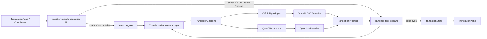
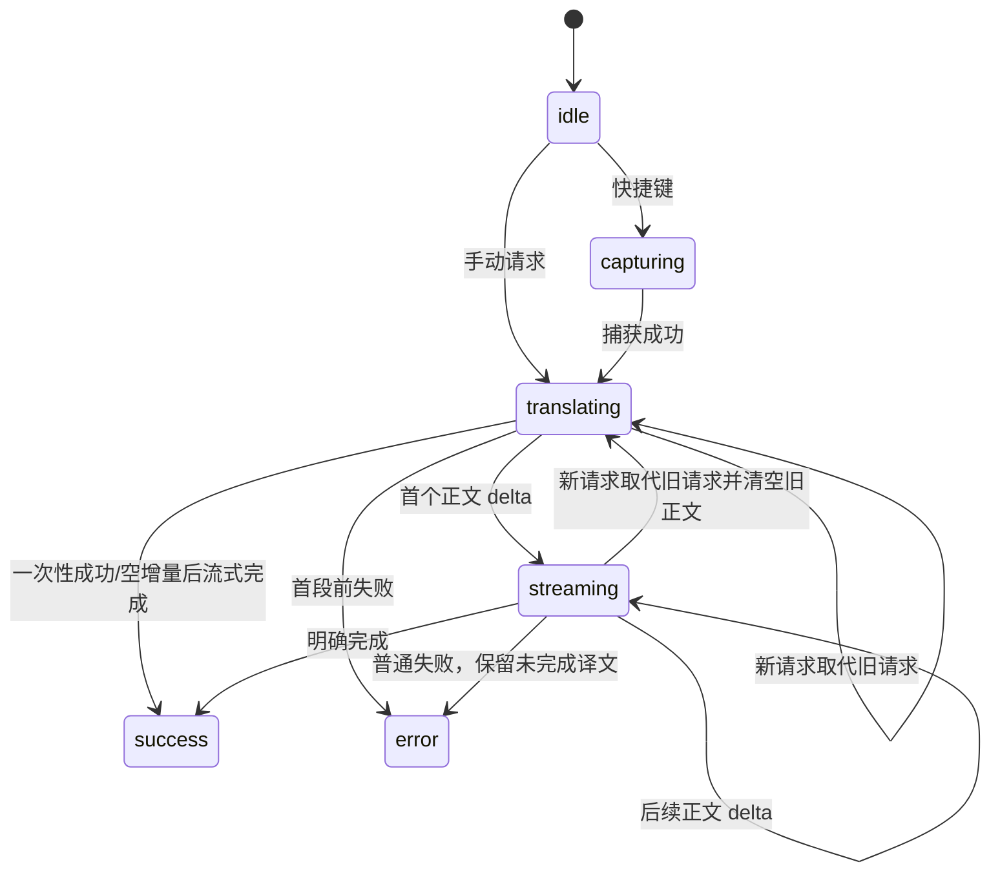
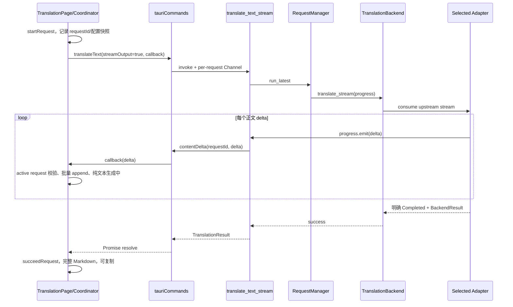

# easyT 流式输出开关软件设计文档

## 0. 文档控制

| 字段 | 值 |
|---|---|
| 状态 | Approved（用户已明确授权按本文档实现） |
| 版本 | 0.4 |
| 最后更新 | 2026-08-02 |
| 目标项目/模块 | easyT Translation：配置、翻译后端、Tauri IPC、React 翻译界面 |
| 预期实现者 | Model-neutral coding agent |
| 相关需求 | FR-001～FR-015；NFR-001～NFR-010 |
| 代码版本 | `f0f35f05f78ac25e72a1801641ee74bae901acfb`（实现前基线） |
| 文档路径 | `SDD-streaming-output.md` |

### 0.1 修订记录

| 版本 | 日期 | 摘要 |
|---|---|---|
| 0.1 | 2026-08-02 | 根据已确认的 grilling/domain-modeling 结果创建初始设计 |
| 0.2 | 2026-08-02 | 用户明确要求根据本文档实现，批准进入编码阶段 |
| 0.3 | 2026-08-02 | 完成流式后端、Tauri channel、前端状态与设置开关实现；进入验证阶段 |
| 0.4 | 2026-08-02 | 完成代码审查修复、前后端自动化测试与完成报告；保持正文静默超时的批准语义 |

> 业务代码实现 MUST NOT 在本 SDD 获得明确 `Approved` 状态前开始。只有用户或指定评审者的明确决定可以将状态改为 `Approved`。

## 1. 执行摘要

easyT 当前在 Official API 和 Qwen 网页实验模式中都等待完整译文后一次性展示。目标是在设置页增加全局“流式输出”开关：开启后，当前翻译请求的可见正文随着上游增量持续更新；关闭后保持完整成功后一次展示。该功能横跨配置持久化、Official API SSE、Qwen 已有 SSE、Tauri IPC、Zustand 状态机和 React 展示。

“流式输出”是**展示策略**，不强制底层传输协议随开关变化。Qwen Web 可以始终消费其私有 SSE；Official API 开启时使用标准 Chat Completions SSE。只有收到后端明确完成信号，译文才是完整结果；中途失败产生的内容是“未完成译文”，必须标记且不可复制。

## 2. 范围

### 2.1 目标

- 增加持久化的全局流式输出设置，默认关闭并兼容旧配置。
- Official API 开启时发送 `stream: true`，解析标准 SSE delta 并严格要求 `[DONE]`。
- Qwen Web 复用现有 SSE 解码，将正文 delta 传给前端。
- 通过每请求独立的 Tauri channel 传递增量事件。
- 首段前显示加载；首段后纯文本显示并标记生成中；成功后切换 Markdown。
- 普通失败保留未完成译文且禁用复制；新请求取代旧请求时丢弃旧内容。
- “测试连接”按设置草稿中的开关测试对应模式。
- 保持一次性输出的现有行为。

### 2.2 非目标

- 不展示 reasoning/思考内容，也不让 reasoning、SSE 心跳或注释续期无增量超时。
- 不为 Qwen Web 新增非 SSE 传输路径。
- 不自动将不兼容的 Official API 流式请求降级为一次性请求，也不隐式重试。
- 不为每个翻译后端保存独立开关。
- 不改变登录、快捷键、窗口、翻译历史或模型思考模式的既有范围。
- 不引入数据库、后台服务、WebSocket 或新的状态管理库。

### 2.3 假设与约束

| ID | 类型 | 陈述 | 若不成立的影响 |
|---|---|---|---|
| ASM-001 | 假设 | Tauri 2.11 的前端 API 与 Rust `tauri::ipc::Channel` 可建立每请求 channel。 | 预检必须验证真实 API；若不成立，停止并提交设计偏差。 |
| ASM-002 | 假设 | 目标 Official API 流式端点的正文位于 `choices[0].delta.content`，以 `[DONE]` 完成。 | 不兼容端点报错且提示关闭开关，不降级。 |
| ASM-003 | 假设 | 当前 `QwenSseDecoder` 能把累积 answer 转为 delta 并识别完成事件。 | 协议变化按协议错误或未完成译文处理。 |
| CON-001 | 约束 | 配置由 Rust `AppConfig` 持久化到 `easyT_Data/config.json`，前后端类型必须对齐。 | 新字段必须有 serde 默认值及前端默认值。 |
| CON-002 | 约束 | `timeoutSeconds` 继续限制为 5～300，不增加第二个超时配置项。 | 流式与一次性输出按模式解释同一值。 |
| CON-003 | 约束 | API Key、Qwen ticket、Cookie、Header、用户正文及原始上游响应不得进入日志或错误响应。 | 新日志和 IPC 错误必须脱敏。 |
| CON-004 | 约束 | latest-wins 继续由 `TranslationRequestManager` 唯一负责。 | 旧任务必须在新任务开始时取消，旧事件还须被前端 requestId 拒绝。 |

## 3. 需求

### 3.1 功能需求

| ID | 需求 | 验收标准 |
|---|---|---|
| FR-001 | 设置页 MUST 提供名为“流式输出”的全局开关，作用于两种翻译后端。 | 切换后只改变配置草稿；切换后端不丢失其值。 |
| FR-002 | 开关 MUST 默认关闭；旧配置缺字段时 MUST 读取为关闭。 | 加载旧配置后 `streamOutput=false`，其他值不变。 |
| FR-003 | 保存后的设置 MUST 只影响新请求。 | 运行中请求仍使用启动时配置快照；下一请求使用新值。 |
| FR-004 | Official API 开启流式输出时 MUST 发送 `stream:true` 并按序解析标准正文 delta。 | 多事件、拆包、合包及 UTF-8 边界均得到无重复、无丢失正文。 |
| FR-005 | Official API MUST 收到 `[DONE]` 才能成功。 | 有正文但普通 EOF、畸形事件或缺少完成信号时为未完成译文。 |
| FR-006 | Qwen Web MUST 上报现有解码器产生的 answer delta。 | 累积正文只上报新增部分，reasoning 不进入可见译文。 |
| FR-007 | 首段前 MUST 加载；首段后 MUST 纯文本展示并标记“生成中”；成功后 MUST 切换 Markdown。 | UI 可观察地经过等待、生成中、完整成功阶段。 |
| FR-008 | 流式输出 MUST 只展示正文。 | reasoning、注释和心跳不展示，也不重置无增量超时。 |
| FR-009 | 流式时 `timeoutSeconds` MUST 限制首段等待和相邻正文增量间隔，并由每个正文 delta 重置。 | 只要正文持续在期限内到达，请求不受总时长限制。 |
| FR-010 | 普通失败 MUST 保留已收到正文并标记“未完成译文”，复制 MUST 禁用。 | 网络、协议、超时失败后正文可查看但不能复制。 |
| FR-011 | 被新请求取代的旧请求 MUST 丢弃其正文和后续事件。 | 请求 A 被 B 取代后，A 不再改变 UI。 |
| FR-012 | 开关关闭时 MUST 保持一次性输出及总请求超时语义。 | 不展示中间正文，成功后按现有 Markdown 和复制流程工作。 |
| FR-013 | “测试连接” MUST 按未保存草稿中的开关测试相应模式。 | 开启时验证 SSE 解析和完成信号；关闭时验证一次性响应。 |
| FR-014 | Official API 流式不兼容时 MUST 明确报错，不得自动发送第二次一次性请求。 | 单次请求失败并提示关闭流式输出，无隐式二次计费风险。 |
| FR-015 | 开关 MUST 位于通用设置区域并展示兼容性提示。 | 提示说明逐步显示及 Official API 端点需支持标准流式响应。 |

### 3.2 非功能需求

| ID | 类别 | 需求与度量 |
|---|---|---|
| NFR-001 | 兼容性 | 新字段、新 command 不得破坏关闭流式时的旧配置及现有一次性 command；配置和回归测试通过。 |
| NFR-002 | 正确性 | delta 必须按序拼接且正确处理 UTF-8 拆包、SSE 合包、空 delta、畸形事件和明确完成。 |
| NFR-003 | 并发 | 任意时刻至多一个 active translation；Rust 取消和前端 requestId 两层阻止旧事件污染。 |
| NFR-004 | 性能 | 首段在下一可用渲染周期显示；UI SHOULD 将高频 delta 合并为约不高于 20 次/秒。 |
| NFR-005 | 资源 | 请求结束、失败、取消或页面卸载后 MUST 释放 task、channel、ticket、timer 和临时 buffer。 |
| NFR-006 | 安全隐私 | 日志和错误不得包含凭证、正文或原始上游 body；channel 仅传当前请求所需正文 delta。 |
| NFR-007 | 可访问性 | “生成中”“未完成译文”必须是可读文本；不可复制状态使用真实 `disabled` 和 aria 属性。 |
| NFR-008 | 可诊断性 | 日志 MAY 记录后端、模型、阶段、长度和错误类别，但不得记录原文/译文。 |
| NFR-009 | 可测试性 | 两类 SSE 解码、配置迁移和前端状态转移必须可脱离真实供应商验证。 |
| NFR-010 | 可回滚 | 关闭开关立即恢复一次性展示；旧版本忽略未知 JSON 字段，回滚不要求数据迁移。 |

## 4. 当前系统上下文

以下事实已从基线仓库核实：

- 前端是 React 18、TypeScript、Zustand、Vite；`package.json` 当前没有测试和 lint 脚本。
- Rust 是 Tauri 2.11、Tokio、reqwest 0.12；reqwest 已启用 `stream`，并已依赖 `futures-util`。
- `src/types/index.ts` 定义前端 `AppConfig` 和五态 `TranslationStatus`，当前没有流式字段或未完成状态。
- `src-tauri/src/config/models.rs` 定义 serde camelCase 的 `AppConfig`；`default_config()` 提供默认值。
- `src-tauri/src/config/storage.rs` 负责 `config.json` 加载与规整；`commands/config.rs::AppState::snapshot()` 为请求提供配置快照。
- `src/services/translationCoordinator.ts` 与 `src/pages/TranslationPage.tsx` 分别覆盖快捷键和手动/重试翻译，均调用 `tauriCommands.ts::translateText()`。
- `commands/translate.rs::translate_text` 通过 `TranslationRequestManager::run_latest()` 调用统一 `TranslationBackend::translate()`，完整后返回 `TranslationResult`。
- `OfficialApiAdapter::translate()` 当前显式发送 `stream:Some(false)` 并以 JSON 一次性解析。
- `QwenWebAdapter::consume_sse_stream()` 已消费 SSE 和累积正文，但只在 `Completed` 后返回完整结果；`QwenSseDecoder` 已分离 reasoning 和 content delta。
- `translationStore.ts::failRequest()` 当前清空 `translatedText`；`TranslationPage` 翻译中只显示 `LoadingState`；`TranslationPanel` 始终使用 Markdown。
- `TranslationHeader` 已以 `canCopy={!!translatedText && status === "success"}` 限制复制。

## 5. 提议设计

### 5.1 设计概览

保留现有 `translate_text` 作为一次性输出契约，新增 `translate_text_stream` 作为 channel 契约。前端统一在一个服务函数中根据请求启动时的 `config.streamOutput` 选择 command。后端通过不依赖 Tauri 的 `TranslationProgress` 回调接口向 adapter 注入正文 delta sink，commands 层负责把该进度转为 IPC 事件，从而避免 translation backend 直接依赖窗口或 Tauri channel。



禁止依赖方向：adapter MUST NOT 依赖 React、Zustand、页面、Tauri Window 或全局事件名；前端 MUST NOT 解析供应商 SSE；Qwen 私有 DTO MUST 保持在 Qwen 模块内部。

### 5.2 核心决策与权衡

| ID | 决策 | 理由 | 未采用方案 | 后果 |
|---|---|---|---|---|
| DD-001 | 流式输出是全局展示策略。 | 与两种翻译后端解耦，符合领域词汇。 | 将开关定义为 HTTP 模式。 | Qwen 关闭开关时仍可内部消费 SSE。 |
| DD-002 | 保留 `translate_text`，新增 `translate_text_stream`。 | 兼容旧调用和测试，接口语义清晰。 | 给旧 command 添加可选 channel。 | commands 层有两个薄入口，共用核心执行函数。 |
| DD-003 | 每请求使用独立 channel，事件携带 requestId。 | 避免全局事件串请求；便于双层过滤。 | Tauri 全局 emit/listen。 | 页面必须释放本次 channel 引用和 timer。 |
| DD-004 | backend 使用进度 sink，不直接依赖 Tauri。 | 保持现有深模块边界及可测试性。 | adapter 直接发送 IPC。 | 需要小型 `TranslationProgress` 契约。 |
| DD-005 | 完成信号严格判定成功。 | 防止代理截断被误认为完整译文。 | EOF 或有正文即成功。 | 某些非标准自定义端点会报不兼容。 |
| DD-006 | 不兼容不自动回退。 | 避免重复生成和重复计费。 | 自动改发 `stream:false`。 | 用户需关闭开关后手动重试。 |
| DD-007 | 流式正文纯文本，成功后 Markdown。 | 避免未闭合 Markdown 引发布局闪烁。 | 每个 delta 都解析 Markdown。 | 完成时会有一次格式切换。 |
| DD-008 | 失败保留未完成译文，取消丢弃。 | 普通失败保留用户价值；取消内容不污染新请求。 | 所有失败清空或都保留。 | store 必须区分普通失败与取消。 |
| DD-009 | 流式时超时为正文静默超时。 | 持续产生正文的长译文不被总时长截断。 | 延用总时限或由心跳续期。 | adapter 必须围绕正文 delta 重置 deadline。 |

## 6. 接口契约

本节 MUST 在内部实现前完成评审；跨层实现以此为准。

### 6.1 持久化配置

前后端 `AppConfig` 新增：

```text
streamOutput: boolean
```

- JSON 字段名 MUST 为 `streamOutput`；Rust 字段为 `stream_output: bool`。
- Rust 字段 MUST 使用 `#[serde(default)]`；前端 `DEFAULT_CONFIG.streamOutput` MUST 为 `false`。
- `settingsStore.migrateConfig()` MUST 用 `input.streamOutput ?? false` 规整运行时对象，防止非 Rust 来源或测试夹具缺字段。
- 不需要单独 migration version；加载旧配置时 serde 默认即可迁移，后续保存自然写出字段。
- 设置保存沿用现有 `save_config` 原子持久化与 `AppState` 快照逻辑。

### 6.2 后端进度契约

在 `translation_backend/models.rs` 增加内部契约，具体命名可在不改变语义时按 Rust 风格微调：

```text
enum BackendProgress { ContentDelta(String) }
trait TranslationProgress: Send + Sync {
    fn emit(&self, progress: BackendProgress) -> Result<(), BackendError>;
}
```

- sink 只接收可见正文，MUST NOT 接收 reasoning。
- `emit` 失败表示消费者已关闭；adapter SHOULD 终止工作并映射为取消，而不是继续消耗上游。
- `TranslationBackend` 增加 `translate_stream(config, request, progress)`；一次性 `translate` 保持原契约。
- 两种入口 MUST 共用输入校验、来源元数据和错误映射，禁止复制两套验证逻辑。

### 6.3 Tauri IPC 契约

保留：

```text
translate_text(text: String, target_language: String) -> AppResult<TranslationResult>
```

新增：

```text
translate_text_stream(
  request_id: String,
  text: String,
  target_language: String,
  on_event: Channel<TranslationStreamEvent>
) -> AppResult<TranslationResult>
```

`TranslationStreamEvent` 序列化为 camelCase 的 tagged union：

```json
{ "type": "contentDelta", "requestId": "req_...", "delta": "新增正文" }
```

- command 返回成功仍携带最终 `translatedText`，用于完成时校验/归一化 store 内容。
- channel 只发送 `contentDelta`；完成由 command Promise 成功表示，错误由 Promise reject 表示，避免 channel 和 Promise 存在两个终态来源。
- 每个事件 MUST 带 `requestId`。前端还 MUST 用 store 中 active requestId 拒绝过期事件。
- `translate_text_stream` MUST 纳入 `TranslationRequestManager::run_latest()`，并注册到 `lib.rs` handler。
- channel 发送失败 MUST 取消本请求；不得 panic。
- 不新增认证字段；API Key 和 Qwen ticket 仍只在 Rust 内存/存储层处理。

### 6.4 前端服务契约

`src/services/tauriCommands.ts` 增加：

```text
interface TranslateTextRequest {
  requestId: string;
  text: string;
  targetLanguage: string;
  streamOutput: boolean;
  onContentDelta?: (delta: string) => void;
}

translateText(request: TranslateTextRequest): Promise<TranslationResult>
```

- `streamOutput=false` 时调用旧 `translate_text`，不得调用 callback。
- `streamOutput=true` 时创建每请求 channel，调用 `translate_text_stream` 并顺序转发匹配 requestId 的 delta。
- 流式开启但 callback 缺失时 MUST 在前端抛开发错误，不能静默丢增量。
- Tauri channel 的准确 import/构造 API MUST 在预检中依据已安装版本确认；若与假设不符，按偏差协议处理。

### 6.5 前端状态契约

`TranslationStatus` 改为：

```text
idle | capturing | translating | streaming | success | error
```

`TranslationState` 增加：

```text
isPartial: boolean
```

store 增加/调整：

```text
appendTranslationDelta(requestId, delta): boolean
failRequest(requestId, message, kind?, originalText?, preservePartial=false): boolean
```

状态不变量：

- `streaming` 表示至少已有一个可见正文 delta，且请求未终止。
- `success` 必须有完整成功信号；`isPartial=false`。
- 普通流式失败且有正文：`status=error`、`isPartial=true`、保留正文。
- 首段前失败：`status=error`、`isPartial=false`、正文为空。
- `BackendCancelled` 或 requestId 过期：不得改变当前 store；旧内容直接丢弃。
- 每次 `beginCapture/startRequest/applyCapturedText/succeedRequest/reset` MUST 正确重置 `isPartial`。



### 6.6 UI 契约

- `SettingsPage` 通用开关区增加 `Switch`，标题“流式输出”，说明“生成时逐步显示译文；Official API 端点需支持标准流式响应”。
- `TranslationPanel` props 改为 `text` 加 `mode: "streaming" | "complete" | "partial"`。
- `streaming` 和 `partial` MUST 使用 `whitespace-pre-wrap break-words` 纯文本，不挂载 Markdown parser。
- `streaming` 显示“生成中”；`partial` 显示“未完成译文”。状态文本不可仅依赖颜色。
- `complete` 保持现有 lazy `MarkdownTranslation`。
- `TranslationPage` 在 `streaming` 状态显示原文和 panel，不再显示 `LoadingState`；`error && isPartial` 同时显示未完成 panel 与 `ErrorState`。
- 只有 `status === "success" && !isPartial && translatedText.length > 0` 时可复制。
- 手动翻译和快捷键协调器 MUST 使用同一个 store delta 行为，避免两条路径语义不同。

## 7. 后端协议与处理逻辑

### 7.1 Official API SSE Decoder

新增 `src-tauri/src/translation_backend/official_api/sse_decoder.rs`，职责限定为纯字节解码：

- 缓冲跨网络 chunk 的 UTF-8 和 SSE event。
- 支持 `\n\n`、`\r\n\r\n`、注释行、多 `data:` 行。
- `[DONE]` 产生 `Completed`。
- JSON event 从 `choices[].delta.content` 提取正文；空 delta、role-only、finish_reason-only 事件忽略。
- 上游 error payload、不可解析的非空 data、正文结构突变映射为明确错误，不能将已收到正文判成功。
- EOF 前未 `Completed`：已有正文为 `PartialResponse`，无正文为 `InvalidResponse`/协议不兼容。

建议解码输出：

```text
enum OpenAiDecodeOutcome { ContentDelta(String), Completed }
```

### 7.2 Official API Adapter

- `translate()` 保持 `stream:false` 和总请求超时。
- 新增 `translate_stream()`，发送 `stream:true`，先处理 HTTP 状态，再消费 bytes stream。
- 首段/相邻正文超时 MUST 使用 `timeoutSeconds` 作为**正文静默 deadline**。每次正文 delta 被 sink 成功接收后重置；连接阶段也受同一等待值约束。
- reasoning 字段、心跳和空事件不得续期。
- 不对网络、429、5xx 或协议错误自动重发一次性请求；为避免重复计费，流式翻译默认不自动重试整次模型请求。
- 若端点返回普通 JSON、错误 content-type 或非标准事件，返回安全的流式不兼容错误。优先复用 `BackendProtocolMismatch`；只有现有用户提示无法明确指导关闭开关时，才新增 `BackendStreamingUnsupported` 并同步前端错误表。

### 7.3 Qwen Adapter

- 现有一次性展示可继续内部调用 SSE 并累积，最终才返回。
- 流式入口复用同一 HTTP 请求、DTO 和 `QwenSseDecoder`，在 `DecodeOutcome::Delta.content_delta` 时调用 sink。
- reasoning_delta 忽略且不续期。
- 流式入口使用正文静默 deadline；一次性入口保持现有总超时。
- 只有 `DecodeOutcome::Completed` 后返回成功。
- 已有正文后 EOF、网络、超时、协议错误均返回错误；前端根据已接收正文保留未完成译文。
- 401/403 仍将 session 标记 expired；取消和 channel 关闭不得改变登录状态。

### 7.4 测试连接

- `test_api_connection` 已接收未保存 `AppConfig` 草稿，必须依据 `config.stream_output` 选择 `test_connection` 或新增 `test_connection_stream` 内部路径。
- 流式测试必须真实验证：可建立请求、至少得到有效正文、收到明确完成信号。
- 测试连接不得通过翻译 UI channel 输出 delta；只返回现有健康检查文本。
- 流式测试失败不自动执行一次性测试。

## 8. 数据设计、迁移与回滚

### 8.1 配置前后

```json
{
  "streamOutput": false
}
```

- 字段类型：boolean；默认值：false；所有者：`AppConfig`。
- 不包含敏感数据，无加密、索引、保留期要求。
- 旧文件无字段：Rust serde 默认 false；前端迁移函数再次兜底 false。
- 新文件被旧版本读取：serde 默认忽略未知字段，因此可回滚。
- 回滚功能：先关闭开关并保存即可恢复旧行为；代码回滚不要求修改配置文件。

## 9. 运行时流程

### 9.1 流式成功



### 9.2 失败、超时与取消

- 首段或相邻正文静默超过阈值：adapter 返回 timeout；有正文则前端保留并标记未完成，无正文则仅错误。
- 普通 EOF 无完成信号：严格失败；不得以累计正文构造成功。
- Official API 不兼容：明确提示关闭流式输出；不得自动二次请求。
- 新请求开始：Rust abort 旧 task；前端新 requestId 立即清空旧正文。旧 channel 的迟到事件因 requestId 不匹配被忽略。
- 页面卸载/channel 关闭：sink 失败，后端尽快停止；不得影响 Qwen session。
- 一次性输出：继续使用现有 `translate_text`，只在 Promise resolve 时更新译文。

## 10. 横切要求

### 10.1 错误与韧性

- 保持 `BackendError -> AppError -> CommandError -> FriendlyError` 单向映射。
- `BackendPartialResponse` 的用户文案 SHOULD 明确“译文未完成，可查看但不可复制”。
- 流式协议不兼容文案 MUST 提示关闭设置中的“流式输出”。
- 不新增静默 fallback，不重试可能已经产生 token/费用的整次流式请求。
- 对 channel 关闭、abort、EOF、timeout 和 malformed SSE 分别测试。

### 10.2 安全与隐私

- 不改变 API Key 和 Qwen 凭证边界。
- IPC channel 只传当前正文 delta 和 requestId，不传请求原文、凭证或原始响应。
- 日志只记录长度、后端、模型、阶段和错误类别。
- 未完成译文仅保存在内存，不写入配置、日志或历史。

### 10.3 性能

- Rust 可逐 delta 发送；前端 MUST 使用约 50ms 的 buffer/flush，或等价的每帧批处理，减少 Markdown/React 重排。
- 完成前只渲染纯文本；完成后仅进行一次 Markdown 转换。
- flush 前必须再次校验 requestId；完成/失败时先同步 flush 剩余 buffer，再进入终态。

### 10.4 可访问性与国际化

- 使用中文可见状态“生成中”“未完成译文”，不以颜色作为唯一信号。
- `Switch`、复制按钮必须有准确 aria-label 和 disabled 状态。
- UTF-8 delta 不能在字节边界产生替换字符或 panic。

### 10.5 可观测性

- 建议日志字段：`backend`、`provider`、`model`、`phase`、`text_len`、`translated_len`、`error_kind`。
- 禁止记录：`text`、`delta`、完整译文、API Key、ticket、Cookie、Header、原始 body。
- 本阶段不引入 metrics、tracing backend 或远程遥测。

### 10.6 算法/AI 设计

本阶段不涉及模型训练、评测、提示词改变或模型选择；只改变译文展示与响应消费方式。

## 11. 兼容、迁移与回滚

- **旧配置兼容：** `streamOutput` 缺失时前后端均默认 `false`，不得重写其他字段。
- **旧 IPC 兼容：** `translate_text` 保留原签名和行为；流式能力使用新增 command。
- **供应商兼容：** 内置 Official API 供应商 SHOULD 在真实凭证环境逐一验证；自定义端点只承诺标准 Chat Completions SSE。
- **发布顺序：** 同一桌面应用包内先完成 Rust contract，再完成 TS contract、store 和 UI，最终整体构建，无跨服务分批部署。
- **回滚触发：** 旧请求污染 UI、完整性误判、凭证泄漏、一次性路径回归、无法停止流式任务均是阻止发布或回滚原因。
- **用户级回滚：** 关闭开关并保存；无需删除配置或重新登录。
- **代码级回滚：** 可移除流式 command/UI；配置中的未知 `streamOutput` 对旧版本无害。

## 12. 逐文件实现计划

以下路径和现有符号已验证；新增符号属于设计决定。编码 agent MUST 按依赖顺序实施，且不得进行无关重构。

### Step 1：配置和共享类型

- **文件：** `src-tauri/src/config/models.rs`
- **符号：** `AppConfig.stream_output`、`default_config()`、现有 serde tests。
- **行为：** 增加 `#[serde(default)] pub stream_output: bool`；默认 false；更新 camelCase、旧配置和序列化测试。
- **文件：** `src/types/index.ts`
- **符号：** `AppConfig.streamOutput`、`DEFAULT_CONFIG`、`TranslationStatus`、`TranslationState`。
- **行为：** 增加流式配置与 `streaming/isPartial` 状态契约。
- **文件：** `src/stores/settingsStore.ts`
- **符号：** `migrateConfig()`。
- **行为：** 规整缺失 `streamOutput` 为 false。
- **需求：** FR-001～FR-003、NFR-001、NFR-010。
- **完成标准：** Rust 配置测试和 `npm run typecheck` 通过；旧 JSON fixture 读取为 false。

### Step 2：后端进度契约与 Official API SSE

- **文件：** `src-tauri/src/translation_backend/models.rs`
- **符号：** 新增 `BackendProgress`、`TranslationProgress`，必要时增加测试 sink。
- **文件：** `src-tauri/src/translation_backend/mod.rs`
- **符号：** 新增 `TranslationBackend::translate_stream()`；复用 `validate_translate_request()`。
- **文件：** `src-tauri/src/translation_backend/official_api/sse_decoder.rs`（新增）。
- **符号：** `OpenAiSseDecoder`、`OpenAiDecodeOutcome`。
- **文件：** `src-tauri/src/translation_backend/official_api/mod.rs`
- **行为：** 注册 decoder 模块。
- **文件：** `src-tauri/src/translation_backend/official_api/adapter.rs`
- **符号：** `OfficialApiAdapter::translate_stream()`；抽取可复用请求构建、HTTP 状态与结果构建逻辑。
- **行为：** `stream:true`、正文静默超时、严格 `[DONE]`、无自动降级/重试、sink 失败即取消。
- **文件：** `src-tauri/src/translation_backend/error.rs`、`src-tauri/src/app_error.rs`、`src/types/index.ts`、`src/services/tauriCommands.ts`。
- **行为：** 优先复用 `ProtocolMismatch`；若必须新增流式不支持错误，所有映射和友好提示同步更新。
- **需求：** FR-004、FR-005、FR-008、FR-009、FR-014、NFR-002、NFR-005、NFR-006、NFR-009。
- **完成标准：** decoder 单元测试覆盖拆包、合包、UTF-8、空事件、错误、缺少 `[DONE]`；`cargo test` 通过。

### Step 3：Qwen 流式进度与统一测试连接

- **文件：** `src-tauri/src/translation_backend/web_gateway/qwen/adapter.rs`
- **符号：** `QwenWebAdapter::translate_stream()`；重用/调整 `consume_sse_stream()`，不得复制私有 DTO。
- **行为：** content delta 发 sink，reasoning 忽略，正文静默超时，严格完成，取消不改变 session。
- **文件：** `src-tauri/src/translation_backend/web_gateway/mod.rs`
- **符号：** `WebGateway::translate_stream()`、按配置选择的流式测试路径。
- **文件：** `src-tauri/src/translation_backend/mod.rs`
- **符号：** `test_connection()` 或内部 helper。
- **行为：** 根据 `config.stream_output` 测试对应模式。
- **需求：** FR-006、FR-008、FR-009、FR-013、NFR-002、NFR-005、NFR-006。
- **完成标准：** Qwen decoder 现有测试保持通过，新增 sink、静默超时、完成/EOF、reasoning 不续期测试通过。

### Step 4：Tauri command 与 latest-wins

- **文件：** `src-tauri/src/commands/translate.rs`
- **符号：** 新增 `TranslationStreamEvent`、`translate_text_stream()`；抽取一次性/流式共用的请求校验和 manager 调用。
- **行为：** per-request channel；事件携带 requestId；Promise 是唯一终态；channel 关闭映射取消；仍由 `run_latest()` abort 旧任务。
- **文件：** `src-tauri/src/lib.rs`
- **符号：** imports、`tauri::generate_handler!`。
- **行为：** 注册新增 command。
- **需求：** FR-003、FR-011、NFR-003、NFR-005、NFR-006。
- **完成标准：** command 事件序列、channel 关闭、旧任务取消测试通过；`cargo check` 和 `cargo test` 通过。

### Step 5：前端服务与状态机

- **文件：** `src/services/tauriCommands.ts`
- **符号：** 扩展 `TranslateTextRequest`、`translateText()`；必要时添加内部 `createTranslationChannel()`。
- **行为：** 按请求快照选择 command；验证 callback；过滤 requestId；保持旧错误转换。
- **文件：** `src/stores/translationStore.ts`
- **符号：** `appendTranslationDelta()`、扩展 `failRequest()`、所有起止方法。
- **行为：** 实施第 6.5 节状态不变量；普通失败可保留部分，取消和过期事件无效。
- **文件：** `src/services/translationCoordinator.ts`
- **符号：** `translateAfterCapture()`。
- **文件：** `src/pages/TranslationPage.tsx`
- **符号：** `handleTranslate()`；两者都传 requestId、streamOutput 和 delta callback。
- **行为：** 使用启动时 config 快照；约 50ms 合并 delta；完成/失败前 flush；清理 timer。
- **需求：** FR-003、FR-007、FR-010～FR-012、NFR-003～NFR-005、NFR-009。
- **完成标准：** 两条入口都遵循同一状态转移；`npm run typecheck` 通过；若添加前端测试设施，状态测试通过。

### Step 6：设置与翻译展示

- **文件：** `src/pages/SettingsPage.tsx`
- **符号：** 通用 Switch 区域。
- **行为：** 增加标题、兼容提示、aria-label；连接测试沿用完整草稿 config。
- **文件：** `src/components/TranslationPanel.tsx`
- **符号：** `TranslationPanelProps.mode` 和三种渲染分支。
- **文件：** `src/pages/TranslationPage.tsx`
- **行为：** 等待、生成中、完整、部分错误渲染；复制只允许完整成功。
- **文件：** `src/components/TranslationHeader.tsx`
- **行为：** 预计无需改 contract；若现有 `canCopy` 足够，仅由页面传正确值。
- **需求：** FR-001、FR-007、FR-010、FR-015、NFR-004、NFR-007。
- **完成标准：** desktop 最小窗口 `360x200` 和默认 `520x390` 无重叠；键盘和 aria 手工验证通过。

### Step 7：文档与全量验证

- **文件：** `README.md`
- **行为：** 设置表、功能说明和 Official API 排错增加流式输出、完成判定和不兼容提示；使用 `CONTEXT.md` 术语。
- **文件：** `SDD-streaming-output.md`
- **行为：** 若实现发生已批准偏差，同步修订版本、状态、接口和记录；不得事后静默改写设计。
- **需求：** 全部 FR/NFR。
- **完成标准：** 第 13.3 节全部可执行命令通过，手工场景有证据，无未报告偏差。

## 13. 验证策略

### 13.1 自动化测试

| ID | 层级 | 文件 | 场景 | 覆盖需求 | 期望结果 |
|---|---|---|---|---|---|
| T-001 | Rust unit | `config/models.rs` | 旧 JSON 无 `streamOutput` | FR-002, NFR-001 | false，其他字段不变 |
| T-002 | Rust unit | `config/models.rs` | 新字段 camelCase 往返 | FR-001～003 | 序列化/反序列化一致 |
| T-003 | Rust unit | `official_api/sse_decoder.rs` | 单/多事件、网络拆包、UTF-8 拆分 | FR-004, NFR-002 | delta 无丢失重复 |
| T-004 | Rust unit | 同上 | role-only、空 delta、注释、多 data 行 | FR-004, FR-008 | 忽略非正文且继续解析 |
| T-005 | Rust unit | 同上 | `[DONE]` 与普通 EOF | FR-005 | 仅 `[DONE]` 成功 |
| T-006 | Rust unit | `official_api/adapter.rs` | 正文静默超时与正文续期 | FR-009 | 仅正文重置 deadline |
| T-007 | Rust unit | `qwen/sse_decoder.rs` / adapter | reasoning 与 content 混合 | FR-006, FR-008 | 只上报 content |
| T-008 | Rust unit | `qwen/adapter.rs` | EOF、超时、明确完成 | FR-006, FR-009, FR-010 | 完成成功，其余错误 |
| T-009 | Rust unit | `commands/translate.rs` | 新请求取消旧流式 task | FR-011, NFR-003 | 旧 task cancelled |
| T-010 | Rust unit | 同上 | channel consumer 关闭 | NFR-005 | task 停止且不 panic |
| T-011 | Store unit | `translationStore` 测试文件（新增，路径按现有测试配置决定） | delta、成功、普通失败、取消、过期 requestId | FR-007, FR-010, FR-011 | 状态不变量成立 |
| T-012 | Component | `TranslationPanel`/`TranslationPage` 测试 | streaming/partial/complete | FR-007, FR-010, NFR-007 | 纯文本/Markdown、标记、复制正确 |
| T-013 | Integration/manual fixture | `test_api_connection` | 草稿开关开/关 | FR-013, FR-014 | 分别测试对应模式且无降级 |
| T-014 | Regression | 前后端现有 tests | 开关关闭 | FR-012, NFR-001 | 行为不变 |
| T-015 | Store/component | 前端测试或受控 instrumentation | 高频 delta 在 1 秒内连续到达 | NFR-004 | UI 更新频率约不高于 20 次/秒，最终正文完整 |
| T-016 | Rust unit/review | error、adapter、command tests | 上游错误含 URL/body，日志与 IPC 事件检查 | NFR-006, NFR-008 | 凭证、正文和原始 body 不出现在日志/错误；仅记录允许字段 |
| T-017 | Rust unit | adapter/command tests | 请求成功、失败、取消及 channel 关闭 | NFR-005 | task、timer、ticket、channel 和 buffer 均结束生命周期 |

仓库当前未配置前端测试 runner。编码 agent MUST 在预检中选择以下之一并报告：

1. 若现有分支已加入测试设施，沿用其约定。
2. 若没有，MAY 最小化加入 Vitest + jsdom + Testing Library，仅用于 T-011/T-012；这属于允许的支持性变更，但不得升级其他依赖。
3. 若用户不批准新增依赖，必须把 T-011/T-012 转为明确的手工检查并记录剩余自动化缺口，不能伪称已自动验证。

### 13.2 手工验证

1. 旧配置启动：确认开关关闭，Official API 一次性翻译无中间正文。
2. Official API 标准 SSE：开启并保存，首段前加载、首段后纯文本“生成中”、完成后 Markdown、复制启用。
3. Official API 非标准/不支持 SSE：只发送一次请求，明确提示关闭流式输出，无自动降级。
4. Qwen Web：开启流式，确认正文增量可见、reasoning 不可见、完成后可复制。
5. 中途断网/模拟 EOF：部分正文保留并标记“未完成译文”，复制禁用。
6. 静默超时：只发心跳或 reasoning 仍在 `timeoutSeconds` 后失败；正文持续到达则不受总时长限制。
7. 连续触发快捷键：旧译文立即清空，旧请求后续事件不污染新请求。
8. 运行中修改设置：当前请求不改变，下一请求使用新设置。
9. 设置页默认和最小窗口检查：开关、提示和按钮无重叠，键盘可操作。

真实供应商测试需要用户凭证和可能产生费用；必须经用户明确允许，不得由编码 agent 默认执行。

### 13.3 验证命令

以下命令已从仓库脚本或工具链核实：

```text
npm run typecheck
npm run build
cargo fmt --manifest-path src-tauri/Cargo.toml -- --check
cargo check --manifest-path src-tauri/Cargo.toml
cargo test --manifest-path src-tauri/Cargo.toml
```

仓库当前没有 lint 命令。若实施中增加前端测试脚本，必须额外运行并报告准确命令，例如 `npm test -- --run`；不得声称未存在的 lint/test 命令已通过。

## 14. 需求追踪矩阵

| 需求 | 设计元素 | 实现步骤 | 测试 |
|---|---|---|---|
| FR-001～003 | 6.1, 6.4, DD-001 | 1, 5, 6 | T-001, T-002, 手工1/8 |
| FR-004～005 | 6.2, 7.1～7.2, DD-005 | 2 | T-003～T-006, 手工2/3 |
| FR-006 | 6.2, 7.3 | 3 | T-007, T-008, 手工4 |
| FR-007～010 | 6.5～6.6, 7.2～7.3, 9 | 2, 3, 5, 6 | T-006～T-008, T-011, T-012, 手工2/5/6 |
| FR-011 | 6.3, 6.5, 9.2 | 4, 5 | T-009～T-011, 手工7 |
| FR-012 | DD-002, 6.3, 7.2 | 2, 4, 5 | T-014, 手工1 |
| FR-013～014 | 7.4, DD-006 | 2, 3 | T-013, 手工3 |
| FR-015 | 6.6 | 6 | T-012, 手工9 |
| NFR-001～003 | 6, 8, 11 | 1～5 | T-001～T-010, T-014 |
| NFR-004～005 | 6.4～6.6, 10.3 | 4～6 | T-010～T-012, T-015, T-017, 手工2/7 |
| NFR-006～008 | 10.1～10.5 | 2～7 | T-012, T-016, 代码审查、手工5 |
| NFR-009 | 7, 13.1 | 1～6 | T-001～T-014 |
| NFR-010 | 8, 11 | 1, 7 | T-001, T-014, 手工1 |

## 15. 风险与开放问题

### 15.1 风险

| ID | 风险 | 概率 | 影响 | 缓解 |
|---|---|---|---|---|
| RISK-001 | Official API 供应商的 OpenAI 兼容实现不标准。 | 中 | 中 | 严格失败、提示关闭、不自动重试；真实供应商逐一验证。 |
| RISK-002 | Qwen 私有协议改变字段或完成事件。 | 中 | 高 | 保持 decoder 隔离、协议错误分类、未完成译文语义。 |
| RISK-003 | channel/Promise 竞态导致漏掉最终 buffer。 | 中 | 高 | Promise 作为唯一终态；终态前同步 flush；requestId 双层过滤。 |
| RISK-004 | 高频 delta 引发 UI 卡顿。 | 中 | 中 | 约 50ms 合并更新，完成前不解析 Markdown。 |
| RISK-005 | 静默 timeout 实现被心跳错误续期。 | 中 | 中 | timeout 单测只由 ContentDelta 驱动。 |
| RISK-006 | 旧请求 abort 后仍有迟到事件。 | 低 | 高 | Rust abort + channel 关闭 + requestId 校验。 |
| RISK-007 | 缺少前端测试基础设施。 | 高 | 中 | 最小引入测试 runner须报告；否则明确手工缺口。 |

### 15.2 开放问题

当前没有阻止设计评审的产品问题。以下实现事实必须在编码预检中确认，但不应由 agent 静默猜测：

| ID | 问题 | 阻塞 | 默认处理 |
|---|---|---|---|
| Q-001 | 已安装 Tauri JS/Rust 版本的 Channel 准确 API 和 Send 错误类型是什么？ | 是，进入 IPC 阶段前 | 查本地依赖/API；不符则提交 `DEV-*`。 |
| Q-002 | 是否批准增加最小前端测试依赖？ | 已解决 | 用户要求修复全部 review 问题，按最新授权最小加入 Vitest、jsdom 与 Testing Library；未升级既有依赖。 |
| Q-003 | 哪些真实 Official API 内置供应商可提供测试凭证？ | 否，单元实现不阻塞 | 不擅自调用；最终报告列出未做的真实集成测试。 |

## 16. 评审与活文档规则

- **必需评审者：** 用户/项目所有者；涉及 Tauri channel contract 时实现者也应确认 API 可行性。
- **批准门槛：** 第 6 节接口、未完成译文语义、超时语义、不回退策略和测试依赖选择被明确接受。
- **批准方式：** 评审者明确要求将状态改为 `Approved`；仅“继续”“看起来可以”不自动等于批准。
- **更新触发：** 配置字段、状态、command/channel、backend sink、超时、错误、迁移、回滚或测试策略变化。
- **同步规则：** 批准后的设计变化必须与代码同一变更更新本文档，并在 0.1 记录新版本和代码提交。
- **禁止事项：** 不得在实现完成后为匹配代码而静默修改 SDD；任何行为偏差先走下述偏差协议。

# Coding Agent Execution Protocol

## 1. 执行目标

仅实现本 SDD 明确批准的流式输出范围。保持范围外行为不变，满足全部 FR/NFR 和验收检查。文档状态不是 `Approved` 时，只允许预检和报告，不允许编辑业务代码。

## 2. 权威顺序与冲突处理

按以下顺序应用指令：

1. 用户最新明确指令。
2. 已批准的 SDD 及已批准修订。
3. 仓库 `CONTEXT.md` 和仓库级 agent/contribution 指令。
4. 现有公开契约、schema 和测试。
5. 最近相关代码的既有约定。
6. 编码 agent 自身实现偏好。

发生冲突时不得静默选择。必须引用文件、符号或命令证据并执行偏差协议。安全、数据丢失、破坏性操作、持久化 schema 和公开接口冲突一律阻塞。

## 3. 允许范围

### 3.1 预计修改文件

| 文件 | 符号/职责 | 允许修改 | 需求 |
|---|---|---|---|
| `src-tauri/src/config/models.rs` | `AppConfig`, defaults/tests | 增加配置字段及兼容测试 | FR-001～003 |
| `src-tauri/src/translation_backend/models.rs` | progress contract | 增加 backend 内部进度接口 | FR-004, FR-006 |
| `src-tauri/src/translation_backend/mod.rs` | router/test | 增加流式路由、按开关测试 | FR-004, FR-006, FR-013 |
| `src-tauri/src/translation_backend/official_api/mod.rs` | module exports | 注册 decoder | FR-004 |
| `src-tauri/src/translation_backend/official_api/sse_decoder.rs` | 新 decoder | 新增纯 SSE 解码模块 | FR-004～005 |
| `src-tauri/src/translation_backend/official_api/adapter.rs` | translate paths | 增加流式消费，保留一次性 | FR-004～005, FR-009, FR-014 |
| `src-tauri/src/translation_backend/web_gateway/mod.rs` | routing | 增加流式路由 | FR-006 |
| `src-tauri/src/translation_backend/web_gateway/qwen/adapter.rs` | Qwen consume | 上报 delta、静默超时 | FR-006, FR-008～010 |
| `src-tauri/src/commands/translate.rs` | commands/manager | 新 channel command，共用校验 | FR-003, FR-011～013 |
| `src-tauri/src/lib.rs` | invoke handler | 注册 command | FR-004, FR-006 |
| `src-tauri/src/translation_backend/error.rs`、`src-tauri/src/app_error.rs` | error mapping | 仅在现有错误不足时增加同步错误 | FR-014 |
| `src/types/index.ts` | config/state/errors | 对齐跨层类型 | FR-001～003, FR-007～010 |
| `src/stores/settingsStore.ts` | migration | 默认规整 | FR-002 |
| `src/stores/translationStore.ts` | request state | delta/partial/requestId 状态机 | FR-007, FR-010～012 |
| `src/services/tauriCommands.ts` | IPC wrapper | command 选择和 channel | FR-003～006, FR-011～014 |
| `src/services/translationCoordinator.ts` | shortcut flow | 接入统一 delta | FR-007, FR-011 |
| `src/pages/TranslationPage.tsx` | manual/visual flow | 接入 delta 和所有 UI 状态 | FR-007, FR-010～012 |
| `src/pages/SettingsPage.tsx` | settings UI | 增加通用开关和提示 | FR-001, FR-015 |
| `src/components/TranslationPanel.tsx` | rendering | 纯文本/Markdown/部分模式 | FR-007, FR-010 |
| `README.md`、`CONTEXT.md`、本文档 | 用户/领域/设计文档 | 仅同步批准行为和术语 | 全部 |
| 前端测试配置及 `package.json` | test support | 仅经批准最小增加测试 runner | NFR-009 |

### 3.2 禁止修改

- `src-tauri/Cargo.lock`、`package-lock.json`：除非批准新增依赖且由标准包管理命令产生必要变化。
- Qwen credential store、session/login、窗口、剪贴板、快捷键、托盘模块：本功能不得修改其行为。
- 生成文件、图标、资产、发布配置及无关样式。
- 不得升级现有依赖版本、替换 Zustand/Tauri/reqwest 或重构无关模块。

允许为编译、格式化、测试和批准设计集成所需的最小支持性修改；最终报告必须逐项列出。

## 4. 强制预检

编码 agent 在编辑前 MUST：

1. 阅读本文档、`CONTEXT.md`、`README.md` 和仓库 agent 指令。
2. 确认本文档状态为 `Approved`；否则停止并报告“等待设计批准”。
3. 检查 `git status`，保留所有无关用户更改。
4. 阅读第 3.1 节全部目标及最近测试。
5. 验证引用的路径、符号、依赖和第 13.3 节命令仍存在。
6. 从本地安装版本确认 Tauri Channel API，解决 Q-001。
7. 确认是否批准新增前端测试依赖，记录 Q-002 结论。
8. 输出简短预检报告：已读文件、拟改文件/符号、依赖假设、冲突、阶段和检查。

存在未批准状态、阻塞问题或阻塞冲突时不得实施。

## 5. 执行阶段

| 阶段 | 目标 | 文件/符号 | 需求 | 验证 | 出口 |
|---|---|---|---|---|---|
| P1 | 配置与 backend contract | Step 1～3 | FR-001～010, FR-013～014 | `cargo test`, `npm run typecheck` | 配置迁移和两类 decoder/adapter tests 通过 |
| P2 | IPC 与前端状态 | Step 4～5 | FR-003, FR-007, FR-010～014 | `cargo test`, typecheck、store tests/手工 fixture | latest-wins、partial、终态无竞态 |
| P3 | UI、文档、全量验证 | Step 6～7 | FR-001, FR-007, FR-010, FR-015, 全部 NFR | build、全量 tests、手工场景 | 所有验收有证据，无未报告偏差 |

每阶段必须先满足上一阶段出口。阶段内先实现 contract/test，再实现调用侧；异常、取消和边界测试不得推迟到最后。

## 6. 实施规则

- 遵循现有架构、命名、格式和依赖模式。
- 先实现已批准 contract，再添加内部便利代码。
- 保持改动最小，不做无关重构、依赖升级或格式化 churn。
- 不添加静默 fallback、隐式重试、额外配置、端点或公共行为。
- 不记录正文或凭证；注释只解释非显然约束。
- 发现工作区并行更改时与其共存，不回退用户工作。
- 批准设计发生变化时，在同一变更更新本 SDD 和修订记录。

## 7. 偏差协议

无法严格遵循 SDD 时停止受影响阶段并报告：

| 字段 | 必需内容 |
|---|---|
| Deviation ID | `DEV-001` |
| 计划设计 | SDD 原要求 |
| 仓库证据 | 精确文件、符号、测试或命令输出 |
| 提议调整 | 最小可行修改 |
| 受影响需求 | FR/NFR ID |
| 影响 | API、数据、安全、兼容、性能、测试、进度 |
| 是否需批准 | Yes/No 及批准者 |

只有不改变行为/contract、仅为编译或格式化所必需的局部调整可以不暂停，但必须进入最终报告。其余偏差均需批准。

## 8. 停止条件

- SDD 尚未 `Approved`。
- 引用的 contract、路径、符号、依赖或命令实质不同或不存在。
- 必须改变未批准的公开 API、持久化数据、安全边界或兼容保证。
- 测试揭示既有行为与 SDD 冲突。
- 所需凭证、fixture、决定或上下文不可用，且对应验收不能替代。
- 继续会造成数据丢失、破坏性修改、重复计费风险或覆盖无关用户工作。

范围内实现导致的普通测试失败不是自动 blocker；应诊断并在范围内修复。

## 9. 验证契约

| 检查 | 命令 | 必需结果 | 需求 |
|---|---|---|---|
| Rust format | `cargo fmt --manifest-path src-tauri/Cargo.toml -- --check` | exit 0，无格式 diff | NFR-002 |
| Rust check | `cargo check --manifest-path src-tauri/Cargo.toml` | exit 0 | 全部后端 FR |
| Rust tests | `cargo test --manifest-path src-tauri/Cargo.toml` | 所有 tests 通过 | FR-002, FR-004～014 |
| TS typecheck | `npm run typecheck` | exit 0 | 全部前端 FR |
| Frontend tests | 预检确认的实际命令 | targeted tests 全部通过，或报告未批准依赖导致的缺口 | FR-007, FR-010～012, NFR-009 |
| Production build | `npm run build` | exit 0 | NFR-001 |
| Manual UI | 第 13.2 节 | 每个场景记录实际/期望 | FR-001, FR-007～015 |

不得在没有命令证据时宣称通过。真实供应商测试必须先获得凭证使用和费用批准。

## 10. 完成报告契约

编码 agent 最终响应 MUST 包含：

1. **结果：** completed、partially completed 或 blocked。
2. **修改文件：** 每个文件及修改的符号/行为。
3. **需求覆盖：** 实施的 FR/NFR 及对应测试。
4. **验证证据：** 实际命令和简明结果；真实供应商测试是否执行。
5. **偏差：** 所有 `DEV-*` 和允许的局部调整。
6. **剩余工作：** 跳过的检查、开放问题、风险或迁移。
7. **SDD 更新：** 本活文档是否修改及原因。

禁止只报告“实现完成”而没有上述证据。

## 11. 实施完成报告

### 11.1 结果

`completed`。FR-001～FR-015 与 NFR-001～NFR-010 的代码实现和可脱离真实供应商执行的自动化验证已完成。真实 Official API 与 Qwen Web 手工联调因需要用户凭证且可能产生费用，未执行并列入剩余工作。

### 11.2 修改范围

- Rust 配置、backend progress contract、Official API SSE decoder/adapter、Qwen adapter、统一错误映射、Tauri channel command 和 latest-wins manager。
- TypeScript 配置迁移、Tauri channel wrapper、统一 `translationRunner`、Zustand streaming/partial 状态与约 50ms delta buffer。
- React 设置开关、等待/生成中/未完成/完整渲染和复制禁用状态。
- README、领域术语文档、前端测试配置及本 SDD。

### 11.3 需求与测试覆盖

- T-001～T-005：旧配置迁移、camelCase 往返、Official SSE 拆包/合包/UTF-8/注释/严格 `[DONE]`。
- T-006：adapter 可注入 chunk stream 测试正文续期；心跳不续期并超时。
- T-007～T-008：Qwen reasoning/content 隔离、仅正文上报、Completed 成功、EOF/静默超时失败。
- T-009～T-010：新请求取消旧 task；channel 消费者关闭映射为 `BackendCancelled` 且不 panic。
- T-011、T-015：store delta/成功/普通失败/取消/过期 requestId 与 50ms 合并测试。
- T-012：panel 三种 mode、页面未完成译文/完整译文及真实复制按钮 disabled 状态测试。
- T-014、T-016～T-017：全量 Rust/前端回归、错误脱敏、sink 关闭与资源终止路径。
- T-013 的草稿开关路由由代码审查覆盖；真实连接部分保留为需凭证的手工验证。

### 11.4 验证证据

- `cargo fmt --manifest-path src-tauri/Cargo.toml -- --check`：通过。
- `cargo check --manifest-path src-tauri/Cargo.toml`：通过。
- `cargo test --manifest-path src-tauri/Cargo.toml`：90 passed，0 failed。
- `npm test`：3 files、9 tests passed。
- `npm run typecheck`：通过。
- `npm run build`：通过。
- 真实供应商测试：未执行；未使用用户凭证，未产生模型调用费用。

### 11.5 偏差与审查结论

- 无 `DEV-*` 行为偏差。
- 为满足 NFR-009 和 T-011/T-012，按用户最新授权增加最小前端测试依赖及 `package-lock.json`，未升级既有依赖。
- review 建议“reasoning/心跳刷新 idle deadline”与 FR-008、FR-009、DD-009、§7.2/§7.3 明确冲突，未采纳；新增测试固定“仅正文 delta 续期”的批准行为。
- review 建议删除 `TranslationStreamEvent.request_id` 的显式 serde rename 经测试证明会破坏 `requestId` IPC schema，已保留并由序列化测试保护。

### 11.6 剩余工作

- 经用户明确批准凭证使用和潜在费用后，执行 §13.2 的 Official API 标准/非标准 SSE 与 Qwen Web 真实联调。
- 在 Windows 桌面环境手工检查最小窗口布局、键盘操作、快捷键连续触发和运行中修改设置的可视行为。

### 11.7 SDD 更新

本文档更新至 v0.4，记录测试依赖决策、review 冲突处理、验证证据及剩余手工验收；未更改已批准的产品行为或跨层 contract。
