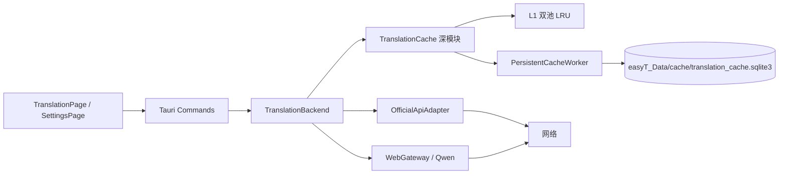
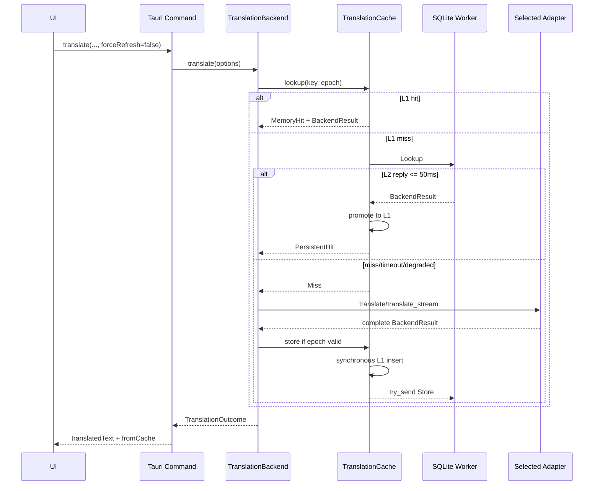

# easyT L1-L2 翻译缓存 Software Design Document

## 0. 文档控制

| 字段 | 值 |
|---|---|
| 状态 | Approved / Implemented，自动验证完成，待人工发布验收 |
| 版本 | 0.4 |
| 最后更新 | 2026-08-10 |
| 目标项目 | easyT 2.1.0/ `translation_backend`、Tauri Commands、React UI |
| 预期实施者 | Model-neutral coding agent |
| 需求来源 | [L1-L2需求与架构共识文档](./L1-L2需求与架构共识文档.md)、[翻译缓存规则](./翻译缓存规则.md) |
| 实施基线 | `c5284f3`（预实施） |
| 实现审计 | `42cc000` 及 AUD-001/AUD-002 后续修复（easyT 2.1.0） |
| 文档路径 | `docs/SDD-translation-cache.md` |

### 0.1 修订历史

| 版本 | 日期 | 摘要 |
|---|---|---|
| 0.1 | 2026-08-09 | 根据两份已确认需求文档生成首版完整 SDD 与执行协议 |
| 0.2 | 2026-08-09 | 项目所有者批准 SDD，并批准拆分为七个 tracer-bullet 工单 |
| 0.3 | 2026-08-10 | 按 `42cc000` 同步 as-built worker、缓存确认框、版本偏差和发布验证状态 |
| 0.4 | 2026-08-10 | 修复 AUD-001/AUD-002，补充永久错误状态转换与队列满失败计数测试 |

> 0.1～0.2 是预实施设计；0.3 记录 `42cc000` 的 as-built 审计结果；0.4 记录审计偏差修复。后文“编码代理执行协议”保留为历史实施合同，不表示功能仍待实现。

### 0.2 实现审计摘要

- **结论：**`42cc000` 审计发现的 2 项 L2 偏差已经修复，当前实现与批准产品规则一致。
- **as-built 调整：**专用 L2 线程内部使用 current-thread Tokio runtime 和异步 `recv`，以同时满足单 Connection 所有权与定时 Touch flush；缓存清除确认使用应用内自适应 `alertdialog`，替代原设计中的 `window.confirm`。
- **验证：**修复后 `cargo test` 172 项、当前工作树 Vitest 46 项通过，`cargo fmt --check` 与全目标 clippy `-D warnings` 通过。`81fff64` 的 typecheck、前端 build、Rust release、MSI 与 NSIS 证据作为此前 2.1.0 发布构建记录保留；按用户明确指示，不重跑构建或安装包验证。
- **剩余事项：**未提供真实 Qwen/Official API 凭证，故账号手工 E2E 未执行；安装包安装/启动抽查仍由发布负责人完成。

| 审计 ID | 批准合同 | `42cc000` 证据 | 影响与处置 |
|---|---|---|---|
| AUD-001 | 权限、只读、磁盘满、无法打开等永久 SQLite 错误应使 L2 进入 Degraded，本次运行不循环重连 | worker 统一通过 `handle_runtime_sqlite_error` 关闭 Connection 并切换 Degraded；Busy/Locked/临时 I/O 保持 Ready | **已修复**；永久/临时错误分类测试通过 |
| AUD-002 | Store/Touch 队列满时应非阻塞跳过并增加内部 `store_failures`/`touch_failures` | sender 侧以独立饱和原子计数接住满队列失败，worker drain 后合并并持久化到 `cache_stats` | **已修复**；Store/Touch 满队列非阻塞及持久计数测试通过 |

详细设计中的 worker 接收模型由 `blocking_recv` 调整为专用线程内 current-thread runtime + async `recv`，保持唯一线程/唯一 Connection 与不阻塞应用 Tokio core 的架构约束；本修订将其记录为 as-built 设计同步，而非删除原产品要求。

## 1. 执行摘要

easyT 的 Qwen WebGateway 翻译通常受网络延迟支配。本设计在 `TranslationBackend` seam 内加入始终启用的两级精确缓存：10 MiB L1 加权 LRU 和 256 MiB L2 bundled SQLite。普通请求按 L1→L2→网络执行；重新翻译绕过读取并覆盖共享缓存；保存 Qwen 历史、连接测试和诊断请求完全绕过。缓存失败必须透明降级为现有翻译，latest-wins、流式输出、Markdown/KaTeX、供应商 Adapter 和登录流程保持原有职责。

该改动跨越持久化数据、并发、Tauri IPC 和 UI 状态，采用 Full SDD。

## 2. 范围

### 2.1 目标

- 重复翻译在 L1/L2 命中时不发网络请求。
- L2 跨应用重启工作，且不阻塞启动或 Tokio core。
- L1、L2、单条和队列均有固定容量。
- 完整保存 Markdown/LaTeX 译文，不改变字节内容。
- 用户可查看缓存详情、清除/重建缓存并识别缓存译文。
- 任意缓存错误不改变普通翻译的成功/错误语义。
- 实现可由编码代理依据本文独立完成并验证。

### 2.2 非目标

- 不缓存增量、reasoning、未完成译文、Future 或请求对象。
- 不做模糊、语义、分段缓存或 in-flight 合并。
- 不按 backend/provider/model/account 分区。
- 不提供缓存开关、容量设置或 TTL。
- 不修改 Qwen/Official API 私有协议。
- 不修改登录凭证保存方式。
- 不保证安全擦除。
- 不进行与缓存无关的重构。

### 2.3 假设与约束

| ID | 类型 | 陈述 | 若不成立的影响 |
|---|---|---|---|
| ASM-001 | 已验证事实 | `TranslationBackend` 是 Official API 与 WebGateway 的统一 seam | 若入口已改变，停止并执行偏差协议 |
| ASM-002 | 已验证事实 | latest-wins 由 `TranslationRequestManager` 管理 | 缓存不得再引入 generation |
| ASM-003 | 已验证事实 | 数据目录由 `config::storage::app_data_dir()` 定位到可执行文件同级 `easyT_Data` | 路径策略变化属于阻塞偏差 |
| ASM-004 | 基线事实 | `c5284f3` 的命令返回 `llm::models::TranslationResult`，前端只含 `translatedText` | 实施时兼容扩展 `fromCache`；`42cc000` 已完成 |
| ASM-005 | 实施期事实 | preflight 时用户曾有 `src-tauri/src/translation_backend/web_gateway/qwen/adapter.rs` 测试改动 | 已按用户要求恢复；`c5284f3..42cc000` 该文件无差异 |
| CON-001 | 约束 | Cargo `rust-version = 1.77.2` | 新依赖必须兼容或先报告偏差 |
| CON-002 | 约束 | L1 10 MiB，L2 256 MiB，单条 1 MiB | 不得改成配置项 |
| CON-003 | 约束 | 所有模型和供应商共享键空间 | 来源只作元数据 |
| CON-004 | 约束 | L2 Lookup 成功入队后的端到端预算为 50 ms | 超时必须走网络 |
| CON-005 | 约束 | 清除不取消翻译，但旧 epoch 不得回填 | epoch 检查必须原子化 |
| CON-006 | 约束 | 本次实现 Windows 桌面行为优先，但缓存核心不得依赖 WebView/Qwen | 不得污染 Adapter |

## 3. 需求

### 3.1 功能需求

| ID | 需求 | 优先级 | 可验收标准 |
|---|---|---|---|
| FR-001 | Use 请求 MUST 按 L1→L2→翻译后端查询 | Must | 第二次相同请求命中且 mock 后端调用次数仍为 1 |
| FR-002 | Refresh MUST 绕过读取并在成功后覆盖共享缓存 | Must | 旧缓存存在时仍调用当前后端；成功后 Use 返回新值 |
| FR-003 | 测试连接、诊断及 Qwen `saveHistory=true` MUST Bypass | Must | 不查询、不写入且公开命中率不变 |
| FR-004 | CacheKey MUST 使用版本化、长度前缀的 BLAKE3 精确键 | Must | 稳定向量测试通过；目标语言不同不命中 |
| FR-005 | 输入 MUST 按单行/多行规则规范化且不破坏 Markdown/LaTeX | Must | CRLF/CR 等价；缩进、空行、反斜杠保持 |
| FR-006 | L1 MUST 实现短/长双池加权 LRU 和固定上限 | Must | 所有容量、条数及确定性淘汰测试通过 |
| FR-007 | L2 MUST 使用独占 worker 的 bundled SQLite、UPSERT、Touch 合并与容量淘汰 | Must | 重启命中、并发命令和低水位测试通过 |
| FR-008 | 只有完整成功、非空、有效 epoch、≤1 MiB 的结果 MUST 写缓存 | Must | partial/cancel/empty/oversized 均无记录 |
| FR-009 | 清除 MUST 清 L1/L2/队列/隔离/统计并阻止旧请求回填 | Must | clear/in-flight 竞态测试后两层为空 |
| FR-010 | 缓存错误 MUST 降级到网络；显式详情/清除/重建可报告错误 | Must | busy/timeout/corrupt/permission 场景不阻断翻译 |
| FR-011 | 设置页 MUST 提供缓存详情弹窗和确认清除/重建 | Must | 条数、磁盘、命中率、路径和状态可见 |
| FR-012 | 缓存命中 MUST 显示独立来源提示，复制与 Markdown/KaTeX 不包含提示 | Must | UI 测试复制值只有译文 |
| FR-013 | Refresh 失败 MUST 保留旧缓存译文及来源提示并显示明确错误 | Must | UI store/component 测试验证状态不丢失 |
| FR-014 | 清除成功 MUST 保留当前译文、移除来源提示且不自动翻译 | Must | 清除后 UI 状态和后端调用次数符合规则 |
| FR-015 | 缓存 MUST 跨模型/供应商/账号共享，但按目标语言与版本隔离 | Must | 跨模型命中；目标语言/版本变化 miss |
| FR-016 | 启动 MUST 异步初始化 L2，退出 MUST 最多等待 1 秒 flush | Must | Starting 可翻译；关闭预算测试/手工验证通过 |
| FR-017 | SQLite MUST 支持 user_version 迁移、损坏隔离及用户重建 | Must | migration/corrupt/newer-version 测试通过 |
| FR-018 | L1/L2 命中 MUST 统计、Touch 并按固定公式展示命中率 | Must | 跨重启统计和清除归零测试通过 |

### 3.2 非功能需求

| ID | 类别 | 需求 | 度量 |
|---|---|---|---|
| NFR-001 | 性能 | L1 查找不得 I/O；L2 查找不得使请求额外等待超过 50 ms 预算 | 定时测试，锁内无 await/I/O |
| NFR-002 | 内存 | L1 逻辑大小≤10 MiB、条目≤1,024；worker 栈 512 KiB、队列 512 | 容量与构造测试 |
| NFR-003 | 存储 | L2 逻辑大小≤256 MiB/50,000，超限降至 230.4 MiB/45,000 | 批量淘汰测试 |
| NFR-004 | 韧性 | 缓存故障不能把成功翻译变成失败 | 故障注入集成测试 |
| NFR-005 | 并发 | epoch 检查与 L1 条件写原子；SQLite Connection 只能由 worker 所有 | loom 非必需；确定性并发测试+代码审查 |
| NFR-006 | 隐私 | 原文、凭证和请求/响应不得落库或写日志；译文明文范围必须公开 | schema/日志审查、UI 文案测试 |
| NFR-007 | 兼容性 | latest-wins、流式未完成译文、现有配置文件和 Adapter 契约不得退化 | 原有测试全部通过 |
| NFR-008 | 可访问性 | 弹窗具备 dialog 语义、可键盘关闭、焦点可恢复，操作状态可读 | RTL 测试与手工键盘验证 |
| NFR-009 | 可维护性 | 缓存只通过深模块接口访问；无供应商分支进入 cache | 依赖方向审查 |
| NFR-010 | 构建 | release 可构建安装包；SQLite 体积增量目标约 1.01 MiB，明显偏差需报告 | before/after 二进制记录、`npm run tauri build` |
| NFR-011 | 确定性 | 键编码与相同时间戳 LRU 淘汰必须跨运行稳定 | 固定测试向量与排序测试 |

## 4. 实施前系统上下文（基线 `c5284f3`）

以下事实是设计时从基线仓库验证的历史上下文，不是 `42cc000` 的当前能力清单：

- `src-tauri/src/translation_backend/mod.rs::TranslationBackend` 持有 `OfficialApiAdapter` 与 `Arc<WebGateway>`，提供 `translate`、`translate_stream`、`test_connection`。
- `src-tauri/src/commands/translate.rs::TranslationRequestManager` 使用 generation 与 abort handle 保证 latest-wins；两条翻译命令分别调用一次性/流式入口。
- `src-tauri/src/translation_backend/models.rs::BackendResult` 包含完整译文与 `BackendSource { backend, provider, model }`。
- `src-tauri/src/translation_backend/prompt.rs::build_system_prompt` 当前无 prompt 版本常量。
- `src-tauri/src/config/storage.rs::app_data_dir` 已负责 `easyT_Data` 路径创建。
- `src-tauri/src/lib.rs` 在 setup 创建共享 `reqwest::Client` 和 `TranslationBackend`；托盘退出会清理 Qwen watcher、窗口和快捷键。
- `src/services/tauriCommands.ts::TranslationResult` 目前只有 `translatedText`。
- `src/services/translationRunner.ts::runTranslationRequest` 负责流式 delta 和最终 store 更新。
- `src/stores/translationStore.ts` 是 request-aware，但没有缓存来源和 Refresh 失败保留状态。
- `src/pages/TranslationPage.tsx` 成功态按 OriginalTextPanel→TranslationPanel 渲染；Header 的刷新和 ErrorState 的重试当前调用同一普通入口。
- `src/pages/SettingsPage.tsx` 当前没有缓存入口或弹窗。
- `package.json` 提供 `typecheck`、`test`、`build`、`tauri`；没有 lint 脚本。
- `src-tauri/Cargo.toml` 使用 release LTO/strip/`opt-level=z`，声明 MSRV 1.77.2。

已知限制：命令返回类型、前端 store 与页面不具备表达“缓存译文仍可见但 Refresh 失败”的状态，必须按本文合同扩展，不能只增加提示字符串。

## 5. 设计方案

### 5.1 总览



依赖方向必须保持：

- UI 只知道 `fromCache` 和详情 DTO。
- Command 只传 `force_refresh`，不选择 L1/L2。
- TranslationBackend 决定 Use/Refresh/Bypass 并编排 Adapter。
- Cache 保存统一 BackendResult，不知道 Qwen、登录、HTTP 或 SSE。
- Adapter 不知道缓存。
- Persistent worker 不引用 Tauri、配置 store 或 Adapter。

### 5.2 关键决策

| ID | 决策 | 理由 | 替代方案 | 后果 |
|---|---|---|---|---|
| DD-001 | L1 双 `lru::LruCache`，版本固定 0.12.5 | 最新 0.18.2 要求 Rust 1.85，与项目 MSRV 冲突 | 手写 LRU、升级 MSRV | 避免升级工具链；API 较旧但足够 |
| DD-002 | L2 使用 `rusqlite 0.40.2`、`default-features=false`、`bundled` | 已接受约 1.01 MiB 体积，获得事务/迁移/恢复 | JSON、sled | 增加发布体积 |
| DD-003 | BLAKE3 1.8.6 | 32 字节快速稳定键 | SHA-256 | 新增小型依赖 |
| DD-004 | worker 使用有界 `tokio::sync::mpsc`；专用线程内 current-thread runtime 以异步 `recv` 驱动命令与 Touch 定时 flush，reply 使用 oneshot | 普通命令可 try_send，显式命令可 await，不阻塞应用 Tokio core，同时可靠触发定时 flush | `blocking_recv`、Mutex<Connection>、std sync_channel | 专用线程仍独占唯一 Connection，需清晰关闭生命周期 |
| DD-005 | TranslationBackend 返回 `TranslationOutcome` | 来源状态与统一结果同行，Adapter 不变 | Command 自行查缓存 | 保持 seam 深度 |
| DD-006 | Store 中保存统一 BackendResult，键不含来源 | 跨模型共享且可展示来源元数据 | 分模型键 | 用户需用 Refresh 获取当前模型 |
| DD-007 | 前端增加显式 refreshing 状态 | 能保留旧缓存结果并显示 Refresh 失败 | 复用 translating + 隐藏译文 | 状态机增加一个状态 |
| DD-008 | 清除关闭连接并删 main/wal/shm 后重建 | Windows 下可靠清空并回收文件 | DELETE+VACUUM | 清除是串行显式操作 |
| DD-009 | 不设 feature flag/用户开关 | 已确认始终启用 | 可配置 rollout | 回滚通过回退二进制完成 |

## 6. 详细组件设计

### 6.1 `cache/key.rs`

- **类型：**新增。
- **职责：**版本常量、规范化、BLAKE3 键、短/长分类和大小预估。
- **覆盖：**FR-004、FR-005、FR-008、FR-015，NFR-011。

建议合同：

```rust
pub const CACHE_KEY_VERSION: u32 = 1;
pub const PROMPT_VERSION: u32 = crate::translation_backend::prompt::PROMPT_VERSION;

pub struct CacheKey([u8; 32]);

pub struct NormalizedCacheInput {
    pub key: CacheKey,
    pub normalized_source_bytes: usize,
    pub target_language: String,
    pub is_short_text: bool,
}

pub fn prepare_cache_input(text: &str, target_language: &str)
    -> NormalizedCacheInput;

pub fn logical_size(input: &NormalizedCacheInput, result: &BackendResult)
    -> u64;
```

约束：

- 规范化函数必须返回受控所有权，避免在 L1 锁内做字符串工作。
- 键编码定义一个私有 `KeyEncoder`，所有 u32/u64 使用 big-endian 或 little-endian之一；实现和固定测试向量必须同时文档化。
- 当前没有输出参数；编码仍预留稳定的“参数数量=0”字段，未来加入参数时提升 key version。
- `prompt.rs` 新增 `pub const PROMPT_VERSION: u32 = 1`，后续 prompt 语义变化必须手动提升。

### 6.2 `cache/entry.rs`

- **类型：**新增。
- **职责：**缓存值、策略、来源状态、统计 DTO、worker 状态。
- **覆盖：**FR-003、FR-008、FR-018。

```rust
pub enum CachePolicy { Use, Refresh, Bypass }
pub enum CacheStatus { Miss, MemoryHit, PersistentHit, Refreshed, Bypassed }
pub enum PersistentCacheState { Starting, Ready, Degraded, Stopped }

pub struct TranslationOutcome {
    pub result: BackendResult,
    pub cache_status: CacheStatus,
}

pub struct CacheEntry {
    pub key: CacheKey,
    pub result: Arc<BackendResult>,
    pub generated_at_ms: i64,
    pub last_accessed_at_ms: i64,
    pub hit_count: u64,
    pub source_text_bytes: u64,
    pub translated_text_bytes: u64,
    pub logical_size_bytes: u64,
    pub access_tick: u64,
}

#[derive(Serialize)]
#[serde(rename_all = "camelCase")]
pub struct CacheStatsView {
    pub state: PersistentCacheState,
    pub entry_count: u64,
    pub disk_bytes: u64,
    pub max_disk_bytes: u64,
    pub hit_rate: Option<f64>,
    pub cache_path: String,
}
```

内部统计还必须包含 `l1_hits/l2_hits/misses/bypasses/refreshes/oversized_bypasses/lookup_failures/store_failures/touch_failures`。前端不需要全部暴露。

### 6.3 `cache/memory.rs`

- **类型：**新增。
- **职责：**10 MiB L1 的锁内原子读写、双池容量与 epoch。
- **覆盖：**FR-006、FR-009，NFR-001/002/005。

```rust
pub struct MemoryCache { state: Mutex<MemoryCacheState> }

pub fn lookup(&self, key: &CacheKey) -> Option<Arc<BackendResult>>;
pub fn insert_if_epoch(&self, entry: CacheEntry, expected_epoch: u64) -> bool;
pub fn clear_and_advance_epoch(&self) -> u64;
pub fn current_epoch(&self) -> u64;
```

实现必须使用 `NonZeroUsize` 构造 `LruCache`。命中时更新 access tick 与内部统计，并返回待异步 Touch 的信息。容量和淘汰严格遵守需求文档，使用 saturating/checked 计量避免溢出。相同键不得同时存在于短、长池。

Mutex poisoning 只记录无敏感内容的 warning，并通过 `into_inner()` 恢复；若状态不变量无法恢复，则清空 L1 并增加 epoch。

### 6.4 `cache/persistent.rs`

- **类型：**新增。
- **职责：**单线程 SQLite、schema、迁移、Lookup/Store/Touch/Clear/Stats/Shutdown。
- **覆盖：**FR-007、FR-009/010/016/017/018，NFR-001/003/004/005/006。

```rust
pub enum CacheCommand {
    Lookup { key, epoch, reply },
    Store { entry, epoch },
    Touch { key, accessed_at_ms, hit_delta, epoch },
    Clear { epoch, reply },
    Stats { reply },
    Shutdown { reply },
}

pub struct PersistentCacheWorker { /* sender + shared state only */ }

pub fn start(data_dir: PathBuf) -> PersistentCacheWorker;
pub async fn lookup(&self, key: CacheKey, epoch: u64)
    -> PersistentLookup;
pub fn try_store(&self, entry: PersistentEntry, epoch: u64);
pub fn try_touch(&self, touch: TouchRecord, epoch: u64);
pub async fn clear(&self, epoch: u64) -> Result<CacheStatsView, CacheOperationError>;
pub async fn stats(&self) -> Result<CacheStatsView, CacheOperationError>;
pub async fn shutdown(&self);
```

内部 worker 线程：

- 使用 `std::thread::Builder::new().name("easyT-cache-db").stack_size(512 * 1024)`。
- Connection 只在线程闭包内创建和销毁。
- `tokio::sync::mpsc::channel(512)`；专用线程创建 current-thread Tokio runtime，以异步 `receiver.recv()` 配合定时预算驱动命令和 30 秒 Touch flush；reply 使用 oneshot。
- Lookup 成功 try_send 后，调用侧使用 `tokio::time::timeout(Duration::from_millis(50), reply)`。
- Store/Touch 队列满时更新进程内失败统计，不等待。
- Clear/Stats/Shutdown 通过 await send；Tauri async command 不做同步阻塞。
- Worker current epoch 是命令过滤的第二道防线。
- Degraded 本次运行不自动循环重连；Clear 作为显式重建入口。
- Shutdown 外层最多等 1 秒；线程超时不阻止退出。

数据库合同为需求文档第 10 节原样 schema。实现建库顺序：创建目录→打开 Connection→新库 PRAGMA→建表/迁移→校验 schema→Ready。SQL 错误必须按 transient/invalid-row/corrupt/permanent 分类，日志只含操作、状态、SQLite code、路径类别和长度。

容量淘汰必须事务化：flush Touch→按稳定 LRU 每批最多 500 个键查询/删除→同时达到 230.4 MiB 与 45,000 低水位→提交→被动 checkpoint。容量判断使用 `SUM(logical_size_bytes)`，物理占用只用于 UI。

隔离文件命名建议为：

```text
translation_cache.corrupt-<unix_ms>.sqlite3
translation_cache.corrupt-<unix_ms>.sqlite3-wal
translation_cache.corrupt-<unix_ms>.sqlite3-shm
```

只保留最新一组。删除前必须验证所有解析后的绝对路径仍位于 `easyT_Data/cache`。

### 6.5 `cache/mod.rs::TranslationCache`

- **类型：**新增。
- **职责：**隐藏双层细节，统一查找、写入、统计、清除和生命周期。
- **覆盖：**FR-001/006/007/009/010/016/018，NFR-004/009。

```rust
pub struct TranslationCache { memory: MemoryCache, persistent: PersistentCacheWorker }

pub fn start(data_dir: &Path) -> Arc<Self>;
pub async fn lookup(&self, input: &NormalizedCacheInput) -> CacheLookupOutcome;
pub fn store(&self, input: &NormalizedCacheInput, result: &BackendResult, epoch: u64);
pub async fn stats(&self) -> Result<CacheStatsView, CacheOperationError>;
pub async fn clear(&self) -> Result<CacheStatsView, CacheOperationError>;
pub async fn shutdown(&self);
```

`start` 对普通应用启动必须表现为不失败：L1 立即可用，L2 异步进入 Starting；无法创建 worker 时以 Degraded 表示。普通 lookup/store 不向上抛缓存错误。

### 6.6 `translation_backend/mod.rs` 与 `models.rs`

- **类型：**修改。
- **职责：**策略决定、缓存编排、统一结果。
- **覆盖：**FR-001/002/003/008/013/015。

新增：

```rust
pub struct TranslationOptions { pub force_refresh: bool }

pub async fn translate(
    &self,
    config: &AppConfig,
    request: BackendRequest,
    options: TranslationOptions,
) -> Result<TranslationOutcome, BackendError>;

pub async fn translate_stream(
    &self,
    config: &AppConfig,
    request: BackendRequest,
    options: TranslationOptions,
    progress: Arc<dyn TranslationProgress>,
) -> Result<TranslationOutcome, BackendError>;
```

`TranslationBackend::new` 改为接收共享 HTTP client 与 `Arc<TranslationCache>`。策略函数只在此处：

```text
if WebGateway && config.web_gateway.save_history => Bypass
else if options.force_refresh => Refresh
else => Use
```

Use：缓存命中立即返回；miss 调 Adapter。Refresh：直接调 Adapter。Bypass：直接调 Adapter且不写。Adapter 成功后只有可缓存结果才 store。流式完整成功后才 store；缓存命中不发 progress。Adapter 错误原样返回，缓存错误不得映射为 BackendError。

### 6.7 Tauri commands、错误与生命周期

修改/新增：

- `src-tauri/src/commands/translate.rs`
  - `translate_text(..., force_refresh: bool)`
  - `translate_text_stream(..., force_refresh: bool, ...)`
  - 把 outcome 映射为扩展的命令结果。
- 新增 `src-tauri/src/commands/cache.rs`
  - `get_translation_cache_stats(cache: State<'_, Arc<TranslationCache>>) -> AppResult<CacheStatsView>`
  - `clear_translation_cache(...) -> AppResult<CacheStatsView>`
- `src-tauri/src/commands/mod.rs` 导出 cache。
- `src-tauri/src/llm/models.rs::TranslationResult` 增加 `from_cache: bool`，保持 camelCase。
- `src-tauri/src/app_error.rs` 增加 `CacheOperationFailed(String)` / kind `CacheOperationFailed`，只供显式缓存命令。
- `src-tauri/src/lib.rs`
  - setup 取得 data_dir 后立即启动 TranslationCache。
  - 将 cache 注入 TranslationBackend，并 `app.manage(Arc<TranslationCache>)`。
  - 注册两个缓存命令。
  - 托盘退出在 `app.exit(0)` 前触发 cache shutdown，最多等待 1 秒。若当前回调无法 await，必须使用现有 runtime 安全桥接；不得阻塞 UI 超过预算或创建第二个 Connection。

`TranslationRequestManager` 保持唯一 latest-wins；缓存操作不得被作为独立 active generation 注册。网络 Future abort 后，未走到完整 store 即不会写入。

### 6.8 Cargo 依赖

修改 `src-tauri/Cargo.toml` 和生成的 `src-tauri/Cargo.lock`：

```toml
blake3 = "1.8.6"
lru = "0.12.5"
rusqlite = { version = "0.40.2", default-features = false, features = ["bundled"] }
```

编码代理必须在 preflight 验证三者与项目实际 Rust 工具链及 `rust-version=1.77.2`。不得升级项目 MSRV。若 rusqlite/blake3 的解析依赖无法满足 MSRV，停止并提交 DEV；允许提议兼容的最近版本，但不得静默替换。不得添加前端依赖。

### 6.9 前端 IPC 与类型

修改 `src/services/tauriCommands.ts`：

```ts
export interface TranslateTextRequest {
  requestId: string;
  text: string;
  targetLanguage: string;
  streamOutput: boolean;
  forceRefresh: boolean;
  onContentDelta?: (delta: string) => void;
}

export interface TranslationResult {
  translatedText: string;
  fromCache: boolean;
}

export type PersistentCacheState = "starting" | "ready" | "degraded" | "stopped";

export interface CacheStats {
  state: PersistentCacheState;
  entryCount: number;
  diskBytes: number;
  maxDiskBytes: number;
  hitRate: number | null;
  cachePath: string;
}

export function getTranslationCacheStats(): Promise<CacheStats>;
export function clearTranslationCache(): Promise<CacheStats>;
```

两条翻译 invoke 均必须发送 `forceRefresh`。旧前端调用点统一显式传值，不依赖隐式默认。缓存命令错误通过现有 `toCommandError` 处理。

修改 `src/types/index.ts`：

- `TranslationStatus` 增加 `refreshing`。
- `TranslationState` 增加 `fromCache: boolean`、`refreshErrorMessage: string | null`。
- `ERROR_KIND` 增加 `CacheOperationFailed`。
- 不把缓存开关或容量加入 `AppConfig`。

### 6.10 前端 store 与 runner

修改 `src/stores/translationStore.ts`：

```ts
startRequest(originalText: string, forceRefresh?: boolean): string;
succeedRequest(requestId: string, result: TranslationResult): boolean;
failRefreshRequest(requestId: string, message: string, kind?: ErrorKind): boolean;
clearCacheSourceNotice(): void;
```

状态规则：

- 普通 start：清空旧译文、`fromCache=false`、`refreshErrorMessage=null`、status=translating。
- Refresh 且当前为同一原文的完整缓存结果：保留译文和 fromCache，status=refreshing，清空旧 refresh error。
- 其他 Refresh：等价普通 start，但仍向后端传 true。
- 成功：译文替换，status=success，fromCache 使用结果值，refresh error 清空。
- Refresh 失败且仍有缓存译文：status 回 success，保留译文/fromCache，写 `refreshErrorMessage`。
- 普通失败/无可保留缓存：沿用现有 error/partial 规则。
- 新请求 requestId 检查保持不变。

修改 `src/services/translationRunner.ts::runTranslationRequest` 增加 `forceRefresh` 参数或 options 对象，调用结果整体传给 store。流式 delta 仅在真正网络请求时出现；缓存命中时没有 delta但最终成功。Refresh 失败根据 store 当前状态调用 `failRefreshRequest`，不得把旧缓存结果作为新成功。

### 6.11 翻译页面

修改 `src/pages/TranslationPage.tsx`：

- `handleTranslate(text, forceRefresh=false)`。
- 普通手动翻译 false；Header retry true；ErrorState retry true。
- `isBusy` 包含 refreshing。
- refreshing 时仍展示 OriginalTextPanel、独立缓存提示、旧 TranslationPanel，并显示非阻塞“正在重新翻译”状态。
- 缓存命中成功时，OriginalTextPanel 与 TranslationPanel 之间渲染提示：
  “此译文来自本机缓存，点击‘重新翻译’可使用当前模型刷新。”
- `refreshErrorMessage` 作为译文外独立错误提示：
  “重新翻译失败，当前仍显示此前的本机缓存译文。”
- 复制逻辑继续只复制 `translatedText`。
- 清除成功时调用 `clearCacheSourceNotice`，不清文本、不发请求。

建议新增 `src/components/CacheNotice.tsx`，只负责可访问的信息提示，不接收/渲染译文内容。

### 6.12 设置页与详情弹窗

建议新增 `src/components/CacheDetailsDialog.tsx`，修改 `src/pages/SettingsPage.tsx`：

```ts
interface CacheDetailsDialogProps {
  open: boolean;
  onClose: () => void;
  onCacheCleared: () => void;
}
```

行为：

- 设置页只显示“翻译缓存”说明与“查看缓存详情”按钮。
- 打开时调用 stats；loading/error/ready/degraded 均有状态。
- 显示 L2 entryCount、main+wal+shm diskBytes/256 MiB、hitRate、绝对路径、本机明文译文提示。
- hitRate null 显示“—”。
- 清除前显示应用内 `role="alertdialog"` 确认层；文案说明不删除设置、Qwen 登录或网页历史。
- 确认层必须自适应窄屏：`width` 受视口约束、最大高度不超过可视区、内容超高可纵向滚动、操作按钮允许换行且文字保持可读比例。
- 清除期间禁用关闭以外的重复提交，按钮显示 loading。
- ready 按钮“清除翻译缓存”；degraded 按钮“重建持久化缓存”。
- 成功用返回 stats 立即刷新并通知 TranslationPage 清除来源提示。
- 对话框使用 `role="dialog"`、`aria-modal="true"`、标题关联；Escape 关闭，打开时聚焦首个可操作控件，关闭后恢复触发按钮焦点。
- 不引入新的 UI/dialog 依赖。

因为 SettingsPage 与 TranslationPage 由上层切换，缓存清除通知建议由 `App.tsx` 持有一个简单 callback 或由 translationStore 暴露动作；不得引入全局事件总线。

## 7. 接口与集成合同

### 7.1 Tauri 翻译命令

```text
translate_text(text, targetLanguage, forceRefresh) -> TranslationResult
translate_text_stream(requestId, text, targetLanguage, forceRefresh, onEvent)
  -> TranslationResult
```

`TranslationResult`：

```json
{
  "translatedText": "完整译文",
  "fromCache": true
}
```

验证：text/target language 沿用现有规则；forceRefresh 是必传 boolean。错误沿用 `AppError` 序列化。命令取消语义不变。

兼容性：同一发布包内前后端同步升级。Rust serde 添加字段不会破坏只读取 translatedText 的旧 JS，但新 JS 对旧 Rust 缺字段不受支持，不要求混合版本运行。

### 7.2 缓存管理命令

```text
get_translation_cache_stats() -> CacheStatsView
clear_translation_cache() -> CacheStatsView
```

- 无认证；仅本机 Tauri 主窗口调用。
- stats 不修改条目或命中统计。
- clear 幂等：空缓存再次清除仍成功。
- 显式操作失败返回 `CacheOperationFailed` 安全文案。
- 路径只返回缓存 DB 路径，不返回凭证位置。
- 不在远程 Qwen WebView 暴露这些命令；现有 capability 必须核对，不能扩大远程页面 Tauri bridge。

### 7.3 Worker 命令

内部队列不是公共 API。Lookup/Store/Touch 是 best effort；Clear/Stats/Shutdown 有 reply。所有 payload 不含原文，只含 key、译文/来源、大小和时间。旧 epoch 命令必须无 SQLite 副作用。

## 8. 数据设计

数据库路径：`easyT_Data/cache/translation_cache.sqlite3`。schema 必须与需求文档第 10 节一致，`user_version=1`。

关键不变量：

- `cache_key` 固定 32 字节主键，`WITHOUT ROWID`。
- `translated_text` 明文且非空。
- 不存在原文字段；`source_text_bytes` 只是整数。
- 所有计数非负；从 SQLite i64 转 u64 时检查。
- LRU 索引 `(last_accessed_at_ms, generated_at_ms, cache_key)`。
- stats 只有 id=1。
- clear 删除数据库族并重新建库，不 DELETE+VACUUM。
- 迁移在事务内顺序执行；新版本应用必须同步更新 SDD、user_version 和迁移测试。

持久化缓存无需旧数据迁移，因为功能尚未存在。回滚旧二进制时旧程序忽略该数据库；重新安装/回退不应删除它，用户可手动删除 `easyT_Data/cache`。

## 9. 运行时流程

### 9.1 Use 命中/未命中



### 9.2 Refresh 失败

```mermaid
sequenceDiagram
    participant UI
    participant Store
    participant TB as TranslationBackend
    participant A as Current Adapter
    participant C as TranslationCache

    UI->>Store: startRequest(text, true)
    Store->>Store: keep cached text; status=refreshing
    UI->>TB: forceRefresh=true
    TB->>A: network request (skip cache read)
    A--xTB: timeout/network/protocol error
    TB--xUI: existing AppError
    UI->>Store: failRefreshRequest
    Store->>Store: status=success; keep fromCache/text; set refreshError
    Note over C: old cache remains unchanged
```

### 9.3 Clear 与在途请求

```mermaid
sequenceDiagram
    participant R as In-flight request epoch=7
    participant UI
    participant C as TranslationCache
    participant W as SQLite Worker

    UI->>C: clear()
    C->>C: epoch=8; clear L1/stats atomically
    C->>W: Clear(epoch=8)
    W->>W: reject queued epoch=7 commands
    W->>W: close/delete/recreate DB
    W-->>UI: zero Stats
    R-->>C: complete result, store(epoch=7)
    C->>C: reject conditional L1 insert
    C--xW: no Store
```

## 10. 横切要求

### 10.1 错误与韧性

错误分类严格采用需求文档：

- transient（BUSY/LOCKED/临时 I/O/队列/50 ms）：miss+网络，保持 Ready。
- invalid row：删除单行并 miss。
- corrupt/schema/migration：隔离重建，失败 Degraded。
- permanent init/permission/disk：Degraded，本次不循环。
- 普通翻译不显示缓存错误。
- Store 失败不撤销已返回结果。
- Refresh 网络失败按现有 Backend/AppError，不是缓存错误。

不得自动重试翻译、自动回退付费 API或自动重新请求缓存。

### 10.2 安全与隐私

- L2 明文译文是“本机敏感数据”；UI 必须说明。
- 原文不落库，日志不得包含原文、译文、key 的完整 hex、Cookie、ticket、API Key、body 或 response。
- 可记录 operation、worker state、SQLite code、条数、字节数和截断 key 前缀（建议完全不记录 key）。
- clear 删除前验证目标绝对路径属于 data_dir/cache，禁止宽路径/glob。
- 远程 Qwen 页面不得获得新增命令权限。
- 本阶段不加密，不创建备份。

### 10.3 性能

- L1 平均 O(1)，所有文本处理在锁外。
- L2 单 Connection 串行，避免锁争用和 Tokio 阻塞。
- Touch 合并 30 秒/256 key，Store write-behind。
- L2 Lookup 50 ms；worker 队列 512；SQLite page cache约2 MiB。
- L2 淘汰最多 500/批，避免长事务；循环达到双低水位。
- 测量 release exe 与安装包变化，异常增长必须报告，不自动换引擎。2.1.0 验收记录为：EXE 5,697,024 B（相对本机保留的 2.0.0 产物 +512 B）、MSI 5,292,032 B（+1,310,720 B）、NSIS 3,615,676 B（+580,626 B）；安装包差异会受打包与压缩影响，不应把任一单值解释为 SQLite 的纯增量。

### 10.4 可访问性与国际化

- 所有新 UI 中文与当前项目一致。
- 大小使用二进制 MiB 计算，显示可四舍五入到 1 位小数。
- 时间不直接展示，无时区问题。
- dialog 键盘、焦点和 aria 合同见 6.12。
- 色彩不能是唯一状态提示，必须同时有文字。

### 10.5 可观测性

不引入遥测。允许脱敏日志事件：

- `cache_worker_state_changed`：from/to/reason_kind。
- `cache_lookup_failed`：reason_kind/elapsed_ms。
- `cache_store_failed`：reason_kind/logical_bytes。
- `cache_rebuilt`：reason_kind/quarantine_created。
- `cache_shutdown_timeout`。

公开 UI 只展示条数、磁盘、命中率、路径和可用状态。

### 10.6 算法/AI

本阶段不涉及模型训练、推理算法或评测。缓存只保存既有翻译后端的完整结果，不改变 prompt 或模型行为。

## 11. 兼容、迁移与回滚

- 不修改 `config.json` schema，不需要配置迁移。
- 新 SQLite 从 user_version=1 创建；损坏或不支持的新版本隔离重建。
- 前后端 IPC 同版本发布。
- 不提供 feature flag；缓存始终启用。
- 回滚触发：数据破坏、普通翻译被缓存错误阻断、latest-wins 回归、明显内存/体积越界。
- 回滚步骤：回退该功能提交并重新构建；旧二进制忽略 `easyT_Data/cache`。不得在回滚脚本自动删除用户缓存。
- 若已发布 schema 需要变化，先更新本文与需求文档、提升 user_version、提供向前迁移；禁止复用 v1 含义。

## 12. 编码代理实施计划

### Step 1：依赖、版本与纯合同

- 修改 `src-tauri/Cargo.toml`、`Cargo.lock`。
- 修改 `translation_backend/prompt.rs` 添加 `PROMPT_VERSION`。
- 新增 `cache/key.rs`、`cache/entry.rs` 和 `cache/mod.rs` 的合同类型。
- 修改 `translation_backend/models.rs` 增加 `TranslationOptions`、`TranslationOutcome` 或按 6.6 的唯一归属放置，避免重复定义。
- 测试键固定向量、规范化、逻辑大小和 serde。
- 覆盖 FR-004/005/008/015，NFR-006/011。
- 完成条件：Rust 单元测试编译通过，Adapter 无改动。

### Step 2：L1

- 新增 `cache/memory.rs` 与模块内测试。
- 实现双池、计量、确定性 LRU、poison recovery、epoch 原子 clear/insert。
- 覆盖 FR-006/009，NFR-001/002/005。
- 完成条件：容量、替换、提升、边界和 clear race 测试全过。

### Step 3：L2

- 新增 `cache/persistent.rs` 与临时目录驱动的集成测试。
- 实现 worker、schema、PRAGMA、迁移、查询预算、write-behind、Touch、淘汰、隔离、clear、stats、shutdown。
- 测试不得写真实安装目录；使用每测试唯一 temp dir，测试结束关闭 worker后清理。
- 覆盖 FR-007/009/010/016/017/018，NFR-001/003/004/005/006。
- 完成条件：SQLite 故障/容量/并发测试通过，单 Connection 所有权清晰。

### Step 4：TranslationBackend 与 Tauri 集成

- 修改 `translation_backend/mod.rs`、`commands/translate.rs`、`llm/models.rs`、`app_error.rs`、`commands/mod.rs`、`lib.rs`。
- 新增 `commands/cache.rs`。
- 实现策略路由、outcome、命令字段、app state、启动/退出和命令注册。
- 用 fake Adapter/抽取的内部执行函数测试 Use/Refresh/Bypass；不要为测试访问真实网络。
- 覆盖 FR-001/002/003/008/010/015/016，NFR-004/007/009。
- 完成条件：现有 TranslationBackend/Command 测试及新增测试全部通过，Qwen/Official Adapter 文件无功能变更。

### Step 5：前端合同、状态与 UI

- 修改 `types/index.ts`、`services/tauriCommands.ts`、`services/translationRunner.ts`、`stores/translationStore.ts`、`pages/TranslationPage.tsx`、`pages/SettingsPage.tsx`、必要的 `App.tsx`。
- 新增 `components/CacheNotice.tsx`、`components/CacheDetailsDialog.tsx`。
- 更新 `translationStore.test.ts`、`translationCoordinator.test.ts`（若合同受影响）、`TranslationPage.test.tsx`、`App.test.tsx`；为新 dialog 新增测试文件。
- 覆盖 FR-011/012/013/014/018，NFR-008。
- 完成条件：typecheck、Vitest 和 build 通过；复制、刷新失败、清除状态和 dialog 可访问性有自动测试。

### Step 6：整体验证、文档同步与体积

- 运行第 13.3 节全部命令。
- 记录 release exe 与安装包体积；若无可靠 baseline，记录新值并标注无法计算差值，不得编造。
- 手工执行 Qwen 与 Official API 场景；无凭证时明确标为未执行。
- 若实现偏离批准合同，先按偏差协议取得批准并更新本文修订历史。
- 完成条件：所有可执行检查通过，完成报告覆盖每个 FR/NFR；无未解释工作树变更。

## 13. 验证策略

### 13.1 自动测试

| ID | 层级 | 文件 | 场景 | 需求 | 预期 |
|---|---|---|---|---|---|
| T-001 | Unit | `cache/key.rs` | 单/多行规范化、BOM、CRLF、Markdown/LaTeX | FR-004/005 | 稳定键且内容规则正确 |
| T-002 | Unit | `cache/key.rs` | 固定 BLAKE3 向量、target/version变化 | FR-004/015 | 精确 hit/miss |
| T-003 | Unit | `cache/memory.rs` | 双池容量/条数/替换/LRU | FR-006 | 不超过上限，淘汰确定 |
| T-004 | Unit | `cache/memory.rs` | clear 与旧 epoch insert | FR-009 | 迟到项被拒绝 |
| T-005 | Integration | `cache/persistent.rs` | schema/UPSERT/reopen | FR-007/017 | 跨重启命中 |
| T-006 | Integration | `cache/persistent.rs` | 50 ms、队列满、busy | FR-010 | miss 并保持翻译可用 |
| T-007 | Integration | `cache/persistent.rs` | Touch flush/LRU低水位 | FR-007/018 | 统计及容量正确 |
| T-008 | Integration | `cache/persistent.rs` | corrupt/newer schema/重建/clear | FR-009/017 | 隔离或 Degraded 符合规则 |
| T-009 | Backend | `translation_backend/mod.rs` | Use/Refresh/Bypass | FR-001/002/003 | 路由与调用次数正确 |
| T-010 | Backend | 同上 | stream complete/partial/cancel | FR-008 | 仅完整结果写入 |
| T-011 | Command | `commands/translate.rs` | forceRefresh/fromCache serde | FR-001/002 | IPC camelCase 正确 |
| T-012 | Store | `translationStore.test.ts` | cached success/new request/refresh failure | FR-012/013 | 状态不残留、不丢旧译文 |
| T-013 | UI | `TranslationPage.test.tsx` | 提示位置/复制/刷新/清除 | FR-012/013/014 | 提示不进入译文 |
| T-014 | UI | 新 dialog 测试 | loading/ready/degraded/confirm/focus | FR-011/018 | 行为与 a11y 正确 |
| T-015 | Regression | 现有测试全集 | latest-wins/流式/公式/登录 | NFR-007 | 无回归 |

### 13.2 手工验证

1. 使用相同文本与目标语言翻译两次；第二次提示来自缓存且网络面板无新请求。
2. 重启应用后再次翻译；应命中 L2。
3. 切换模型/供应商后 Use；应命中共享缓存。点击重新翻译；应调用当前模型并刷新结果。
4. 断网后对已有缓存点重新翻译；旧译文保留并显示明确失败。
5. 开启 Qwen 保存网页历史；请求必须走网络并出现在网页历史，缓存统计不变。
6. 输入含 Markdown 表格、代码块、行内/块公式；命中结果渲染和复制与首次结果一致。
7. 打开详情，核对路径位于安装目录 `easyT_Data/cache`；清除确认后条数/占用/命中率归零，当前译文仍在但来源提示消失。
8. 在翻译未完成时清除；请求可展示完成结果，但再次 Use 必须走网络。
9. 将测试副本数据库破坏后启动；普通翻译可用，详情反映重建或 Degraded。
10. 仅在有真实凭证时执行 Qwen/Official API E2E；不得把凭证写入 fixture 或日志。

### 13.3 验证命令

```powershell
npm run typecheck
npm test
npm run build
cargo fmt --manifest-path src-tauri/Cargo.toml -- --check
cargo test --manifest-path src-tauri/Cargo.toml
cargo clippy --manifest-path src-tauri/Cargo.toml --all-targets -- -D warnings
cargo build --release --manifest-path src-tauri/Cargo.toml
npm run tauri build
```

没有现成 npm lint 脚本，因此本阶段不新增或伪造 lint 命令。若 clippy 暴露与本功能无关的既有 warning，编码代理必须区分并报告，不得顺手重构无关文件。

## 14. 需求追踪矩阵

| 需求 | 设计 | 实施步骤 | 测试 |
|---|---|---|---|
| FR-001 | 5.1, 6.5, 6.6 | 1,4 | T-009,T-011 |
| FR-002 | 5.2, 6.6, 6.10 | 4,5 | T-009,T-012 |
| FR-003 | 5.2, 6.6 | 4 | T-009 |
| FR-004 | 6.1 | 1 | T-001,T-002 |
| FR-005 | 6.1 | 1 | T-001 |
| FR-006 | 6.3 | 2 | T-003,T-004 |
| FR-007 | 6.4 | 3 | T-005,T-007 |
| FR-008 | 6.1, 6.6 | 1,4 | T-002,T-010 |
| FR-009 | 6.3-6.5, 9.3 | 2,3 | T-004,T-008 |
| FR-010 | 6.4, 10.1 | 3,4 | T-006,T-008 |
| FR-011 | 6.7, 6.12 | 4,5 | T-014 |
| FR-012 | 6.9-6.11 | 5 | T-012,T-013 |
| FR-013 | 6.10-6.11, 9.2 | 5 | T-012,T-013 |
| FR-014 | 6.11-6.12 | 5 | T-013,T-014 |
| FR-015 | 6.1, 6.6 | 1,4 | T-002,T-009 |
| FR-016 | 6.4, 6.7 | 3,4 | T-005 + 手工 |
| FR-017 | 6.4, 8 | 3 | T-008 |
| FR-018 | 6.2, 6.4, 6.12 | 3,5 | T-007,T-014 |
| NFR-001 | 6.3-6.5, 10.3 | 2,3 | T-003,T-006 |
| NFR-002 | 6.3-6.4 | 2,3 | T-003 |
| NFR-003 | 6.4 | 3 | T-007 |
| NFR-004 | 10.1 | 3,4 | T-006,T-008,T-009 |
| NFR-005 | 6.3-6.4, 9.3 | 2,3 | T-004,T-008 |
| NFR-006 | 8, 10.2 | 1,3,5 | T-001,T-005 + 审查 |
| NFR-007 | 4, 6.6-6.10 | 4,5 | T-010,T-015 |
| NFR-008 | 6.12, 10.4 | 5 | T-014 |
| NFR-009 | 5.1, 6.5-6.6 | 1-4 | 依赖方向审查 |
| NFR-010 | 6.8, 10.3 | 1,6 | release/installer build |
| NFR-011 | 6.1, 6.3-6.4 | 1-3 | T-002,T-003,T-007 |

## 15. 风险与开放问题

### 15.1 风险

| ID | 风险 | 概率 | 影响 | 缓解 |
|---|---|---|---|---|
| RISK-001 | rusqlite 依赖树与 MSRV 1.77.2 不兼容 | 中 | 高 | preflight 用实际工具链解析；冲突即 DEV，不升级 MSRV |
| RISK-002 | Windows 安装目录无写权限导致 L2 Degraded | 中 | 中 | L1/网络继续；详情可重建并显示错误 |
| RISK-003 | 50 ms 时网络与迟到 L2 并行造成重复工作 | 低 | 低 | 丢弃迟到 reply；正确性优先 |
| RISK-004 | WAL/防病毒占用导致 clear 删除失败 | 中 | 中 | 关闭 Connection、明确 Degraded、允许重建 |
| RISK-005 | Refresh 状态改动破坏 partial/latest-wins | 中 | 高 | store requestId 测试与现有回归测试 |
| RISK-006 | 逻辑大小和物理大小差异令 UI 看似超过 256 MiB | 中 | 低 | UI 明确显示实际占用；容量规则使用逻辑大小 |
| RISK-007 | 用户切换模型仍得到旧模型缓存而困惑 | 中 | 中 | 独立提示和重新翻译入口 |
| RISK-008 | 明文译文包含敏感信息 | 中 | 高 | 本机说明、无原文、脱敏日志、清除能力 |

### 15.2 开放问题

当前无待决产品选择。实施 preflight 的四项开放检查均已关闭：

- `blake3 1.8.6`、`lru 0.12.5`、`rusqlite 0.40.2` 已在 MSRV 1.77.2 合同下解析、构建并通过测试。
- 用户早期的 Qwen adapter 测试改动已按要求恢复；`c5284f3..42cc000` 的 adapter 无差异。
- 新缓存命令只由本地主窗口使用，未扩大远程 Qwen WebView capability。
- 托盘退出通过现有 Tauri runtime 桥接 shutdown；worker 内部预算最多 1 秒并有生命周期测试。

AUD-001/AUD-002 已关闭。发布验收仍待真实 Qwen/Official API 凭证 E2E 与安装包安装/启动抽查。

## 16. 编码代理执行约束

本节记录实施期约束，供后续回归和审计参考；`42cc000` 已完成本轮编码阶段。

- 遵守根 `AGENTS.md`、`CONTEXT.md` 和 `docs/agents/*.md`。
- 不进行无关重构、依赖升级、格式化或模型列表改动。
- 不覆盖用户现有 Qwen adapter 修改。
- 不修改 Official API/Qwen 协议，除非缓存集成编译所必需且无行为变化；否则是阻塞偏差。
- 不新增配置开关、TTL、按模型分区或静默回退。
- 实现偏离本文必须先执行偏差协议。
- 每阶段运行针对性测试，最后运行完整检查并提供证据。

## 17. 审查与活文档

- **必需审查者：**项目所有者/用户。
- **批准门：**明确回复批准本 SDD，文档状态改为 Approved。
- **更新触发：**接口、模块边界、schema、版本、缓存键、容量、UI 行为、错误恢复、迁移或回滚变化。
- **同步规则：**批准后的设计修订与实现代码在同一次变更中更新本文版本和修订历史。
- **来源同步：**若本文修改产品规则，必须同步更新两份需求来源文档。

---

# Coding Agent Execution Protocol

> 本协议是 0.1～0.2 的实施合同，0.3 保留其原文用于追溯。后续维护若改变接口、schema、容量或安全边界，仍须按第 17 节同步设计；普通审计不应把下述 preflight 步骤误读为当前未完成事项。

## 1. 执行目标

只实现本 SDD 批准的 L1-L2 翻译缓存范围。保留范围外现有行为，满足全部 FR/NFR 与验收检查。

## 2. 权威顺序与冲突处理

按以下顺序执行：

1. 用户最新明确指令。
2. 两份已确认需求文档及其批准修订。
3. 状态为 Approved 的本 SDD。
4. 仓库 `AGENTS.md`、`CONTEXT.md`、相关 ADR/agent 指南。
5. 现有公共合同、schema 和测试。
6. 最近相关代码的既有约定。
7. 编码代理偏好。

发现冲突不得静默选择。记录文件/符号证据并执行偏差协议。安全、数据丢失、破坏性操作、MSRV、持久化 schema 和公共 API 冲突均为阻塞。

## 3. 允许范围

### 3.1 预期变更文件

| 文件 | 符号 | 允许变更 | 需求 |
|---|---|---|---|
| `src-tauri/Cargo.toml` | dependencies | 增加 blake3/lru/rusqlite | NFR-010 |
| `src-tauri/Cargo.lock` | generated lock | 仅依赖解析生成 | NFR-010 |
| `src-tauri/src/translation_backend/cache/{mod,key,entry,memory,persistent}.rs` | 缓存深模块 | 新增 | FR-001-010, FR-16-18 |
| `src-tauri/src/translation_backend/{mod,models,prompt}.rs` | Backend contracts/policy/version | 修改 | FR-001-005, FR-008, FR-015 |
| `src-tauri/src/commands/cache.rs` | stats/clear commands | 新增 | FR-009-011, FR-018 |
| `src-tauri/src/commands/{mod,translate}.rs` | command registration/contracts | 修改 | FR-001-003, FR-011 |
| `src-tauri/src/{app_error,llm/models,lib}.rs` | DTO/error/state/lifecycle | 修改 | FR-010/011/016 |
| `src/types/index.ts` | translation/cache/error types | 修改 | FR-011-014 |
| `src/services/{tauriCommands,translationRunner}.ts` | IPC/runner | 修改 | FR-001-003, FR-012/013 |
| `src/stores/translationStore.ts` | refresh/cache state | 修改 | FR-012-014 |
| `src/pages/{TranslationPage,SettingsPage}.tsx` | interactions/UI | 修改 | FR-011-014 |
| `src/components/{CacheNotice,CacheDetailsDialog}.tsx` | new UI | 新增 | FR-011-014 |
| `src/App.tsx` | clear notification wiring only | 必要时修改 | FR-014 |
| 相关 Rust/TS/TSX 测试 | T-001 至 T-015 | 新增/修改 | 全部 |

### 3.2 禁止修改

- `src-tauri/src/translation_backend/web_gateway/qwen/adapter.rs` 中用户现有修改。
- Official API/Qwen request、header、SSE 协议和登录凭证逻辑。
- `src-tauri/src/config/models.rs` 的 AppConfig schema。
- `src-tauri/src/commands/selection.rs`、`shortcut.rs`。
- logo、icons 和安装包标识。版本号原属禁止范围，但项目所有者已批准 DEV-001，将根版本统一为 2.1.0。
- `package.json`、`package-lock.json` 原则上不因缓存功能或前端依赖修改；DEV-001 仅批准同步 2.1.0 版本及 lockfile 根元数据，未新增前端依赖。
- 与缓存无关的 docs、测试快照和格式化。

### 3.3 允许的支持性变更

只允许为编译、注册模块、测试 fixture、格式化或批准设计同步文档所需的小改动。每项必须在完成报告列出。生成 `Cargo.lock` 是已授权支持变更。

## 4. 强制 preflight

编码前 MUST：

1. 完整阅读本 SDD、两份需求文档、根 `AGENTS.md`、`CONTEXT.md`、`docs/agents/domain.md` 和存在的相关 ADR。
2. 检查所有预期目标及最近测试。
3. 运行 `git status --short`，记录并保护所有用户改动。
4. 验证路径、符号、命令、Tauri capabilities 和依赖仍存在。
5. 验证本 SDD 状态为 Approved。
6. 输出简短 preflight 报告：
   - 已读文件。
   - 计划修改文件/符号。
   - 所依赖假设。
   - SDD/仓库冲突。
   - 阶段与检查。
   - 未提交用户文件的保护计划。

SDD 未 Approved、有阻塞问题或阻塞冲突时不得编码。

## 5. 执行阶段

| 阶段 | 目标 | 文件/符号 | 需求 | 验证 | 退出标准 |
|---|---|---|---|---|---|
| P1 | 依赖、键、合同 | Cargo、key/entry/prompt/models | FR-004/005/008/015 | T-001/T-002 + cargo test | 纯合同稳定 |
| P2 | L1 | memory.rs | FR-006/009 | T-003/T-004 | 全部容量/epoch测试过 |
| P3 | L2 | persistent.rs/cache mod | FR-007/009/010/016-018 | T-005-T-008 | SQLite正常/降级流过 |
| P4 | 后端与 Command | backend/commands/lib/error/DTO | FR-001-003/008/010/015/016 | T-009-T-011 | IPC和生命周期过 |
| P5 | 前端状态/UI | types/services/store/pages/components | FR-011-014/018 | T-012-T-014 + typecheck | UI合同过 |
| P6 | 回归与发布 | tests/docs/build | 全部 | T-015 + 第13.3节 | 报告证据完整 |

每阶段必须先满足上一阶段退出标准。不得为“先跑起来”跳过失败路径、容量或并发测试。

## 6. 实施规则

- 先实现批准合同，再实现内部便利 API。
- 保持改动局部，不升级无关依赖或格式化无关文件。
- 不改生成/供应商协议文件，除非明确授权。
- 保持向后兼容，除非本文明确改变 IPC。
- 不添加静默 fallback、自动重试、开关、TTL、endpoint、字段或依赖。
- 注释只解释 epoch、worker ownership、大小/LRU 等非显然约束。
- 批准设计变化时，在同一变更更新本 SDD。
- 文件操作必须使用已解析的 cache 目录，禁止宽泛删除。

## 7. 偏差协议

无法精确遵循时停止当前阶段并报告：

| 字段 | 必填内容 |
|---|---|
| Deviation ID | `DEV-001` |
| 计划设计 | SDD 原要求 |
| 仓库证据 | 精确文件、符号、测试或命令输出 |
| 建议调整 | 最小可行变更 |
| 影响需求 | FR/NFR ID |
| 影响 | API、数据、安全、兼容、性能、测试、工期 |
| 所需批准 | Yes/No，批准者 |

只有为编译/格式化所需、无行为和合同影响的局部调整可继续，但必须在最终报告记录。其他偏差必须先批准。

## 8. 停止条件

- SDD 不是 Approved。
- 路径、符号、依赖或命令发生实质变化。
- 需要改变未批准的 API、schema、安全边界、MSRV 或兼容保证。
- 测试揭示现有行为与 SDD 冲突。
- 缺少凭证、fixture、决策或仓库上下文。
- 继续可能丢失数据、执行宽泛删除或覆盖用户工作。
- 新命令会暴露给远程 Qwen WebView。
- 无法在不改用户 Qwen adapter 的情况下完成。

范围内实现导致的普通测试失败不是自动阻塞；应诊断并在范围内修复。

## 9. 验证合同

| 检查 | 命令 | 要求 | 需求 |
|---|---|---|---|
| Rust format | `cargo fmt --manifest-path src-tauri/Cargo.toml -- --check` | exit 0、无 diff | NFR-009 |
| TypeScript typecheck | `npm run typecheck` | exit 0 | FR-011-014 |
| Frontend tests | `npm test` | 全部通过 | FR-011-014,NFR-007/008 |
| Frontend build | `npm run build` | exit 0 | NFR-007 |
| Rust tests | `cargo test --manifest-path src-tauri/Cargo.toml` | 全部通过 | FR-001-010,FR-015-018 |
| Rust lint | `cargo clippy --manifest-path src-tauri/Cargo.toml --all-targets -- -D warnings` | 新增代码无 warning；既有 warning单列 | NFR-009 |
| Rust release | `cargo build --release --manifest-path src-tauri/Cargo.toml` | exit 0 | NFR-010 |
| Installer | `npm run tauri build` | exit 0并生成 bundle | NFR-010 |

每个验收标准必须有自动测试或可复现手工检查。未执行真实账号 E2E 时必须明确说明原因，不能声称覆盖。

## 10. 完成报告合同

最终报告 MUST 包含：

1. **Outcome：**completed / partially completed / blocked。
2. **Changed files：**逐文件说明符号与行为。
3. **Requirement coverage：**FR/NFR 与对应测试。
4. **Verification evidence：**命令、退出结果和关键数量。
5. **Size evidence：**release exe、安装包大小及可获得的差值。
6. **Deviations：**全部 DEV，包括批准项和局部调整。
7. **Preserved user work：**确认未覆盖哪些既有改动。
8. **Remaining work：**未执行检查、风险、迁移或真实凭证 E2E。
9. **SDD update：**是否更新及原因。

不得只写“实现完成”而没有上述证据。
