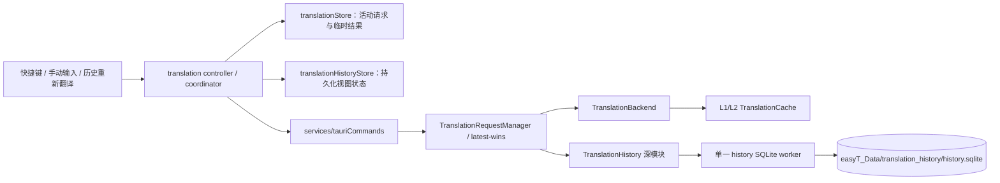
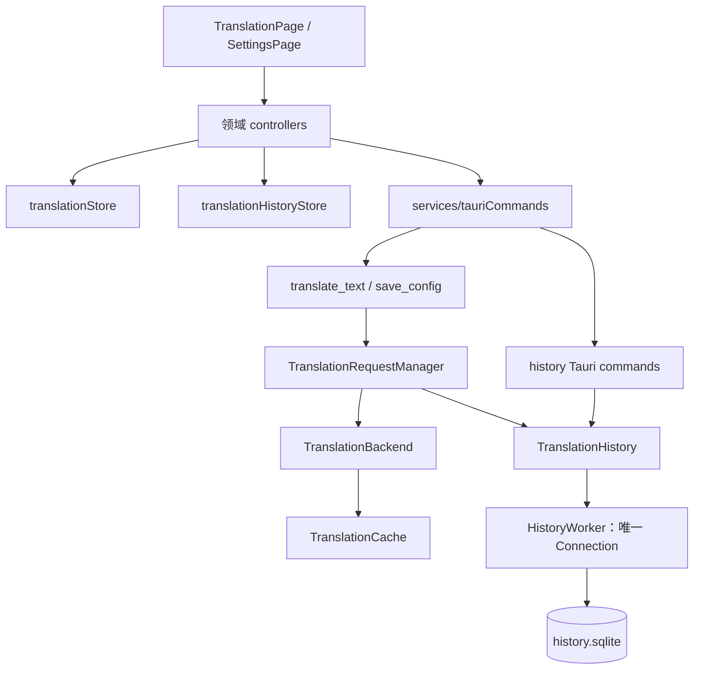
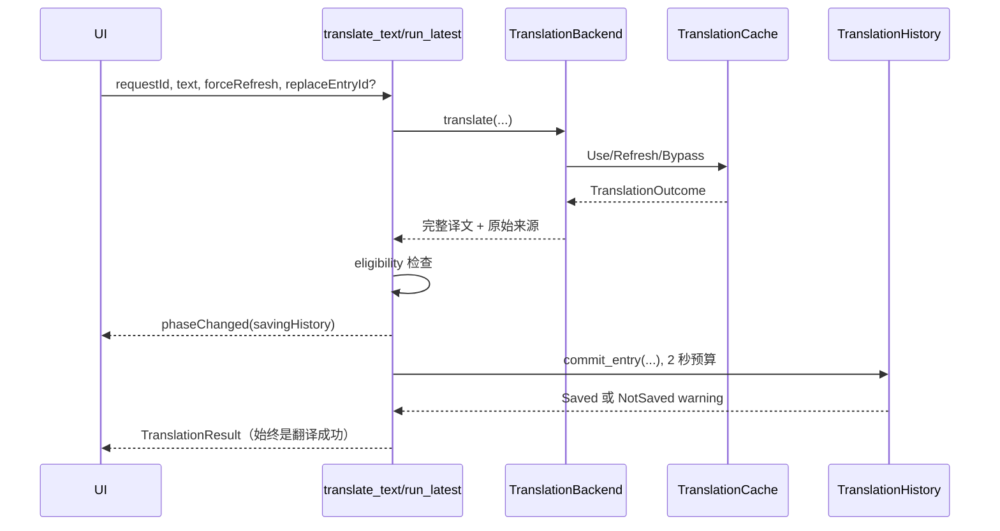
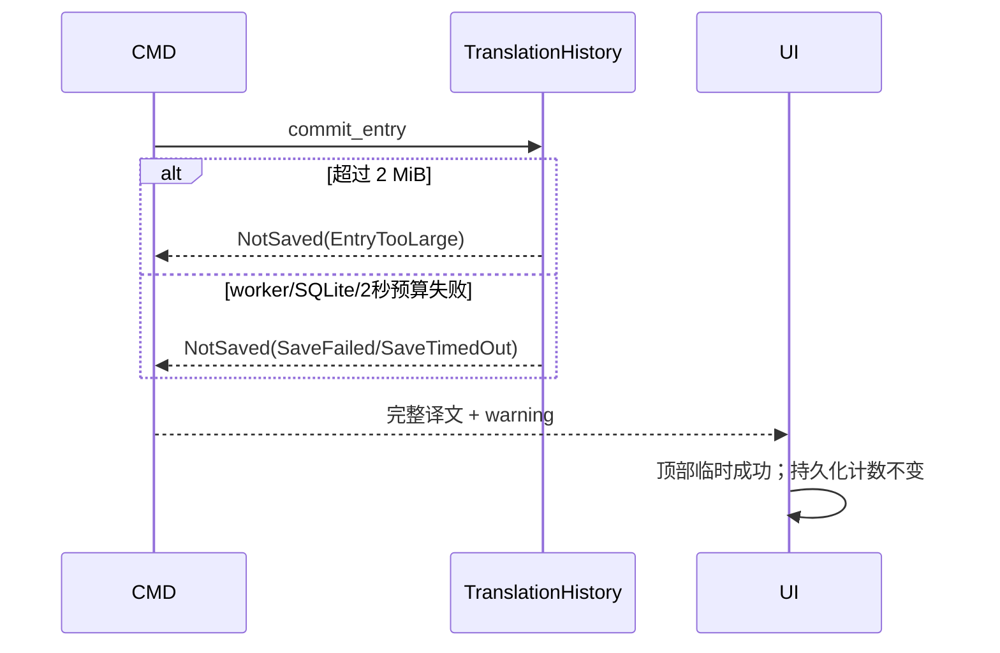

# easyT 翻译历史 Software Design Document

## 0. 文档控制

| 字段 | 值 |
|---|---|
| 状态 | Implemented |
| 版本 | 1.1 |
| 最后更新 | 2026-08-13 |
| 目标项目/模块 | easyT 2.x；Rust `translation_history` 深模块、翻译命令、前端翻译与设置领域 |
| 预期实施者 | Model-neutral coding agent |
| 需求来源 | `docs/翻译历史需求与架构共识文档.md` v1.1（Approved） |
| 相关设计 | `docs/SDD-translation-cache.md`、`docs/SDD-translation-request-progress.md`、`docs/UI-Kit需求与架构共识文档.md` |
| 代码版本 | `4eedc50cd17e413ceaee2a5b345f059de8befc75`（Pre-implementation） |
| 本文路径 | `docs/SDD-translation-history.md` |

### 0.1 修订历史

| 版本 | 日期 | 摘要 |
|---|---|---|
| 0.1 | 2026-08-13 | 基于已批准需求和当前仓库现实建立 execution-ready 设计 |
| 0.2 | 2026-08-13 | 项目所有者通过 `/implement` 明确批准设计并授权实施 |
| 1.0 | 2026-08-13 | 完成 Rust/前端/UI Kit 实施、自动验证、原生窗口验收与安装包构建 |
| 1.0.1 | 2026-08-13 | 修正 tagged enum struct variant 字段的 camelCase IPC 序列化，并增加合同回归测试 |
| 1.1 | 2026-08-13 | 按项目所有者决定将手动输入改为空历史/捕获故障时的按需按钮入口 |

> 项目所有者已通过 `/implement` 明确批准本文并授权实施。实施期间若合同、schema 或行为变化，仍须执行偏差协议。

### 0.2 设计审查门禁

批准本文同时表示审查者明确同意：

1. 新增第六个真实进度阶段 `savingHistory`。这是较新的历史需求对 `docs/SDD-translation-request-progress.md`“固定五阶段”约束的局部修订；其余阶段真实性、sequence、耗时、Channel 和 latest-wins 规则不变。
2. `translate_text` 增加可选 `replaceEntryId`，并把历史保存结果作为成功 DTO 的一部分返回。
3. `save_config` 从 `void` 成功响应扩展为带历史限额应用结果的结构化响应；配置保存成功而限额收缩失败时仍 resolve，并携带弱警告。
4. 历史数据库使用明文 SQLite，路径、留存和损坏隔离语义以已批准需求为准。

### 0.3 设计基线验证

在未修改业务代码的 `4eedc50` 基线上已执行：

| 检查 | 结果 |
|---|---|
| `npm run typecheck` | exit 0 |
| `npm test` | 12 files / 66 tests passed |
| `cargo test --manifest-path src-tauri/Cargo.toml` | 175 tests passed；仅有现存 Windows linker message warning |

## 1. 执行摘要

easyT 当前只保留一个翻译状态。该设计新增独立的 Rust `TranslationHistory` 深模块，在 `easyT_Data/translation_history/history.sqlite` 中持久化最多 1～20 条完整成功记录；启动只恢复摘要和最新正文，其余正文按需读取。历史写入位于现有缓存处理之后、翻译最终成功之前，并受同一个 `TranslationRequestManager` latest-wins 生命周期控制。历史失败只产生临时成功结果和弱警告，不改变翻译或缓存结果。

前端新增独立 `translationHistoryStore`，不把数据库状态并入 `translationStore`。翻译领域 controller/runner 组合两个 store：活动请求或临时成功结果由 `translationStore` 拥有，持久化摘要、正文缓存、展开/复制/清空状态由 `translationHistoryStore` 拥有。页面复用现有 UI Kit，并新增通用 `Combobox` 与 `Collapsible` 两个 UI module，不增加依赖。



## 2. 范围

### 2.1 目标

- 持久化完整成功且仍有请求资格的翻译记录，跨启动确定性恢复。
- 保留现有 latest-wins、缓存、流式输出和阶段进度语义，仅增加真实历史保存阶段。
- 提供启动恢复、按需正文、复制、全部复制、原子重新翻译替换、清空和 1～20 条限额。
- 把 SQLite、schema、事务、淘汰、损坏恢复和大小限制隐藏在窄 Rust interface 后。
- 在 520×390 默认窗口和 360×200 最小窗口保持可操作、可键盘访问和低常驻开销。

### 2.2 非目标

- 不迁移旧版当前译文、L1/L2、日志或 Qwen 网页对话。
- 不做单条删除、搜索、筛选、收藏、导出、同步、分页或虚拟列表。
- 不加密数据库，不承诺存储介质级安全擦除。
- 不修改翻译 Prompt、缓存键、缓存容量、Qwen 私有协议或窗口视觉语言。
- 不增加请求代次、缓存策略、数据库引擎、UI runtime dependency 或新的全局监听体系。
- 不展示数据库路径/大小、供应商或模型，不提供隔离文件管理 UI。

### 2.3 假设与约束

| ID | 类型 | 陈述 | 若不成立的影响 |
|---|---|---|---|
| ASM-001 | 已验证事实 | `TranslationRequestManager::run_latest` 是唯一 latest-wins seam | 若被替换，停止并重新设计提交资格 |
| ASM-002 | 已验证事实 | `TranslationOutcome` 已包含 `BackendResult.source` 与 cache status | 若来源丢失，不得用当前配置伪造缓存来源 |
| ASM-003 | 已验证事实 | `app_data_dir()` 返回可执行文件同级 `easyT_Data` | 路径策略变化属于阻塞偏差 |
| ASM-004 | 已验证事实 | `rusqlite 0.40.2` 已存在且使用 bundled SQLite | 不新增数据库依赖 |
| ASM-005 | 已验证事实 | 当前无 `docs/adr/` 目录 | 本设计无需虚构 ADR；冲突记录在本文 |
| CON-001 | 约束 | Rust MSRV 为 1.77.2 | 所有实现必须兼容 |
| CON-002 | 约束 | 工作树中的需求文档为用户未跟踪文件 | 实施和本设计不得覆盖或移动它 |
| CON-003 | 约束 | 历史上限固定 1～20，默认 5 | 第一版不得暴露更大范围 |
| CON-004 | 约束 | 单条逻辑大小最多 2 MiB，恰好上限允许 | 不截断后保存 |
| CON-005 | 约束 | 历史保存用户等待预算为 2 秒 | 超时降级为临时成功，不改翻译成功语义 |

## 3. 需求

### 3.1 功能需求

| ID | 要求 | 优先级 | 可验证验收标准 |
|---|---|---|---|
| FR-001 | 系统 MUST 跨启动恢复最多 N 条历史摘要，并额外恢复最新正文 | Must | A→B→C 重启后顺序为 C/B/A，C 默认展开，空库进入 idle |
| FR-002 | 页面 MUST 按“活动请求/临时结果 → 最新持久化记录 → 其他历史 → idle”优先级展示 | Must | 每种状态组合均只出现一个顶部主状态，计数只含持久化记录 |
| FR-003 | 只有完整成功且仍有 latest-wins 资格的请求 MUST 提交历史 | Must | 失败、取消、未完成、过期请求和无选区均无数据库新增 |
| FR-004 | 每次正常完整成功（含 L1/L2 命中）MUST 创建独立记录且不得去重 | Must | 相同原文连续成功两次产生两个不同 `entryId` |
| FR-005 | 历史 MUST 与 L1/L2 缓存保持文件、表、命令和生命周期隔离 | Must | 历史清空不改缓存；缓存清理不改历史；缓存命中仍记历史 |
| FR-006 | 设置 MUST 支持预设 5/10/15/20 和自定义 1～20 整数，默认 5 | Must | 非整数、空值、越界阻止保存；合法保存立即应用限额 |
| FR-007 | 写入、替换和限额淘汰 MUST 在单个历史事务/串行上下文中完成 | Must | 任一事务失败不出现半写入、半替换或超过 N 的提交状态 |
| FR-008 | 清空 MUST 原子删除当前有效库全部记录，并且不影响缓存或配置 | Must | 删除失败保留前端和数据库记录；成功回 idle；维护失败只记日志 |
| FR-009 | 历史重新翻译 MUST 使用当前配置与现有 Refresh 语义，并原子替换原记录 | Must | 成功新记录置顶且总数不增；失败/取消/保存失败保留旧记录 |
| FR-010 | 非最新正文 MUST 按 `entryId` 按需读取；折叠时 MUST 卸载 Markdown/KaTeX 树 | Must | 启动不读取全部正文；展开显示局部 Spinner；关闭后渲染树消失 |
| FR-011 | “复制译文”和“全部复制”MUST 使用完整原始字符串与固定格式 | Must | 全部复制严格为 `原文 + "\n\n" + 译文`，不含 UI 元数据 |
| FR-012 | 排序 MUST 为 `completed_at_utc_ms DESC, sequence_id DESC`，界面使用 Windows 当前本地时区格式 | Must | 同毫秒记录仍稳定；今天/昨天/更早格式符合需求 |
| FR-013 | 历史故障或超限 MUST 保留完整翻译为临时成功结果并给出对应弱警告 | Must | 翻译/缓存仍成功，持久化计数不增，重启后临时结果可丢失 |
| FR-014 | 损坏或不支持的历史库 MUST 隔离 main/WAL/SHM 并创建空库；正常旧 schema MUST 迁移 | Must | 隔离文件保留，新库可写，启动只显示一次恢复警告 |
| FR-015 | 翻译保存 MUST 使用现有进度通道发布真实 `savingHistory` 阶段 | Must | 缓存处理后才出现；总耗时含保存等待；阶段/增量不抢滚动 |
| FR-016 | 手动输入 MUST 作为空历史和无原文捕获故障的按需备用入口，并遵守禁用和输入保留规则 | Must | 默认仅显示按钮；正常已有历史不显示；点击展开不丢输入；活动请求禁用 |
| FR-017 | 清空、复制、展开和重新翻译 MUST 提供需求指定的 pending/disabled/确认行为 | Must | 活动请求禁用清空；ConfirmDialog 文案准确；按需读取时仅局部 pending |
| FR-018 | 新请求和清空成功 MUST 各只触发一次滚动到顶部，显示恢复与页面往返 MUST 保留运行期滚动位置 | Must | phase/timer/delta 不重复滚动，设置页返回位置不变 |

### 3.2 非功能需求

| ID | 类别 | 要求 | 度量/验证 |
|---|---|---|---|
| NFR-001 | 性能 | 历史 SQLite MUST 位于专用 worker，WebView/UI 线程不得执行数据库操作 | 代码审查；启动和正文读取行为测试 |
| NFR-002 | 内存 | 启动最多加载 20 条摘要与 1 条正文，正文字符串和渲染树生命周期分离 | store/DOM 测试与人工观察 |
| NFR-003 | 完整性 | 写入、替换、淘汰、清空、限额应用 MUST 串行且事务化 | Rust 故障注入测试 |
| NFR-004 | 安全/隐私 | 日志 MUST NOT 包含原文、译文、密钥、Cookie、Authorization 或完整响应 | 日志调用审查与测试 |
| NFR-005 | 可访问性 | 新控件 MUST 支持键盘、ARIA、focus-visible、disabled 和 reduced-motion | Testing Library 行为测试与人工键盘检查 |
| NFR-006 | 兼容性 | MUST 保持缓存、Prompt、后端、latest-wins、窗口和旧配置行为；不得新增依赖 | 回归测试、lockfile/manifest diff 审查 |
| NFR-007 | 韧性 | 历史不可用、保存失败、读取失败、维护失败 MUST 可降级且不阻断后续翻译 | Rust/前端失败路径测试 |
| NFR-008 | 轻量化 | 不增加永久 listener/timer、每记录 store 或复杂高度动画 | 代码审查；bundle 变化记录 |
| NFR-009 | 窗口适配 | 默认 520×390、最小 360×200 MUST 无溢出或不可操作区 | 固定尺寸人工验收 |
| NFR-010 | 生命周期 | 应用退出 SHOULD 在 1 秒预算内请求 history worker 关闭并关闭连接 | shutdown 测试/日志；不阻塞 UI 超预算 |

## 4. 当前系统上下文

以下事实已在 `4eedc50` 工作树验证：

- `src-tauri/src/lib.rs` 在 setup 中加载配置、启动 `TranslationCache`、构造 `TranslationBackend`，并在托盘退出时关闭缓存 worker。
- `src-tauri/src/commands/translate.rs::TranslationRequestManager` 用 generation 与 Tokio abort handle 取消旧 Future；`translate_text` 的整个后端调用位于 `run_latest` 内。
- `TranslationBackend::translate` 完成 `L1 → L2 → adapter` 与 cache store 后返回 `TranslationOutcome`。命令当前丢弃 `BackendSource`，只返回译文、`fromCache` 和耗时。
- `TranslationProgressReporter` 当前只允许五个阶段；cache hit 最后停在 `checkingCache`，网络成功最后停在 `waitingForContent` 或 `receivingContent`。
- `AppConfig` 尚无历史限额；`save_config` 成功返回 `()`，配置文件使用临时文件后 rename。
- 前端 `translationStore` 同时持有当前活动状态和最终成功译文；`translationRunner` 直接处理终态，`translationCoordinator` 负责快捷键入口。
- `TranslationPage` 当前只显示一个结果；手动输入只在 idle 出现；路由切换会卸载页面，未保存滚动位置。
- UI Kit、patterns 和领域 seam 已实施；`ConfirmDialog`、`Spinner`、`StatusBanner`、`FormField` 可直接复用。
- 仓库不存在 `docs/adr/`，因此没有额外 ADR 冲突；存在的进度 SDD 冲突按 §0.2 处理。

## 5. 设计方案

### 5.1 架构边界



依赖规则：

- `TranslationHistory` MAY 复用路径解析、rusqlite 和 worker 实现经验，但 MUST NOT 依赖 `translation_backend::cache` 或调用缓存。
- `TranslationBackend` MUST NOT 调用历史；命令层在 backend/cache 成功后编排历史。
- `TranslationRequestManager` 仍是唯一 generation owner。历史模块只消费调用方提供的取消/截止信号，不维护请求代次。
- 两个前端 store MUST NOT 互相调用。runner/controller/coordinator 是组合 seam。
- UI/pattern modules MUST NOT 读取 store、调用 Tauri 或包含历史业务规则。

### 5.2 关键决策与取舍

| ID | 决策 | 理由 | 替代方案 | 后果 |
|---|---|---|---|---|
| DD-001 | 新建独立 `translation_history` 深模块与数据库 | 生命周期和业务语义与缓存不同 | 复用 L2 表/模块 | 多一个 worker，但隔离清晰 |
| DD-002 | 单一专用线程持有唯一 SQLite Connection，有界 mpsc + oneshot | 串行化事务且不阻塞 Tokio/WebView | `Mutex<Connection>`、每命令开连接 | 需显式 shutdown 与队列失败处理 |
| DD-003 | `sequence_id INTEGER PRIMARY KEY AUTOINCREMENT` + UUID v4 `entry_id` | 稳定 UI 身份与时间相同/回拨时确定排序 | 只用时间或 UUID 排序 | 多一个内部键，不暴露前端 |
| DD-004 | 历史提交位于 `run_latest` Future 内，并携带现有请求取消资格 | 防止被取代请求提交历史 | command resolve 后后台保存 | 最终成功最多多等 2 秒 |
| DD-005 | 保存结果使用 tagged union 返回 `saved/notSaved` | 历史失败不是翻译错误，前端可区分超限 | command reject 或静默日志 | 成功 DTO 扩展 |
| DD-006 | 持久化成功后 `translationStore` 释放最终结果，顶部从 history store 读取 | 避免两个 store 长期拥有同一持久化状态 | 两边都保留成功记录 | 组合 selector 稍复杂但职责单一 |
| DD-007 | `save_config` resolve 结构化限额结果 | 配置成功、淘汰失败不能回滚配置 | 失败整个保存或单独 command | 调用方必须处理 warning |
| DD-008 | 2 MiB 使用明确 UTF-8 逻辑大小公式并在写/读两端复核 | 阈值可测试、避免异常行一次送前端 | SQLite 文件字节数或仅正文 | 少量计算开销 |
| DD-009 | `Combobox`/`Collapsible` 进入 UI Kit | 两者隐藏键盘/ARIA/焦点或复杂 DOM 生命周期 | 页面私有实现 | 增加正式 UI interface 与测试 |
| DD-010 | 不加 feature flag，回滚使用二进制/提交回退且保留数据库 | 已批准为默认能力；无迁移旧数据 | 配置开关 | 回滚版本忽略历史文件，不删除用户数据 |

## 6. Rust 详细设计

### 6.1 `translation_history` 深模块

新增：

```text
src-tauri/src/translation_history/
├── mod.rs       # 唯一公开 seam、领域错误和 facade
├── models.rs    # entry/summary/result DTO 与大小/摘要纯函数
└── worker.rs    # worker 命令、SQLite schema/事务/迁移/恢复
```

`mod.rs` 对 crate 内公开等价合同：

```rust
pub struct TranslationHistory { /* sender + lifecycle state */ }

pub fn start(data_dir: &Path, initial_limit: u8) -> Arc<Self>;
pub async fn initialize(&self, limit: u8) -> HistoryInitResult;
pub async fn list_summaries(&self) -> Result<Vec<TranslationHistorySummary>, HistoryError>;
pub async fn get_entry(&self, entry_id: &str) -> Result<TranslationHistoryEntry, HistoryError>;
pub async fn commit_entry(
    &self,
    draft: HistoryEntryDraft,
    replace_entry_id: Option<String>,
    eligibility: HistoryCommitEligibility,
) -> HistoryCommitOutcome;
pub async fn clear_all(&self) -> Result<ClearHistoryResult, HistoryError>;
pub async fn apply_limit(&self, limit: u8) -> Result<HistoryLimitResult, HistoryError>;
pub async fn shutdown(&self);
```

不变量：

- `start` 立即返回并在 `easyT-history-db` 线程异步初始化，不阻塞窗口创建。
- `initialize` 幂等；重复调用只等待/读取同一初始化结果并应用合法 limit。
- worker command 顺序就是写入、限额、清空的全局序列。
- 显式命令使用 `send().await`，队列关闭映射为 `Unavailable`；不得静默丢弃写入。
- `commit_entry` 的用户等待预算固定 2 秒。命令携带 deadline 与独立取消标志；worker 在 BEGIN 前和 COMMIT 前检查 deadline、调用方资格及接收方存活。超时/取消必须回滚或不开始事务。若 COMMIT 已成功，则结果 MUST 为 `Saved`，不得报告未保存。
- 为避免 SQLite busy 导致无界等待，连接的 `busy_timeout` MUST 小于剩余保存预算；测试用可注入延迟验证超时分支。

### 6.2 领域类型与 IPC DTO

`models.rs` 定义并用 `camelCase` 序列化：

```rust
pub struct TranslationHistorySummary {
    pub entry_id: String,
    pub original_summary: String,
    pub translated_summary: String,
    pub target_language: String,
    pub source_backend: BackendMode,
    pub source_provider: String,
    pub source_model: String,
    pub from_cache: bool,
    pub total_elapsed_ms: u64,
    pub completed_at_utc_ms: i64,
}

pub struct TranslationHistoryEntry {
    pub summary: TranslationHistorySummary,
    pub original_text: String,
    pub translated_text: String,
}

pub enum HistoryCommitOutcome {
    Saved {
        summary: TranslationHistorySummary,
        replaced_entry_id: Option<String>,
        evicted_entry_ids: Vec<String>,
    },
    NotSaved { warning: HistoryWarning },
}

pub enum HistoryWarningKind {
    StorageUnavailable,
    StorageRecovered,
    SaveFailed,
    SaveTimedOut,
    EntryTooLarge,
    LimitApplyFailed,
}
```

公开 warning 只包含稳定 kind 与安全中文 message，不包含 SQL、正文、凭证或完整底层错误。底层日志只允许：操作名、错误分类、数据库状态、脱敏后的历史路径和 schema version。

### 6.3 schema 与数据约束

数据库路径固定：

```text
easyT_Data/translation_history/history.sqlite
easyT_Data/translation_history/history.sqlite-wal
easyT_Data/translation_history/history.sqlite-shm
```

schema v1 使用 `PRAGMA user_version = 1`：

```sql
CREATE TABLE translation_history (
    sequence_id            INTEGER PRIMARY KEY AUTOINCREMENT,
    entry_id               TEXT NOT NULL UNIQUE,
    original_text          TEXT NOT NULL,
    translated_text        TEXT NOT NULL,
    original_summary       TEXT NOT NULL,
    translated_summary     TEXT NOT NULL,
    target_language        TEXT NOT NULL,
    source_backend         TEXT NOT NULL,
    source_provider        TEXT NOT NULL,
    source_model           TEXT NOT NULL,
    from_cache             INTEGER NOT NULL CHECK (from_cache IN (0, 1)),
    total_elapsed_ms       INTEGER NOT NULL CHECK (total_elapsed_ms >= 0),
    completed_at_utc_ms    INTEGER NOT NULL,
    logical_size_bytes     INTEGER NOT NULL CHECK (logical_size_bytes >= 0)
);

CREATE INDEX history_completed_order
ON translation_history(completed_at_utc_ms DESC, sequence_id DESC);
```

规则：

- `entry_id` 使用现有 `uuid` 依赖生成 v4 canonical 字符串；UI 输入的 replace/read ID 必须通过 UUID 解析。
- `sequence_id` 不进入任何 IPC DTO。
- `completed_at_utc_ms` 在 worker 即将提交时用 Unix 毫秒生成；系统时间早于 epoch 时使用 0，并由 sequence 保证顺序。
- `total_elapsed_ms` 由 worker 使用请求级 `Instant` 在 COMMIT 前计算，因此包含 backend、缓存和历史排队/事务等待；command resolve 的最终 elapsed MAY 只比存储值大调度级微小差值，前端与数据库统一使用 worker 返回值。
- source 元数据直接来自 `TranslationOutcome.result.source`。cache hit 使用缓存条目的原始来源，不读取当前配置伪造。
- `source_backend` 只接受 `officialApi`/`webGateway`；未知值视为结构不兼容并触发恢复流程。

逻辑大小公式固定为以下 UTF-8 字节数之和：

```text
entry_id + original_text + translated_text
+ original_summary + translated_summary + target_language
+ source_backend + source_provider + source_model
+ 8(sequence_id) + 1(from_cache) + 8(total_elapsed_ms)
+ 8(completed_at_utc_ms)
```

写入前生成摘要和 entry ID 后计算；`<= 2 * 1024 * 1024` 允许，`>` 拒绝且不写。读取完整正文时同时检查存储值和按实际字段重算值；任一超限或不一致均返回 `EntryTooLarge/CorruptEntry`，不把正文送入 IPC，也不自动删除该行。

摘要算法：把 CRLF、CR、LF 各折叠为一个普通空格，保留其他字符，再按 Unicode scalar value `chars().take(160)` 截取；不追加省略号、不解析 Markdown/LaTeX。视觉省略由 CSS 完成。

### 6.4 事务合同

普通提交在单一事务内：

1. 再次检查 eligibility/deadline。
2. INSERT 新记录。
3. 按 `completed_at_utc_ms DESC, sequence_id DESC` 保留前 N 条，收集并 DELETE 其余 `entry_id`。
4. 再次检查 eligibility/deadline。
5. COMMIT 并返回新摘要与淘汰 ID。

替换提交在同一事务内：

1. 验证 `replace_entry_id` 当前存在；不存在返回 `ReplaceTargetNotFound` 并不写新记录。
2. INSERT 新记录。
3. DELETE 旧记录。
4. 执行相同 N 条淘汰。
5. COMMIT；失败/取消/超时全部 rollback，因此旧记录保留。

限额应用：验证 1～20 后，在一个事务中删除排序 N 之后的记录并返回保留 summaries 与 evicted IDs。清空：一个事务 `DELETE FROM translation_history`；提交成功后再 best-effort 执行 `wal_checkpoint(TRUNCATE)` 和 `VACUUM`。维护失败只写脱敏 warning，`clear_all` 仍返回成功。

### 6.5 初始化、迁移与损坏恢复

worker 初始化顺序：

1. 创建 `translation_history` 目录。
2. 打开连接并设置 WAL、foreign keys、busy timeout。
3. 运行 `quick_check`、读取 `user_version`、验证必要表/列和来源枚举。
4. v0 空库创建 v1；未来受支持旧版本按逐版本事务迁移；高于当前版本或迁移/检查失败进入隔离。
5. 对当前 limit 执行启动修复。
6. 返回 summaries 和初始化状态。

隔离使用同一 UTC 时间戳：

```text
history.sqlite.corrupt-YYYYMMDD-HHMMSS
history.sqlite-wal.corrupt-YYYYMMDD-HHMMSS
history.sqlite-shm.corrupt-YYYYMMDD-HHMMSS
```

先关闭连接，再逐一 rename 存在的文件；不得删除隔离文件。若 rename 任一现有 family 文件失败，不得混用旧 family，应返回 unavailable 并让翻译降级运行。全部隔离成功后创建空 v1 库并返回一次 `StorageRecovered` warning。不得从缓存重建。

### 6.6 latest-wins 与保存资格

修改 `TranslationRequestManager::run_latest`，让它给 Future factory 提供只读 `RequestEligibility`：

```rust
async fn run_latest<F, Fut, T>(&self, factory: F) -> AppResult<T>
where
    F: FnOnce(RequestEligibility) -> Fut,
    Fut: Future<Output = AppResult<T>> + Send + 'static;
```

`RequestEligibility` 内部是当前 generation 对应的 `Arc<AtomicBool>`，只暴露 `is_current()`；安装新请求时，在 abort 旧 task 前先把旧 eligibility 置 false。它不是第二套 generation，也不进入历史模块持久状态。命令在 backend 返回后检查一次，history worker 在事务前和 COMMIT 前再检查。这样旧 Future 即使在阻塞 worker 边界附近被 abort，也不能提交替换/写入。

### 6.7 翻译命令与进度

`translate_text` 增加可选参数：

```rust
replace_entry_id: Option<String>
```

普通翻译传 null；从持久化历史触发重新翻译时传目标 entry ID，且 `force_refresh` 必须为 true。非法组合（replace 有值但未 refresh）返回 `ConfigInvalid`，不调用后端。

成功编排顺序：



`TranslationPhase` 增加 `SavingHistory`，前端为 `savingHistory`。允许的新增转换仅为：

- `CheckingCache → SavingHistory`（L1/L2 hit）。
- `WaitingForContent → SavingHistory`（一次性输出完整成功）。
- `ReceivingContent → SavingHistory`（流式完整成功）。

失败、取消、未完成响应不进入该阶段。phase send 失败继续只记脱敏 warning；正文 Channel 失败仍映射取消。

命令成功 DTO 等价于：

```rust
pub struct TranslationResult {
    pub translated_text: String,
    pub from_cache: bool,
    pub total_elapsed_ms: u64,
    pub history: HistoryCommitOutcome,
}
```

`NotSaved` 不走 `Err`。翻译错误继续使用现有 `TranslationCommandError`，且不含 history 字段。

### 6.8 历史 Tauri commands 与错误

新增 `src-tauri/src/commands/history.rs`，只做参数校验、state 调用和安全错误映射：

```text
initialize_translation_history() -> HistorySnapshot
get_translation_history_entry(entryId) -> TranslationHistoryEntry
clear_translation_history() -> ClearHistoryResult
```

`HistorySnapshot` 包含 `state: ready | recovered | unavailable`、运行时 limit、summaries 和可选一次性 warning。排序、大小、恢复和清空事务不得在 command 层实现。

`AppError` 增加 `HistoryOperationFailed`，只用于显式读取/清空 command reject；翻译内的保存问题使用 `HistoryCommitOutcome::NotSaved`。前端 `ERROR_KIND` 同步增加该 kind。

### 6.9 配置与限额合同

Rust/TypeScript `AppConfig` 增加：

```text
translationHistoryLimit / translation_history_limit: integer
default = 5; valid = 1..=20
```

Rust 使用 serde default 兼容旧配置；`normalize_config` 对运行时非法数字回退 5 并记录无敏感 info，但不因该字段单独自动写文件。下一次显式保存写回。`validate_config` 拒绝所有越界值。

`save_config` 保留现有“校验 → 快捷键预备 → 持久化 → AppState 更新 → 快捷键提交”顺序；只有全部配置步骤成功后才调用 `history.apply_limit(new_limit)`。返回：

```rust
pub struct SaveConfigResult {
    pub history_limit: u8,
    pub history_update: HistoryLimitUpdate,
}

pub enum HistoryLimitUpdate {
    Applied { summaries: Vec<TranslationHistorySummary>, evicted_entry_ids: Vec<String> },
    Warning { warning: HistoryWarning },
}
```

配置保存失败时 command reject，历史 limit 不变且不淘汰。配置已保存而 apply_limit 失败时 command resolve `Warning`，AppState 和文件保留新值；worker 后续启动/写入继续尝试修复。前端显示“设置已保存”以及独立弱警告。

### 6.10 生命周期接线

`src-tauri/src/lib.rs`：

- 在配置加载后以运行时 limit 启动并 `manage(Arc<TranslationHistory>)`。
- 注册三个 history commands，并向 `translate_text`/`save_config` 注入 state。
- 窗口继续立即创建显示，历史初始化不阻塞 setup。
- 托盘退出在 `app.exit(0)` 前按最多 1 秒关闭 history worker；缓存、Qwen、快捷键现有顺序不变。

## 7. 前端状态与接口设计

### 7.1 共享类型与 service

`src/types/index.ts` 增加与 Rust DTO 一一对应的 summary、entry、snapshot、warning、commit outcome、limit update 类型；`TranslationPhase` 加 `savingHistory`；`AppConfig`/`DEFAULT_CONFIG` 加 `translationHistoryLimit: 5`。

`src/services/tauriCommands.ts`：

- `translateText` request 增加 `replaceEntryId?: string`，result 增加 `history`。
- `saveConfig` 返回 `Promise<SaveConfigResult>`。
- 新增 `initializeTranslationHistory`、`getTranslationHistoryEntry`、`clearTranslationHistory`。
- 不新增原始 `invoke` 的其他入口；错误统一经 `toCommandError`。

### 7.2 `translationHistoryStore`

新增 `src/stores/translationHistoryStore.ts`，状态等价于：

```ts
interface TranslationHistoryState {
  initialization: "loading" | "ready" | "unavailable";
  initializationWarning: HistoryWarning | null;
  limit: number;
  summaries: TranslationHistorySummary[];
  bodiesById: Record<string, HistoryBody>;
  expandedEntryIds: string[];
  loadingEntryIds: string[];
  pendingActionById: Record<string, "copy" | "copyAll" | "retranslate" | undefined>;
  clearStatus: "idle" | "confirming" | "pending";
  actionError: string | null;
  manualInput: string;
  manualInputOpen: boolean;
  scrollTop: number;
  scrollToTopToken: number;
}
```

必须提供的原子 action：

- `hydrate(snapshot)`：替换 summaries、设置最新 body 的后续加载状态，并保持手动输入默认关闭。
- `applySavedCommit(summary, originalText, translatedText, replacedId, evictedIds)`：删除替换/淘汰 ID，插入并排序新摘要，缓存正文。
- `applyLimitUpdate`：替换 summaries 并清理 body/展开/pending 中已淘汰 ID。
- `cacheBody`、`setEntryLoading`、`setExpanded`。
- `prepareForNewRequest`：折叠全部历史、折叠手动输入并仅递增一次 scroll token。
- `clearSucceeded`：清空持久化视图、回到显示手动输入按钮的 idle 状态并递增 scroll token。
- `rememberScrollTop`，用于设置页往返恢复。

store 不调用 service 或 `translationStore`。数组始终按后端排序；任何前端 upsert 后使用 `completedAtUtcMs DESC`，相同时间保持后端返回顺序，不尝试使用不可见 sequence 重排。下一次 snapshot 是最终权威。

### 7.3 `translationStore` 变更

保持活动请求、latest-wins guard、流式/进度/错误与临时成功结果。新增：

- `historyWarning: HistoryWarning | null`。
- `finishPersistedRequest(requestId): boolean`：仅当前请求可清除活动结果并回到 idle；不清 pinned。
- `succeedTemporaryRequest(requestId, result, warning): boolean`：保留完整正文、success、warning 和最终耗时。
- `startRequest`/失败/reset 清理旧 history warning。
- phase rank 接受 `savingHistory`，终态照旧清 active progress。

不得保存持久化 summaries、正文 map、展开或数据库状态。

### 7.4 runner、controller 与 coordinator

`translationRunner` 成功顺序：

1. flush delta。
2. 若 history 为 Saved，无论 JS 返回时是否已有更新请求，都把已提交事实应用到 history store；replace/evicted 同步删除。
3. 仅当 requestId 仍 active 时调用 `finishPersistedRequest`。
4. 若 NotSaved，仅 active 请求调用 `succeedTemporaryRequest`；过期结果不更新界面。
5. catch 保持现有 partial/Refresh/错误语义；失败不改历史 store。

`useTranslationController`/新增同目录 `useTranslationHistoryController` 对页面暴露组合后的窄 interface：顶部 view model、历史 rows、手动输入、复制、重新翻译、清空和 scroll 动作。若拆成两个 hook，只有 `useTranslationController` 作为页面公开组合 seam；展示 module 不读取 store。

所有请求入口（快捷键、手动输入、标题栏重试、历史重新翻译）在 `startRequest` 同一同步调用栈中调用一次 `prepareForNewRequest`。历史重新翻译传 `forceRefresh=true` 与 `replaceEntryId`；原记录保持在 store，直到 Saved 结果返回。

`translationCoordinator` 在 history initialization 为 `loading` 时不启动选区捕获/翻译；UI 同期禁用手动入口。初始化为 `unavailable` 后允许正常翻译，后端每次保存返回 warning。

### 7.5 App 启动

`App.tsx` 启动时并行加载配置与 `initializeTranslationHistory()`，在 history store 为 loading 时翻译页显示“正在加载翻译历史…”。历史返回 ready/recovered 后，若有摘要再按最新 `entryId` 调 `getTranslationHistoryEntry`；该正文成功后完成 hydrate 并展示。读取最新正文失败时初始化仍结束为可翻译降级态，显示一次弱警告，不把整个应用卡住。

打开设置和关闭窗口不等待初始化。快捷键监听保留，但 loading 时只显示/聚焦窗口，不发起翻译请求。

## 8. UI 详细设计

### 8.1 UI Kit 扩展

新增并从 `src/components/ui/index.ts` 导出：

```ts
interface ComboboxOption { value: string; label: string }
interface ComboboxProps {
  value: string;
  options: ComboboxOption[];
  onValueChange(value: string): void;
  placeholder?: string;
  disabled?: boolean;
  required?: boolean;
  inputMode?: React.HTMLAttributes<HTMLInputElement>["inputMode"];
}

interface CollapsibleProps {
  open: boolean;
  onOpenChange(open: boolean): void;
  title: ReactNode;
  summary?: ReactNode;
  children: ReactNode;
  disabled?: boolean;
  unmountOnClose?: boolean;
}
```

`Combobox` 使用原生 Input recipe、`role=combobox`/listbox/option、`aria-activedescendant`，实现过滤、ArrowUp/Down、Enter、Escape、点击外部关闭；外部监听只在打开时存在并清理。它不校验 1～20。

`Collapsible` 使用原生 button 触发器、稳定 `useId`、`aria-expanded/controls`、Lucide Chevron 具名导入。无高度测量/动画；`unmountOnClose=true` 直接卸载 children；CSS 仍尊重全局 reduced-motion。

### 8.2 翻译领域 modules

新增或修改：

```text
src/components/translation/
├── ManualTranslationInput.tsx
├── TranslationRecord.tsx
├── TranslationHistorySection.tsx
├── historyFormatting.ts
├── useTranslationHistoryController.ts
├── useTranslationController.ts
└── index.ts
```

- `TranslationRecord` 通过 props 渲染顶部持久化记录或下方历史，不读 store。整体历史使用 `Collapsible`；内部原文/译文各自使用受控 `Collapsible`。完整译文继续复用 `TranslationPanel`，关闭时卸载 Markdown/KaTeX。
- 活动请求的原文可折叠；生成中译文和进度不可折叠。
- `TranslationHistorySection` 标题固定显示 `翻译历史 count / limit` 与 `Button danger sm`。只要 count > 0 就显示；只有最新一条时列表可为空但工具栏仍在。
- 清空使用现有 `ConfirmDialog`，文案逐字采用需求。活动请求期间 disabled，title 为“翻译完成后可清空历史记录。”。
- 最新持久化记录无活动请求时位于顶部；section 下排除它。存在活动/临时/错误时，全部持久化记录进入 section。
- `historyFormatting.ts` 接受显式 `now` 便于测试，按本地日历日判断今天/昨天，格式固定补零。

### 8.3 复制与重新翻译

- 标题栏复制按钮永远作用于当前顶部完整结果，只复制译文。
- 每条完整记录内容区有“复制译文”“全部复制”“使用当前设置重新翻译”。
- body 未加载时 action 先调用 get-entry，只给该按钮 pending；成功后继续原动作。
- `全部复制 = originalText + "\n\n" + translatedText`，不 trim、不重新渲染。
- 复制优先现有 `copy_translation`，浏览器 clipboard 仅作现有 fallback；失败显示该记录局部错误，不改变记录。

### 8.4 手动输入与滚动

- 无持久化记录或出现无原文的选区捕获故障时显示“手动输入翻译”按钮，输入区默认不渲染；正常已有历史时不显示入口。
- 点击按钮后展开输入区；折叠后在仍满足入口条件时恢复按钮。
- 折叠保留 `manualInput`，失败也保留；活动请求禁用。
- 翻译页滚动容器保存 `scrollTop` 到 history store。页面 mount/设置页返回先恢复该值。
- `scrollToTopToken` 只在请求启动或清空成功递增；effect 对 token 每值执行一次 `scrollTo({top:0})`。phase、elapsed、delta、展开/折叠均不得修改 token。

### 8.5 设置页

在通用设置区增加：

```tsx
<FormField
  label="最多保留翻译历史"
  hint="预设 5、10、15、20；也可输入 1～20。减少数量会立即移除超限的较早记录。"
  error={historyLimitError}
>
  <Combobox ... />
</FormField>
```

controller 保留原始字符串草稿以识别空值和非整数；只有 `/^(?:[1-9]|1\d|20)$/` 合法。不得用 `Number(value) || 5` 静默修正。保存成功后应用 `HistoryLimitUpdate` 到 history store；Warning 同时展示成功 banner 与 warning banner。

## 9. 运行时异常流程

### 9.1 保存失败/超限



后续请求继续尝试；当前记录不无限重试。cache 已完成的结果不回滚。

### 9.2 重新翻译被覆盖

新请求安装时先把旧 eligibility 置 false再 abort。若旧请求尚未提交，worker 在事务检查处 rollback；原历史记录不删除。旧 JS catch/result 仍由 requestId guard 忽略。新请求成为唯一顶部活动状态。

### 9.3 清空失败与维护失败

DELETE transaction reject：command reject，ConfirmDialog 关闭或保留由 controller 决定，但 summaries/body 不清。DELETE commit 后 checkpoint/VACUUM 失败：command resolve success、前端清空并回 idle，只记录脱敏日志。

### 9.4 限额收缩失败

配置文件和 AppState 已保存新 N；history worker 仍可能暂时多于 N。前端保留当前 summaries 并显示弱警告；下次启动、写入或再次保存重新执行 limit 修复。任何新写入成功事务提交后记录数必须满足当前 N。

## 10. 横切要求

### 10.1 安全与隐私

- SQLite 明文是已批准产品决策；不新增隐私提示/开关。
- command 参数只接受 UUID、合法 limit 和已有翻译数据；不接受路径。
- 所有 SQL 使用参数绑定；不得拼接正文或 ID。
- 日志禁止正文、译文、密钥、Cookie、Authorization、模型完整响应和 SQL 参数。
- 隔离文件只在既定 history 目录内 rename；操作前规范化并验证父路径等于 `easyT_Data/translation_history`。

### 10.2 性能与容量

- worker 队列有界；显式历史操作不得 fire-and-forget。
- list query 只选择 summary 字段，LIMIT 使用运行时 N（最大 20）。
- get-entry 单 ID、单行；不得 `SELECT *` 全表。
- 不设置总数据库字节上限；不把 cache 的 1 MiB 规则用于历史。
- 记录 production JS/CSS gzip 变化；沿用 UI Kit 的 JS +10 KiB/CSS +5 KiB 审查阈值。

### 10.3 可访问性与国际化

- warning 用 `StatusBanner announcement="polite"`；破坏性失败/清空错误可 assertive，计时不每秒播报。
- loading 文本和局部 Spinner 提供可读 label；按钮 pending 使用 `aria-busy`。
- 时间存 UTC ms，展示由本地 Date API 决定；字符串固定中文，第一版不建设 i18n 系统。
- 键盘必须可完成 Combobox、Collapsible、清空确认、复制和重新翻译。

### 10.4 可观测性

允许的结构化日志事件：

```text
history_worker_state_changed {from,to,reason}
history_init_recovered {schema_version,path}
history_operation_failed {operation,kind,state,path}
history_maintenance_failed {operation,kind,path}
history_shutdown_timeout {state}
```

不得记录 entry ID 与正文同一行；entry ID 本身非秘密，但第一版无诊断需要。

### 10.5 算法/AI

本阶段不涉及：历史功能不改变模型、Prompt、推理或评估算法。

## 11. 兼容、迁移与回滚

- 旧 `config.json` 缺字段时默认 5；非法数运行时回退 5，显式保存时写回。
- 首次升级创建空历史库，不读取任何旧翻译数据。
- 历史 schema 从 v1 起使用正式迁移；不得把“无旧翻译迁移”误解为无 schema migration。
- Tauri command 只被同版本内置前端调用，允许同一发布中兼容扩展 DTO；所有调用方必须同步更新，不保留双 command。
- 回滚到无历史版本时保留 `translation_history` 目录，不删除用户数据；缓存和配置其余字段仍可读取，未知配置字段由 serde 忽略。
- 出现旧请求提交历史、替换丢原记录、清空影响缓存、schema 无法恢复、UI 最小窗口不可操作或敏感日志时停止发布并回滚代码。

## 12. 编码代理实施计划

### Step 1：建立合同、配置与进度修订

- 修改 `src-tauri/src/config/models.rs::{AppConfig,default_config}`、`config/storage.rs::normalize_config`、`commands/config.rs::validate_config`。
- 修改 `translation_backend/progress.rs::{TranslationPhase,is_valid_transition}` 增加 `SavingHistory`。
- 修改 `llm/models.rs::TranslationResult` 和前端 `src/types/index.ts` 合同。
- 先添加 serde/default/validation/phase transition 测试。
- 覆盖 FR-006/015，NFR-006。
- 完成门：Rust/TS 合同一致，旧配置和原五阶段回归通过。

### Step 2：实现 TranslationHistory 深模块

- 新增 `translation_history/{mod.rs,models.rs,worker.rs}`。
- 实现 schema、摘要/大小、初始化/迁移/隔离、list/get、commit/replace/evict、clear、apply-limit、shutdown。
- 使用测试临时目录和可注入 clock/delay/failure seam；不得依赖真实用户数据目录。
- 覆盖 FR-001/004/005/007/008/009/010/012/014，NFR-001/003/004/007/010。
- 完成门：Rust module tests 覆盖所有事务和故障不变量。

### Step 3：接入 latest-wins、commands 与生命周期

- 修改 `commands/translate.rs::{TranslationRequestManager,translate_text,translate_outcome_to_result}`，把 history commit 放入 run_latest。
- 新增 `commands/history.rs`，修改 `commands/mod.rs`、`app_error.rs`、`lib.rs`。
- 修改 `commands/config.rs::save_config` 注入 history 并返回 limit update。
- 覆盖取消竞态、2 秒超时、cache hit 记历史、Refresh 替换、配置保存/淘汰补偿测试。
- 覆盖 FR-003/004/006/009/013/015，NFR-003/006/007。
- 完成门：过期请求在 worker 边界前后均不能提交；历史失败不改变翻译成功。

### Step 4：前端 service 与双 store

- 修改 `src/services/tauriCommands.ts`、`translationRunner.ts`、`translationCoordinator.ts`。
- 新增 `stores/translationHistoryStore.ts` 及测试；修改 `translationStore.ts` 及测试。
- 修改 `App.tsx` 完成启动门控和恢复。
- 覆盖 saved/notSaved、snapshot、limit update、正文缓存、滚动 token 和 latest-wins UI guard。
- 覆盖 FR-001/002/003/013/018，NFR-002/007/008。
- 完成门：两个 store 无互调，持久化成功只由 history store 长期拥有。

### Step 5：UI Kit 与设置页

- 新增 `components/ui/{Combobox,Collapsible}.tsx` 和共置测试；更新 ui seam。
- 修改 `useSettingsController.ts`、`SettingsPage.tsx` 及测试，使用 FormField + Combobox 严格校验。
- 不新增依赖、实际颜色、页面私有 focus/listbox 行为。
- 覆盖 FR-006/017，NFR-005/008/009。
- 完成门：键盘/ARIA/FormField/disabled/最小窗口测试通过。

### Step 6：翻译历史 UI 与交互

- 新增 §8.2 modules；修改 `TranslationHeader`、`OriginalTextPanel`、`TranslationPanel`、`TranslationPage`、translation seam 和相关测试。
- 实现顶部优先级、嵌套折叠、局部正文读取、复制、重新翻译、清空确认、手动输入和滚动恢复。
- 覆盖 FR-002/009/010/011/012/016/017/018，NFR-002/005/009。
- 完成门：所有状态矩阵和精确复制文本自动测试通过。

### Step 7：全量验证、视觉与活文档同步

- 更新本 SDD revision/code version；同步修订 `docs/SDD-translation-request-progress.md` 的六阶段合同，不改变其他进度规则。
- 执行全量命令、默认/最小窗口人工验收、bundle 记录和正式安装包构建。
- 不修改已批准需求文档，除非项目所有者另行要求修订。
- 覆盖全部 FR/NFR。
- 完成门：§13、§14 和 Definition of Done 全部满足，无未批准偏差。

## 13. 验证策略

### 13.1 自动测试

| 测试 ID | 层级 | 文件 | 场景 | 需求 | 预期 |
|---|---|---|---|---|---|
| T-001 | Rust unit | `translation_history/models.rs` | 摘要换行、160 chars、UTF-8 2 MiB 边界 | FR-010/013 | 恰好允许，超出拒绝 |
| T-002 | Rust integration | `translation_history/worker.rs` | 首建、v1、重开、排序、limit 修复 | FR-001/012/014 | 稳定 summaries |
| T-003 | Rust integration | 同上 | 写入+淘汰、重复记录 | FR-004/007 | 同事务且不去重 |
| T-004 | Rust integration | 同上 | replace 成功/失败/target missing/取消 | FR-003/009 | 旧记录保护正确 |
| T-005 | Rust integration | 同上 | clear commit 与维护失败 | FR-008 | 删除语义独立于维护 |
| T-006 | Rust integration | 同上 | corrupt main/WAL/SHM 隔离 | FR-014 | family 保留，新库可用 |
| T-007 | Rust command | `commands/translate.rs` | miss/L1/L2 hit 保存与来源 | FR-004/005/015 | 每次独立记录，来源真实 |
| T-008 | Rust command | 同上 | fail/cancel/partial/late/2s timeout | FR-003/013 | 不写历史，翻译语义正确 |
| T-009 | Rust command | `commands/config.rs` | 默认/1/20/非法与 apply fail | FR-006/007 | 配置/淘汰结果符合合同 |
| T-010 | UI unit | `components/ui/Combobox.test.tsx` | 输入/过滤/选择/键盘/ARIA/FormField/disabled | FR-006/017 | interface 行为通过 |
| T-011 | UI unit | `components/ui/Collapsible.test.tsx` | controlled、键盘、ARIA、summary、unmount | FR-010/017 | DOM 生命周期正确 |
| T-012 | Store | `stores/translationHistoryStore.test.ts` | hydrate/upsert/replace/evict/clear/scroll | FR-001/002/018 | 原子状态正确 |
| T-013 | Store | `stores/translationStore.test.ts` | persisted/temporary/saving phase/latest guard | FR-003/013/015 | 旧请求不可见 |
| T-014 | Runner/service | `services/translationCoordinator.test.ts` 等 | saved/notSaved/retranslate/init gate | FR-003/009/013 | 双 store 编排正确 |
| T-015 | UI integration | `pages/TranslationPage.test.tsx` | 启动、顶部优先级、折叠、按需正文 | FR-001/002/010/016 | 状态矩阵正确 |
| T-016 | UI integration | 同上 | copy/all copy/clear/retranslate/scroll | FR-008/009/011/017/018 | 文本与交互精确 |
| T-017 | UI integration | settings tests | preset/custom/非法/save warning | FR-006 | 无静默修正 |
| T-018 | App regression | `App.test.tsx` | loading gate、恢复警告、路由往返 | FR-001/014/018 | 降级且保留滚动 |

### 13.2 人工验收

必须使用真实 Tauri 开发/安装包环境验证：

1. 520×390 和 360×200：idle+手动输入、加载中、最新展开、多个历史展开。
2. Markdown/公式展开正确，折叠后 KaTeX/Markdown DOM 卸载。
3. 快捷键、手动输入、重新翻译只滚顶一次；流式增量不抢滚动；设置往返保留位置。
4. 计数、清空确认、活动请求禁用、成功回 idle、失败保留。
5. Combobox 预设、自定义、键盘、越界错误和窄窗口列表滚动。
6. 保存失败、超限、读取失败和损坏恢复 warning。
7. 重启恢复、系统时区变化显示和同毫秒稳定顺序。
8. 清空历史后缓存命中仍有效；清缓存后历史仍存在。

### 13.3 验证命令

```powershell
npm run typecheck
npm test
npm run build
cargo fmt --manifest-path src-tauri/Cargo.toml -- --check
cargo test --manifest-path src-tauri/Cargo.toml
cargo build --release --manifest-path src-tauri/Cargo.toml
npm run tauri build
```

仓库没有 npm lint script，不得伪造。`npm run tauri build` 是正式安装包门禁；裸 release 可执行文件不得当成安装成品运行。

## 14. 需求追踪矩阵

| 需求 | 设计元素 | 实施步骤 | 测试 |
|---|---|---|---|
| FR-001 | §6.5, §7.5 | 2,4 | T-002,T-015,T-018 |
| FR-002 | §7.2-7.4, §8.2 | 4,6 | T-012,T-015 |
| FR-003 | §6.6-6.7, §7.4 | 3,4 | T-004,T-008,T-013,T-014 |
| FR-004 | §6.3-6.4, §6.7 | 2,3 | T-003,T-007 |
| FR-005 | §5.1, §6.1 | 2,3 | T-007 + 手工 8 |
| FR-006 | §6.9, §8.5 | 1,3,5 | T-009,T-010,T-017 |
| FR-007 | §6.1, §6.4, §6.9 | 2,3 | T-003,T-004,T-009 |
| FR-008 | §6.4, §9.3 | 2,3,6 | T-005,T-016 |
| FR-009 | §6.4, §6.7, §7.4 | 2,3,4,6 | T-004,T-014,T-016 |
| FR-010 | §6.2-6.3, §7.2, §8.2 | 2,4,6 | T-001,T-011,T-015 |
| FR-011 | §8.3 | 6 | T-016 |
| FR-012 | §6.3, §8.2 | 2,6 | T-002,T-015 |
| FR-013 | §6.7, §7.3-7.4, §9.1 | 2,3,4,6 | T-001,T-008,T-013,T-014 |
| FR-014 | §6.5, §7.5 | 2,4 | T-002,T-006,T-018 |
| FR-015 | §6.7, §7.3 | 1,3,4 | T-007,T-008,T-013 |
| FR-016 | §7.2, §8.4 | 4,6 | T-015 |
| FR-017 | §7.2, §8.1-8.3 | 5,6 | T-010,T-011,T-016 |
| FR-018 | §7.2, §8.4 | 4,6 | T-012,T-016,T-018 |
| NFR-001 | §6.1, §10.2 | 2 | T-002-T-006 |
| NFR-002 | §7.2, §8.2, §10.2 | 4,6 | T-011,T-012,T-015 |
| NFR-003 | §6.4, §6.6 | 2,3 | T-003-T-005,T-008 |
| NFR-004 | §6.2, §10.1/10.4 | 2,3 | 代码审查 |
| NFR-005 | §8, §10.3 | 5,6 | T-010,T-011,T-015-T-017 |
| NFR-006 | §5.1, §11 | 全部 | 全量回归 |
| NFR-007 | §6.5, §9 | 2-6 | T-005,T-006,T-008,T-018 |
| NFR-008 | §8.1, §10.2 | 5-7 | bundle/监听审查 |
| NFR-009 | §8 | 5-7 | 人工 1/5 |
| NFR-010 | §6.10 | 3 | shutdown test |

## 15. 风险与开放问题

### 15.1 风险

| ID | 风险 | 可能性 | 影响 | 缓解 |
|---|---|---|---|---|
| RISK-001 | Tokio task abort 时 worker 已取得提交命令 | 中 | 高 | eligibility/deadline 在 BEGIN/COMMIT 前双检 + 竞态测试 |
| RISK-002 | 2 秒边界与 SQLite blocking commit 发生竞态 | 中 | 高 | worker 内统一预算、busy timeout、提交结果优先、可注入延迟测试 |
| RISK-003 | config 已保存但 limit apply 失败造成暂时超限 | 低 | 中 | 结构化 warning；启动/写入继续修复 |
| RISK-004 | 嵌套折叠与 Markdown 增加 DOM/小窗口压力 | 中 | 中 | 按需正文、unmount、无高度动画、360×200 验收 |
| RISK-005 | 损坏 family 部分 rename 导致旧 WAL 混入 | 低 | 高 | 关闭连接、同批次验证、任一失败保持 unavailable，不开新库 |
| RISK-006 | 进度 SDD 与新阶段不同步 | 中 | 中 | §0.2 审查门禁；Step 7 同步活文档 |

### 15.2 开放问题

| ID | 问题 | 决策来源 | 阻塞？ | 默认处理 |
|---|---|---|---|---|
| Q-001 | 是否批准 `savingHistory` 对旧五阶段 SDD 的局部修订？ | 项目所有者批准本文 | 是（实施前） | 将本文改为 Approved 即表示批准 |
| Q-002 | 是否需要第一版 UI 展示 provider/model？ | 已批准需求 | 否 | 不展示，只持久化 |
| Q-003 | 是否需要恢复/删除隔离文件 UI？ | 已批准需求 | 否 | 第一版不提供 |

## 16. 编码代理执行约束

- 只实施本文批准范围；不得顺手重构后端、Prompt、缓存、Qwen 协议或视觉语言。
- 不新增 Cargo/npm dependency；若现有 API 无法满足，按偏差协议停止。
- 不修改/删除用户未跟踪的需求文档、隔离数据库或工作树中无关变更。
- 不把 history 表放入 cache DB，不把 persistent history 放入 `translationStore`。
- 不以“测试方便”为由放宽 UUID、limit、大小、latest-wins 或日志约束。
- 若实际 schema、命令、UI seam 或测试与本文不一致，先记录文件/symbol/输出，再决定是否属于非行为局部适配。

## 17. 审查与活文档

- **必需审查者：**项目所有者；涉及 UI Kit interface 时同时完成 UI 架构审查。
- **批准门：**§0.2 四项合同、2 秒竞态处理、schema/事务和前端双 store ownership 明确同意。
- **更新触发：**接口、schema、路径、阶段、大小/限额、事务、恢复、UI 状态或回滚策略变化。
- **同步规则：**批准后的设计变更必须与代码同一 change 更新本文 revision/code version；进度阶段变化同步 `docs/SDD-translation-request-progress.md`。
- **完成状态：**只有代码、测试、人工验收和安装包门禁全部通过后，才能记录 Implemented；不得把 Draft 直接改为已实施。

# Coding Agent Execution Protocol

## 1. 执行目标

只实现已批准的 easyT 翻译历史范围，满足全部 FR/NFR 和测试合同；保持范围外行为不变。

## 2. 权威顺序与冲突处理

按以下顺序执行：

1. 用户最新明确指令。
2. 已批准的本 SDD 及其已批准修订。
3. `docs/翻译历史需求与架构共识文档.md`。
4. 根 `AGENTS.md`、`CONTEXT.md`、`docs/agents/domain.md` 和 `docs/UI-Kit需求与架构共识文档.md`。
5. 相关已批准 SDD、现有公共合同、schema 和测试。
6. 邻近代码惯例。
7. 编码代理实现偏好。

本 SDD 批准后，`savingHistory` 只在该单点优先于旧进度 SDD 的“五阶段”限制；其他冲突不得类推。安全、数据丢失、破坏性操作、公共 IPC、持久化 schema 和 latest-wins 冲突均为阻塞。

## 3. 允许范围

### 3.1 预期变更文件

| 文件 | symbols/职责 | 允许变更 | 需求 |
|---|---|---|---|
| `src-tauri/src/translation_history/{mod.rs,models.rs,worker.rs}` | `TranslationHistory` 及 schema/worker | 新增 | FR-001-014 |
| `src-tauri/src/commands/history.rs` | 三个 history commands | 新增 | FR-001/008/010 |
| `src-tauri/src/commands/{mod.rs,translate.rs,config.rs}` | 接线、资格、commit、limit result | 修改 | FR-003/006/009/013/015 |
| `src-tauri/src/{lib.rs,app_error.rs}` | state/lifecycle/handler/error | 修改 | FR-001/008/014 |
| `src-tauri/src/config/{models.rs,storage.rs}` | limit/default/normalize | 修改 | FR-006 |
| `src-tauri/src/translation_backend/progress.rs` | `SavingHistory` 合同 | 修改 | FR-015 |
| `src-tauri/src/llm/models.rs` | success DTO | 修改 | FR-013/015 |
| `src/types/index.ts` | TS shared contracts | 修改 | 全部前端合同 |
| `src/services/{tauriCommands.ts,translationRunner.ts,translationCoordinator.ts}` | IPC/双 store 编排 | 修改 | FR-001/003/009/013/018 |
| `src/stores/translationHistoryStore.ts` | 持久化历史前端状态 | 新增 | FR-001/002/010/018 |
| `src/stores/translationStore.ts` | 活动/临时结果 | 修改 | FR-003/013/015 |
| `src/components/ui/{Combobox.tsx,Collapsible.tsx,index.ts}` | UI Kit interfaces | 新增/修改 | FR-006/010/017 |
| `src/components/translation/*`（§8.2 列出） | history/controller/presentation | 新增/修改 | FR-002/009-018 |
| `src/components/settings/useSettingsController.ts` | limit draft/save warning | 修改 | FR-006 |
| `src/pages/{TranslationPage.tsx,SettingsPage.tsx}` | 页面组合 | 修改 | FR-002/006/016-018 |
| `src/App.tsx` | 启动恢复/门控 | 修改 | FR-001/014/018 |
| 对应共置 `*.test.*` 和现有回归测试 | 测试合同 | 新增/修改 | 全部 |
| `docs/SDD-translation-history.md` | 活文档状态/修订 | 修改 | NFR-006 |
| `docs/SDD-translation-request-progress.md` | 同步第六阶段 | 修改（仅批准后） | FR-015 |

### 3.2 禁止修改

- `src-tauri/src/translation_backend/prompt.rs`、Qwen private protocol、Official API 请求协议。
- cache key/capacity/schema/clear 语义，除非仅测试历史隔离且无行为变更。
- `package.json` dependencies、`package-lock.json`、Cargo dependencies/Cargo.lock（本设计无新依赖）。
- `dist/`、`node_modules/`、图标、品牌图片、生成物。
- 用户需求文档和任何无关未跟踪/已修改文件。

### 3.3 允许的支持性变更

仅允许为编译、格式、seam export、测试 fixture 或批准设计同步所必需的最小支持性变更；完成报告逐项列出。不得全仓格式化。

## 4. 强制 preflight

编码前 MUST：

1. 完整读取本 SDD，确认状态为 `Approved`。
2. 读取根 `AGENTS.md`、`CONTEXT.md`、`docs/agents/domain.md`、需求文档、UI Kit 文档和两份相关 SDD。
3. 执行 `git status --short`，保存并避开用户变更。
4. 检查 §3.1 每个现有目标与最近测试，验证 symbols、依赖版本和 npm/cargo 命令。
5. 确认 `docs/adr/` 是否仍不存在；若出现相关 ADR，完整读取并比对。
6. 输出 preflight 报告：已读文件、计划文件/symbol、依赖阶段、假设、冲突、基线检查。

SDD 非 Approved、Q-001 未解决或发生阻塞冲突时不得编辑业务代码。

## 5. 执行阶段

| 阶段 | 目标 | 文件/symbols | 需求 | 验证 | 退出条件 |
|---|---|---|---|---|---|
| P1 | 合同与纯函数 | config/progress/models/types | FR-006/012/015 | targeted Rust + typecheck | 前后端 DTO/默认值一致 |
| P2 | history 深模块 | `translation_history/*` | FR-001/004/007/008/010/014 | history Rust tests | schema/事务/恢复全部通过 |
| P3 | Rust 集成 | manager/translate/config/history commands/lib | FR-003/005/006/009/013/015 | command + cargo tests | 资格、超时、降级正确 |
| P4 | 前端 state/service | services/stores/App | FR-001/002/003/013/018 | store/service/App tests | 双 store ownership 正确 |
| P5 | UI Kit/设置 | Combobox/Collapsible/settings | FR-006/010/017 | UI interface tests | ARIA/键盘/校验通过 |
| P6 | 历史页面 | translation modules/page | FR-002/008-018 | page/controller tests | 全状态矩阵通过 |
| P7 | 发布验证 | docs/full suite/manual/bundle | 全部 | §13.3 + 人工 | 无偏差或偏差已批准 |

每阶段先跑 targeted checks，再进入下一阶段；不得跨阶段累积已知失败。

## 6. 实施规则

- 先冻结接口和 schema，再实现内部逻辑和 UI。
- 每个事务、错误、deadline 和取消分支先写测试或同时提交可复现测试。
- 遵循 UI Kit seam；跨目录只从 `@/components/{ui,patterns,translation,settings}` 导入。
- 不改变批准合同以迁就测试；测试与合同冲突时执行偏差协议。
- 不隐藏 warning、不吞显式 history command 错误、不把 SQLite 错误原文透给 UI。
- 不运行破坏用户数据的手工数据库测试；只使用测试临时目录。

## 7. 偏差协议

无法按设计实施时停止受影响阶段并报告：

| 字段 | 必填内容 |
|---|---|
| Deviation ID | `DEV-001` |
| 计划设计 | 本文 section/合同 |
| 仓库证据 | 精确文件、symbol、测试或命令输出 |
| 最小调整 | 最小可行替代 |
| 影响需求 | FR/NFR IDs |
| 影响 | API、数据、安全、兼容、性能、测试、排期 |
| 所需批准 | Yes/No；批准者 |

仅编译/格式所需、无行为且不改合同的局部调整可继续，但必须记入完成报告。其余偏差先获批准。

## 8. 停止条件

- 本 SDD 不是 Approved 或 Q-001 未解决。
- 需要新增依赖、修改 cache/Prompt/Qwen 协议或扩大历史范围。
- 无法保证旧请求不提交、替换原子性、清空隔离或 2 秒保存降级语义。
- schema/path/配置兼容与本文 materially 不同。
- 测试揭示现有合同与需求矛盾，或需要破坏用户工作树。
- 所需 Windows/Tauri 环境、fixture 或项目所有者决策不可用。

普通 in-scope 测试失败不是自动 blocker；诊断并在范围内修复。

## 9. 验证合同

| 检查 | 命令 | 必需结果 | 需求 |
|---|---|---|---|
| TypeScript | `npm run typecheck` | exit 0 | 前端全部 |
| Frontend tests | `npm test` | 全部通过 | FR/NFR UI |
| Frontend build | `npm run build` | exit 0 | NFR-006/008 |
| Rust format | `cargo fmt --manifest-path src-tauri/Cargo.toml -- --check` | 无 diff | 质量 |
| Rust tests | `cargo test --manifest-path src-tauri/Cargo.toml` | 全部通过 | Rust 全部 |
| Rust release | `cargo build --release --manifest-path src-tauri/Cargo.toml` | exit 0 | NFR-006 |
| Installer | `npm run tauri build` | 正式安装包成功 | DoD |
| Visual/manual | §13.2 | 每项记录结果 | NFR-005/009 |

任何未运行检查必须在完成报告标为未验证并说明原因；不得声称全部完成。

## 10. 完成报告合同

最终报告 MUST 包含：

1. **Outcome：**completed / partially completed / blocked。
2. **Changed files：**逐文件与主要 symbols/行为。
3. **Requirement coverage：**FR/NFR 与对应测试。
4. **Verification evidence：**实际命令、exit/result、人工矩阵和 bundle 差异。
5. **Deviations：**所有 `DEV-*`，含批准和非行为局部调整。
6. **Data/compatibility：**schema version、路径、迁移/回滚确认。
7. **Remaining work：**跳过检查、开放风险、后续迁移。
8. **SDD update：**本文与进度 SDD 是否同步、版本和原因。

不得只报告“实现完成”。

## 11. 实施记录（v1.0）

> 后续变更：历史记录重新翻译及其原子替换能力已移除。当前行为以 `docs/翻译历史需求与架构共识文档.md` 为准；本节保留 v1.0 的历史实施记录。

### 11.1 结果

实现完成。翻译历史使用独立 SQLite worker 与 v1 schema；成功翻译在 latest-wins 和 2 秒预算内原子写入、替换并淘汰，失败降级为临时成功。前端完成启动恢复、双 store 编排、顶部优先级、按需正文、复制/全部复制、重新翻译、清空、滚动恢复和 1～20 条设置；`Combobox`、`Collapsible` 已进入 UI Kit seam。

### 11.2 验证证据

| 检查 | 实际结果 |
|---|---|
| `npm run typecheck` | exit 0 |
| `npm test -- --run` | 17 files / 86 tests passed |
| `npm run build` | exit 0；主入口 252.27 kB（gzip 79.28 kB），Markdown lazy chunk 392.28 kB（gzip 119.37 kB） |
| `cargo fmt -- --check` | exit 0 |
| `cargo test` | 192 tests passed |
| `cargo build --release` | exit 0；仅现存 Windows linker message warning |
| `npm run tauri build` | exit 0；MSI 与 NSIS 两种安装器生成成功 |
| 原生窗口验收 | 520×390、360×200 的空历史和 3 条历史折叠态均可纵向滚动，无横向溢出；临时测试记录验收后已清空 |

安装器产物：

- `src-tauri/target/release/bundle/msi/easyT_2.2.0_x64_en-US.msi`
- `src-tauri/target/release/bundle/nsis/easyT_2.2.0_x64-setup.exe`

### 11.3 局部实现适配

- `DEV-001`（非行为偏差）：history worker 启动时取得初始 limit；每次 commit 另外携带 AppState 当前 limit。这样配置已保存但即时裁剪失败时，后续写入会继续修复，满足 §7.2，不改变 IPC DTO。
- `DEV-002`（非行为偏差）：隔离 family 时按 WAL、SHM、主库顺序 rename，以主库最后 rename 作为完成标志，避免 sidecar 隔离失败后未来初始化混用旧 family。
- 未新增依赖，未修改缓存 schema/key/容量、Prompt、Qwen 协议或用户需求文档。

### 11.4 数据与兼容性

- 数据路径：`easyT_Data/translation_history/history.sqlite`；`PRAGMA user_version=1`。
- 旧配置缺少 `translationHistoryLimit` 时默认 5；非法持久值只做运行时回退，下一次显式保存时写回。
- 回滚旧二进制时历史数据库保留但被忽略；缓存与历史清理继续互不影响。
