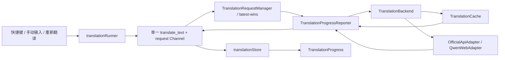

# easyT 翻译请求阶段进度 Software Design Document

> 本文是供编码 Agent 执行的实施合同。产品与架构决策以 `docs/翻译请求阶段进度需求与架构共识文档.md` 为唯一需求来源；本文将已批准共识转换为可实施、可验证、可回滚的工程设计，不重新讨论产品方案，也不授权在本文评审通过前修改生产代码。

## 0. 文档控制

| 字段 | 值 |
|---|---|
| 文档状态 | **Implemented；自动验证完成，待人工 E2E/视觉验收** |
| SDD 版本 | 0.2 |
| 日期 | 2026-08-12 |
| 仓库 | `D:\code\workSpace_Java\easyT` |
| 设计基线 | `c76144b` |
| 目标版本 | easyT 2.2.x |
| 需求来源 | `docs/翻译请求阶段进度需求与架构共识文档.md`（Approved v1.0） |
| 预期实施者 | Model-neutral coding agent |
| 实施类型 | Rust/Tauri/React 跨层功能；无持久化迁移；无新增依赖 |
| 实施状态 | 已按本文完成；真实 Qwen/Official API 与窗口尺寸人工验收待项目所有者执行 |

### 0.1 修订历史

| 版本 | 日期 | 摘要 |
|---|---|---|
| 0.1 | 2026-08-12 | 根据已批准共识和 `c76144b` 仓库现实生成首版 Full SDD |
| 0.2 | 2026-08-12 | 完成统一进度 Channel、五阶段上报、Rust 权威计时、前端状态/UI 与自动验证 |
| 0.3 | 2026-08-15 | 纳入翻译历史需求已批准的 `savingHistory` 第六阶段 |

### 0.2 实施验证摘要

- `npm run typecheck`：通过。
- `npm test`：12 个测试文件、66 项测试通过。
- `npm run build`：通过。
- `cargo fmt --manifest-path src-tauri/Cargo.toml -- --check`：通过。
- `cargo test --manifest-path src-tauri/Cargo.toml`：175 项测试通过。
- `cargo clippy --manifest-path src-tauri/Cargo.toml --all-targets -- -D warnings`：通过。
- `cargo build --release --manifest-path src-tauri/Cargo.toml`：通过。
- `git diff --check`：通过；仅有现有 Windows 工作树的 LF/CRLF 提示。
- 未执行：需要真实凭证的 Qwen/Official API E2E、屏幕阅读器实机检查以及 `520×390`/`360×200` 窗口截图验收。

### 0.3 不可协商约束

1. 实现六个真实阶段：`checkingCache`、`preparingRequest`、`connectingBackend`、`waitingForContent`、`receivingContent`、`savingHistory`；不得增加泛化 `finalizing` 或百分比进度。
2. 阶段必须由真正执行操作的 Rust module 上报；前端只能展示和本地续算时间，不得按等待时长猜阶段。
3. 一次性输出和流式输出必须共用一个请求级 Tauri Channel 和一个翻译 command；不得长期保留有 Channel/无 Channel 两条路径。
4. Rust 单调时钟是总耗时权威；前端 `performance.now()` 只用于事件间平滑续算。
5. 现有 latest-wins 是唯一请求代次和取消机制；不得在进度模块另建 generation、队列或取消状态机。
6. `PhaseChanged` 发送失败只记录脱敏 warning，翻译继续；`ContentDelta` 发送失败继续映射为取消。
7. 不改变缓存键、容量、命中规则、Refresh/Bypass 语义、Qwen 登录、错误类别或流式部分结果语义。
8. 不新增依赖、持久化字段、后台线程、全局计时器、全局事件监听或新的 Zustand store。
9. 进度与耗时必须位于 Markdown/译文内容之外，不能进入复制文本。
10. 前端必须复用现有 UI Kit `Spinner` 与 design tokens；不得新增通用 UI Kit module 或页面私有视觉 recipe。
11. 工作区已有未提交改动属于用户；实施者不得清理、覆盖、暂存或回退无关文件。

## 1. 执行摘要

当前 easyT 只在 `LoadingState.tsx` 中用前端墙上时间显示“已等待 N 秒”，一次性翻译不创建 Channel，流式翻译才创建 Channel。Rust adapter 只向流式路径发送正文增量，命令成功和失败均不携带权威耗时。因此 UI 无法说明 13～15 秒等待具体处于缓存查询、请求准备、连接、等待正文还是接收正文。

本设计在 `TranslationBackend` 内建立一个请求级 `TranslationProgressReporter` 深模块。Reporter 持有 Rust `Instant`、严格递增 sequence、当前阶段和事件 sink；缓存编排与各 adapter 在真实边界调用它。Tauri 侧把阶段事件与可选正文增量统一发送到每请求 Channel，并在成功或结构化翻译错误中返回最终 `totalElapsedMs`。前端 store 接收 request-aware、sequence-aware 的阶段快照，`TranslationProgress` 使用至多一个 1 秒局部 timer 展示阶段耗时与总耗时。



该功能采用 Full SDD，因为它同时修改 Rust 深模块、adapter 时序、Tauri IPC、错误合同、Zustand 状态和多个 UI 状态分支。

## 2. 范围

### 2.1 范围内

- 快捷键、手动输入和重新翻译发起的正式翻译请求。
- Official API 与 Qwen WebGateway。
- 一次性输出与流式输出。
- L1/L2 Use 命中、miss、降级、oversized bypass、Refresh 和 Bypass。
- 五阶段事件、sequence、结构化后端弱提示和 Rust 权威总耗时。
- 成功、普通失败、部分正文后中断、Refresh 失败和 latest-wins 取消的展示规则。
- 替换现有 `LoadingState` 和“正在重新翻译”专用等待文案。
- Rust、Tauri、service、store、UI、可访问性和回归测试。

### 2.2 范围外

- 选区捕获、剪贴板轮询、窗口定位/显示/聚焦。
- 设置页测试连接、Qwen 登录/注销、缓存详情/清理、配置保存。
- 请求诊断面板、阶段历史、遥测、日志页面、瀑布图或性能指标数据库。
- DNS/TCP/TLS/SSE/JSON/Cookie 等底层阶段。
- 缓存算法、键、容量、TTL、持久化 schema 或路径变更。
- adapter 重试次数或超时策略调整。
- 新 UI Kit module、新依赖、应用版本号和安装包配置变更。

## 3. 实施前必读与基线校验

编码 Agent 开始前必须完整阅读：

1. `AGENTS.md`
2. `CONTEXT.md`
3. `docs/UI-Kit需求与架构共识文档.md`
4. `docs/翻译请求阶段进度需求与架构共识文档.md`
5. 本 SDD
6. 本文文件矩阵中将修改文件的现有实现与直接测试

然后记录以下命令输出：

```powershell
git status --short
git rev-parse --short HEAD
npm run typecheck
npm test
cargo test --manifest-path src-tauri/Cargo.toml
```

若预检失败，先判断是否为当前工作区既有失败。不得把既有失败归因于本功能，也不得通过删除用户改动使基线变绿。若基线与第 4 节不一致，执行第 16 节偏差协议。

## 4. 已验证的仓库现实

以下事实基于 `c76144b` 和 2026-08-12 工作区核对：

- `TranslationRequestManager::run_latest` 使用 generation 与 Tokio abort handle，已实现 latest-wins。
- `src-tauri/src/commands/translate.rs` 当前暴露 `translate_text` 和 `translate_text_stream` 两条命令；只有后者接收 `requestId` 和 `Channel`。
- 当前 Tauri Channel 事件只有 `ContentDelta { requestId, delta }`。
- `TranslationBackend` 当前分别暴露 `translate` 与 `translate_stream`，两者重复缓存编排和 adapter 路由。
- `TranslationProgress` 当前只有 `emit(BackendProgress::ContentDelta)`，且发送失败会返回 `BackendError`。
- `run_translation_with_cache` 当前接收一个已构造但惰性执行的 Future；Use miss、Refresh、Bypass 进入 adapter 前没有显式阶段边界。
- Official API 和 Qwen adapter 都有一次性与流式入口；流式 decoder 已能区分正文 delta，Qwen decoder 已能区分 reasoning/控制事件。
- `llm::models::TranslationResult` 当前只有 `translatedText` 和 `fromCache`。
- `AppError` 当前序列化为 `{ kind, message }`，没有翻译专用耗时字段。
- `tauriCommands.ts::translateText` 根据 `streamOutput` 选择两条 command；前端一次性请求没有 Channel。
- `translationStore` 已 request-aware，但没有阶段、sequence 或总耗时字段。
- `LoadingState.tsx` 用 `Date.now()` 和 1 秒 interval 显示笼统等待文案。
- `TranslationPage.tsx` 在 `refreshing` 状态显示专用“正在重新翻译”，流式有正文时不显示阶段。
- UI Kit 已完成验收，`Spinner`、tokens、translation domain seam 均已存在。
- `package.json` 有 `typecheck`、`test`、`build`，没有 lint script；本功能不得凭空增加 lint 工具。
- 工作树包含与 UI Kit 验收和本需求文档相关的未提交文档改动，实施时必须保留。

## 5. 需求与验收追踪

| ID | 需求 | 设计落点 | 验收证据 |
|---|---|---|---|
| FR-001 | 展示五个真实阶段 | Rust reporter、cache/adapter 埋点 | reporter/backend/adapter tests |
| FR-002 | 同时展示阶段和总耗时 | Rust `Instant` + 前端局部续算 | formatter/timer/UI tests |
| FR-003 | 一次性与流式共用 Channel | 单一 `translate_text` command | IPC/service tests；旧 command 删除 |
| FR-004 | 缓存命中可直接成功 | `checkingCache` 在实际 lookup 前上报 | cache-hit integration test |
| FR-005 | Refresh/Bypass 不假装查缓存 | 从 `preparingRequest` 开始 | policy matrix tests |
| FR-006 | 首段有效正文才进入 receiving | adapter decoder 边界 | heartbeat/reasoning/empty tests |
| FR-007 | 后端来源结构化、前端映射 | `ProgressBackendSource` | mapping tests |
| FR-008 | sequence 严格递增并处理重试 | Reporter 集中发号、store 拒绝旧事件 | Rust + store tests |
| FR-009 | latest-wins 旧请求不可见 | 复用 manager + store requestId guard | manager/runner/store tests |
| FR-010 | 终态返回权威耗时 | success DTO + timed command error | serialization/runner tests |
| FR-011 | 进度不进入译文/复制/Markdown | translation domain 独立 module | TranslationPage/copy tests |
| FR-012 | 失败/中断/Refresh 失败文案 | store 保留 final duration + UI 分支 | page tests |
| FR-013 | 无障碍不每秒播报 | phase-only polite live region | RTL tests |
| NFR-001 | 不新增依赖或后台任务 | 现有 std/React primitives | lockfile/Cargo diff review |
| NFR-002 | 活动请求最多一个 1s UI timer | timer 归属 `TranslationProgress` | fake-timer tests |
| NFR-003 | 进度故障不影响翻译 | phase sink best-effort | fault-injection test |
| NFR-004 | 小窗口可用、视觉保持 | UI Kit/tokens、紧凑/内联两布局 | 520×390 与 360×200 手测 |

## 6. 架构与接口设计

### 6.1 Rust 进度深模块

新增 `src-tauri/src/translation_backend/progress.rs`。该文件拥有阶段词汇、时钟、sequence、合法顺序和 sink 语义；cache、adapter、Tauri command 不得各自实现计时或发号。

公开合同应等价于：

```rust
pub enum TranslationPhase {
    CheckingCache,
    PreparingRequest,
    ConnectingBackend,
    WaitingForContent,
    ReceivingContent,
}

pub struct ProgressBackendSource {
    pub mode: BackendMode,
    pub provider: String,
}

pub struct PhaseProgress {
    pub sequence: u64,
    pub phase: TranslationPhase,
    pub total_elapsed_ms: u64,
    pub backend: Option<ProgressBackendSource>,
}

pub trait TranslationProgress: Send + Sync {
    fn phase_changed(&self, progress: PhaseProgress);
    fn content_delta(&self, delta: String) -> Result<(), BackendError>;
}
```

`phase_changed` 必须是 best-effort、无返回值；Tauri sink 自己记录发送 warning。`content_delta` 保持可失败，从而维持当前 Channel 离开即取消流式请求的行为。

`TranslationProgressReporter` 必须：

- 在正式请求开始后构造一次，内部使用 `std::time::Instant`。
- 以 `AtomicU64` 或由单个 `Mutex` 保护的计数从 1 发放 sequence。
- 以单一同步状态保护当前 phase 和 sequence，避免检查与更新分裂。
- 提供 `phase(phase, backend)`、`content_delta(delta)`、`elapsed_ms()`。
- 将 `Instant::elapsed().as_millis()` 饱和转换为 `u64`。
- 在发送事件前完成状态提交，避免 sink 重入破坏顺序。
- 不缓存正文、不拥有 requestId、不知道 Tauri Channel。
- 提供显式 disabled/discard reporter，供 `test_connection` 使用。disabled reporter 的 `phase` 和 `content_delta` 均直接成功返回，不执行阶段校验、不写 warning、不产生 UI 事件。

合法阶段转换固定为：

```text
None → checkingCache | preparingRequest
checkingCache → preparingRequest | terminal
preparingRequest → connectingBackend | terminal
connectingBackend → connectingBackend | waitingForContent | terminal
waitingForContent → receivingContent | terminal
receivingContent → terminal
```

其中 terminal 不是阶段，也不发送事件。同阶段只允许 `connectingBackend → connectingBackend`，代表真实的新连接尝试并分配新 sequence。其他重复调用视为实现噪声，记录脱敏 warning 后忽略。任何倒退或非法跳转也只 warning 并忽略，不能使翻译失败。

### 6.2 单一 TranslationBackend seam

`TranslationBackend` 对正式翻译只保留一个公开入口，语义等价于：

```rust
translate(config, request, options, reporter) -> Result<TranslationOutcome, BackendError>
```

是否流式仍由已保存的 `config.stream_output` 决定。内部可以继续调用 adapter 的一次性/流式私有方法，但命令层和前端不得再选择不同 backend 方法。

`test_connection` 保持独立接口和现有行为；它使用 discard reporter，不接入翻译 Channel，不返回阶段耗时。

### 6.3 缓存编排边界

把 `run_translation_with_cache` 的 `fetch: Future` 改为惰性 `fetch: FnOnce() -> Future`（或语义等价的零参数异步工厂），使 `preparingRequest` 能在确认 miss/旁路后、真正构造和轮询 adapter Future 前上报。

固定顺序：

| CachePolicy / 输入 | 阶段顺序 |
|---|---|
| Use + 可查询 + L1/L2 hit | `checkingCache → success` |
| Use + 可查询 + miss/缓存降级 | `checkingCache → preparingRequest → ...` |
| Use + definitely oversized | `preparingRequest → ...`，不得发送 `checkingCache` |
| Refresh | `preparingRequest → ...` |
| Bypass（包括 Qwen saveHistory） | `preparingRequest → ...` |

`checkingCache` 必须紧邻 `cache.lookup(input).await` 之前发送。缓存内部 L1/L2 转换仍是一个用户阶段；不得暴露 L1/L2 子阶段。缓存失败继续按既有透明降级规则进入 `preparingRequest`。

### 6.4 Adapter 阶段边界

`TranslationBackend` 在调用选定 adapter 之前发送 `preparingRequest`，并附带结构化 backend。该阶段覆盖 prompt、参数、Header、配置校验与必要临时凭证借用。

Official API 与 Qwen WebGateway 都必须遵守：

1. 每次真正开始 `.send()` 前发送 `connectingBackend`。
2. 取得成功 HTTP response headers 且确认 status success 后发送 `waitingForContent`。
3. 非 2xx 响应不得发送 `waitingForContent`。
4. 收到第一段非空、有效的译文正文时只发送一次 `receivingContent`。
5. heartbeat、空 delta、reasoning、usage、控制事件、`[DONE]`、协议元数据不得触发 `receivingContent`。
6. 一次性 JSON 响应在解析出非空有效正文后、返回完整结果前发送 `receivingContent`。
7. 一次性 SSE 消费仍在首个正文时发送 `receivingContent`，但不调用 `content_delta`。
8. 流式模式首个正文先确保 `receivingContent` 已提交，再调用 `content_delta`；后续正文只发 delta，不重复阶段。
9. Qwen 的每个既有有限连接重试在新 `.send()` 前再次发送 `connectingBackend`，自动获得更大 sequence 并重置阶段耗时。
10. 不新增重试、无限 timeout 或供应商回退。

若一个合法完整结果不存在正文，保持当前结果校验/错误语义；不得为了补齐阶段而伪造 `receivingContent`。

### 6.5 结构化 backend source

Rust 事件字段只允许：

```text
backend.mode: officialApi | webGateway
backend.provider: 稳定 provider id
```

生成规则：

- WebGateway 固定 `{ mode: webGateway, provider: qwen }`。
- Official API 使用 `{ mode: officialApi, provider: config.provider }`。
- 不携带 model、Base URL、账号、凭证、设备 ID 或响应文字。
- `checkingCache` 的 backend 必须为 `None`。

前端 translation domain 依据 `BackendMode`、`ModelProvider` 和现有 provider preset 映射：

- `webGateway + qwen` → `Qwen 网页实验模式`
- `officialApi + custom` → `Official API · 自定义供应商`
- 已知内置 official provider → `Official API · {现有供应商展示名}`
- 未知 official provider → `Official API`
- 未知 web provider → 不显示弱提示，不直接展示原始字符串

弱提示只在 preparing/connecting/waiting/receiving 显示；checkingCache 与 fallback 不显示。

### 6.6 Tauri 事件和命令合同

将 `TranslationStreamEvent` 重命名为 `TranslationProgressEvent`，使用 `#[serde(tag = "type", rename_all = "camelCase")]`，精确 JSON 合同为：

```ts
type TranslationProgressEvent =
  | {
      type: "phaseChanged";
      requestId: string;
      sequence: number;
      phase: TranslationPhase;
      totalElapsedMs: number;
      backend?: ProgressBackendSource;
    }
  | {
      type: "contentDelta";
      requestId: string;
      delta: string;
    };
```

正式翻译只保留：

```text
translate_text(requestId, text, targetLanguage, forceRefresh, onEvent)
```

要求：

- `requestId` 对一次性和流式均必填、非空，只用于 IPC 关联和前端 latest-wins guard。
- `onEvent` 对一次性和流式均必填。
- Rust 从 `AppState` snapshot 读取 `streamOutput`，前端不能以参数覆盖配置。
- 删除 `translate_text_stream` command、import、handler registration 和前端调用。
- 最终完整结果仍由 command resolve；Channel 不发送 terminal event。
- 该前后端变更必须在同一提交链原子完成，不要求兼容旧前端二进制。

`ChannelProgress::phase_changed` 调用 `channel.send`，失败只使用 `log::warn!` 记录事件类别、phase、sequence，不记录 requestId、原文、译文或 backend provider；然后返回。`content_delta` 发送失败映射 `BackendError::Cancelled`。

### 6.7 成功与错误 DTO

扩展 `llm::models::TranslationResult`：

```text
translatedText: string
fromCache: boolean
totalElapsedMs: non-negative integer
```

翻译 command 使用专用 `TranslationCommandError`：

```text
kind: existing ErrorKind
message: existing sanitized message
totalElapsedMs?: non-negative integer
```

不得给所有 `AppError` 或非翻译 command 强行增加耗时。推荐在 `app_error.rs` 提供 crate-private 的安全 `kind`/`message` 取值方法，并在 `commands/translate.rs` 组装专用 DTO；不得复制一份易漂移的 AppError match 表。

正式计时边界：

1. 先完成 `requestId` 非空、配置 snapshot、空文本和最大长度等现有同步预检查。
2. 预检查通过后立即构造 reporter，此时为总耗时零点。
3. reporter 与 backend future 一同交给 `run_latest`；新请求仍立即 abort 旧请求。
4. `run_latest` 完成后，成功 DTO 和错误 DTO 都从同一个 reporter 读取最终 `elapsed_ms()`。
5. 预检查失败返回原错误结构，不带 `totalElapsedMs`。
6. Tokio abort 映射的旧请求取消可以携带耗时，但前端必须因 requestId 已失效而忽略；不得写入新请求状态。

最终耗时包含正式请求内的缓存、请求准备、连接、等待正文、接收和返回组装，但不包含捕获和窗口操作。

## 7. 前端数据与状态设计

### 7.1 共享类型

在 `src/types/index.ts` 增加：

```ts
type TranslationPhase =
  | "checkingCache"
  | "preparingRequest"
  | "connectingBackend"
  | "waitingForContent"
  | "receivingContent";

interface TranslationProgressBackend {
  mode: BackendMode;
  provider: string;
}
```

`TranslationStatus` 不变。`TranslationState` 增加以下等价字段；字段名按本文固定，避免不同实现层自行命名：

```ts
progressPhase: TranslationPhase | null;
progressSequence: number | null;
progressBackend: TranslationProgressBackend | null;
progressPhaseStartedTotalElapsedMs: number | null;
progressSyncedTotalElapsedMs: number | null;
progressSyncedAtMonotonicMs: number | null;
requestStartedAtMonotonicMs: number | null;
totalElapsedMs: number | null;
```

前七个活动字段不持久化。`totalElapsedMs` 在活动期保存最近权威快照，在终态保存 Rust 最终值。

### 7.2 Service seam

`TranslateTextRequest` 改为：

```ts
interface TranslateTextRequest {
  requestId: string;
  text: string;
  targetLanguage: string;
  forceRefresh: boolean;
  onPhaseChanged: (event: PhaseChangedEvent) => void;
  onContentDelta?: (delta: string) => void;
}
```

删除 `streamOutput` 作为 IPC 路由条件。`translationRunner` 仍根据当前配置决定是否创建正文 delta buffer 和传入 `onContentDelta`；Rust 的配置 snapshot 是是否实际产生 delta 的唯一权威。callback 缺失时 service 安全忽略意外 delta，不得因此取消一个本可成功的一次性请求。

`translateText` 始终创建一个 `Channel<TranslationProgressEvent>` 并调用 `translate_text`。Channel handler 必须：

- 先校验 event `requestId` 与 request 相同。
- `phaseChanged` 调用 `onPhaseChanged`。
- `contentDelta` 仅在 callback 存在时调用。
- 不在 service 中保存阶段、不启动 timer、不映射中文文案。

`TranslationResult` 和 `CommandError` 分别增加必填和可选 `totalElapsedMs`。`toCommandError` 只接受有限、非负数；无效值归一为 `undefined`，避免 NaN/Infinity 污染 UI。

### 7.3 Store 不变量

`translationStore` 增加：

```text
applyProgressPhase(requestId, event) -> boolean
```

更新规则：

1. requestId 不是当前请求：返回 false，不改状态。
2. sequence 非正整数：忽略。
3. 与当前 sequence 相同或更小：忽略，不重置计时。
4. phase 的语义 rank 小于当前 phase：忽略并在开发环境 warning；不得使 UI 倒退。
5. sequence 更大且 phase 相同：接受，表示连接重试；同步点和阶段起点重置。
6. 接受事件时用一次 `performance.now()` 写入 `progressSyncedAtMonotonicMs`，把 Rust `totalElapsedMs` 同时写入 `progressSyncedTotalElapsedMs`、`progressPhaseStartedTotalElapsedMs` 和活动期 `totalElapsedMs`，并更新 backend。
7. `checkingCache` 强制把 `progressBackend` 设为 null，不能沿用旧来源。

生命周期：

- `startRequest`：记录 `requestStartedAtMonotonicMs = performance.now()`；清除旧 phase/sequence/backend/sync/final duration；保留既有 Refresh 旧缓存译文规则。
- `appendTranslationDelta`：保留现有 request/status guard 和 50ms buffer；不自行设置 phase。
- `succeedRequest`：清活动进度字段，将 result `totalElapsedMs` 写入 final duration。
- `failRequest`：增加可选 `totalElapsedMs` 参数；清活动字段，保留现有 partial 规则并写 final duration。
- `failRefreshRequest`：增加可选 `totalElapsedMs`；状态仍回到 success、保留旧缓存译文和来源提示，同时保存本次失败耗时。
- `failCapture`：清所有阶段和耗时，因为捕获不属于正式翻译。
- `reset`：清所有阶段和耗时，保留 pinned。
- 切到设置页不 reset，因此返回时终态耗时仍存在；应用重启不恢复。

前端只把 store 当当前请求快照，不保留阶段数组或历史。

### 7.4 Runner 行为

`runTranslationRequest` 必须：

- 调用统一 `translateText` 并把 phase callback 直接转发给 store。
- 只有配置启用流式时创建现有 delta buffer。
- success 前 flush delta，再调用带 final duration 的 `succeedRequest`。
- catch 时先 dispose/flush 当前 buffer，解析 `CommandError.totalElapsedMs`，再按 refreshing/partial/ordinary failure 调用对应 store 方法。
- 继续依赖 store 的 requestId guard；不得因为收到 cancel error 临时覆盖新请求。
- 不创建计时器、不猜 phase、不修改 latest-wins。

## 8. UI 设计

### 8.1 TranslationProgress module

新增 `src/components/translation/TranslationProgress.tsx`，通过 `src/components/translation/index.ts` 导出。它是翻译领域 module，不进入 `components/ui` 或 `components/patterns`。

使用一个判别联合 props：

```ts
type TranslationProgressProps =
  | { kind: "active"; snapshot: ActiveProgressSnapshot; compact: boolean }
  | { kind: "success" | "failure" | "interrupted"; totalElapsedMs: number };
```

该 module 集中拥有：

- 五阶段固定中文主文案。
- fallback“正在处理翻译请求”。
- backend 弱提示映射。
- 活动耗时与终态耗时格式化。
- active 状态下唯一的 1 秒 interval。
- 首段正文前居中布局与正文后 compact 布局。
- phase-only `aria-live="polite"` 行为。

不得让调用页面拼接阶段中文、时间格式或供应商提示。

### 8.2 时间续算与格式化

active 模式每次 render/tick 计算：

```text
若已有 Rust sync：
  localDelta = max(0, performance.now() - progressSyncedAtMonotonicMs)
  displayedTotal = progressSyncedTotalElapsedMs + localDelta
  displayedPhase = max(0, displayedTotal - progressPhaseStartedTotalElapsedMs)

若尚无真实 phase：
  displayedTotal = max(0, performance.now() - requestStartedAtMonotonicMs)
```

每次接受新 phase 时，其 `totalElapsedMs` 同时是该 phase 的起始总耗时，因此无需保存阶段历史。

活动格式固定：

- `< 1000ms` → `不足 1 秒`
- `>= 1000ms` → `Math.floor(ms / 1000) 秒`

终态格式固定：

- `< 100ms` → `不足 0.1 秒`
- `100ms <= x < 9950ms` → 四舍五入到 0.1 秒，始终显示一位小数
- `>= 9950ms` → 四舍五入到整数秒

所有输入先 clamp 为有限非负数。终态只使用 Rust 返回值，不再本地续算。

### 8.3 展示位置

`TranslationPage` 固定组合：

| 状态 | 展示 |
|---|---|
| translating、尚无正文 | OriginalTextPanel 后显示 active、`compact=false` |
| streaming、有正文 | TranslationPanel 后显示 active、`compact=true` |
| refreshing、保留旧缓存译文 | 旧 TranslationPanel 后显示 active、`compact=true`；删除专用“正在重新翻译” |
| success | TranslationPanel 后显示 `kind=success`；缓存来源提示继续独立存在 |
| refresh failure | 旧 TranslationPanel 与既有刷新错误后显示 `kind=failure` |
| error + partial | 未完成 TranslationPanel 下显示 `kind=interrupted`，再显示既有 ErrorState/actions |
| error + no partial | 既有 ErrorState 下显示 `kind=failure` |
| latest-wins 旧请求 | 不显示任何旧耗时 |

fallback 尚无 phase 时显示：

```text
正在处理翻译请求
总计不足 1 秒
```

真实阶段首段正文前显示：

```text
Spinner
{阶段主文案}
{可选后端弱提示}
本阶段 {duration} · 总计 {duration}
```

有正文后 compact 显示同样语义但不占用居中等待区。成功/失败/中断分别固定：

```text
本次翻译耗时 {duration}
请求在 {duration} 后失败
请求在 {duration} 后中断
```

进度和耗时必须在 Markdown container 外；现有 copy handler 仍只接收 `translatedText`。

### 8.4 可访问性

- `Spinner` 使用现有 UI Kit，不重复提供会与主文案冲突的 label。
- 独立 live region 只包含阶段主文案和必要弱提示，`aria-live="polite"`、`aria-atomic="true"`。
- live region 以 sequence/phase 更新；每秒变化的数字必须位于 live region 外，避免屏幕阅读器每秒播报。
- 首次进入 receivingContent 只播报一次；正文 delta 不触发阶段播报。
- terminal duration 是普通可读文本，不使用 assertive announcement。
- 360×200 下允许自然换行，不缩小 UI Kit 规范字号和控件尺寸。

### 8.5 旧 module 清理

功能迁移完成且测试通过后：

- 删除 `src/components/translation/LoadingState.tsx`。
- 删除 translation seam 对它的 export。
- 删除/迁移其测试。
- 全仓搜索并确保不存在旧文案“已等待”“如长时间无响应请检查网络与 API 配置”“正在重新翻译”。
- 不保留兼容 wrapper 或第二套 timer。

## 9. 并发、取消和失败语义

### 9.1 Latest-wins

- request manager 不改 generation 算法。
- Reporter 随被 spawn 的 future 所有；future abort 后其 adapter、decoder 和 reporter 一起 drop。
- Channel event 带 requestId；service 和 store 双重过滤。
- 新请求 `startRequest` 先清旧进度并展示新 fallback；任何旧 phase/delta/result/error 都不能覆盖。
- 不展示被替代旧请求的 terminal duration。

### 9.2 PhaseChanged 发送失败

- Tauri channel send error：warning 后继续。
- 后续阶段仍可尝试发送；不把 sink 标记为永久失败，不影响网络请求和最终 command result。
- 如果所有 phase 都丢失，前端保持 fallback 并正常接收最终 success/error。
- warning 只包含固定事件类别、phase、sequence；不得包含正文、URL、Header、凭证、完整 response 或 request body。

### 9.3 ContentDelta 发送失败

- 保持当前 `BackendError::Cancelled` 语义。
- 已收到正文时，runner/store 继续按当前 partial/cancel mapping 处理；不得把部分译文标记成功或写缓存。
- 一次性模式不发送 delta，因此 phase channel 失败不能取消一次性翻译。

### 9.4 非法阶段

- Rust reporter 是第一道约束；非法转换 warning + ignore。
- 前端 store 是第二道防御；旧 sequence、重复 sequence、语义倒退全部 ignore。
- 非法阶段不能改变 TranslationStatus、清空正文或造成请求失败。

## 10. 文件变更矩阵

| 文件 | 操作 | 责任 |
|---|---|---|
| `src-tauri/src/translation_backend/progress.rs` | 新增 | phase、source、reporter、sink、sequence、单调计时和合法转换 |
| `src-tauri/src/translation_backend/models.rs` | 修改 | 移除旧单一 `BackendProgress`/旧 trait 所有权，保留请求/结果模型 |
| `src-tauri/src/translation_backend/mod.rs` | 修改 | 导出 progress；统一 translate seam；真实 cache phase；惰性 fetch |
| `src-tauri/src/translation_backend/official_api/adapter.rs` | 修改 | preparing 后的连接/等待/首正文阶段，一次性与流式一致 |
| `src-tauri/src/translation_backend/web_gateway/mod.rs` | 修改 | 透传 reporter，不增加 provider abstraction |
| `src-tauri/src/translation_backend/web_gateway/qwen/adapter.rs` | 修改 | Qwen send/retry/SSE 首正文阶段与 delta 语义 |
| `src-tauri/src/commands/translate.rs` | 修改 | 单一 command、统一 Channel、timed success/error、best-effort phase sink |
| `src-tauri/src/app_error.rs` | 修改 | 提供 crate-private 安全错误字段读取，非翻译序列化不变 |
| `src-tauri/src/llm/models.rs` | 修改 | TranslationResult 增加 `totalElapsedMs` |
| `src-tauri/src/lib.rs` | 修改 | 移除 `translate_text_stream` 注册/import |
| `src/types/index.ts` | 修改 | phase/backend/state/timing 类型 |
| `src/services/tauriCommands.ts` | 修改 | 统一 Channel/command、event union、timed result/error |
| `src/services/translationRunner.ts` | 修改 | 转发 phase、写入终态耗时、保留 delta buffer |
| `src/stores/translationStore.ts` | 修改 | request/sequence-aware 进度状态和生命周期 |
| `src/components/translation/TranslationProgress.tsx` | 新增 | 所有阶段/时间/弱提示/计时/UI/a11y |
| `src/components/translation/LoadingState.tsx` | 删除 | 被统一进度 module 替代 |
| `src/components/translation/index.ts` | 修改 | export seam 更新 |
| `src/pages/TranslationPage.tsx` | 修改 | 各生命周期的进度/终态耗时组合 |
| 相关 `*.test.ts(x)` | 修改/新增 | 第 12 节测试合同 |

若实现发现还需修改 fixture 或 mock 文件，可在不改变架构的前提下增加；最终报告必须列出。不得顺手重构无关设置页、缓存或 UI Kit。

## 11. 实施步骤与提交边界

### Step 1：建立 Rust progress 深模块

- 新增 phase/source/sink/reporter。
- 先写 reporter 单元测试，再接业务代码。
- 保持旧路径暂时可编译，必要时通过 re-export 过渡，但最终必须删除旧 `BackendProgress::ContentDelta` 合同。

**完成门：**sequence、合法转换、同阶段连接重试、非法倒退、elapsed、phase sink 无返回值测试通过。

### Step 2：接入 TranslationBackend 与缓存真实边界

- 合并正式 translate seam。
- 把 fetch 改成惰性工厂。
- 按 policy matrix 接入 checking/preparing。
- 保持 cache stats、epoch、store 和错误降级完全不变。

**完成门：**cache hit/miss/oversized/Refresh/Bypass 的阶段序列和原缓存测试全部通过。

### Step 3：接入 Official API 与 Qwen adapters

- 为一次性和流式路径传同一 reporter。
- 在 send/success headers/首正文的真实位置上报。
- 保持 Qwen retry、history、credential、decoder 和错误映射。

**完成门：**两类 adapter 的一次性/流式、心跳/reasoning、非 2xx、retry、partial 测试通过。

### Step 4：统一 Tauri command 与错误合同

- 新增 union event 和 Channel sink。
- `translate_text` 接受 requestId/onEvent 并返回 final elapsed。
- 删除 `translate_text_stream` 和 handler。
- 保持 latest-wins manager 本身不变。

**完成门：**serde 合同、phase send failure、content send failure、success/error elapsed、旧请求取消测试通过。

### Step 5：更新前端 service、runner 和 store

- 增加共享类型和统一 Channel。
- 实现 store 进度状态、sequence guard、终态耗时。
- runner 接线，不在 service/runner 创建 timer。

**完成门：**service event routing、store lifecycle、latest-wins、Refresh failure、partial tests 通过。

### Step 6：替换 UI

- 新增 `TranslationProgress`。
- 更新 TranslationPage 全状态组合。
- 复用 Spinner/tokens，确保 Markdown 和复制边界。
- 删除 LoadingState 和旧专用文案。

**完成门：**formatter、fake timer、a11y、页面分支、copy/Markdown tests 通过；无新增 UI 依赖。

### Step 7：清理、全量验证与人工验收

- 搜索旧 API/文案/双 timer。
- 跑第 13 节全部命令。
- 在默认与最小窗口执行第 14 节手工矩阵。
- 输出实施报告，但不自动提交、推送、构建安装包或改版本号，除非项目所有者另行授权。

## 12. 自动测试合同

### 12.1 Rust reporter 单元测试

至少覆盖：

- 首事件 sequence 为 1，后续严格递增。
- checking→preparing→connecting→waiting→receiving。
- cache hit 只有 checking。
- connecting→connecting 分配新 sequence。
- 其他同阶段重复不发事件。
- 倒退/非法跳转不发事件且不返回业务错误。
- elapsed 单调非减，使用可注入时钟或暂停/容差极小的测试策略，禁止长 sleep。
- phase sink 故障不影响 reporter；content sink 错误原样返回。

### 12.2 Backend/cache tests

在 `translation_backend/mod.rs` 现有 cache tests 上增加 recording reporter：

- Use L1/L2 hit：checking 后直接返回，adapter 调用为 0。
- Use miss/缓存降级：checking→preparing。
- definitely oversized：无 checking，从 preparing 开始且公开 cache stats 语义不变。
- Refresh/Bypass：无 checking。
- Official/WebGateway source 正确，checking 无 source。
- cache failure 仍调用 adapter，翻译结果不因进度改变。

### 12.3 Adapter tests

Official API：

- 非流式成功序列 connecting→waiting→receiving。
- 流式心跳/空 delta 不进入 receiving。
- 首个有效 delta 进入 receiving 一次，后续只发 delta。
- 非 2xx 只有 connecting，没有 waiting/receiving。
- partial/timeout 维持现有错误种类。

Qwen：

- reasoning、控制事件、空 content 不触发 receiving。
- 一次性 SSE 触发 receiving 但无 content delta。
- 流式首正文先 receiving 后 delta。
- 既有重试产生第二个 connecting 和更大 sequence，总时钟不重置。
- 401/403 session expired 行为不变。
- saveHistory/cache Bypass 行为不变。

### 12.4 Tauri command tests

- `TranslationProgressEvent` 精确 camelCase serde snapshot。
- TranslationResult 序列化含 `totalElapsedMs`。
- 已开始错误序列化含 `kind/message/totalElapsedMs`；预检查错误无 elapsed。
- phase Channel send failure 不改变最终成功。
- content delta Channel send failure 仍为 cancelled。
- 新请求 abort 旧请求，旧请求事件/结果不影响新请求。
- `lib.rs` 只注册一个正式翻译 command。

### 12.5 Frontend service/store/runner tests

- service 对两种模式都调用 `translate_text` 并创建 Channel。
- event requestId 不匹配时忽略。
- phase/content union 路由正确。
- `toCommandError` 接受合法 elapsed，拒绝负数、NaN、Infinity 和字符串。
- start 清旧 progress/final timing，Refresh 仍保留旧缓存译文。
- 第一个 phase、正常前进、重复 sequence、较小 sequence、倒退、同 phase 新 sequence。
- success/error/partial/Refresh failure 保存正确 final elapsed 并清 active phase。
- latest-wins 旧 phase/error/success 全部拒绝。
- reset/failCapture 清 timing；页面切换不主动清 store。
- delta buffer 50ms 合并行为不退化。

### 12.6 UI tests

- 五阶段固定文案与 fallback 文案。
- backend 弱提示所有映射和未知来源降级。
- active 格式边界：0、999、1000、1999ms。
- terminal 格式边界：0、99、100、9840、9949、9950、9960、14600ms。
- fake timer 证明只有 active mount 创建一个 interval，phase 更新不叠加，terminal/unmount 清理。
- phase live region 存在，秒数不在 live region；每秒 tick 不改变 live region 文本。
- translating/streaming/refreshing/success/error/partial/refresh failure 的页面位置正确。
- 进度不在 Markdown container，复制值仍只有 translatedText。
- 缓存来源提示与耗时提示彼此独立。
- 不再出现旧等待提示和“正在重新翻译”。

## 13. 自动验证命令

实施完成后按顺序运行并记录命令、退出码和测试数量：

```powershell
npm run typecheck
npm test
npm run build
cargo fmt --manifest-path src-tauri/Cargo.toml -- --check
cargo test --manifest-path src-tauri/Cargo.toml
cargo clippy --manifest-path src-tauri/Cargo.toml --all-targets -- -D warnings
cargo build --release --manifest-path src-tauri/Cargo.toml
git diff --check
git status --short
```

说明：

- 仓库没有 npm lint script，不得添加工具只为满足虚构命令。
- `cargo build --release` 从仓库根执行时必须显式传 `--manifest-path`。
- 本功能不要求安装包构建；若项目所有者另行要求，使用 `npm run tauri build` 并单独记录 MSI/NSIS 产物。
- 如 clippy 存在与本变更无关的基线 warning，按偏差协议报告，不得扩大范围清理全仓。

## 14. 手工验收矩阵

在 Windows、默认窗口 `520×390` 和最小窗口 `360×200` 各执行关键路径：

1. 手动输入 + Official API + 一次性 + cache miss。
2. 快捷键 + Official API + 流式，确认首正文后进度移到译文下方。
3. Qwen WebGateway + 一次性，观察连接/等待/接收阶段和弱提示。
4. Qwen WebGateway + 流式，确认 reasoning/心跳不提前显示接收正文。
5. L1 hit 和重启后的 L2 hit，允许 checking 快速闪现并显示终态耗时。
6. 重新翻译缓存结果：旧译文保留、无 checking、普通阶段文案、成功替换。
7. 重新翻译失败：旧译文和缓存来源保留，显示现有错误和本次失败耗时。
8. 流式收到部分正文后断网：部分译文保留并显示“中断”。
9. 连续触发 Ctrl+T：新请求立即显示 fallback，旧请求阶段/错误/耗时不闪回。
10. 屏幕阅读器或无障碍树检查：阶段变化可读，秒数 tick 不每秒播报。
11. 复制译文：剪贴板不含阶段、弱提示、缓存提示或耗时。
12. 切换设置页再返回：当前终态耗时仍在；重启应用后不恢复。

每项记录 backend、stream setting、cache condition、结果和必要截图。无真实账号/API 凭证时明确标记未执行，不能伪造通过。

## 15. 性能、安全、兼容与回滚

### 15.1 性能预算

- Rust 每请求仅一个 reporter、一个 `Instant`、一个小型同步状态和低频 phase event。
- 不为每个 token 发送 phase；正文 delta 继续使用现有 50ms 前端合并。
- 前端活动请求最多一个 1 秒 interval；非活动状态零 timer。
- 不持久化阶段，不增加 SQLite I/O。
- 不新增依赖，release 体积只应出现与少量代码和固定文案相称的变化；若出现明显的物料增量，实施报告给出 before/after 可执行文件大小和原因，不通过未经批准的依赖掩盖问题。

### 15.2 敏感信息

- 事件不包含原文、译文（ContentDelta 除外，沿用现有前端可见传输）、URL、Header、Cookie、ticket、API Key、账号、模型或请求正文。
- backend provider 只传稳定 id；未知值不直接展示。
- warning 不记录 requestId 和动态 upstream 内容。
- 不改变凭证或缓存持久化。

### 15.3 兼容性

- Tauri 前后端在同一桌面应用内发布，单一 command 变更允许原子升级，不提供跨版本 IPC 兼容层。
- 配置、缓存数据库、credentials、用户数据和安装路径均不变，无 migration。
- TranslationStatus 和既有 ErrorKind 不变。
- 回滚时必须整体回滚本功能提交链，使旧前端与旧 command 同时恢复；不能只回滚一侧。

### 15.4 回滚触发条件

出现以下任一情况应停止发布并回滚：

- 阶段事件会改变翻译成功/失败结果。
- latest-wins 旧请求能覆盖新请求。
- 一次性与流式结果、缓存写入或 partial 语义退化。
- 每秒 timer 泄漏或叠加。
- 进度进入复制文本或 Markdown。
- 新增依赖、持久化 schema 或未批准的 provider/重试改动。

## 16. 仓库现实冲突协议

编码 Agent 不得在以下情况自行猜测：

1. `TranslationBackend`、cache policy 或 command 已被其他未提交代码改成与本文不同的接口。
2. UI Kit seam、TranslationPage 状态组合或 store 字段已有并行实现。
3. 现有 adapter 无法在不改变协议/重试的情况下识别“成功 headers”或“首段有效正文”。
4. Tauri Channel 的实际版本不支持本文事件发送方式。
5. 必须新增依赖、修改持久化数据或扩大到测试连接/登录才能实现。
6. 与用户未提交改动发生同文件、同语义冲突，无法安全保留。

处理顺序：

- 先用只读检查确认现实并记录文件、symbol、diff 和影响。
- 若能在不改变产品决策的情况下做局部适配，更新实施报告并继续。
- 若会改变阶段真实性、IPC 合同、latest-wins、缓存或 UI 语义，停止实施并向项目所有者报告选择，不自行选方案。
- 不用 `git reset --hard`、`git checkout --`、删除文件或覆盖工作树来消除冲突。

## 17. 编码 Agent 执行协议

实施者必须遵守：

1. 本文是实施合同，共识文档是需求权威；冲突时共识文档优先。
2. 开始前完成第 3 节预检并保存结果。
3. 按第 11 节顺序推进；每一步先测试最小闭环，再进入下一步。
4. 只修改第 10 节所需文件和直接 fixture/mock；任何扩展范围先报告。
5. 使用现有命名、错误模型、UI Kit、测试框架和格式化工具。
6. 不创建 tickets、不提交、不推送、不改版本、不打安装包，除非用户单独授权。
7. 不用测试替代实现，不降低/删除既有断言来获得通过。
8. 不在日志或测试 fixture 写真实凭证、Cookie、账号、原文或完整私有响应。
9. 发现需求不可能满足时停止并提供证据，不做静默降级。
10. 完成后提交一份实施报告，至少包含：
    - 实际修改文件；
    - 每个 FR/NFR 的实现映射；
    - 自动命令、退出码和测试数量；
    - 手工验收结果与未执行项；
    - 任何偏差、残余风险、release 体积 before/after（若测量）；
    - `git status --short`，明确区分本功能与用户既有改动。

## 18. Definition of Done

只有以下条件全部满足才可声明实现完成：

- [ ] 项目所有者已批准本 SDD。
- [ ] 正式翻译只有一个 TranslationBackend seam、一个 Tauri command、一个请求 Channel。
- [ ] 五阶段均由真实 Rust 边界上报，未新增或伪造阶段。
- [ ] cache hit/miss/oversized/Refresh/Bypass 阶段顺序符合合同。
- [ ] Official API/Qwen、一次性/流式均正确进入真实 receivingContent。
- [ ] sequence、重试、非法倒退与 latest-wins 测试通过。
- [ ] 成功和已开始错误均返回 Rust 权威耗时；预检查错误可无耗时。
- [ ] 前端 fallback、双计时、弱提示和终态耗时格式完全符合共识。
- [ ] Refresh 旧译文、partial、缓存提示、复制和 Markdown 语义无回归。
- [ ] 阶段 live announcement 不包含每秒计时。
- [ ] `LoadingState`、旧双 command 和旧等待文案已删除，无兼容残留。
- [ ] 无新增依赖、配置项、持久化数据、后台任务或全局 timer/listener。
- [ ] 第 13 节全部适用自动命令通过。
- [ ] 第 14 节人工验收完成，或未执行项被真实记录并由项目所有者接受。
- [ ] 实施报告完整，工作区用户既有改动被保留。

---

**当前结论：**功能已按本文完成实现并通过全部自动验证。发布前仍需项目所有者使用真实 Qwen/Official API 凭证完成 E2E，并在默认与最小窗口执行人工视觉和可访问性验收。
