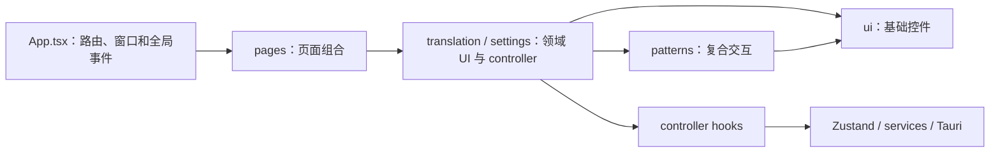
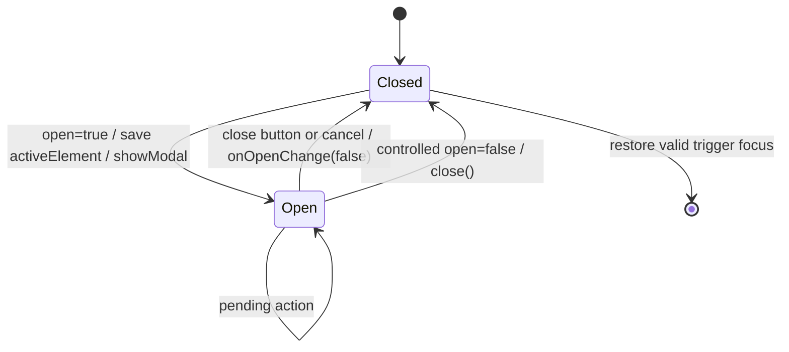

# easyT 内部 UI Kit 提取与前端结构优化 SDD

> 本文是供编码 Agent 执行的实施合同。需求与视觉决策以 `docs/UI-Kit需求与架构共识文档.md` 为准；本文只把已批准共识转换为可实施、可验证、可回滚的工程步骤，不重新讨论产品方案。

## 0. 文档控制

| 字段 | 值 |
|---|---|
| 文档状态 | **Implemented and Accepted** |
| SDD 版本 | 0.3 |
| 日期 | 2026-08-12 |
| 仓库 | `D:\code\workSpace_Java\easyT` |
| 基线提交 | `594528f` |
| 交付版本 | `2.2.0` |
| 需求来源 | `docs/UI-Kit需求与架构共识文档.md`（Approved v1.1） |
| 实施类型 | 既有前端重构；行为保持；无后端数据迁移 |
| 实施与验收 | **已完成；项目所有者于 2026-08-12 确认最终验收通过** |

### 0.0 批准记录

项目所有者于 2026-08-11 明确批准 01 工单。批准范围仅限本文既定的 easyT 内部 UI Kit 提取、领域组件迁移和行为保持重构；不新增依赖、不修改 Rust/Tauri 接口、不改变配置/缓存/翻译状态机，也不改变窗口尺寸合同或既有视觉语言。

项目所有者于 2026-08-12 确认 UI Kit 已完成验收。实施、自动验证、人工视觉与交互验收证据见 `docs/ui-kit-refactor/release-verification.md` 及 01～09 工单。

### 0.1 变更摘要

在不改变 easyT 当前功能、窗口行为和视觉风格的前提下，将分散在页面和根组件目录中的通用交互、复合模式及翻译/设置领域 UI 提取为 easyT 内部 UI Kit。建立稳定的目录 seam、CSS token 所有权、可访问性合同、测试基线与 Agent 约束，使以后新增或修改前端页面时优先复用 UI Kit。

### 0.2 不可协商约束

1. UI Kit 仅供 easyT 内部使用，不发布 npm 包，不追求跨项目通用性。
2. 保留现有暖灰、蓝灰、紧凑桌面端视觉风格；不得借重构重新设计页面。
3. 不新增 UI 运行时或开发依赖，不引入 Storybook、Playwright、Radix、Headless UI 等。
4. 不修改 Tauri command、事件名、配置格式、Zustand store 语义、缓存格式或 Rust 后端。
5. `ui` 与 `patterns` 必须为受控展示模块，不得读取 Zustand、调用 Tauri command 或依赖 `AppConfig` 等领域类型。
6. 页面只负责组合；领域副作用进入对应 controller hook；全局路由、托盘/快捷键事件与窗口协调继续由 `App.tsx` 承担。
7. `className` 只允许用于布局定位，不得作为调用方覆盖组件视觉合同的通道。
8. 所有破坏性确认统一使用 `ConfirmDialog`；移除 `window.confirm` 和页面私有确认遮罩。
9. 原生 `<dialog>` 是唯一对话框基础，不得维护另一套页面级焦点/键盘实现。
10. 工作区已有的未提交改动属于用户：实施时不得覆盖或清理 `AGENTS.md` 和本需求文档等无关改动。

## 1. 执行前必读与现实校验

编码 Agent 开始前必须完整阅读：

1. `AGENTS.md`
2. `CONTEXT.md`
3. `docs/UI-Kit需求与架构共识文档.md`
4. 本 SDD
5. 与修改文件直接相关的现有测试

然后执行并记录：

```powershell
git status --short
git rev-parse --short HEAD
npm run typecheck
npm test
npm run build
```

若基线测试失败，不得把失败归因于本重构后继续推进；先记录完整命令和失败信息并报告。若仓库现实与本文不一致，按第 15 节冲突协议处理。

注意：本仓库不存在 `tsconfig.app.json`，TypeScript 构建合同由根 `tsconfig.json` 与其 project reference 驱动，不得凭空创建 `tsconfig.app.json`。

## 2. 现状与问题陈述

### 2.1 当前实现

- 通用组件仅有 `Button.tsx`、`Input.tsx`、`Switch.tsx`、`Field.tsx`，接口、可访问性和样式所有权尚未统一。
- `src/index.css` 同时拥有基础样式、`.btn`/`.input`/`.panel` 全局 recipe、翻译 Markdown/KaTeX 样式，职责混杂。
- `tailwind.config.js` 直接保存色值，缺少 `warning` token，但页面已引用 `text-warning`、`bg-warning/5` 等类。
- `SettingsPage.tsx` 同时承担配置加载、登录轮询、保存/测试、领域面板和大量 JSX，包含裸 `<select>`、图标 `<button>` 与 `window.confirm`。
- `TranslationPage.tsx` 同时读取 store、发起翻译、处理复制/固定窗口和渲染页面，包含裸 `<textarea>`。
- `CacheDetailsDialog.tsx` 自行实现 fixed overlay、Escape、焦点恢复，并在其内部再实现一套确认遮罩。
- 根 `src/components/` 混放翻译领域、设置领域和通用组件，跨目录 import 指向具体文件，没有目录级 seam。
- 当前测试覆盖核心翻译状态、缓存详情和快捷键门控，但通用控件、对话框语义、设置页领域拆分尚无系统测试。

### 2.2 目标结构

```text
src/
├── components/
│   ├── ui/                  # 低层、无领域、受控组件
│   ├── patterns/            # 跨页面复合交互模式
│   ├── translation/         # 翻译领域展示组件与 controller
│   └── settings/            # 设置领域展示组件与 controller
├── pages/                   # 只组合领域模块
├── styles/
│   ├── tokens.css
│   └── base.css
└── index.css                # 样式入口，仅 import/layer 装配
```

依赖方向只能是：



禁止反向依赖：`ui`/`patterns` 不得 import `pages`、领域目录、store、service、Tauri API 或应用领域类型。

## 3. 范围

### 3.1 范围内

1. 建立 tokens/base 样式层并让 Tailwind 语义颜色映射 CSS variables。
2. 完成 9 个基础模块：`Button`、`IconButton`、`Input`、`Textarea`、`Select`、`Switch`、`FormField`、`Dialog`、`Spinner`。
3. 完成 2 个模式模块：`StatusBanner`、`ConfirmDialog`。
4. 将现有翻译组件迁入 `components/translation`，新增 `useTranslationController`，瘦身 `TranslationPage`。
5. 将设置组件迁入 `components/settings`，提取设置面板/行/标题和两个 controller，瘦身 `SettingsPage`。
6. 迁移所有生产代码裸交互控件、私有确认和私有对话框。
7. 建立四个目录级 `index.ts` seam 和边界测试/静态检查。
8. 搬迁 Markdown 专属样式，删除全局 UI recipe。
9. 补齐组件、领域、页面回归测试和手工截图基线。
10. 更新受重构影响的 import；删除已迁移旧文件。

### 3.2 范围外

- 改变翻译流程、latest-wins、缓存、流式输出或刷新语义。
- 改变 Official API/Qwen WebGateway 协议、登录逻辑或轮询策略。
- 改变配置 schema、默认值、持久化位置或 Rust command。
- 修改窗口尺寸：默认 `520×390`、最小 `360×200`、最大 `900×700`、可调整大小必须保持。
- 新增深色主题、移动端布局、国际化、动画体系或新业务功能。
- 发布公共组件包、引入独立文档站或第三方 UI 框架。
- 更改应用版本号、安装包配置或图标资源。

## 4. 功能需求

### FR-001 设计 token 与现有视觉保持

`src/styles/tokens.css` 必须成为真实视觉值的唯一来源，至少定义以下语义 token：

| 类别 | token | 固定值 |
|---|---|---|
| 背景 | surface | `#f6f5f2` |
| 背景 | surface-soft | `#efece6` |
| 背景 | surface-panel | `#ffffff` |
| 文本 | ink | `#2f3136` |
| 文本 | ink-soft | `#595c63` |
| 文本 | ink-muted | `#8a8d94` |
| 边线 | line | `#e3ded5` |
| 重点 | accent | `#5a7d8c` |
| 危险 | danger | `#b6553c` |
| 成功 | success | `#4f7a52` |
| 警告 | warning | `#8a5a20` |

还需定义：紧凑圆角 `6px`、控件圆角 `8px`、表面圆角 `12px`、现有 soft shadow、字体族、规范字号/行高/字重、控件高度和 focus ring。`tailwind.config.js` 只能引用 CSS variables，不再复制上述实际色值。

### FR-002 基础 UI 模块

各模块必须通过 `src/components/ui/index.ts` 导出，并保留原生属性和 ref 能力：

| 模块 | 最小接口合同 |
|---|---|
| `Button` | `variant: primary | outline | ghost | danger`；`size: sm | md`；`loading`；`loadingLabel`；继承原生 button props；`forwardRef` |
| `IconButton` | `variant: ghost | outline | danger`；`size: sm | md`；必填 `label`；可选 `pressed`、`loading`；只接收单个图标 child |
| `Input` | 原生 input props、`forwardRef`、FormField 上下文合并 |
| `Textarea` | 原生 textarea props、`forwardRef`、最小高度 80px、FormField 上下文合并 |
| `Select` | 原生 select props、`forwardRef`、FormField 上下文合并；第一版只封装 native select |
| `Switch` | `checked`、`onCheckedChange`、`disabled`、原生可访问属性、`forwardRef`；36×20，thumb 16 |
| `FormField` | `label`、可选 hint/error、required/disabled 语义；使用 context 与 `useId` 自动关联控件 |
| `Dialog` | 受控 `open`、`onOpenChange`、标题/描述关联、初始焦点、焦点恢复、原生 `<dialog>.showModal()` |
| `Spinner` | `size: sm | md`；可选可访问 label；默认不重复播报父级 loading 文案 |

`Button` 不实现 `asChild`；图标通过 children 组合。`IconButton` 的可访问名称不能依赖 tooltip。所有控件默认满足当前密度：Button/IconButton sm 32px、md 36px，Input/Select 最小 36px。

### FR-003 FormField 自动关联

`FormField` 建立内部 context，Input/Textarea/Select/Switch 消费该 context，并遵守：

1. 未显式提供 id 时使用 `useId()` 生成稳定 id。
2. label 的 `htmlFor` 与控件 id 一致。
3. hint 与 error 各自拥有 id；控件 `aria-describedby` 合并调用方值与当前有效描述 id，不覆盖调用方内容。
4. error 存在时控件 `aria-invalid=true`；required 向 label 和控件语义传播。
5. 显式传入的原生属性优先，但不得破坏必要的 label/description 关联。
6. Context 缺失时控件仍可独立使用。

### FR-004 原生 Dialog 行为

`Dialog` 必须使用原生 `<dialog>`：

- `open=true` 时在 effect 中调用 `showModal()`；`open=false` 时调用 `close()`。
- 浏览器触发 `cancel` 时 `preventDefault()` 并调用 `onOpenChange(false)`。
- 打开时保存触发元素，关闭/卸载后在元素仍可聚焦时恢复焦点。
- 支持调用方提供 initial focus ref；未提供时聚焦首个可用交互元素，最终回退到 dialog 本身。
- 通过 `aria-labelledby`/`aria-describedby` 关联标题和描述；没有描述时不生成空关联。
- 内容限制在 viewport 内并允许内部滚动；在 `360×200` 下关闭操作仍可达。
- 禁止嵌套 Dialog。`ConfirmDialog` 若从 Cache Details 触发，应先关闭详情 Dialog 或在同一 Dialog 内切换 view，不允许两个 modal 同时 open。
- backdrop 由 `dialog::backdrop` 统一控制；页面不得自行创建 fixed overlay。

`src/test/setup.ts` 需要只在 jsdom 缺失时提供最小 `HTMLDialogElement.showModal/close` polyfill，并正确反映 `open` 属性；生产代码不得包含测试分支。

### FR-005 跨页面模式

`StatusBanner`：

- `tone: info | success | warning | danger`
- 可选 `title`，必填 `description`，可选 action slot
- `announcement: off | polite | assertive`
- 使用统一 Lucide 图标映射；不可让图标成为唯一状态表达

`ConfirmDialog`：

- `title`、`description`、`confirmLabel`、`cancelLabel`
- `tone: default | danger`
- `pending` 防重复提交并提供可访问 loading 状态
- `onConfirm`、`onCancel`
- 只能由 `Dialog` 与 `Button` 组合，不复制 modal/focus 实现

### FR-006 目录 seam 与 import 合同

必须存在：

```text
src/components/ui/index.ts
src/components/patterns/index.ts
src/components/translation/index.ts
src/components/settings/index.ts
```

跨目录 import 只能使用 `@/components/ui`、`@/components/patterns`、`@/components/translation`、`@/components/settings`。同目录实现允许相对 import。不得建立 `@/components` 根 mega barrel。

### FR-007 Controller 与页面职责

- `useTranslationController` 读取 translation/settings store 并协调 `runTranslationRequest`、复制、固定窗口等翻译页行为；不得复制或改变 store 状态机。
- `useSettingsController` 负责配置加载、草稿修改、保存、测试连接、Qwen 登录状态/轮询、登录/注销意图和对外 view model。
- `useCacheDetailsController` 负责缓存统计读取、清理、错误/进行中状态和清理成功通知。
- controller 可以使用 Zustand、services、Tauri 和领域类型；展示组件只接受 props。
- controller effect 必须清理 timer/listener，保留现有登录轮询频率和取消保护。
- `TranslationPage` 与 `SettingsPage` 只消费 controller 返回的 view model/actions 并组合领域组件。
- `App.tsx` 保留路由、启动配置加载、托盘/快捷键事件、窗口 focus/resize/auto-hide 协调；不得把这些全局职责下沉进 UI Kit。

### FR-008 翻译领域迁移

迁移到 `src/components/translation/`：

- `CacheNotice`
- `ErrorState`
- `LoadingState`
- `MarkdownTranslation`
- `OriginalTextPanel`
- `TranslationHeader`
- `TranslationPanel`

`MarkdownTranslation` 的 Markdown/KaTeX 专属 CSS 搬到同目录 `MarkdownTranslation.css`，由组件显式 import；KaTeX 库 CSS 可继续在样式入口加载，也可由该组件加载，但全仓必须只有一个明确入口且构建无重复。

保持：idle 引导、手动输入、快捷键提示、翻译中/流式/刷新、partial、错误重试、复制、pin、缓存来源提示及“重新翻译”强制刷新行为。缓存来源提示必须继续与译文内容分离。

### FR-009 设置领域迁移

迁移/新增到 `src/components/settings/`：

- `ShortcutInput`
- `CacheDetailsDialog`
- `SettingsHeader`
- `SettingsRow`
- `OfficialApiPanel`
- `WebGatewayPanel`
- 与上述面板直接相关的领域展示组件

所有 select 使用 UI `Select`；API key 显隐使用 `IconButton`；开关行使用 `SettingsRow + Switch`；状态消息优先使用 `StatusBanner`。Qwen 退出登录改用 `ConfirmDialog`，缓存清理/重建也使用 `ConfirmDialog`。

保持现有配置字段、Official/WebGateway 切换、Qwen 模型允许列表、saveHistory 开关、登录/重新登录/退出、保存、连接测试、缓存详情与清除回调语义。

### FR-010 CSS 所有权与清理

`src/index.css` 最终只负责：

1. import `tokens.css`、`base.css` 及必要第三方全局 CSS；
2. Tailwind directives；
3. 无法合理归属组件且确属全局的最小规则。

删除 `.btn`、`.btn-*`、`.input`、`.panel` 和 `.translation-markdown` recipe。组件视觉样式由组件实现和 token 组合拥有。不得在页面中新建等价 recipe。

### FR-011 手工视觉基线

在任何视觉相关修改前，先创建/更新 `docs/ui-kit/baselines/README.md`，记录环境、缩放、窗口尺寸、状态准备方法与文件命名。截图放在 `docs/ui-kit/baselines/`，至少覆盖：

1. 翻译 idle（默认尺寸与最小尺寸）
2. translating/streaming
3. success 与 cache notice
4. ordinary error 与 refresh error
5. Official API 设置
6. Qwen WebGateway 设置及各登录状态
7. cache details
8. destructive confirm

实现后在相同尺寸和状态复拍，逐项比较。若像素差异来自 token/组件规范化但肉眼可见风格或布局改变，必须报告而非自行接受。

### FR-012 行为保持与删除旧入口

迁移完成后：

- 根 `src/components/` 不再保留已迁移领域组件。
- 删除 `src/components/ui/Field.tsx`，所有调用改用 `FormField`。
- 生产代码中除 `components/ui` 实现外不得出现裸 `<button>`、`<input>`、`<select>`、`<textarea>`；原生 `<dialog>` 只允许在 `Dialog.tsx`。
- 测试 fixture 可使用裸控件，但优先通过真实 UI Kit 触发。
- 全仓无 `window.confirm`、页面私有 `role=dialog/alertdialog`、页面私有 fixed modal overlay。
- 不保留旧路径 re-export 兼容层；在同一次迁移中更新全部 import，避免双入口长期存在。

## 5. 非功能需求

### NFR-001 可访问性

- 键盘可完成全部交互；focus-visible 清晰且由 token 统一。
- 表单标签、hint/error、required/invalid 关联正确。
- loading、状态变化和错误按需使用 `aria-live`/`role=status|alert`，避免同一信息重复播报。
- IconButton 始终有可访问名称；装饰图标 `aria-hidden`。
- 对话框初始焦点、Escape、关闭、焦点恢复正确。
- 尊重 `prefers-reduced-motion`，仅保留必要且简短的状态过渡。
- 颜色对比目标 WCAG 2.1 AA；最小交互目标 32px，不能因最小窗口压缩低于合同。

### NFR-002 性能与体积

- 不新增依赖。
- 不新增全局 store 或长生命周期 listener。
- controller timer/listener 在关闭页面或组件卸载时清理。
- 相对重构前，生产 JS gzip 增量超过 10 KiB 或 CSS gzip 增量超过 5 KiB 时必须给出文件级原因并请求确认；不得用未使用抽象填充 bundle。
- 记录 `npm run build` 前后 Vite 产物大小；使用相同 Node/npm/lockfile。

### NFR-003 兼容性

- 支持当前 Tauri Windows WebView2 运行环境。
- 保持窗口尺寸和 resize 行为。
- 不依赖实验性浏览器 API；原生 dialog 的测试差异由测试 setup 处理。
- TypeScript strict、noUnusedLocals/noUnusedParameters 继续通过。

### NFR-004 可维护性

- 组件接口只暴露调用方真正需要的能力；禁止用大量 boolean 或 DOM passthrough 制造浅层抽象。
- 真实视觉值只在 tokens 出现一次。
- 领域组件命名使用 easyT 现有业务语言；不得引入与 `CONTEXT.md` 冲突的新术语。
- 每个目录仅通过自身 index seam 对外。

### NFR-005 测试性

- 基础 UI 和 patterns 使用纯 React Testing Library + Vitest 测试。
- controller 的 Tauri/service 调用可 mock，展示组件不需要 mock 全局 store。
- 不使用实现细节选择器；优先 role、label、可见文案。

## 6. 文件级设计

### 6.1 新增文件

```text
src/styles/tokens.css
src/styles/base.css

src/components/ui/index.ts
src/components/ui/IconButton.tsx
src/components/ui/Textarea.tsx
src/components/ui/Select.tsx
src/components/ui/FormField.tsx
src/components/ui/Dialog.tsx
src/components/ui/Spinner.tsx
src/components/ui/*.test.tsx                 # 可按组件或相关组件组测试

src/components/patterns/index.ts
src/components/patterns/StatusBanner.tsx
src/components/patterns/ConfirmDialog.tsx
src/components/patterns/*.test.tsx

src/components/translation/index.ts
src/components/translation/useTranslationController.ts
src/components/translation/useTranslationController.test.ts
src/components/translation/MarkdownTranslation.css

src/components/settings/index.ts
src/components/settings/useSettingsController.ts
src/components/settings/useSettingsController.test.ts
src/components/settings/useCacheDetailsController.ts
src/components/settings/useCacheDetailsController.test.ts
src/components/settings/SettingsHeader.tsx
src/components/settings/SettingsRow.tsx
src/components/settings/OfficialApiPanel.tsx
src/components/settings/WebGatewayPanel.tsx

docs/ui-kit/baselines/README.md
docs/ui-kit/baselines/*.png
```

测试文件可在保持同目录的前提下合理合并，例如 `FormControls.test.tsx`；不得省略第 10 节指定行为。

### 6.2 修改文件

| 文件 | 修改合同 |
|---|---|
| `tailwind.config.js` | 颜色/圆角/shadow 指向 CSS variables；补齐 warning；不保留重复 hex |
| `src/index.css` | 成为样式装配入口；移除全局组件和 Markdown recipe |
| `src/test/setup.ts` | 添加幂等的 jsdom dialog polyfill |
| `src/components/ui/Button.tsx` | 新接口、loading、ref、内部样式；移除 `icon` size |
| `src/components/ui/Input.tsx` | 内部样式、FormField context、ref |
| `src/components/ui/Switch.tsx` | ref、FormField context、可访问性；移除同文件 `Label` |
| `src/pages/TranslationPage.tsx` | 只组合 controller 与 translation UI；使用 Textarea |
| `src/pages/TranslationPage.test.tsx` | 更新 seam mock/import；保留现有状态和刷新测试 |
| `src/pages/SettingsPage.tsx` | 只组合 controller 与 settings UI |
| `src/App.tsx` | 仅更新领域 import/必要页面 props，不移动全局协调职责 |
| `src/App.test.tsx` | 保持设置路由快捷键门控测试 |
| 现有组件测试 | 随文件迁移；保留已有断言并补 accessibility 断言 |

### 6.3 移动后删除的旧文件

```text
src/components/CacheDetailsDialog.tsx
src/components/CacheDetailsDialog.test.tsx
src/components/CacheNotice.tsx
src/components/ErrorState.tsx
src/components/LoadingState.tsx
src/components/MarkdownTranslation.tsx
src/components/MarkdownTranslation.test.tsx
src/components/OriginalTextPanel.tsx
src/components/ShortcutInput.tsx
src/components/TranslationHeader.tsx
src/components/TranslationPanel.tsx
src/components/TranslationPanel.test.tsx
src/components/ui/Field.tsx
```

删除必须发生在新路径可编译、测试已迁移之后。使用移动/小步补丁保留历史可读性；不得先批量删除再重写。

## 7. 关键接口与状态设计

### 7.1 Controller 返回值

具体 TypeScript 名称可依仓库类型微调，但职责边界固定。

`useTranslationController()` 返回：

- 完整页面 view state：原文、译文、状态、错误、partial、fromCache、refresh error、pinned、configured shortcut、manual input。
- 派生 boolean：`isBusy`、`canCopy`、`canRetry` 等；页面不得重复推导 store 状态机。
- actions：修改手动输入、普通翻译、强制刷新、重试、复制、toggle pin。
- 继续调用既有 `startRequest/failRequest/runTranslationRequest`；`forceRefresh` 语义不变。

`useSettingsController({ onCacheCleared })` 返回：

- 配置草稿及加载/保存/连接测试状态。
- Official/WebGateway 面板所需的纯 view model。
- 登录状态与 pending 状态。
- actions：字段更新、provider/backend change、save、test、beginLogin、requestLogout、confirmLogout/cancelLogout、打开/关闭缓存详情。
- 注销确认状态由 controller 管理，但 confirm UI 由页面/领域组件组合。

`useCacheDetailsController({ open, onCacheCleared })` 返回：

- `phase: idle | loading | ready | error` 及 stats/safe error。
- `clearing`、`confirmIntent: clear | rebuild | null`。
- actions：load/retry/requestClear/cancelClear/confirmClear。
- 当 `open=false` 时不得继续更新已关闭 UI；保留取消旗标或 Abort 能力。

### 7.2 Dialog 流程



缓存详情中的清理确认采用单 modal 规则：推荐在同一个 cache dialog 中将内容 view 从 `details` 切换为 `confirm`，确认/取消后回到 details；若使用两个受控 Dialog，则打开 ConfirmDialog 前必须先关闭 CacheDetailsDialog，并在取消后按产品需要恢复详情。不可同时保持两个 `open=true`。

### 7.3 错误处理

- controller 继续使用 `toCommandError`/现有安全错误映射，UI 不解析 unknown/Tauri error。
- StatusBanner 只渲染已经脱敏的字符串。
- 组件错误不抛出领域异常；无效组合（如 Dialog 嵌套）在开发环境可通过明确错误或 warning 暴露，生产不记录敏感数据。
- loading action 捕获失败后必须清除 pending，保留可重试状态。

## 8. 数据、后端与安全影响

### 8.1 数据设计

不适用。本重构不新增数据库表、缓存字段、配置项或迁移脚本。

### 8.2 Tauri/Rust 接口

不变。现有 commands、events、payload、错误映射和窗口配置均为兼容边界。编码 Agent 不得修改 `src-tauri`；如发现必须修改才能完成 UI 重构，应停止并按冲突协议报告。

### 8.3 安全与隐私

- 不改变 API Key、Qwen 登录凭证或缓存数据的处理方式。
- 不在组件 props、日志、测试 snapshot 或截图中暴露真实 API Key、Cookie、ticket、原文/译文隐私数据。
- 截图使用虚构、非敏感文本和脱敏配置。
- API key 显隐按钮保持明确 label；默认仍为 password。

## 9. 分阶段实施计划

### Phase 0：冻结基线

1. 记录 git 状态和基线提交，不触碰用户未提交改动。
2. 运行第 1 节前端命令。
3. 记录 `dist/assets` JS/CSS 原始字节与 gzip 字节；使用 PowerShell/.NET 或既有工具计算，不新增 npm 包。
4. 在默认与最小窗口尺寸采集第 FR-011 所列旧版截图，编写 baseline README。
5. 使用 `rg` 固化当前裸控件、`window.confirm`、私有 dialog/overlay 清单。

验收：基线命令通过；截图与体积记录可复现；未修改生产行为。

### Phase 1：tokens、base 与 Tailwind 映射

1. 新建 `tokens.css` 与 `base.css`。
2. 调整 `index.css` import/layer 顺序，先不一次性删除仍被旧组件使用的 recipe。
3. 更新 Tailwind 语义映射并补 `warning`。
4. 保证 UI 无可见变化；运行 typecheck/test/build。
5. 在后续组件完成前，对遗留 `.btn/.input/.panel` 记录 TODO 清单，不新增使用点。

验收：所有 token 值唯一；Tailwind warning 正常生成；基线页面无明显变化。

### Phase 2：9 个基础 UI 模块

建议顺序：`Spinner` → `Button` → `IconButton` → FormField context → `Input/Textarea/Select/Switch` → `Dialog` → `ui/index.ts`。

1. 先写组件行为测试，再实现接口。
2. 在不迁移领域页面前使用组件测试验证样式/语义。
3. Dialog 完成后补测试 setup polyfill。
4. 所有 UI 组件只依赖 React、Lucide（需要时）与 `cn`。
5. `Button size=icon` 调用迁移为 `IconButton`，不保留废弃 alias。

验收：第 10.1 节测试全部通过；`ui` 无 forbidden import。

### Phase 3：2 个 patterns

1. 实现 `StatusBanner` 及四 tone/announcement。
2. 实现 `ConfirmDialog`，复用 Dialog/Button/Spinner。
3. 为 pending、防重复提交、取消和焦点恢复写测试。
4. 建立 `patterns/index.ts`，只从 `@/components/ui` 导入基础组件。

验收：patterns 无 store/service/Tauri/domain import；无复制 dialog 实现。

### Phase 4：翻译领域迁移

1. 移动现有翻译组件与测试，先只更新路径。
2. 搬迁 Markdown CSS并验证 KaTeX 测试。
3. 引入 `useTranslationController`，把 TranslationPage 中 store/service/派生逻辑逐项迁移。
4. 用 Textarea、Button/IconButton、Spinner、StatusBanner 取代裸控件/重复状态样式。
5. 建立 translation seam，更新 Page/App/test imports。
6. 每搬一组逻辑运行已有 TranslationPage/Panel/Markdown/store/coordinator 测试。

验收：原有翻译行为测试不降级；TranslationPage 不直接 import store/service；缓存提示与译文 DOM 分离。

### Phase 5：设置领域迁移

1. 移动 ShortcutInput 与 CacheDetailsDialog，提取 cache controller。
2. 提取 SettingsHeader/SettingsRow/OfficialApiPanel/WebGatewayPanel。
3. 提取 settings controller，保留登录 polling、save/test 状态和清理逻辑。
4. 迁移所有 select/input/switch/icon button。
5. 用 ConfirmDialog 替换 Qwen `window.confirm` 和缓存私有确认。
6. 用原生 Dialog 替换 CacheDetailsDialog 私有 overlay，遵守单 modal 规则。
7. 建立 settings seam，瘦身 SettingsPage。

验收：SettingsPage 不直接 import store/service/Tauri；所有设置流程回归通过；无 window.confirm/私有 modal。

### Phase 6：清理、截图与完整发布验证

1. 删除旧根组件、Field 和旧路径 import。
2. 删除 `index.css` 中全部全局 UI/Markdown recipe。
3. 运行静态搜索验收。
4. 复拍所有状态截图并与 Phase 0 对照。
5. 记录重构后 JS/CSS gzip，执行预算判断。
6. 运行完整前端和 Rust 构建合同。
7. 检查 `git diff --check` 和 `git status --short`，报告全部变更、测试、体积与剩余风险。

验收：满足 DoD，不存在临时 re-export、TODO overlay 或旧样式兼容层。

## 10. 测试计划

### 10.1 基础组件测试

| ID | 场景 | 期望 |
|---|---|---|
| UI-001 | Button 各 variant/size 和原生 props/ref | role、disabled、click、ref 正确 |
| UI-002 | Button loading | disabled、防重复 click、loadingLabel 可访问 |
| UI-003 | IconButton 无 label（类型/运行保护）及正常 label | 正常实例有可访问名称，pressed 正确 |
| UI-004 | FormField + Input | label/id、hint/error describedby 合并、invalid/required 正确 |
| UI-005 | FormField + Textarea/Select/Switch | 同上，控件独立使用也正常 |
| UI-006 | Dialog open/close | showModal/close、标题描述关联正确 |
| UI-007 | Dialog cancel | Escape 调用受控关闭，不直接遗留 open |
| UI-008 | Dialog focus | initial focus 与关闭恢复正确 |
| UI-009 | Spinner | label/无 label 两种播报策略正确 |

### 10.2 Pattern 测试

| ID | 场景 | 期望 |
|---|---|---|
| PT-001 | StatusBanner 四 tone | 文案、非纯颜色表达、图标隐藏语义正确 |
| PT-002 | announcement 三模式 | off 无 live；polite/assertive 映射正确 |
| PT-003 | ConfirmDialog cancel/confirm | 回调准确且焦点恢复 |
| PT-004 | ConfirmDialog pending | confirm disabled、防重复提交、loading 可访问 |

### 10.3 Controller 与领域测试

1. 保留现有 `TranslationPage.test.tsx` 全部测试：partial/copy、快捷键提示、重试、forceRefresh、刷新保留缓存译文、缓存 notice。
2. 保留 `TranslationPanel.test.tsx` 与 `MarkdownTranslation.test.tsx` 全部语义。
3. 新增 translation controller 测试：空文本、长度上限、普通翻译 false、刷新 true、复制失败安全映射、pin action。
4. 保留 `CacheDetailsDialog.test.tsx` 的 loading/ready/degraded/error/Escape/focus/clear/repeat submission/failure 断言，迁移到 controller + dialog 新结构。
5. 新增 settings controller 测试：load cancel、save/test pending、provider/backend change、login polling cleanup、logout confirm intent、命令失败恢复。
6. 新增 SettingsPage 组合测试：Official/WebGateway、API key 显隐、Qwen login actions、save/test 状态、cache details 与 confirm。
7. 保留 `App.test.tsx` 设置页打开时忽略快捷键的门控。

### 10.4 静态边界检查

最终执行并人工审核：

```powershell
rg -n 'window\.confirm|role="dialog"|role="alertdialog"|fixed inset-0' src --glob '*.tsx'
rg -n '<(button|input|select|textarea)\b' src --glob '*.tsx'
rg -n '@/components/(ui|patterns|translation|settings)/[^"'']+' src --glob '*.{ts,tsx}'
rg -n '@/stores|@/services|@tauri-apps|AppConfig' src/components/ui src/components/patterns --glob '*.{ts,tsx}'
rg -n '\.btn|\.input|\.panel|\.translation-markdown' src/index.css src/pages src/components --glob '*.{css,tsx}'
```

解释规则：

- 第一条只允许 `Dialog.tsx` 内部原生 dialog 语义；不应有 fixed overlay。
- 第二条只允许 `components/ui` 实现和明确的测试 fixture。
- 第三条结果应为空，表示跨目录没有深路径 import。
- 第四条必须为空。
- 第五条不得出现旧全局 recipe；MarkdownTranslation 自有 class 可保留在其同目录 CSS，不得回到 index.css。

### 10.5 完整验证命令

```powershell
npm run typecheck
npm test
npm run build
cargo test --manifest-path src-tauri/Cargo.toml
cargo build --release --manifest-path src-tauri/Cargo.toml
git diff --check
```

`cargo build --release` 必须带 `--manifest-path`，因为仓库根目录没有 `Cargo.toml`。

## 11. 验收标准与追踪矩阵

| 需求 | 验收证据 |
|---|---|
| FR-001 / NFR-004 | token 文件、Tailwind 映射、hex/recipe 静态搜索 |
| FR-002 | UI-001～UI-009、`ui/index.ts` |
| FR-003 | UI-004～UI-005 |
| FR-004 | UI-006～UI-008、无私有 overlay 搜索 |
| FR-005 | PT-001～PT-004、无 `window.confirm` |
| FR-006 | deep import 搜索、目录 seam 审核 |
| FR-007 | controller tests、Page import 审核、listener/timer cleanup tests |
| FR-008 | TranslationPage/Panel/Markdown 既有测试及截图 |
| FR-009 | Settings/controller/cache tests 及截图 |
| FR-010 | index.css 审核、旧 recipe 搜索 |
| FR-011 | baseline README 与前后截图集 |
| FR-012 | 裸控件/旧文件搜索、全量回归 |
| NFR-001 | role/label/focus/live 测试与键盘手测 |
| NFR-002 | build 前后 gzip 记录、依赖 diff |
| NFR-003 | typecheck/build、默认/最小窗口手测 |
| NFR-005 | co-located tests、无实现细节选择器审核 |

## 12. Definition of Done

全部满足才可报告完成：

- 11 个 UI Kit 模块实现且被现有生产 UI 实际使用，不存在“建了组件但页面仍绕过”的情况。
- 四个目录 seam 建立，跨目录无深路径 import，无根 mega barrel。
- 页面仅组合，业务副作用位于 controller；App 保持全局协调职责。
- 生产代码无 `window.confirm`、私有 modal overlay、重复焦点管理和裸交互元素（UI 实现除外）。
- 所有破坏性动作统一 ConfirmDialog。
- 真实视觉值集中在 tokens；全局 `.btn/.input/.panel` recipe 删除；Markdown CSS 归属翻译组件。
- 当前功能、错误、loading、缓存来源、强制刷新、登录、保存、连接测试和窗口行为保持。
- 默认与最小窗口截图完成，关闭/确认在 360×200 下可达。
- 所有第 10.5 节命令通过。
- package dependencies/devDependencies 无新增；gzip 增量在预算内或已获得用户批准。
- 无泄漏 timer/listener，无敏感测试/截图/日志数据。
- 旧文件和临时兼容层清理完成。
- 最终报告包含文件摘要、测试结果、体积前后值、截图路径、风险/偏差和 git 状态；不得声称未实际运行的检查已通过。

## 13. 风险与缓解

| 风险 | 影响 | 缓解 |
|---|---|---|
| CSS token/Tailwind 迁移产生隐性视觉漂移 | UI 风格改变 | Phase 0 截图；token 先映射、组件后迁移；同尺寸复拍 |
| 原生 dialog 与 jsdom 行为不同 | 测试假阳性/运行异常 | 最小 polyfill 仅用于测试；在真实 Tauri WebView2 手测 |
| Modal 嵌套 | 焦点与 Escape 错乱 | 明确单 modal 状态机；测试缓存清理流程 |
| Settings controller 过深或 view model 过大 | 新模块仍难维护 | 按 settings/cache 两个 controller 分离；展示面板只收必要 props |
| 重构意外改变翻译状态机 | latest-wins/刷新回归 | 不改 store/runner/coordinator；保留现有测试，controller 只编排 |
| 全局样式过早删除 | 中间阶段页面失样式 | 两步迁移；最后一个使用点移除后才删 recipe |
| 过度抽象增加体积和理解成本 | 背离轻量目标 | 仅实现已批准 11 模块；无动态 provider/slot framework/asChild |
| 未提交用户文件被覆盖 | 数据损失 | 每阶段检查 git diff；只编辑 SDD 列出的目标文件 |

## 14. 回滚策略

本需求无数据迁移，回滚仅涉及前端文件：

1. 实施应按 Phase 分为可审查的小提交；每个提交都通过 typecheck/test/build。
2. 若某 Phase 失败，回退该 Phase 的代码，不回退用户原有未提交改动。
3. 新旧路径不并存跨发布；若无法在同一 Phase 完成某领域迁移，则该领域保留旧路径，勿提交半套 re-export。
4. 若 release 后发现 Dialog/焦点严重回归，可回滚 UI Kit 迁移提交；配置、缓存和 Rust 数据无需恢复。
5. 回滚后重新运行第 10.5 节命令并确认安装数据不受影响。

## 15. 仓库现实冲突协议

编码 Agent 遇到以下情况必须停止相关部分并报告，不得猜测：

- 共识文档与本 SDD 对同一接口给出矛盾要求。
- 实际源文件/符号不存在，且无法通过 `rg` 找到等价实现。
- 完成前端重构需要修改 Rust/Tauri command、配置 schema 或持久化数据。
- 必须新增依赖才能实现已规定能力。
- 视觉基线无法取得或窗口尺寸与已确认配置不符。
- 工作区用户改动与目标文件发生不可安全合并的重叠。
- JS/CSS gzip 超出预算。

报告格式：发现的现实、受影响的 FR/NFR、已验证证据、最小可选方案及各自影响。等待用户决定后继续。

允许编码 Agent自行调整的仅限：测试文件合并方式、内部私有类型名、同目录文件拆分，以及不改变公开合同/依赖方向的实现细节；所有调整必须在最终报告说明。

## 16. 编码 Agent 执行协议

1. **先读后改**：完成第 1 节必读、基线与搜索，不根据文件名臆测实现。
2. **小步实施**：严格按 Phase 0～6；每个 Phase 只做其范围，执行对应测试。
3. **测试保护行为**：先保留/移动现有测试，再提取逻辑；新增合同先写失败测试再实现。
4. **保持边界**：不得顺手重命名业务概念、格式化无关文件、升级依赖或修改 Rust。
5. **保护用户改动**：不使用 `git reset --hard`、`git checkout --` 或 destructive clean；不覆盖无关 dirty files。
6. **证据驱动**：完成声明必须附命令、退出结果、体积、搜索和截图证据。
7. **不自行扩展范围**：发现值得优化但不在本文内的事项，记录为 follow-up，不在此次实现。
8. **失败处理**：命令失败先定位是否由本 Phase 引入；修复本 Phase 问题。若属于基线或冲突协议，停止并报告。
9. **最终交付**：总结新增/修改/删除文件，逐项映射 FR，列出测试命令与结果、体积差、截图路径、偏差、未解决风险和当前 git 状态。

## 17. 实施与验收结论

本 SDD 已完成实施并于 2026-08-12 通过项目所有者最终验收：

- easyT 2.2.0 已使用正式 UI Kit、四层 seam、领域 controller 和统一 styles；
- 自动测试、前端构建、Rust 测试与 release 构建已经通过；
- 默认/最小窗口、视觉一致性、键盘焦点、Dialog 行为和 Windows release 流程已经人工验收；
- 01～09 工单均以 `Resolution: completed` 归档。

后续 UI Kit 修改属于新的变更，不得继续复用本 SDD 的实施授权；必须遵守 `docs/UI-Kit需求与架构共识文档.md` 的治理规则。
