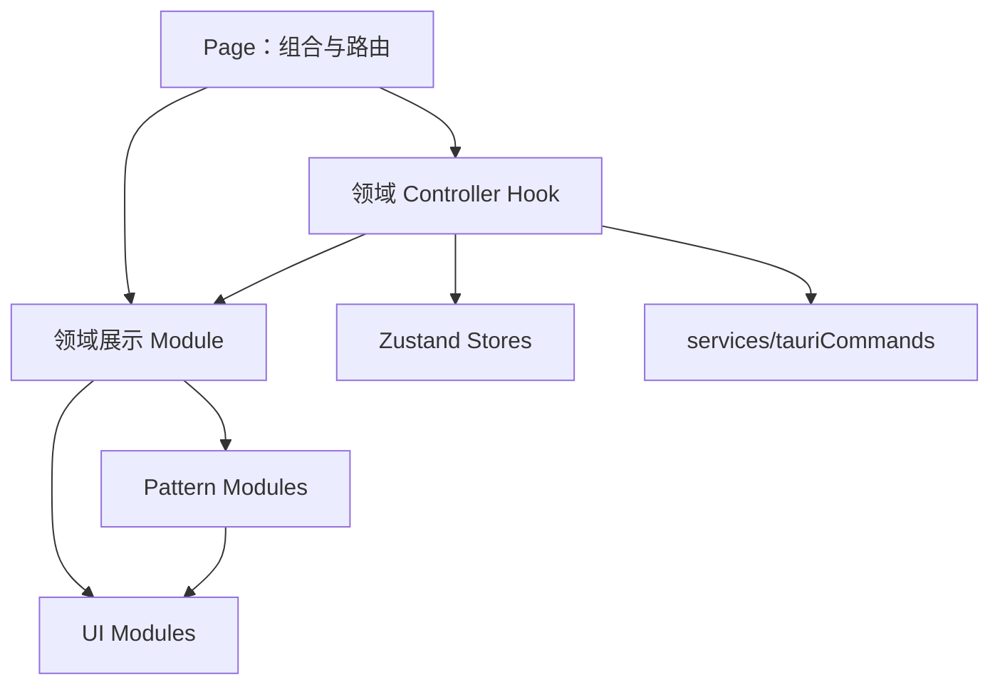

# easyT UI Kit 需求与架构共识文档

## 0. 文档控制

| 字段 | 值 |
|---|---|
| 状态 | Approved |
| 版本 | 1.0 |
| 最后更新 | 2026-08-11 |
| 适用项目 | easyT 2.x 前端 |
| canonical 路径 | `docs/UI-Kit需求与架构共识文档.md` |
| 决策来源 | 项目所有者与架构评审对话 |
| 实施状态 | 尚未实施 |

### 0.1 修订历史

| 版本 | 日期 | 摘要 |
|---|---|---|
| 1.0 | 2026-08-11 | 固定 easyT 内部 UI Kit、视觉语言、module interface、迁移与治理规则 |

> 本文是 easyT UI Kit 的唯一规范来源。本次工作只固化文档与 Agent 约束，不包含 React、CSS、依赖、测试或功能代码变更。

## 1. 目标

建立只服务 easyT 的内部 UI Kit，统一现有和未来页面的视觉语言、交互行为、无障碍、目录结构与测试 seam。

必须达到：

- 保留当前 easyT 暖灰、蓝灰、紧凑桌面视觉风格。
- 现有全部前端页面与 UI module 迁移到正式 UI Kit，不保留新旧双轨。
- 基础 UI 行为集中实现，页面不重复实现控件、弹窗、状态提示和表单关联。
- UI Kit 保持小体积、低常驻开销和零新增 UI dependency。
- 页面、领域 controller、领域展示 module、patterns 与 ui 的依赖方向清晰。
- Agent 后续修改前端时必须先读取并遵守本文。

## 2. 非目标

- 不拆分独立 npm package 或 workspace。
- 不跨项目发布或维护独立语义版本。
- 不引入 Storybook、Playwright、Chromatic、CSS-in-JS、CSS Modules 或大型 UI 框架。
- 不实施 dark theme；只保留未来通过 CSS Variables 覆盖的结构。
- 不建设移动端导航、触摸手势或通用响应式设计系统。
- 不建设 JSON 驱动的万能表单系统。
- 不把所有 HTML 元素包装成 React module。
- 不在本次重构中改变业务功能、翻译流程、缓存规则或 Tauri Command。
- 不进行视觉改版。

## 3. canonical 术语

**easyT 视觉语言**  
easyT 当前采用的暖灰背景、白色面板、蓝灰 accent、柔和边框、克制状态色、紧凑桌面密度和阅读优先排版。后续前端默认遵循该视觉语言。

**内部 UI Kit**  
只供 easyT 使用的基础 UI module、共享 pattern、设计令牌和使用规则。它不是独立发布的组件包。

**UI module**  
位于 `components/ui`、无业务含义、隐藏控件行为与视觉 recipe 的 module。

**Pattern module**  
至少被两个业务区域真实复用，或隐藏确认、状态播报等复杂交互的组合 module。

**领域 module**  
只服务翻译或设置领域、允许依赖领域类型但通过受控 interface 展示的 module。

**Controller hook**  
领域目录内负责读取 store、调用统一 service、管理异步状态并向展示 module 提供小 interface 的 hook。

**Seam**  
其他目录接入一个 module 集合的统一位置。本设计中，各目录的 `index.ts` 是公开 seam；内部 implementation 不直接暴露。

**视觉等价重构**  
保持视觉气质、页面布局、字号层级和业务行为，只允许修复不一致、溢出、状态缺失和无障碍问题。

## 4. 视觉语言

### 4.1 风格原则

- 暖灰页面背景与白色内容 surface。
- 深灰正文、低对比辅助文字。
- 蓝灰 accent，避免高饱和品牌色。
- 细边框、适度圆角和单一柔和阴影。
- 紧凑的小尺寸桌面控件。
- 状态反馈克制，不使用大面积高饱和色块。
- 系统字体优先，强调长文本阅读。
- 普通内容面板默认使用背景和边框，不滥用 elevation。
- 后续视觉改版必须作为独立需求修订本文，不能在业务功能中顺手完成。

### 4.2 颜色令牌

`src/styles/tokens.css` 是实际令牌值的唯一来源。Tailwind 配置只将语义名称映射到 CSS Variables。

| Token | 基准值 | 语义 |
|---|---|---|
| `surface` | `#f6f5f2` | 页面背景 |
| `surface-soft` | `#efece6` | 次级背景 |
| `surface-panel` | `#ffffff` | 面板与 Dialog |
| `ink` | `#2f3136` | 主正文 |
| `ink-soft` | `#595c63` | 次级正文 |
| `ink-muted` | `#8a8d94` | hint 与弱信息 |
| `line` | `#e3ded5` | 边框与分隔 |
| `accent` | `#5a7d8c` | 主要操作与焦点 |
| `danger` | `#b6553c` | 错误与破坏性操作 |
| `success` | `#4f7a52` | 成功状态 |
| `warning` | `#8a5a20` | 警告状态 |

实现时颜色变量使用 RGB channel 形式，以支持 Tailwind alpha modifier；本文十六进制值是视觉基准。

规则：

- 页面和领域 module 不得新增十六进制、rgb/hsl 实际色值。
- tone 的透明背景由对应语义 token 派生。
- 遮罩等 UI implementation 特有颜色可以封装在该 UI module 内，不得散落到页面。
- `warning` 是新补齐令牌；当前源码使用该名称但旧 Tailwind 配置未定义。
- 当前只定义 light theme。

### 4.3 圆角与阴影

| Token | 值 | 用途 |
|---|---:|---|
| `radius-compact` | 6px | kbd、路径、小状态块 |
| `radius-control` | 8px | 控件和 StatusBanner |
| `radius-surface` | 12px | Dialog、主要 surface |
| `shadow-soft` | `0 6px 24px -8px rgba(60,55,45,.18)` | 浮层 |

- Switch、圆点等继续使用 `rounded-full`。
- shadow-soft 只用于浮层或明确高于页面的 surface。
- 不建设多档 elevation 系统。

### 4.4 排版

| 语义 | 字号/字重 | 用途 |
|---|---|---|
| page-title | 16px / 600 | Dialog 与重要标题 |
| body | 14px / 400 | 正文和表单 |
| label | 14px / 500 | 字段标签、设置项标题 |
| translation | 15px / 400 | 完整译文与未完成译文 |
| caption | 12px / 400 | hint、状态、字数 |
| caption-strong | 12px / 500 | 小标题、原文/译文标签 |

- 保留现有 system-ui、Segoe UI、Microsoft YaHei 等系统字体栈。
- 译文保持舒适行高。
- 不新增品牌字体文件。
- 页面不得新增任意 `text-[Npx]`；新增语义层级必须先修订本文。
- 排版 recipe 由 UI 或领域 module implementation 管理，不要求全部成为 CSS Variable。

### 4.5 密度与图标

| 项目 | 固定值 |
|---|---:|
| Button sm | 32px 高 |
| Button md | 36px 高 |
| IconButton sm | 32×32px |
| IconButton md | 36×36px |
| Input/Select | 最小 36px 高 |
| Textarea | 最小 80px |
| Switch | 36×20px；滑块 16px |
| 普通操作图标 | 16px |
| 主要状态图标 | 20px |
| 页面紧凑内边距 | 12px |
| 设置页内容内边距 | 16px |
| 常规间距 | 8–12px |

- 继续使用 Tailwind 默认间距刻度，不令牌化每一个像素。
- 图标统一使用 Lucide 具名导入，禁止整包导入。
- 最小空间不足时换行、折叠或滚动，不继续压缩字体和控件。
- Logo 与品牌图片不属于图标系统。

## 5. 目标目录与 seam

```text
src/
├── index.css
├── styles/
│   ├── tokens.css
│   └── base.css
└── components/
    ├── ui/
    │   ├── index.ts
    │   ├── Button.tsx
    │   ├── IconButton.tsx
    │   ├── Input.tsx
    │   ├── Textarea.tsx
    │   ├── Select.tsx
    │   ├── Switch.tsx
    │   ├── FormField.tsx
    │   ├── Dialog.tsx
    │   └── Spinner.tsx
    ├── patterns/
    │   ├── index.ts
    │   ├── StatusBanner.tsx
    │   └── ConfirmDialog.tsx
    ├── translation/
    │   ├── index.ts
    │   ├── useTranslationController.ts
    │   ├── CacheNotice.tsx
    │   ├── ErrorState.tsx
    │   ├── LoadingState.tsx
    │   ├── MarkdownTranslation.tsx
    │   ├── MarkdownTranslation.css
    │   ├── OriginalTextPanel.tsx
    │   ├── TranslationHeader.tsx
    │   └── TranslationPanel.tsx
    └── settings/
        ├── index.ts
        ├── useSettingsController.ts
        ├── useCacheDetailsController.ts
        ├── CacheDetailsDialog.tsx
        ├── ShortcutInput.tsx
        ├── OfficialApiPanel.tsx
        ├── WebGatewayPanel.tsx
        ├── SettingsHeader.tsx
        └── SettingsRow.tsx
```

文件名可以在实施时因已验证的职责做非行为调整，但四层 seam、依赖方向和 module 归属不得改变。

### 5.1 归属规则

- 无业务含义且隐藏通用控件行为：`ui/`。
- 两个以上领域真实复用，或隐藏通用复杂交互：`patterns/`。
- 翻译状态、原文、译文、缓存来源：`translation/`。
- 配置、Qwen 登录、快捷键、缓存管理：`settings/`。
- `patterns/` 不是“不知道放哪里”的收容目录。
- 只包装一个 div、className 或布局的浅 module 不得创建。

### 5.2 import 规则

- 每层 `index.ts` 是该层公开 seam。
- 跨目录必须从以下路径导入：
  - `@/components/ui`
  - `@/components/patterns`
  - `@/components/translation`
  - `@/components/settings`
- 同目录 implementation 可使用相对路径。
- 不创建 `@/components` 根级大 barrel。
- seam 只导出调用方需要的 module 与公共类型。
- 内部 class map、context、controller 私有状态和工具不导出。
- 不通过深层路径绕开 seam 解决循环依赖；必须修正依赖方向。
- 测试与 implementation 共置。

## 6. 依赖方向与状态所有权



### 6.1 UI 与 patterns

必须：

- 完全受控或遵守标准原生受控/非受控 interface。
- 不读取 Zustand。
- 不调用 Tauri Command 或原始 invoke。
- 不依赖 AppConfig、翻译状态、Qwen 或缓存类型。
- 只通过 props 接收状态与回调。

### 6.2 领域 module

可以依赖领域类型，但展示 module 通过 props 接收数据和动作。复杂异步行为进入同领域 controller hook。

Controller hook 可以：

- 读取 Zustand selector。
- 调用 `services/tauriCommands`。
- 管理 loading/error/pending。
- 向展示 module 返回小型状态与动作 interface。

不得：

- 在展示 module 内散落原始 invoke。
- 在 page 中重新展开 controller 的完整异步流程。
- 为每个 UI module 创建 Zustand store。
- 在 UI Kit 中加入供应商或翻译条件分支。

### 6.3 页面职责

- `TranslationPage`：组合 translation controller 与 translation modules。
- `SettingsPage`：组合 settings controller 与 settings modules。
- `App`：页面切换、全局事件和跨页面协调。
- pages 不再内嵌 OfficialApiPanel、WebGatewayPanel 等大型 implementation。
- Tauri Command 统一从 `services/tauriCommands` 进入。

## 7. CSS 归属

目标：

```text
src/index.css
  → 导入顺序与 Tailwind layers

src/styles/tokens.css
  → 实际设计令牌

src/styles/base.css
  → html/body/root、系统字体、滚动条、reduced-motion

components/translation/MarkdownTranslation.css
  → Markdown、代码块、KaTeX 嵌套内容样式
```

规则：

- Button、Input 等 Tailwind recipe 与 variant class map和 implementation 共置。
- 删除全局 `.btn`、`.btn-primary`、`.input` 等控件 recipe。
- 页面不能依赖隐藏的全局 class 才获得 UI Kit 外观。
- Markdown 子元素选择器跟随 MarkdownTranslation。
- 不引入 CSS Modules、CSS-in-JS 或新构建插件。
- Tailwind content scanning 与 production purge 行为保持。
- `className` 只作为外部布局逃生口，不得覆盖 UI module 的颜色、圆角、字号、边框、hover、focus 或 disabled。

## 8. 第一版 UI Kit interface

### 8.1 通用 interface 规则

- 使用 TypeScript union、class map 与现有 `cn()`。
- 不重新引入 `class-variance-authority`。
- 透传适用的原生元素属性与 ref。
- 不使用大量 boolean props 构造万能 module。
- 新增 variant 必须表达稳定语义，不能使用页面名、临时颜色或单次需求命名。
- 不提供任意颜色、任意尺寸字符串或绕过类型的 props。

### 8.2 Button

```text
variant: primary | outline | ghost | danger
size: sm | md
loading?: boolean
loadingLabel?: string
```

- loading 时自动 disabled、显示 Spinner、设置 aria-busy。
- 图标作为 children 组合，不增加 leftIcon/rightIcon。
- 不提供 asChild 或链接按钮。

### 8.3 IconButton

```text
variant: ghost | outline | danger
size: sm | md
label: string
pressed?: boolean
loading?: boolean
```

- label 必填，用于 aria-label 和默认 title。
- 只允许一个图标作为可见内容。
- pressed 用于固定窗口等 toggle。
- 标题栏统一使用 sm。
- 页面不得覆盖尺寸或 tone。

### 8.4 Input、Textarea、Select、Switch

- Input、Textarea、Select 透传相应原生属性和 ref。
- Select 固定使用原生 `select`，不实现自定义菜单。
- Textarea 统一 focus、invalid、disabled、resize 与最小高度；业务决定 rows/maxLength。
- Switch 使用 button + role=switch，支持 checked、disabled、aria。
- 控件可脱离 FormField 独立使用。
- 不提供多种密度。

### 8.5 FormField

推荐组合：

```tsx
<FormField label="..." hint="..." error="..." required>
  <Input />
</FormField>
```

implementation：

- 使用 `useId()` 生成 control、hint、error ID。
- 通过内部 context 为直接子控件提供 id、aria-describedby、aria-invalid、aria-required。
- 安全合并调用方显式原生属性，不得丢失错误说明关联。
- 不保存输入值，不绑定表单库。
- error 与必要 hint 可以同时关联；视觉上 error 优先。
- context 不从 ui seam 单独导出。

### 8.6 Dialog

使用原生 `HTMLDialogElement`：

```text
open
onOpenChange
title / titleId
description / descriptionId
initialFocusRef?
children
```

- 使用 `showModal()`。
- 使用原生 cancel 事件处理 Escape。
- 统一 aria-labelledby、aria-describedby。
- 打开后聚焦指定控件，关闭后恢复触发按钮。
- 统一 backdrop、viewport 最大高度和内部滚动。
- 测试环境提供最小 showModal/close polyfill。
- 禁止业务页面自行实现 fixed overlay 与 focus trap。
- 不允许同时打开嵌套 Dialog；确认流程顺序呈现。
- 不引入 Radix、Headless UI 等依赖。

### 8.7 Spinner

```text
size: sm | md
label?: string
```

- 无 label 时作为装饰并 aria-hidden。
- 有 label 时提供可访问 loading 文本。
- tone 继承当前文本语义，不接受任意颜色。

### 8.8 StatusBanner

```text
tone: info | success | warning | danger
title?: ReactNode
description: ReactNode
action?: ReactNode
announcement: off | polite | assertive
```

- tone 只决定图标和视觉 recipe。
- announcement 独立决定静态、polite 或 assertive 播报。
- 自动使用标准 Lucide 状态图标。
- 最多一个 action 区域。
- 缓存提示：info + polite。
- Qwen 实验说明：warning + off。
- 重新翻译失败：danger + assertive。
- 不知道错误类型、缓存状态或 Qwen 业务。

### 8.9 ConfirmDialog

```text
title
description
confirmLabel
cancelLabel
tone: default | danger
pending
onConfirm
onCancel
```

- 组合 Dialog 与 Button。
- 缓存清除、缓存重建、Qwen 退出登录统一使用。
- pending 时阻止重复确认并显示进行中。
- 不接受任意 JSX footer。
- 只负责确认交互，不执行 Tauri Command。
- 删除 `window.confirm` 和业务私有确认弹窗。

## 9. 领域迁移映射

| 当前 module/位置 | 目标 |
|---|---|
| `components/ui/Button` | 完善后成为正式 `ui/Button` |
| `components/ui/Input` | 完善后成为正式 `ui/Input` |
| `components/ui/Switch` | 完善后成为正式 `ui/Switch` |
| `components/ui/Field` | 迁移为 `ui/FormField` |
| `components/CacheNotice` | `translation/CacheNotice`，内部组合 StatusBanner |
| `components/ErrorState` | `translation/ErrorState` |
| `components/LoadingState` | `translation/LoadingState` |
| `components/MarkdownTranslation` | `translation/MarkdownTranslation` 与共置 CSS |
| `components/OriginalTextPanel` | `translation/OriginalTextPanel` |
| `components/TranslationHeader` | `translation/TranslationHeader` |
| `components/TranslationPanel` | `translation/TranslationPanel` |
| `components/ShortcutInput` | `settings/ShortcutInput` |
| `components/CacheDetailsDialog` | `settings/CacheDetailsDialog` |
| SettingsPage 内 OfficialApiPanel | `settings/OfficialApiPanel` |
| SettingsPage 内 WebGatewayPanel | `settings/WebGatewayPanel` |
| 设置标题栏 | `settings/SettingsHeader` |
| 重复设置项结构 | `settings/SettingsRow` |
| 页面/领域状态提示 | 组合 `patterns/StatusBanner` |
| 所有破坏性确认 | 组合 `patterns/ConfirmDialog` |

迁移后：

- `components/` 根目录不散放业务 module。
- 所有现有页面使用正式 UI Kit。
- 不保留旧路径 alias 或 wrapper。
- 原生 div、p、列表和语义布局可直接使用，不强制包装。

## 10. 无障碍底线

- 所有交互可仅用键盘完成。
- 统一 focus-visible；键盘焦点必须可见。
- IconButton 必须有可访问名称。
- FormField 自动关联 label/hint/error。
- invalid 同时使用文字和 aria-invalid，不能只改变颜色。
- Dialog/ConfirmDialog 管理 Escape、焦点进入与恢复。
- loading 使用 aria-busy 或可读状态文字。
- StatusBanner 根据 announcement 使用合适 live region/role。
- 正文和控件文字以 WCAG AA 对比度为目标；现有 token 不足时允许最小修正并记录。
- 尊重 `prefers-reduced-motion`，关闭非必要 pulse、旋转和位移；loading 仍提供静态文字。
- 保持紧凑桌面风格，普通控件最小高度 32px。
- 采用行为测试和人工检查，不宣称正式无障碍认证。

## 11. 窗口适配

支持 Tauri 主窗口实际范围：

- 默认：520×390。
- 最小：360×200。
- 最大：900×700。
- resizable：true。

规则：

- 默认截图基线使用 520×390。
- 额外验证 360×200 最小窗口。
- 标题栏固定，页面主体独立滚动。
- Dialog 高度受 viewport 限制，内容过高时内部滚动。
- 设置页窄窗口单列，空间足够才两列。
- 长译文和缓存路径可换行或局部滚动，不撑破窗口。
- 大窗口使用合理 max-width，不盲目拉伸。
- 不建设移动端断点体系。
- Tauri drag region、标题栏按钮点击和自动隐藏抑制行为必须保持。
- 高 DPI 由 WebView2/CSS pixel 处理；截图固定 Windows 缩放条件。

## 12. 视觉回归

第一阶段采用人工固定截图基线 + 自动行为测试，不新增视觉测试依赖。

基线目录：

`docs/ui-kit/baselines/`

必须覆盖：

1. 翻译页 idle。
2. 翻译中与流式输出。
3. 翻译成功和缓存提示。
4. 普通错误和重新翻译失败。
5. 设置页 Official API。
6. 设置页 Qwen。
7. 缓存详情。
8. 破坏性 ConfirmDialog。
9. 默认 520×390。
10. 最小 360×200 的关键页面。

迁移前后按相同 Windows 缩放、窗口尺寸、主题和测试数据截图。差异仅允许来自已批准的一致性、布局和无障碍修复，并在交付报告中记录。

## 13. 测试规则

测试公开 interface 的可观察行为，不测试内部 class map。

- Button/IconButton：点击、disabled、loading、原生属性、ref、可访问名称。
- Input/Select/Textarea/Switch：label、键盘、invalid、disabled、ref。
- FormField：ID 与 aria-describedby/invalid/required 合并。
- Dialog：打开、Escape、初始焦点、焦点恢复和卸载清理。
- ConfirmDialog：确认、取消、danger 语义和 pending 防重复。
- StatusBanner：role/live、标题、description 与 action。
- 领域 module：使用假的 controller interface，测试业务展示，不 mock UI Kit implementation。
- 不用大段 JSX snapshot 代替行为测试。
- 少量 recipe 测试可以验证稳定 variant，但不逐条断言 Tailwind class。
- 新 interface 覆盖旧行为后删除旧浅测试。
- 迁移期间持续运行翻译、缓存、设置和 App 回归测试。

必须执行：

```powershell
npm run typecheck
npm test
npm run build
cargo test --manifest-path src-tauri/Cargo.toml
cargo build --release --manifest-path src-tauri/Cargo.toml
```

实施完成时还应运行仓库已有的格式和 lint 检查；不存在的 npm lint 脚本不得伪造。

## 14. 轻量化预算

- 不新增 UI runtime dependency。
- 不新增 Storybook、Playwright、CSS-in-JS 等 dev dependency。
- UI module 不各自注册永久 window/document listener。
- Dialog 等行为只在打开期间注册并在关闭/卸载时清理。
- 不为每个 module 创建 store。
- Lucide 只具名导入。
- 记录 production JS/CSS gzip 前后大小。
- JS gzip 增长超过 10 KiB或 CSS gzip 增长超过 5 KiB时必须解释并审查；该阈值不是自动失败。
- Release 安装包不得因 UI Kit 引入明显新资源或 runtime。
- 不增加常驻后台任务、定时器或跨页面订阅。

## 15. 六阶段迁移

### 阶段 1：视觉基础

- 建立 tokens、base 与 Tailwind CSS Variable 映射。
- 保留当前视觉值。
- 修复 warning token 缺失。
- 页面仍可按旧结构运行。

完成条件：typecheck/test/build 通过；基线色值未改变。

### 阶段 2：基础 UI module

- 完善 Button、Input、Switch。
- 新增 IconButton、Textarea、Select、FormField、Dialog、Spinner。
- 先完成 interface 行为测试。

完成条件：UI interface 测试通过；业务页面行为未改变。

### 阶段 3：共享 patterns

- 新增 StatusBanner、ConfirmDialog。
- 迁移状态提示和所有破坏性确认。
- 删除 window.confirm 和业务私有 overlay。

完成条件：状态与确认行为测试通过；视觉保持。

### 阶段 4：翻译领域

- 移动翻译 module。
- 提取 translation controller。
- 迁移标题栏、手动输入、状态、译文、缓存提示。
- 共置 Markdown CSS。

完成条件：latest-wins、流式、缓存提示、复制和错误回归通过。

### 阶段 5：设置领域

- 提取 settings/cache controller。
- 拆分 Official API、Qwen、缓存、设置行和 header。
- 迁移全部 FormField、Switch、Dialog 和状态提示。

完成条件：配置保存、测试连接、登录、注销、缓存详情/清除回归通过。

### 阶段 6：清理与验收

- 删除旧路径、旧全局 recipe、重复 class、旧浅测试和临时兼容代码。
- 完成默认/最小窗口截图对比。
- 完成全量测试、release build 和 bundle 记录。

完成条件：第 17 节 Definition of Done 全部满足。

每阶段必须保持测试和构建可用；不得跨阶段累积已知回归。

## 16. 后续治理

- UI Kit 不单独版本化，与 easyT 发布。
- 本文记录修订历史。
- 修改公开 interface 时在同一变更迁移所有调用方，不长期保留 deprecated wrapper。
- 修改 token、字号、密度或 recipe 时更新本文与截图基线。
- 新增基础 UI module必须满足至少一项：
  - 两个以上领域真实复用。
  - 隐藏焦点、键盘、ARIA、异步状态等明显复杂行为。
- 只减少 className 不是创建 module 的充分理由。
- 不为未来假设提前创建 module。
- 新增 UI dependency 必须单独评估并获项目所有者批准。
- 发现循环依赖时修正 seam 和依赖方向，不绕过。
- 批准的行为/视觉变化必须与文档同步。

## 17. Definition of Done

全部满足才算完成：

- [ ] `components/` 根目录只保留四个正式目录。
- [ ] 现有全部前端页面与领域 module 使用 UI Kit。
- [ ] pages/领域 module 不直接实现原生 button/input/select/textarea；这些交互元素由 UI module implementation 拥有。
- [ ] 不存在 window.confirm 或业务私有 fixed-overlay Dialog。
- [ ] 不存在全局 .btn/.input 控件 recipe。
- [ ] 除 tokens、必要遮罩和第三方 KaTeX CSS 外无新增实际颜色值。
- [ ] 跨目录 import 通过对应 index.ts seam。
- [ ] ui/patterns 不依赖 Zustand、Tauri Command、AppConfig 或领域类型。
- [ ] 原始 invoke 只存在于统一 service 层。
- [ ] TranslationPage、SettingsPage、App 及现有业务行为保持。
- [ ] 默认与最小窗口截图符合视觉基线。
- [ ] 差异只来自批准的一致性、布局和无障碍修复。
- [ ] UI interface、领域回归、typecheck、前端 build、Rust test 和 release build 通过。
- [ ] JS/CSS bundle 变化符合预算或有批准说明。
- [ ] 旧路径、旧 recipe、旧浅测试和临时兼容代码已删除。
- [ ] 最终报告包含迁移映射、验证证据、视觉差异、体积变化和任何偏差。

## 18. Agent 执行清单

任何 Agent 修改前端页面、UI module 或前端样式前必须：

1. 完整阅读本文。
2. 检查现有 UI/pattern/领域 seam。
3. 优先复用正式 UI Kit。
4. 判断缺失能力应扩展 UI Kit 还是留在单一领域。
5. 不创建浅包装，不复制已有控件行为。
6. 不写实际颜色或私有 Dialog/Confirm。
7. 不新增 UI dependency，除非明确批准。
8. 补充 interface 行为测试。
9. 核对默认与最小窗口。
10. 报告视觉与 bundle 变化。

如果需求与本文冲突，Agent 必须停止受影响部分、给出代码与文档证据，并请求项目所有者决定；不得静默偏离。

