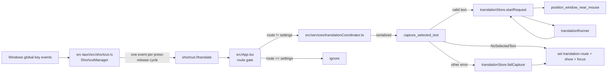
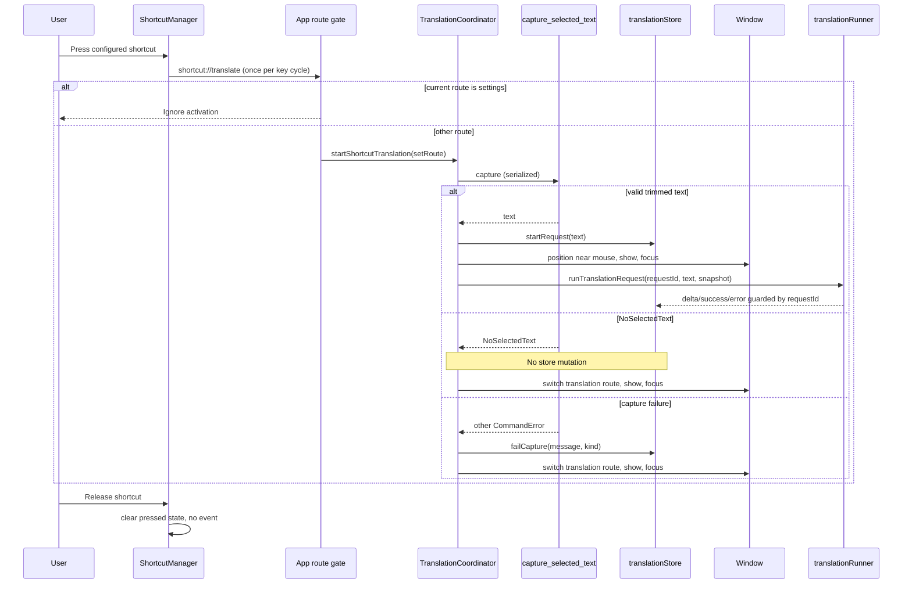
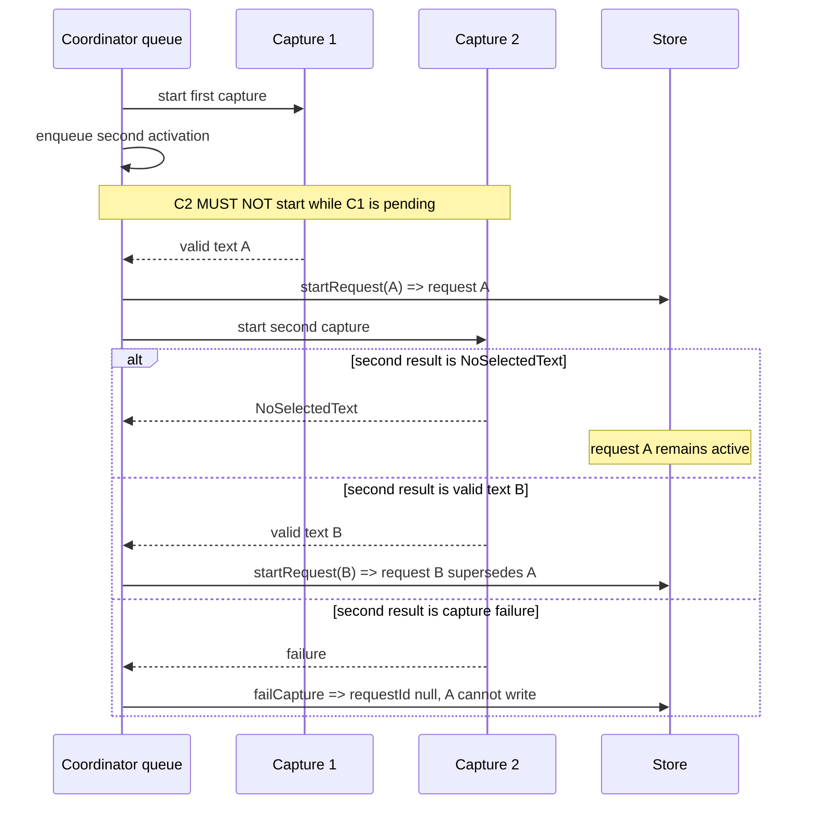

# 无选区快捷键显示恢复 Software Design Document

## 0. 文档控制

| 字段 | 值 |
|---|---|
| 状态 | Approved |
| 版本 | 0.2 |
| 文档配置 | Full SDD（聚焦范围）；改动跨 Rust 全局按键状态、前端异步捕获、窗口路由和翻译状态并发契约 |
| 最后更新 | 2026-08-06 |
| 目标项目 | easyT Windows 桌面翻译应用 |
| 预期实施者 | Model-neutral coding agent |
| 相关需求 | FR-001 至 FR-010；NFR-001 至 NFR-006 |
| 代码版本 | `716e9ae08ca6b00d2cbf00b61e18b26a74774813`（预实现基线；工作区仅有本次设计会话对 `CONTEXT.md` 的术语更新） |
| 文档路径 | `SDD-shortcut-no-selection-window-restore.md` |

### 0.1 修订历史

| 版本 | 日期 | 摘要 |
|---|---|---|
| 0.2 | 2026-08-06 | 用户明确评审决定批准实施，状态改为 Approved |
| 0.1 | 2026-08-06 | 根据需求澄清会话创建预实现设计和执行协议 |

> 本文档是预实现设计。只有明确的评审决定才能将状态改为 `Approved`；在此之前，编码代理 MUST NOT 开始业务代码实施。

## 1. 执行摘要

easyT 当前把可配置的全局翻译快捷键（默认 `Ctrl+T`）始终解释为新的快捷翻译尝试：前端在选区捕获完成前清空现有译文，捕获返回 `NoSelectedText` 后再展示错误。目标行为是让同一快捷键具备双重语义：捕获到有效外部选区时继续快捷翻译；确认“无选区”时执行“显示恢复”，即切到翻译界面、显示并聚焦窗口，同时完整保留当前翻译状态。

设计将“快捷键激活/选区捕获”与“翻译请求”分开。捕获期间不创建请求、不改变可见状态；只有有效原文才能创建新翻译请求。Rust 快捷键层保证每次按下到释放周期只发出一次激活，前端协调层继续串行访问剪贴板，并以有效原文创建时间实现翻译请求 latest-wins。

## 2. 范围

### 2.1 目标

- 将当前配置的全局翻译快捷键扩展为“有选区翻译、无选区显示恢复”。
- 无选区显示恢复 MUST 保留成功、错误、未完成、进行中和空闲状态。
- 捕获到有效原文后 MUST 立即建立新的可见翻译请求并清除旧译文。
- 快捷键长按 MUST 每个按下到释放周期最多激活一次。
- 多次选区捕获 MUST 串行操作剪贴板；多次有效原文 MUST 由较新的翻译请求拥有可见状态。
- 更新直接描述快捷键行为的界面文案和 README。

### 2.2 非目标

- 不持久化翻译结果；应用完全退出后仍回到初始未翻译界面。
- 不修改托盘左键行为、托盘菜单行为或窗口启动行为。
- 不修改现有剪贴板保存/恢复能力、350 ms 捕获等待、模拟 `Ctrl+C` 或空白裁剪规则。
- 不新增窗口取消最小化、可见性切换、特殊常驻时长或自动固定行为。
- 不修改固定窗口、自动隐藏、窗口尺寸保存、鼠标附近定位算法。
- 不重新设计 `idle` 页面或手动输入区域。
- 不修改快捷键录制器支持的键位集合或快捷键配置格式。
- 不为捕获故障新增“重新捕获”按钮。
- 不修改翻译后端、翻译协议、流式输出或一次性输出行为。

### 2.3 假设与约束

| ID | 类型 | 陈述 | 若不成立的影响 |
|---|---|---|---|
| ASM-001 | 已确认决策 | “无选区”仅指快捷键选区捕获返回 `NoSelectedText`；其他入口的空文本校验不触发显示恢复 | 必须重新设计错误路由和手动输入行为 |
| ASM-002 | 已确认决策 | 设置页处于当前路由时不响应全局翻译快捷键 | 需要设计未保存设置草稿的保存或放弃策略 |
| ASM-003 | 已确认决策 | 其余未特别说明的窗口、托盘、剪贴板和翻译行为沿用当前实现 | 范围会扩大并需要额外平台设计 |
| CON-001 | 仓库约束 | 项目当前只支持 Windows 10/11，选区捕获位于 Windows 平台实现 | 不设计跨平台捕获兼容层 |
| CON-002 | 数据约束 | 翻译状态是 Zustand 进程内状态，没有翻译历史存储 | 显示恢复只能恢复当前进程内状态 |
| CON-003 | 并发约束 | 选区捕获会临时操作系统剪贴板，物理捕获不得并行 | 激活必须进入单一捕获队列 |

## 3. 需求

### 3.1 功能需求

| ID | 需求 | 优先级 | 验收标准 |
|---|---|---|---|
| FR-001 | 当前配置的全局翻译快捷键 MUST 在非设置页触发一次后台选区捕获 | Must | Given 当前路由不是设置页，When 快捷键完成一次按下，Then 调用一次 `capture_selected_text`，且捕获返回前不显示窗口、不改变翻译状态 |
| FR-002 | 捕获到有效原文时 MUST 按现有快捷翻译行为创建新请求 | Must | Given 捕获返回 trim 后非空文本，When 处理结果，Then 新原文立即替换旧状态，窗口按既有规则定位、显示、聚焦并执行翻译 |
| FR-003 | 快捷键捕获返回 `NoSelectedText` 时 MUST 执行显示恢复 | Must | Given 任意现有翻译状态，When 捕获返回 `NoSelectedText`，Then 切到翻译界面、调用窗口 `show()` 和 `setFocus()`，且状态逐字段保持不变 |
| FR-004 | 非 `NoSelectedText` 捕获故障 MUST 取代旧翻译状态并显示错误 | Must | Given 已有译文，When 捕获返回 `ClipboardError` 或其他错误，Then 清除原文和译文、写入该错误、显示并聚焦翻译界面，且不提供重新捕获操作 |
| FR-005 | 设置页 MUST 忽略全局翻译快捷键 | Must | Given 当前路由为 `settings`，When 收到 `shortcut://translate`，Then 不捕获选区、不切换路由、不显示窗口、不改变翻译或设置状态 |
| FR-006 | 快捷键激活 MUST 按完整按键周期去重 | Must | Given 同一快捷键尚未释放，When 收到多个 `Pressed`，Then 只发出一次 `shortcut://translate`；When 收到 `Released` 后再次 `Pressed`，Then 可再次发出事件 |
| FR-007 | 多次选区捕获 MUST 串行执行，多个有效结果 MUST 由较新结果接管可见请求 | Must | Given 连续两个激活，Then 第二次底层捕获在第一次完成后开始；若两次均有效，第二次创建的新请求使第一次结果不能再覆盖可见状态 |
| FR-008 | 后续无选区 MUST NOT 使已有捕获或翻译请求失效 | Must | Given 第一次有效捕获或翻译仍在进行，When 后续捕获返回 `NoSelectedText`，Then 原请求继续并仍可更新可见状态 |
| FR-009 | 有效选区 MUST 沿用现有空白规则 | Must | 全空白返回 `NoSelectedText`；有效文本去除首尾空白，内部空白和换行保留 |
| FR-010 | 用户文案 MUST 描述快捷键双重行为 | Must | 空闲页、设置页提示和 README 明确说明“有选区时翻译，无选区时显示翻译窗口”，空闲页展示当前配置快捷键而非写死 `Ctrl+T` |

### 3.2 非功能需求

| ID | 类别 | 需求 | 度量/验证 |
|---|---|---|---|
| NFR-001 | 状态完整性 | 捕获结果确定前 MUST NOT 清空、替换或取消可见翻译状态 | 协调器自动化测试比较捕获前后完整 store 快照 |
| NFR-002 | 并发安全 | 任意时刻 MUST 最多有一个底层选区捕获调用在执行 | 延迟 Promise 测试证明第二次调用在第一次 settle 前未开始 |
| NFR-003 | 兼容性 | MUST 保持 `shortcut://translate` 事件名、Tauri 命令名、配置字段和错误序列化格式不变 | 类型检查、Rust 测试和差异审查 |
| NFR-004 | 可维护性 | 快捷键激活、捕获结果分类和翻译状态变化 MUST 有单一明确所有者，不得在 `App.tsx` 复制协调逻辑 | 模块审查；`App.tsx` 只做路由门控和事件转发 |
| NFR-005 | 可观测性 | 窗口定位/显示失败和捕获故障 MUST 沿用安全日志，不记录选区正文或译文 | 代码审查和手工触发检查 |
| NFR-006 | 回归质量 | 前端、Rust 测试、类型检查、Rust 格式检查和生产前端构建 MUST 通过 | 第 13.3 节命令退出码为 0 |

## 4. 当前系统事实

- `src-tauri/src/shortcut.rs::shortcut_handler` 在每个 `Pressed` 事件发出无负载的 `shortcut://translate`，没有按键释放状态去重。
- `src/App.tsx` 无条件把快捷键事件交给 `startShortcutTranslation(setRoute)`。
- `src/services/translationCoordinator.ts::startShortcutTranslation` 在捕获前切到翻译页、生成 request ID、快照配置并调用 `beginCapture`。
- `src/stores/translationStore.ts::beginCapture` 立即清除原文、译文和错误并进入 `capturing`，这是无选区无法保留旧结果的直接原因。
- `src/services/translationCoordinator.ts::captureForRequest` 在选区结果未知时先调用 `positionWindowNearMouse`；捕获失败会显示窗口并写入错误。
- `src-tauri/src/commands/selection.rs::capture_selected_text` 将捕获文本 `trim()`；空值或全空白映射为 `AppError::NoSelectedText`。
- `src-tauri/src/platform/windows.rs::capture_selection` 保存文本剪贴板、清空、模拟 `Ctrl+C`、最多等待 350 ms，并尽量恢复原文本。本文档不改变此行为。
- `src/stores/translationStore.ts` 通过 `requestId` 隔离旧翻译增量和结果；`startRequest` 创建新 ID 并清除旧译文。
- `src-tauri/src/commands/translate.rs::TranslationRequestManager` 已实现新翻译请求取消旧后端请求。
- `src-tauri/src/lib.rs` 中托盘菜单“显示翻译窗口”会发出 `tray://show` 并显示/聚焦；托盘左键只显示/聚焦当前路由。本文档不修改二者。
- `src/App.tsx` 的失焦处理根据 `pinned` 和 `autoHide` 隐藏窗口。本文档不改变该生命周期。
- 当前基线验证：`npm test` 为 4 个文件、12 项测试通过；`npm run typecheck` 通过；`npm run build` 通过；`cargo test` 为 90 项测试通过；`cargo fmt --check` 通过。

## 5. 提议设计

### 5.1 设计原则

1. 选区捕获不是翻译请求。捕获结果确定前，不占用 `translationStore.requestId`，不进入可见 `capturing` 状态。
2. `NoSelectedText` 是控制流结果：它触发显示恢复，不是快捷键路径中的用户可见错误。
3. 有效原文是创建翻译请求的唯一捕获结果；创建时立即通过现有 `startRequest(text)` 接管可见状态。
4. 捕获故障属于当前可见尝试，但不伪造空原文翻译请求；store 提供专用 `failCapture` 状态转换。
5. Rust 管理物理按键周期，前端管理业务激活和异步捕获；两层不得互相复制职责。

### 5.2 模块和边界



边界规则：

- `shortcut.rs` MUST NOT 判断选区或操作翻译状态。
- `App.tsx` MUST NOT 判断 Tauri 命令错误；它只根据当前路由决定是否转发激活。
- `translationCoordinator.ts` MUST 是快捷键捕获队列、结果分类、窗口显示和翻译启动的所有者。
- `translationStore.ts` MUST 只提供原子状态转换，不调用 Tauri API。
- `translationRunner.ts`、Rust 翻译命令、托盘模块和 Windows 捕获实现 MUST 保持行为不变。

### 5.3 决策与权衡

| ID | 决策 | 理由 | 考虑过的替代方案 | 后果 |
|---|---|---|---|---|
| DEC-001 | 捕获完成前保留当前翻译状态 | 无选区必须无损显示上次结果，也避免捕获期间闪烁 | 继续使用 `capturing` 并备份/恢复旧状态 | 快捷键捕获期间不再展示“正在获取选中文本” |
| DEC-002 | `NoSelectedText` 不创建请求 | 它没有原文，不符合“翻译请求”的领域定义 | 创建空 request 后恢复旧状态 | 协调器必须按错误种类分支 |
| DEC-003 | 非无选区捕获故障使用 `failCapture` | 故障必须使旧翻译结果失效，但不能伪造空文本翻译请求 | `startRequest("")` 后 `failRequest` | store 增加一个明确的状态转换 |
| DEC-004 | 物理捕获串行，翻译请求按有效结果 latest-wins | 保护剪贴板，同时允许用户快速切换选区 | 并行捕获；忽略后续激活 | 后续激活可能等待最多一个捕获周期 |
| DEC-005 | Rust 按当前快捷键的 Pressed/Released 周期去重 | 防止操作系统按键重复导致多次剪贴板捕获 | 前端时间防抖 | 需要在快捷键替换时清理按下状态 |
| DEC-006 | 设置页在 `App.tsx` 门控快捷键 | 避免打断设置与未保存草稿，且不污染协调器业务 | 协调器接收 route；设置页自动切回翻译页 | 必须测试事件在设置页被完全忽略 |

这些决策局限于本功能，易于通过后续代码修改逆转，不单独创建 ADR。

## 6. 详细组件设计

### 6.1 `ShortcutManager` 和 `shortcut_handler`

- **位置：** `src-tauri/src/shortcut.rs`
- **修改符号：** `ShortcutState`、`ShortcutManager`、`shortcut_handler`、`commit_replacement`，以及同文件测试模块
- **职责：** 只为当前注册快捷键的每个按下到释放周期发出一次激活事件
- **覆盖需求：** FR-006、NFR-003

#### 内部契约

建议采用以下等价契约；具体私有方法名 MAY 依邻近 Rust 风格微调，但行为不得变化：

```text
ShortcutManager::begin_press(shortcut: Shortcut) -> bool
ShortcutManager::end_press(shortcut: Shortcut) -> void
```

- `begin_press` 仅当 `shortcut == current_sc` 且该快捷键当前未处于按下状态时返回 `true` 并记录状态。
- 重复 `Pressed` 返回 `false`，不得 emit。
- `Released` 仅清理对应当前按键状态，不 emit。
- `commit_replacement` MUST 清除旧的按下状态，防止快捷键替换后永久抑制新快捷键。
- 已登记为 stale 的旧快捷键回调 MUST NOT 发出翻译事件。
- 事件名和 payload MUST 保持 `shortcut://translate` 与 `()` 不变。

### 6.2 快捷键路由门控

- **位置：** `src/App.tsx`
- **修改符号：** `App` 内的 route 跟踪和 `shortcut://translate` listener
- **职责：** 设置页忽略激活，其余路由转发给协调器
- **覆盖需求：** FR-001、FR-005、NFR-004

#### 契约

- listener MUST 能读取最新 route，不能因 effect 的陈旧闭包误判。
- SHOULD 使用同步 route ref 或等价的稳定读取方式，避免 route 改变时反复注销/注册全局事件监听。
- `route === "settings"` 时 MUST 在调用协调器之前直接返回。
- 不得在该 listener 中调用 `setRoute("translation")`；显示路由由协调器在捕获结果确定后处理。

### 6.3 快捷键翻译协调器

- **位置：** `src/services/translationCoordinator.ts`
- **修改符号：** `startShortcutTranslation`、捕获队列、窗口辅助函数；删除或替换 request-bound 捕获辅助逻辑
- **职责：** 串行捕获，分类捕获结果，按结果执行翻译、显示恢复或故障展示
- **覆盖需求：** FR-001 至 FR-004、FR-007、FR-008、NFR-001、NFR-002、NFR-004、NFR-005

#### 保持的入口契约

```text
startShortcutTranslation(setRoute: (route: "translation") => void): void
```

- 保持同步 `void` 返回，事件 listener 不等待它。
- 每次调用 MUST 在进入捕获队列时固定一份 `useSettingsStore.getState().config` 浅拷贝，保持当前“激活时配置快照”行为。
- 每次调用 MUST 追加到模块级 `captureQueue`，且前一捕获 reject 不得阻断后续捕获。
- 调用入口 MUST NOT 改 route、window 或 translation store。

#### 结果处理

**有效文本：**

1. 调用 `useTranslationStore.getState().startRequest(text)`；该时点立即清除旧译文并建立 request ID。
2. 调用 `setRoute("translation")`。
3. 按现有规则读取 `pinned` 并调用 `positionWindowNearMouse(pinned)`；定位失败只安全记录 warning，不阻断。
4. 调用窗口 `show()` 和 `setFocus()`；失败只安全记录 warning，翻译仍 MAY 在后台继续。
5. 调用 `runTranslationRequest(requestId, text, configSnapshot)`。
6. request ID 的现有隔离规则和 Rust 后端取消规则负责阻止旧翻译覆盖新请求。

**`NoSelectedText`：**

1. 不调用 `startRequest`、`failCapture`、`failRequest` 或 `reset`。
2. 不调用 `positionWindowNearMouse`。
3. 调用 `setRoute("translation")`、窗口 `show()`、窗口 `setFocus()`。
4. 不检查或替换活动 request ID；已有翻译继续运行并更新。

**其他捕获故障：**

1. 通过 `toCommandError` 归一化错误。
2. 调用 `translationStore.failCapture(err.message, err.kind)`，使旧请求后续更新失效。
3. 调用 `setRoute("translation")`、窗口 `show()`、窗口 `setFocus()`。
4. 不调用 `positionWindowNearMouse`，不自动重试，不记录选区或译文正文。

#### 并发不变量

- `captureQueue` 决定底层捕获启动顺序，任何时刻最多一个 `captureSelectedText()` pending。
- 不因新激活预先废弃旧捕获。第一次有效结果可以先启动翻译；第二次若为无选区则保持第一次请求，若为有效文本则通过新的 `startRequest` 接管。
- 捕获故障通过 `failCapture` 将 `requestId` 置为 `null`，使先前翻译的迟到更新无法写入。
- 后续 `NoSelectedText` 不写 store，因此不能取消、废弃或覆盖已有请求。

### 6.4 翻译状态存储

- **位置：** `src/stores/translationStore.ts`
- **修改符号：** `TranslationStore` 接口和状态转换
- **职责：** 为捕获故障提供原子、非翻译请求的错误状态转换
- **覆盖需求：** FR-002 至 FR-004、FR-008、NFR-001

#### 新契约

```text
failCapture(message: string, kind?: ErrorKind): void
```

后置状态 MUST 为：

```text
requestId = null
originalText = ""
translatedText = ""
status = "error"
errorMessage = message
errorKind = kind ?? null
isPartial = false
pinned = unchanged
```

- 置空 `requestId` 是必要不变量：任何旧翻译请求的增量、成功或失败回调都必须被现有 request ID 检查拒绝。
- `beginCapture` 和 `applyCapturedText` 在新流程中无调用者。编码代理 SHOULD 删除这两个 store API，并删除只服务于快捷键可见捕获阶段的 `capturing` 状态及 UI 分支，避免保留不可达状态。
- 若预检发现 `capturing` 已有本文档未发现的新调用者，MUST 按偏差协议停止，不得直接删除。

### 6.5 翻译状态类型和页面

- **位置：** `src/types/index.ts`、`src/pages/TranslationPage.tsx`
- **修改符号：** `TranslationStatus`、`TranslationPage`
- **职责：** 移除不可达的可见捕获态，并展示动态快捷键双重行为文案
- **覆盖需求：** FR-010、NFR-004

设计要求：

- 若 6.4 的预检确认无其他调用者，`TranslationStatus` MUST 删除 `"capturing"`。
- `TranslationPage` 的 `isBusy` 和 loading 分支 MUST 只处理实际翻译状态，不再渲染捕获中状态。
- `idle` 页 MUST 保留当前手动输入区域。
- 快捷键提示 MUST 使用 `config.shortcut`，不得写死 `Ctrl+T`。
- 文案 MUST 同时表达“有选区时翻译，无选区时显示翻译窗口”；允许按现有排版拆成一句或两句，不新增布局组件。
- 错误组件的 `onRetry` MUST 仅在错误可重试且 `originalText` 非空时提供。捕获故障的 `failCapture` 状态没有原文，因此不得渲染无效的重试按钮；已有原文的翻译后端故障继续按现有规则允许重新翻译。
- 手动输入的空文本逻辑和 `NoSelectedText` 友好错误映射 MUST 保持不变。

### 6.6 设置与 README 文案

- **位置：** `src/pages/SettingsPage.tsx`、`README.md`
- **修改符号：** 全局快捷键 `Field` 的 `hint`；功能特性、快速开始和故障排查中直接描述快捷键行为的段落
- **职责：** 使文档与双重行为一致
- **覆盖需求：** FR-010

要求：

- 设置页 MUST 保留默认快捷键和冲突提示，并补充双重行为。
- README MUST 使用“选区捕获”“无选区”“显示翻译窗口”等项目词汇。
- README 中原有“未检测到选中文本”故障排查 MUST 调整：普通无选区不再作为快捷键错误；剪贴板/外部应用无法复制等真实捕获故障仍可保留排查说明。
- 不修改版本号、安装说明或其他功能介绍。

## 7. 接口与集成契约

### 7.1 Tauri 全局事件

| 字段 | 契约 |
|---|---|
| 事件名 | `shortcut://translate`，不变 |
| 生产者 | `src-tauri/src/shortcut.rs::shortcut_handler` |
| 消费者 | `src/App.tsx` |
| Payload | `()`，不变 |
| 发送条件 | 当前配置快捷键从未按下进入按下状态时发送；重复 Pressed 和 Released 不发送 |
| 兼容性 | 不新增事件版本，不改变现有 listener API |

### 7.2 Tauri 命令和错误

- `capture_selected_text() -> Result<String, AppError>` 保持不变。
- `AppError::NoSelectedText` 及其序列化 `{ kind: "NoSelectedText", message: ... }` 保持不变。
- `position_window_near_mouse(pinned: bool)` 保持不变，但调用时点从捕获前移动到有效文本确认后。
- 窗口显示继续使用前端 `getCurrentWindow().show()` 和 `setFocus()`；不改 `show_translation_window` 命令。
- 超时、重试、鉴权和权限：本功能不新增网络接口或权限；捕获继续使用既有 350 ms 等待且不自动重试。

### 7.3 前端内部接口兼容性

- `startShortcutTranslation` 保持名称、参数和返回类型，减少 `App.tsx` 集成变化。
- `TranslationStore` 是仓库内部 TypeScript 接口；删除 `beginCapture`、`applyCapturedText` 和 `capturing` 不涉及持久化或外部 API，但必须同步所有编译期引用。
- 不新增配置键、路由值、IPC schema 或持久化格式。

## 8. 数据设计

本阶段不涉及持久化数据变更：不新增配置字段、数据库、历史记录、迁移或回填。

进程内状态变化仅包括：

- 捕获等待期间不再写入 `translationStore`。
- 捕获故障可通过 `failCapture` 把状态原子替换为无原文、无译文的错误态。
- 翻译结果保留周期仍是当前进程生命周期。

回滚无需数据迁移；代码回滚即可恢复旧行为。

## 9. 运行时流程

### 9.1 有效选区与无选区



### 9.2 连续激活



## 10. 横切要求

### 10.1 错误处理与韧性

- 只有 `NoSelectedText` 在快捷键捕获上下文中转换为显示恢复。
- 其他捕获故障必须通过现有 `toCommandError` 分类并显示现有错误组件。
- 捕获故障不得提供直接重捕获按钮；用户需返回外部应用后重新选中并按快捷键。
- 窗口定位失败不阻止有效原文翻译；窗口显示或聚焦失败不清除已建立的新请求，均只记录安全 warning。
- 捕获队列的前一个 Promise reject 不得毒化队列。

### 10.2 安全与隐私

- 本功能不新增权限、凭据或网络传输。
- 日志不得包含捕获原文、译文、剪贴板内容、API Key 或登录凭据。
- 剪贴板格式保护沿用当前仅恢复文本的实现；这是明确的范围约束，不在本功能中修复。

### 10.3 性能与可扩展性

- 每次按键周期最多一次捕获，避免长按导致无界队列增长。
- 捕获保持 O(激活次数) 串行处理；单次等待预算沿用现有最多 350 ms，后续激活可能等待前一捕获完成。
- 不新增定时器、防抖延迟、缓存或后台线程。

### 10.4 可访问性与国际化

- 现有按钮、焦点和 aria 属性不变。
- 动态 `<kbd>` 必须显示当前配置快捷键。
- 新文案使用现有中文界面语言；不引入本地化框架。
- 无响应式布局变更；必须手工确认当前最小窗口下文案不溢出。

### 10.5 可观测性

- 保留 `[easyT]` warning 风格和现有错误分类。
- 不新增遥测、指标或追踪系统。
- 手工验证时可通过安全日志确认定位/显示失败，但不得依赖正文日志。

### 10.6 算法和 AI 设计

本阶段不涉及：不改变翻译后端、提示词、模型选择、推理参数或输出评估。

## 11. 兼容性、迁移与回滚

- **向后兼容：** 默认 `Ctrl+T` 与用户自定义快捷键仍使用同一事件和配置；有选区快捷翻译保持可用。
- **行为变化：** 快捷键无选区不再显示 `NoSelectedText` 错误，而是显示恢复；这是本功能唯一有意改变的用户行为。
- **数据迁移：** N/A，无持久化 schema 变化。
- **部署顺序：** 前端和 Rust 属于同一桌面二进制，必须作为一个版本构建发布。
- **功能开关：** 不需要；改动可由完整二进制回滚。
- **回滚触发：** 快捷键无法激活、长按后永久失效、有效选区不翻译、无选区清空状态、捕获并发破坏剪贴板时应回滚。
- **回滚方式：** 回退本 SDD 对应代码提交并重新构建；无数据恢复步骤。

## 12. 编码代理实施计划

### Step 1：按键周期契约和 Rust 测试

- **前置：** SDD 状态已明确改为 `Approved`；确认 `Shortcut` 仍可比较/复制。
- **文件：** `src-tauri/src/shortcut.rs`
- **符号：** `ShortcutState`、`ShortcutManager::{begin_press,end_press}`（或等价私有名）、`shortcut_handler`、`commit_replacement`、`tests`
- **行为：** 实现当前快捷键 Pressed/Released 周期去重，忽略 stale 快捷键并在替换时清理状态。
- **需求：** FR-006、NFR-003
- **测试：** 增加首次 press 接受、重复 press 拒绝、release 后再接受、非当前快捷键拒绝、替换清理状态的单元测试。
- **完成标准：** `cargo fmt --check` 和 `cargo test shortcut::tests` 通过；事件名/payload 未改变。

### Step 2：前端状态和协调器契约

- **前置：** 搜索确认 `beginCapture`、`applyCapturedText`、`capturing` 无本文档外的新调用者。
- **文件：** `src/stores/translationStore.ts`、`src/types/index.ts`、`src/services/translationCoordinator.ts`
- **符号：** `TranslationStore.failCapture`、`TranslationStatus`、`startShortcutTranslation`、捕获队列和窗口辅助函数
- **行为：** 捕获前零状态变更；有效文本创建请求；无选区纯显示恢复；其他故障原子替换错误；位置调整仅在有效文本后；捕获严格串行。
- **需求：** FR-001 至 FR-004、FR-007 至 FR-009、NFR-001、NFR-002、NFR-004、NFR-005
- **测试：** 更新 `translationStore.test.ts`；新增 `src/services/translationCoordinator.test.ts`，mock Tauri window、捕获命令、定位命令、runner 和 stores。
- **完成标准：** T-005 至 T-010 通过；`npm run typecheck` 通过；无生产引用残留。

### Step 3：路由门控、UI 和文档

- **前置：** Step 2 的协调器入口稳定。
- **文件：** `src/App.tsx`、`src/pages/TranslationPage.tsx`、`src/pages/SettingsPage.tsx`、`README.md`
- **符号：** 快捷键 listener、`TranslationPage` 状态分支和 idle 文案、全局快捷键 `Field` hint、README 相关段落
- **行为：** 设置页完全忽略快捷键；删除不可达捕获 UI；动态显示配置快捷键；同步双重行为说明。
- **需求：** FR-005、FR-010、NFR-004
- **测试：** 新增或更新 `src/App.test.tsx` 与 `src/pages/TranslationPage.test.tsx`；测试设置页门控和动态文案。
- **完成标准：** T-011 至 T-013 通过，文案差异审查无无关改动。

### Step 4：全量回归和 Windows 手工验收

- **前置：** Steps 1-3 全部完成。
- **文件：** 不应新增业务改动；仅允许修复在范围内发现的回归并同步本文档。
- **行为：** 执行第 13 节全部自动化和手工检查。
- **需求：** 全部 FR/NFR
- **完成标准：** 必需命令退出码为 0；M-001 至 M-012 有结果记录；任何偏差按协议处理。

## 13. 验证策略

### 13.1 自动化测试

| ID | 层级 | 文件 | 场景 | 需求 | 预期 |
|---|---|---|---|---|---|
| T-001 | Rust unit | `src-tauri/src/shortcut.rs` | 首次 Pressed | FR-006 | 接受并允许 emit |
| T-002 | Rust unit | 同上 | 未 Released 的重复 Pressed | FR-006 | 拒绝重复激活 |
| T-003 | Rust unit | 同上 | Released 后再次 Pressed | FR-006 | 第二周期可激活 |
| T-004 | Rust unit | 同上 | stale/非当前快捷键事件 | FR-006、NFR-003 | 不激活 |
| T-005 | Store unit | `src/stores/translationStore.test.ts` | `failCapture` 覆盖已有成功/流式状态 | FR-004、NFR-001 | 清空正文、requestId 为 null、固定状态不变、迟到更新被拒绝 |
| T-006 | Coordinator unit | `src/services/translationCoordinator.test.ts` | 捕获 pending | FR-001、NFR-001 | route/window/store 均不变 |
| T-007 | Coordinator unit | 同上 | 有效文本 | FR-002、FR-009 | trim 后原文启动请求；定位、显示、聚焦、runner 各一次 |
| T-008 | Coordinator unit | 同上 | `NoSelectedText` 且已有成功/流式/错误/idle 状态 | FR-003、FR-008 | store 深度相等；不定位、不运行翻译；显示并聚焦 |
| T-009 | Coordinator unit | 同上 | 非无选区捕获故障 | FR-004 | `failCapture` 状态可见；不定位、不运行翻译；显示并聚焦 |
| T-010 | Coordinator unit | 同上 | 两次延迟捕获 | FR-007、NFR-002 | 第二捕获在第一 settle 后才开始；第二有效文本最终拥有状态 |
| T-011 | App integration | `src/App.test.tsx` | 当前 route 为 settings 时收到事件 | FR-005 | 协调器未调用，route 和设置页保持 |
| T-012 | Component | `src/pages/TranslationPage.test.tsx` | 自定义快捷键下 idle 页面 | FR-010 | 展示当前快捷键及双重行为文案，手动输入区仍存在 |
| T-013 | Component | `src/pages/TranslationPage.test.tsx` | 无原文捕获故障与有原文翻译故障 | FR-004 | 捕获故障无重试按钮；可重试的翻译故障仍有重新翻译入口 |

测试实现约束：

- 测试 MUST 重置 Zustand stores、mock 队列依赖并在用例间清理未决 Promise，防止跨测试污染。
- 协调器测试 MUST 断言调用顺序，而不只断言最终状态。
- 不得通过暴露生产内部状态只为测试；优先测试公开入口和可观察副作用。

### 13.2 Windows 手工验证

| ID | 步骤 | 预期 |
|---|---|---|
| M-001 | 启动后从未翻译，在外部应用取消选区并按当前快捷键 | 显示并聚焦现有 idle 界面，不移动窗口 |
| M-002 | 完成一次翻译，关闭窗口到托盘，无选区按快捷键 | 显示上次完整译文，复制仍可用 |
| M-003 | 流式输出进行中隐藏窗口，无选区按快捷键 | 显示当前进度，请求继续更新，不重启或清空 |
| M-004 | 显示未完成译文或翻译错误后，无选区按快捷键 | 原状态原样恢复；复制规则不变 |
| M-005 | 在浏览器/PDF/Word 选择有效文本后按快捷键 | 新原文立即替换旧状态；窗口按现有规则定位并翻译 |
| M-006 | 选择仅空格/换行的文本后按快捷键 | 按无选区显示恢复；旧状态不变 |
| M-007 | 按住快捷键产生系统重复按键 | 每次按下到释放只发生一次捕获；释放后可再次触发 |
| M-008 | 快速选择 A、触发，再选择 B、触发 | 捕获不并行；B 的有效请求最终拥有可见结果，A 不覆盖 B |
| M-009 | 有效请求运行时后续触发无选区 | 有效请求继续，不被无选区取消 |
| M-010 | 打开设置页并按快捷键 | 不捕获、不切页、不显示翻译页，设置草稿不变 |
| M-011 | 修改并保存快捷键后重复 M-001/M-005 | 新快捷键具备相同双重行为，旧快捷键不触发 |
| M-012 | 开启/关闭固定和自动隐藏组合后显示恢复 | 完全沿用现有固定与失焦自动隐藏行为 |

### 13.3 验证命令

在仓库根目录执行：

```text
npm test
npm run typecheck
npm run build
```

在 `src-tauri/` 执行：

```text
cargo fmt --check
cargo test
```

| 检查 | 命令 | 必需结果 | 需求 |
|---|---|---|---|
| Frontend tests | `npm test` | 全部测试通过 | FR-001 至 FR-005、FR-007 至 FR-010、NFR-001、NFR-002 |
| Typecheck | `npm run typecheck` | 退出码 0 | NFR-003、NFR-004 |
| Frontend production build | `npm run build` | 退出码 0 | NFR-006 |
| Rust format | `cargo fmt --check` | 退出码 0 且无格式差异 | NFR-006 |
| Rust tests | `cargo test` | 全部测试通过 | FR-006、NFR-003、NFR-006 |
| Lint | N/A | 仓库没有已配置的 lint script；不得临时新增依赖 | NFR-006 |
| Windows integration | M-001 至 M-012 | 每项记录通过/失败和环境 | 全部 FR |

## 14. 需求追踪矩阵

| 需求 | 设计元素 | 实施步骤 | 测试 |
|---|---|---|---|
| FR-001 | 5.1、6.2、6.3 | Step 2、Step 3 | T-006、M-001 |
| FR-002 | 6.3、9.1 | Step 2 | T-007、M-005 |
| FR-003 | 6.3、9.1 | Step 2 | T-008、M-001 至 M-004 |
| FR-004 | 6.3 至 6.5、10.1 | Step 2、Step 3 | T-005、T-009、T-013 |
| FR-005 | 6.2 | Step 3 | T-011、M-010 |
| FR-006 | 6.1、7.1 | Step 1 | T-001 至 T-004、M-007 |
| FR-007 | 6.3、9.2 | Step 2 | T-010、M-008 |
| FR-008 | 6.3、9.2 | Step 2 | T-008、M-003、M-009 |
| FR-009 | 6.3、7.2 | Step 2 | T-007、M-006 |
| FR-010 | 6.5、6.6 | Step 3 | T-012、文档审查 |
| NFR-001 | 5.1、6.3、6.4 | Step 2 | T-005、T-006、T-008 |
| NFR-002 | 6.3、9.2 | Step 2 | T-010 |
| NFR-003 | 6.1、7 | Step 1、Step 2 | T-004、typecheck、cargo test |
| NFR-004 | 5.2、6.2 至 6.5 | Step 2、Step 3 | typecheck、代码审查 |
| NFR-005 | 6.3、10.1、10.5 | Step 2 | T-009、手工故障检查 |
| NFR-006 | 13.3 | Step 4 | 全量命令 |

## 15. 风险与开放问题

### 15.1 风险

| ID | 风险 | 可能性 | 影响 | 缓解 |
|---|---|---|---|---|
| RISK-001 | Tauri global-shortcut 插件在部分环境不产生 `Released`，导致去重状态不清理 | 低 | 高 | 实施前核对插件事件契约；Windows 手工执行 M-007；若契约冲突按偏差协议停止 |
| RISK-002 | 协调器模块级 Promise 队列使测试间互相影响 | 中 | 中 | 每个测试等待队列 settle；必要时增加仅模块内部可控的测试重置，但不得暴露业务 API |
| RISK-003 | 删除 `capturing` 后遗漏 UI/type 引用 | 低 | 中 | 全仓搜索并运行 `npm run typecheck` |
| RISK-004 | 设置页 listener 使用陈旧 route 闭包，错误触发捕获 | 中 | 高 | 使用稳定最新 route 读取；T-011 覆盖路由切换后事件 |
| RISK-005 | 当前剪贴板实现只恢复文本格式，无选区高频使用可能影响非文本剪贴板 | 已存在 | 中 | 明确为非目标并沿用现状；不得在本功能中静默扩大修复范围 |
| RISK-006 | 窗口 `show()`/`setFocus()` 失败但翻译继续，用户暂时看不到结果 | 已存在 | 中 | 沿用安全 warning；不改变既有降级行为 |

### 15.2 开放问题

无阻塞产品问题。所有关键行为已由用户确认。实施预检仍 MUST 验证 RISK-001 的插件事件事实；若仓库依赖版本无法提供可靠 Released 事件，这是设计冲突而非允许静默改为时间防抖的授权。

## 16. 评审与活文档规则

- **必需评审者：** 功能需求提出者；至少一名熟悉 Tauri 全局快捷键和前端状态协调的代码评审者。
- **批准门禁：** 评审者明确接受 FR/NFR、按键 Released 契约、`failCapture` 状态转换、测试矩阵和非目标后，将状态改为 `Approved`。
- **更新触发：** 任何接口、模块边界、状态转换、并发优先级、窗口行为、测试命令或范围变化。
- **同步规则：** 批准后的设计变更必须与代码在同一 change 中更新本文档、修订历史和代码版本，不得只改代码。
- **禁止静默偏差：** 仓库事实与本文档冲突时，编码代理必须执行下述偏差协议。

# Coding Agent Execution Protocol

## 1. 执行目标

只实施已批准的本文档范围。保持范围外行为不变，并满足每项映射需求和验收检查。

## 2. 权威顺序与冲突解决

按以下顺序应用指令：

1. 用户最新的明确指令。
2. 已批准的本 SDD 及其已批准修订。
3. 仓库级指令，包括 `CONTEXT.md` 和运行环境提供的仓库指导。
4. 现有公共契约、schema 和测试。
5. 最近相关代码中的既有约定。
6. 编码代理自己的实现偏好。

若来源冲突，不得静默选择。记录文件/符号证据并执行偏差协议。安全、数据丢失、破坏性操作和公共 API 冲突均为阻塞项。

## 3. 允许范围

### 3.1 预计变更文件

| 文件 | 符号 | 允许的改动 | 需求 |
|---|---|---|---|
| `src-tauri/src/shortcut.rs` | `ShortcutState`、`ShortcutManager`、`shortcut_handler`、tests | 按键周期去重和单元测试 | FR-006 |
| `src/App.tsx` | `App` route/event listener | 设置页门控和最新 route 读取 | FR-005 |
| `src/services/translationCoordinator.ts` | `startShortcutTranslation` 及私有辅助 | 捕获结果分支、队列和窗口时序 | FR-001 至 FR-004、FR-007、FR-008 |
| `src/services/translationCoordinator.test.ts` | 新测试套件 | 协调器回归测试 | NFR-001、NFR-002 |
| `src/stores/translationStore.ts` | `TranslationStore`、`failCapture` | 捕获故障状态转换和死 API 清理 | FR-004 |
| `src/stores/translationStore.test.ts` | store tests | `failCapture` 和 stale update 测试 | FR-004、NFR-001 |
| `src/types/index.ts` | `TranslationStatus` | 删除不可达 `capturing`（预检确认后） | NFR-004 |
| `src/pages/TranslationPage.tsx` | `TranslationPage` | 删除捕获 UI，动态快捷键和文案 | FR-010 |
| `src/pages/TranslationPage.test.tsx` | page tests | idle 文案和手动区保留测试 | FR-010 |
| `src/App.test.tsx` | 新测试套件 | 设置页快捷键门控测试 | FR-005 |
| `src/pages/SettingsPage.tsx` | 全局快捷键 Field | 更新 hint | FR-010 |
| `README.md` | 功能、快速开始、排错段落 | 更新双重行为说明 | FR-010 |
| `CONTEXT.md` | 已确认领域词汇 | 仅在批准术语发生变化时同步；当前会话已预先更新 | NFR-004 |
| `SDD-shortcut-no-selection-window-restore.md` | 文档控制和设计 | 批准、偏差或设计变化时更新 | 全部 |

### 3.2 禁止变更

- `src-tauri/src/platform/windows.rs` 和 `src-tauri/src/commands/selection.rs`：捕获、剪贴板和 trim 行为沿用现状。
- `src-tauri/src/commands/translate.rs`、`src-tauri/src/translation_backend/**`、`src/services/translationRunner.ts`：翻译和取消语义不变。
- `src-tauri/src/lib.rs`：托盘、窗口启动和关闭行为不变。
- 配置 schema、持久化文件格式、版本号、依赖清单和 lockfiles。
- `docs/SDD-streaming-output.md`：与本功能无关的既有设计文档。
- 生成文件、构建产物和 vendored 文件。

### 3.3 允许的支持性改动

只允许为编译、测试、格式化或集成本设计所必需的最小支持性改动。每项支持性改动必须在完成报告中列出。不得升级依赖、顺便修复快捷键录制器键位不一致、重构托盘或改善剪贴板格式恢复。

## 4. 强制预检

编码代理在编辑代码前 MUST：

1. 完整读取本文档。
2. 读取 `CONTEXT.md`、仓库指令、`package.json`、`src-tauri/Cargo.toml`。
3. 检查第 3.1 节全部目标文件及最近测试。
4. 执行 `git status --short`，保留无关用户改动；不得回退本设计会话对 `CONTEXT.md` 的修改。
5. 全仓搜索 `beginCapture`、`applyCapturedText`、`capturing`、`startShortcutTranslation`、`shortcut://translate`。
6. 验证 Tauri global-shortcut 当前依赖版本可提供可靠 `Pressed` 和 `Released` 事件。
7. 验证第 13.3 节命令和引用符号仍存在。
8. 输出简短预检报告，包含：读取的文件和指令、计划修改的文件/符号、采用的假设、发现的 SDD/仓库冲突、执行阶段和检查。

若 SDD 状态不是 `Approved`、存在阻塞问题、Released 事件契约不可满足或关键仓库事实发生变化，不得开始实施。

## 5. 执行阶段

| 阶段 | 目标 | 文件/符号 | 需求 | 验证 | 退出标准 |
|---|---|---|---|---|---|
| P1 | 快捷键和状态契约 | `shortcut.rs`、`translationStore.ts`、`types/index.ts` | FR-004、FR-006 | targeted Rust/store tests、typecheck | 按键周期与故障状态转换有测试且通过 |
| P2 | 协调和路由集成 | `translationCoordinator.ts`、`App.tsx` 及新测试 | FR-001 至 FR-005、FR-007 至 FR-009 | coordinator/App tests、typecheck | 三种捕获结果和并发顺序均可验证 |
| P3 | UI、文档和回归 | `TranslationPage.tsx`、`SettingsPage.tsx`、README、tests | FR-010、全部 NFR | 全量命令、M-001 至 M-012 | 自动化全绿且手工结果已记录 |

每阶段必须先满足前置依赖，完成该阶段测试后才能开始下一阶段。阶段内必须覆盖正常、错误、降级和边界行为；不得把测试统一推迟到最后。

## 6. 实施规则

- 遵循现有架构、命名、格式和依赖模式。
- 先实现已批准契约，再添加内部便利逻辑。
- 保持改动聚焦，不做无关重构、依赖升级或格式化 churn。
- 不修改生成或 vendored 文件。
- 除本文档明确改变的无选区行为外，保持向后兼容。
- 不新增静默 fallback、功能、事件、字段、依赖或公共行为。
- 注释只解释非显而易见的并发和状态不变量。
- 若批准后的设计发生变化，在同一 change 中更新本 SDD。

## 7. 偏差协议

无法严格遵循 SDD 时，停止受影响阶段并报告：

| 字段 | 必填内容 |
|---|---|
| 偏差 ID | `DEV-001` |
| 计划设计 | SDD 要求的行为 |
| 仓库证据 | 显示冲突的精确文件、符号、测试或命令输出 |
| 提议调整 | 最小可行调整 |
| 受影响需求 | FR/NFR ID |
| 影响 | API、数据、安全、兼容性、性能、测试、工期 |
| 所需批准 | 是/否及批准者 |

只有为编译或格式化所必需、且不改变契约或需求的非行为本地调整可以不暂停，但必须写入最终报告。其他偏差全部需要批准。

## 8. 停止条件

以下任一情况发生时停止并请求指示：

- SDD 尚未批准实施。
- 引用的契约、路径、符号、依赖或命令发生实质变化或不存在。
- Tauri 依赖无法可靠提供按下/释放周期，因而无法实现批准的去重契约。
- 改动会触及未批准的公共 API、持久化数据、安全边界或兼容性保证。
- 测试揭示与 SDD 相反的既有行为契约。
- 缺少必需服务、fixture、决策或仓库上下文。
- 继续操作存在数据丢失、破坏性修改或覆盖无关用户工作的风险。

范围内实现导致的普通测试失败不是自动阻塞项；应在范围内诊断并修复。

## 9. 验证契约

必须运行第 13.3 节实际命令，不得在没有命令证据时声称成功。每项验收标准必须有自动化测试或可复现手工检查。Windows 手工验证无法在当前代理环境执行时，必须明确列为未完成，不得以单元测试替代声明。

## 10. 完成报告契约

编码代理最终报告 MUST 包含：

1. **结果：** completed、partially completed 或 blocked。
2. **变更文件：** 每个文件及其修改的符号/行为。
3. **需求覆盖：** 已实施的 FR/NFR ID 和对应测试。
4. **验证证据：** 运行命令、退出状态和简要结果；逐项记录 M-001 至 M-012 或说明未执行原因。
5. **偏差：** 每个 `DEV-*`，包括已批准偏差和轻微本地调整。
6. **剩余工作：** 跳过的检查、开放问题、风险或后续工作。
7. **SDD 更新：** 活文档是否更新及原因。

不得只使用“实施完成”等无证据概述。
