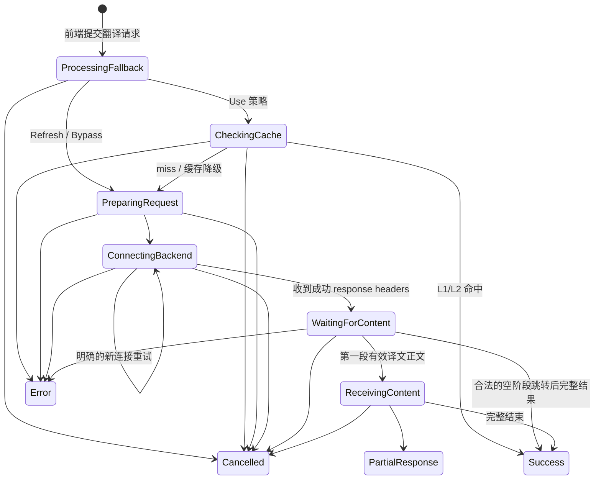
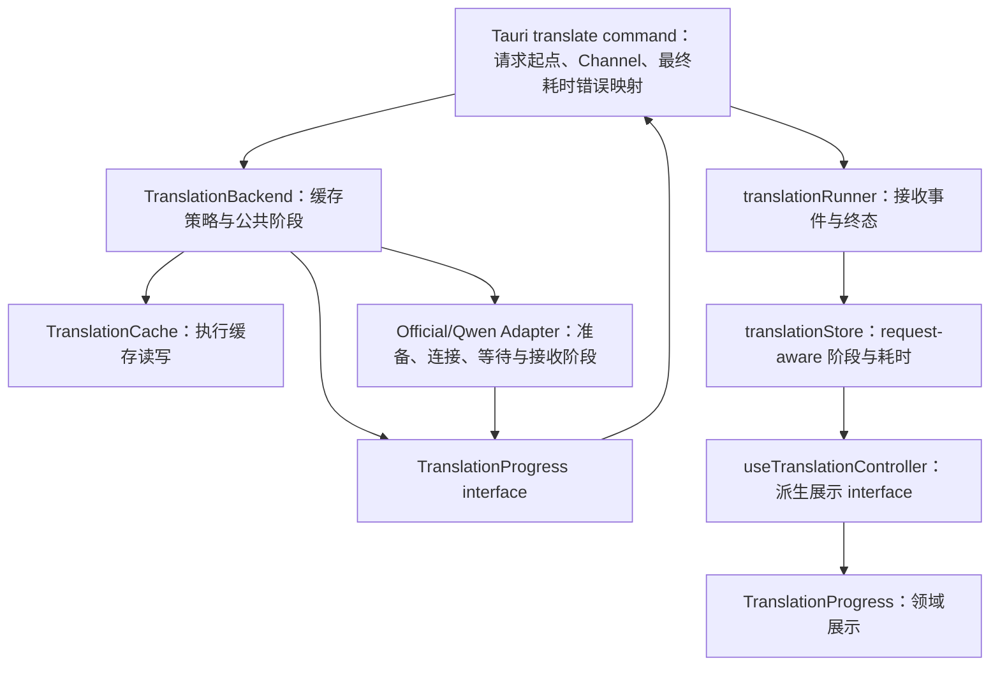

# easyT 翻译请求阶段进度需求与架构共识文档

## 0. 文档控制

| 字段 | 值 |
|---|---|
| 状态 | Approved |
| 版本 | 1.0 |
| 日期 | 2026-08-12 |
| 适用项目 | easyT 2.x |
| canonical 路径 | `docs/翻译请求阶段进度需求与架构共识文档.md` |
| 决策来源 | 项目所有者与架构评审对话 |
| 实施状态 | 已实施；自动验证完成，待真实账号与窗口人工验收 |

### 0.1 修订历史

| 版本 | 日期 | 摘要 |
|---|---|---|
| 1.0 | 2026-08-12 | 固定翻译请求五阶段、双计时、统一进度事件、展示规则与测试合同 |

> 本文是 easyT 翻译请求阶段进度功能的唯一需求与架构来源。本轮只固化共识，不包含代码、SDD、tickets、依赖或构建产物变更。

## 1. 背景与问题

当前翻译等待界面只能显示“已等待 N 秒”，无法说明时间具体花在缓存查询、请求准备、连接翻译服务、等待译文还是接收译文。尤其在 Qwen WebGateway 请求耗时约 13～15 秒时，用户难以判断应用是在正常等待、网络连接缓慢，还是已经无响应。

本需求不建设完整的诊断或监控模块，而是把当前执行中的真实阶段转换为稳定、清晰的用户状态：

```text
XXX 操作中
本阶段 N 秒 · 总计 M 秒
```

目标是提升等待期间的确定感，同时保持小体积、低内存、低复杂度，并且不改变翻译结果、缓存、latest-wins、流式输出或重新翻译的既有业务语义。

## 2. 目标

- 用真实执行阶段替换笼统的“已等待 N 秒”。
- 同时展示当前阶段耗时和本次翻译请求总耗时。
- 让缓存命中、缓存未命中、缓存旁路、Official API 与 Qwen WebGateway 都遵守同一进度 interface。
- 让一次性输出和流式输出共用同一请求级进度 Channel。
- 阶段只能由真正执行该操作的 Rust module 上报，前端不得按时间猜测。
- 阶段、耗时和后端弱提示与译文内容严格分离。
- 保持 latest-wins：只有最新翻译请求可以更新可见进度。
- 不新增依赖，不持久化阶段或耗时，不增加长期后台任务。

## 3. 非目标

- 不建设翻译请求诊断面板、历史报表、指标数据库或遥测平台。
- 不保存每个阶段的历史明细，不提供瀑布图或性能分析页面。
- 不展示 DNS、TCP、TLS、SQLite、SSE、Cookie、JSON 等实现细节。
- 不展示原文、译文、URL、Header、Cookie、API Key、模型私有参数、账号或 HTTP response body。
- 不改变翻译请求、流式输出、一次性输出、未完成译文、缓存和重新翻译的业务语义。
- 不展示选区捕获、窗口定位、窗口显示或聚焦阶段。
- 不覆盖设置页测试连接、Qwen 登录、缓存详情/清理、配置保存等非翻译操作。
- 不新增进度条、完成百分比、复杂动画或新的通用 UI Kit module。

## 4. Canonical 术语

本文继承根 `CONTEXT.md` 中的翻译领域术语，并增加以下术语：

**翻译阶段**  
一次翻译请求当前正在执行的、用户可理解的操作类别。翻译阶段不等同于翻译状态；`translating`、`streaming`、`refreshing` 等表示请求生命周期，翻译阶段表示生命周期内部正在做什么。

**阶段耗时**  
从当前真实翻译阶段开始到当前时刻的单调时间。进入新的真实阶段或开始一次明确的新连接重试时归零。

**请求总耗时**  
从正式翻译请求在 Rust command 中开始，到完整成功、失败或中断为止的单调时间。包含缓存查询、请求准备、网络连接、等待译文、接收译文与必要的完成处理；不包含选区捕获、窗口定位、显示和聚焦。

**真实阶段事件**  
由实际执行某项操作的 Rust module 上报的结构化阶段变化。前端不得根据等待时长、是否出现 Spinner 或其他推测条件构造真实阶段。

**进度兜底状态**  
前端提交翻译请求后、收到第一个真实阶段事件前显示的确定性状态“正在处理翻译请求”。它不是 Rust 翻译阶段，不参与阶段顺序与历史。

**后端弱提示**  
在访问翻译后端期间显示的次级来源信息，例如 `Official API · DeepSeek` 或 `Qwen 网页实验模式`。弱提示不参与核心成功流程，也不进入译文内容。

## 5. 适用范围

### 5.1 覆盖

- 快捷键触发的翻译请求。
- 手动输入触发的翻译请求。
- “重新翻译”触发的强制刷新请求。
- Official API 与 Qwen WebGateway。
- 流式输出与一次性输出。
- L1/L2 缓存命中、缓存未命中、缓存旁路和强制刷新。
- 成功、普通失败、收到部分正文后的中断和 latest-wins 取消。

### 5.2 不覆盖

- 选区捕获。
- 窗口定位、显示、聚焦和显示恢复。
- 设置页“测试连接”。
- Qwen 登录、重新登录与注销。
- 缓存详情读取、清除和重建。
- 配置加载与保存。
- 复制译文和固定窗口操作。

## 6. 五个用户可见阶段

第一版只定义以下五个阶段：

| 枚举 | 固定主文案 | 进入条件 |
|---|---|---|
| `checkingCache` | 正在查询本机缓存 | 实际开始可用的 L1/L2 缓存读取 |
| `preparingRequest` | 正在准备翻译请求 | 缓存未命中或旁路后，开始构造 prompt、参数、Header 及借用必要凭证 |
| `connectingBackend` | 正在连接翻译服务 | 开始发送 HTTP 请求，尚未取得成功 response headers |
| `waitingForContent` | 已连接翻译服务，正在等待译文 | 已取得成功 response headers，尚未收到第一段有效译文正文 |
| `receivingContent` | 正在接收译文 | 已收到至少一段有效译文正文，尚未完整结束 |

### 6.1 不公开 `finalizing`

完成处理通常很短，第一版不增加 `finalizing` 用户阶段。如果以后有证据证明该阶段存在稳定、可感知耗时，应作为独立需求修订本文，不能由实现方自行添加。

### 6.2 阶段真实性

- 缓存命中允许 `checkingCache → success`，不经过网络阶段。
- 缓存旁路和强制刷新未执行缓存读取，必须从 `preparingRequest` 开始。
- 缓存故障按既有非阻塞规则继续走网络，不增加错误阶段。
- 空 SSE 事件、心跳、reasoning、元数据和协议控制字段不能触发 `receivingContent`。
- 只有有效译文正文可以触发 `receivingContent`。
- 一次性输出虽然不向前端展示增量正文，但只要后端实际收到有效正文，也必须进入 `receivingContent`。
- 未执行的阶段不得为了让流程显得完整而伪造或展示。

## 7. 阶段状态机



阶段可以按真实路径跳过，但不能倒退。明确的新连接重试可以再次进入 `connectingBackend`，它属于新的阶段序列。

## 8. 统一进度事件合同

### 8.1 后端进度

现有只包含正文增量的进度 interface 扩展为两个语义类别：

```text
BackendProgress
├── PhaseChanged
│   ├── sequence
│   ├── phase
│   ├── totalElapsedMs
│   └── backend?
└── ContentDelta
    └── delta
```

Tauri Channel 事件必须携带当前 `requestId`：

```text
TranslationProgressEvent
├── PhaseChanged
│   ├── requestId
│   ├── sequence
│   ├── phase
│   ├── totalElapsedMs
│   └── backend?
└── ContentDelta
    ├── requestId
    └── delta
```

### 8.2 Sequence

- `sequence` 只在当前请求内存在，从 1 开始严格递增。
- 相同 `requestId + sequence` 是重复事件，前端忽略，不重置阶段计时。
- sequence 小于当前值的是迟到事件，前端忽略。
- sequence 更大时，即使 phase 与当前相同，也表示一次真实的新阶段或重试，阶段耗时重新开始。
- 用户界面不显示 sequence 或重试次数。

### 8.3 结构化后端来源

事件不传递最终中文 `backendLabel`，而是传稳定的结构化来源：

```text
backend?
├── mode
└── provider
```

前端翻译领域统一映射弱提示，Adapter 不得传递任意用户文案或上游响应文字。

### 8.4 统一 Channel

一次性输出与流式输出必须共用请求级进度 Channel：

- 一次性输出接收 `PhaseChanged`，不向可见译文发送 `ContentDelta`。
- 流式输出接收 `PhaseChanged` 和 `ContentDelta`。
- 两种模式最终结果仍由 command 返回。
- 设置中的“流式输出”含义不变。
- 不长期维护“有进度 Channel”与“无进度 Channel”的两套翻译调用路径。

## 9. 时间权威与同步

### 9.1 Rust 为权威

- Rust 使用单调时钟计算请求总耗时，不能使用系统墙上时间。
- 请求开始点位于正式翻译请求进入 Rust command 后，不包含选区捕获和窗口操作。
- 每个 `PhaseChanged` 携带该阶段发生时的 `totalElapsedMs`。
- 成功结果携带最终 `totalElapsedMs`。
- 已正式开始的失败或中断通过结构化 command error 携带 `totalElapsedMs`。
- 配置预检查、空文本等未进入正式请求的错误可以不携带耗时。
- 阶段与耗时不写入配置、L1、L2、文件或数据库。

### 9.2 前端显示

- 前端收到阶段事件后，以事件的 `totalElapsedMs` 同步权威总耗时。
- 在下一次后端事件或终态前，前端使用本地单调计时器继续显示当前阶段与总耗时。
- 阶段切换时阶段耗时归零，总耗时不归零。
- 明确的新连接重试带新 sequence，阶段耗时归零，总耗时继续累计。
- 重复或迟到事件不改变任何计时起点。
- 成功或失败后只显示 Rust 返回的最终权威总耗时。

### 9.3 显示精度

等待期间：

- 小于 1 秒：显示 `不足 1 秒`。
- 大于等于 1 秒：向下取整为整数秒。

完成、失败或中断后：

- 小于 100ms：显示 `不足 0.1 秒`。
- 100ms～9.95s：四舍五入保留 1 位小数。
- 大于等于 9.95s：四舍五入为整数秒。

示例：

| 原始耗时 | 展示 |
|---:|---|
| 56ms | 不足 0.1 秒 |
| 840ms | 0.8 秒 |
| 9.84s | 9.8 秒 |
| 9.96s | 10 秒 |
| 14.6s | 15 秒 |

## 10. 前端状态所有权

现有 `TranslationStatus` 继续表示翻译请求生命周期：

```text
idle | translating | streaming | refreshing | success | error
```

翻译阶段是独立维度，不扩张 `TranslationStatus` 枚举。翻译状态应增加等价于以下信息：

```text
phase: TranslationPhase | null
phaseSequence: number | null
phaseStartedAt: monotonic timestamp | null
phaseStartedTotalElapsedMs: number | null
totalElapsedMs: number | null
backendSource: structured source | null
```

具体字段名可以在后续实施设计中调整，但以下不变量不可改变：

- 只有当前 `requestId` 的阶段事件可写入状态。
- 新请求开始时清除旧请求的阶段、sequence 和成功耗时。
- success/error 后清除活动阶段，但保留最终总耗时。
- latest-wins 取消的旧请求不保留耗时，也不能覆盖新请求。
- reset 到 idle 时清空阶段和耗时。
- 切换设置页再返回时，如果当前翻译结果仍在 store，总耗时继续保留。
- 应用重启后不恢复阶段或耗时。

## 11. 前端兜底状态

请求提交后、收到第一个真实阶段事件前，前端立即显示：

```text
正在处理翻译请求
总计不足 1 秒
```

规则：

- 兜底状态不是 `TranslationPhase`，不分配 sequence。
- 它只表达“翻译请求已经提交”这一确定事实，不声称正在查询缓存或连接网络。
- 收到第一个真实阶段事件后立即替换。
- 如果整个请求没有阶段事件，继续显示 `正在处理翻译请求 · 总计 N 秒`。
- 不恢复当前“如长时间无响应请检查网络与 API 配置”的猜测性提示。

## 12. 后端弱提示

### 12.1 显示范围

只在真实访问翻译后端时显示：

- `preparingRequest`
- `connectingBackend`
- `waitingForContent`
- `receivingContent`

`checkingCache` 不显示供应商，因为翻译缓存跨翻译后端、供应商和模型共享。

### 12.2 固定映射

| 结构化来源 | 弱提示 |
|---|---|
| Qwen WebGateway | `Qwen 网页实验模式` |
| 内置 Official API | `Official API · {供应商展示名}` |
| 自定义 Official API | `Official API · 自定义供应商` |
| 无法识别的 Official 来源 | `Official API` |

不显示模型名、Base URL、账号、凭证或上游文字。模型名可能较长，也不是理解当前阶段所必需的信息。

## 13. UI 展示规则

### 13.1 Module 归属

新增或演进后的进度展示属于翻译领域，建议 seam：

```text
src/components/translation/TranslationProgress.tsx
```

- 不新增通用 UI Kit module。
- 复用正式 UI Kit 的 `Spinner` 和现有 tokens。
- 现有 `LoadingState` 应被替换或收敛为内部 implementation，不长期保留两套进度入口。
- 不使用 `StatusBanner`，因为翻译进度是正常运行状态，不是通知或异常。
- 不创建只包装 className 的浅 module。

### 13.2 首段正文前

使用当前紧凑、居中的等待区域：

```text
        Spinner
正在连接翻译服务
Official API · DeepSeek
本阶段 2 秒 · 总计 3 秒
```

- 每个真实阶段收到后立即渲染，不设置 200ms 防闪烁或最小停留时间。
- 快速缓存命中可能短暂闪现某个阶段，这是已接受的交互结果。
- 不使用进度条，因为无法得知完成百分比。
- 不新增颜色和复杂动画。

### 13.3 有可见译文后

- 流式输出收到首段正文后，完整等待区域消失，优先展示可见译文。
- `TranslationProgress` 移到译文内容下方，显示 `正在接收译文 · 本阶段 N 秒 · 总计 M 秒`。
- 重新翻译保留旧缓存译文时，同一个进度 module 显示在旧译文下方。
- 重新翻译不使用专门的“正在重新翻译”阶段或文案，完全复用普通翻译阶段。
- 进度不进入 Markdown 容器，不参与复制。

### 13.4 成功

完整成功后，在译文下方显示：

```text
本次翻译耗时 14 秒
```

缓存快速命中可能显示：

```text
本次翻译耗时不足 0.1 秒
```

- 缓存来源继续由现有独立缓存提示展示，不在耗时文案中重复。
- 成功后不显示阶段历史、供应商或模型。
- 耗时与译文内容分离，不参与复制或 Markdown 渲染。

### 13.5 失败与中断

| 结果 | 耗时文案 |
|---|---|
| 普通失败 | `请求在 15 秒后失败` |
| 已收到部分正文后中断 | `请求在 15 秒后中断` |
| 重新翻译失败 | 保留旧缓存译文和现有刷新错误，并显示 `请求在 15 秒后失败` |
| latest-wins 取消 | 不展示被取消旧请求的耗时 |

失败界面不展示完整阶段历史。错误类型、友好文案、可重试规则和未完成译文语义继续使用当前实现。

### 13.6 最小窗口

- 在 `360×200` 下，主文案、弱提示和双计时允许自然换行。
- 不压缩既定字体或控件尺寸。
- 有可见译文时，进度与耗时不得遮挡正文或主要操作。
- 大窗口继续遵守合理 max-width，不拉伸成性能仪表盘。

## 14. 重新翻译规则

重新翻译保留已验收的缓存刷新语义：

- 当前为同一原文的完整缓存译文时，旧译文继续可见。
- 强制刷新实际绕过缓存读取，因此不展示 `checkingCache`。
- 其余阶段、主文案、弱提示、阶段耗时和总耗时与普通翻译完全一致。
- 不增加 `refreshingCache`、`retranslating` 等专用阶段。
- 成功后替换旧译文并展示新请求总耗时。
- 失败后保留旧译文、缓存来源提示和现有刷新错误，同时展示本次失败耗时。

## 15. 一次性输出与流式输出

### 15.1 共同规则

- 两者使用同一五阶段状态机和进度 Channel。
- 两者由相同 Rust 时间权威计算总耗时。
- 两者都必须进入真实发生的 `receivingContent` 阶段。
- 两者成功后都只返回完整译文和最终耗时。

### 15.2 一次性输出

- 接收阶段事件，但不向前端发送可见正文增量。
- 后端收到第一段有效正文时显示 `正在接收译文`。
- 完整成功前不展示部分译文。

### 15.3 流式输出

- 第一段有效正文触发 `receivingContent` 和正文增量。
- 从第一段有效正文到完整结束为 receivingContent 阶段耗时。
- 正文出现后，进度移到译文下方。
- 中断时继续按现有规则保留并标记未完成译文。

## 16. Latest-wins 与并发

- 现有 latest-wins 继续作为翻译请求的唯一并发控制者。
- 进度功能不得创建第二套请求代次或取消机制。
- 每个进度事件必须携带 `requestId`。
- 前端只有在 `requestId` 仍为当前请求时才接受事件。
- 新请求开始后，旧请求的阶段、sequence、正文增量、成功、错误和耗时全部失效。
- Rust future 被 abort 后不应继续产生可见阶段或正文事件。
- latest-wins 取消不显示旧请求失败耗时，也不短暂覆盖新请求的兜底状态。

## 17. 重试与阶段顺序

- 重试策略本身不由本需求新增或扩大，继续遵守各 Adapter 的既有有限重试规则。
- 开始一次明确的新连接尝试时，可以再次发送 `connectingBackend`，但必须使用更大的 sequence。
- 新 sequence 的同阶段事件重置阶段耗时，总耗时不重置。
- 传输重复造成的同 sequence 事件被忽略。
- 更小 sequence、已结束请求或非当前 requestId 的事件被忽略。
- 非法阶段倒退被忽略并记录脱敏 warning，不能导致翻译失败。
- 不向用户显示“第 N 次重试”，避免暴露不稳定实现和增加视觉噪声。

## 18. 错误与降级

### 18.1 结构化失败耗时

翻译 command 的结构化错误可增加：

```text
kind
message
totalElapsedMs?
```

- 已正式开始的翻译请求失败或中断时必须携带最终总耗时。
- 未进入正式请求的校验错误可以不携带耗时。
- 现有错误类别、友好文案和 retryable 映射不改变。
- 其他非翻译 Tauri command 的错误合同不受影响。

### 18.2 进度发送失败

- 发送 `PhaseChanged` 失败：记录脱敏 warning，但翻译继续。
- 发送 `ContentDelta` 失败：保持当前行为，视为流式输出调用方已经离开并取消请求。
- 阶段进度是辅助用户体验，不能成为翻译成功的必要条件。
- 任何日志不得记录原文、译文、凭证、请求正文或完整响应。

### 18.3 无阶段事件

如果由于兼容或内部故障整个请求没有收到阶段事件：

- 前端保留进度兜底状态。
- 显示 `正在处理翻译请求 · 总计 N 秒`。
- 不猜测缓存、连接或等待正文阶段。
- 最终成功或失败仍使用 Rust 返回的权威总耗时。

## 19. 模块职责与 seam



### 19.1 Tauri command

负责：

- 建立请求级进度 Channel。
- 为事件补充 requestId。
- 建立 Rust 单调总计时起点或承接唯一权威计时上下文。
- 对成功结果和翻译错误映射最终 `totalElapsedMs`。
- 保持 latest-wins 取消行为。

不负责：

- 推测具体缓存或网络阶段。
- 生成供应商私有文案。
- 持久化耗时。

### 19.2 TranslationBackend

负责：

- 决定 Use/Refresh/Bypass 的真实阶段路径。
- 在实际缓存读取前上报 `checkingCache`。
- 缓存 miss/旁路后进入 `preparingRequest` 路径。
- 保持缓存错误不阻断翻译。
- 协调公共阶段顺序与总耗时上下文。

### 19.3 Adapter

负责：

- 在实际准备、send、成功 headers、有效正文等真实位置上报对应阶段。
- 提供结构化翻译后端来源。
- 明确重试时发送新 sequence。
- 保持 Qwen/Official 私有协议位于各自 Adapter 内。

不负责：

- 传递任意中文阶段文案。
- 直接修改前端状态。
- 把 reasoning 或心跳当作正文。

### 19.4 translationRunner 与 store

负责：

- 通过统一 Channel 接收阶段和正文事件。
- 对 requestId、sequence 和 latest-wins 进行 request-aware 校验。
- 保存当前阶段、双计时同步点、结构化来源和最终总耗时。
- success/error/cancel 时按本文清理或保留状态。

### 19.5 翻译领域 UI

负责：

- 将固定枚举映射为本文规定的中文主文案。
- 将结构化后端来源映射为弱提示。
- 按精度规则格式化阶段耗时和总耗时。
- 根据是否已有可见译文选择完整或紧凑布局。
- 保持进度、耗时与 Markdown/复制内容分离。

## 20. 无障碍

- 阶段发生有意义变化时使用 `aria-live="polite"` 播报一次。
- 每秒变化的阶段耗时和总耗时不进入 live region，避免持续打断屏幕阅读器。
- 首次进入 `receivingContent` 时播报一次“正在接收译文”。
- success、error 和未完成译文继续使用现有语义。
- Spinner 无独立 label 时作为装饰，避免与阶段文案重复播报。
- 状态不能只依赖颜色；主文案始终可见。
- 尊重 `prefers-reduced-motion`；不因进度功能增加非必要动画。
- 最小窗口与键盘行为继续遵守 UI Kit 共识文档。

## 21. 性能、体积与隐私

- 不新增运行时或开发依赖。
- 前端最多使用一个当前可见请求的 1 秒 UI 计时器。
- 请求终止、替换或组件卸载时必须清理计时器。
- 不创建全局永久 timer、listener、后台 worker 或新 Zustand store。
- 阶段事件是低频状态变化，不按每个 SSE chunk 上报阶段。
- 正文增量继续使用既有批处理，不能因阶段显示增加 React 高频渲染。
- 不持久化阶段、sequence、时间或后端弱提示。
- 不记录原文、译文、API Key、Cookie、ticket、URL query、Header、完整响应或账号。
- 不增加诊断导出、历史统计或网络请求。
- 应记录 production JS/CSS gzip 前后变化，并遵守 UI Kit 既有预算。

## 22. 测试合同

### 22.1 Rust TranslationBackend

- Use 命中：`checkingCache → success`，不调用 Adapter。
- Use miss：`checkingCache → preparingRequest → Adapter stages`。
- Refresh/Bypass：不出现 checkingCache。
- 缓存降级继续走网络，阶段顺序有效。
- 阶段发送失败不改变翻译结果。

### 22.2 Official/Qwen Adapter

- 准备、连接、成功 headers、等待正文、第一段有效正文和完成阶段位置正确。
- reasoning、心跳、空 delta 不触发 receivingContent。
- 明确重试产生更大的 sequence 并重置连接阶段耗时。
- 401/403、429、timeout、5xx、协议变化和部分响应保留现有错误分类。
- 一次性输出和流式输出使用相同阶段语义。

### 22.3 Tauri command

- 一次性输出和流式输出均建立统一进度 Channel。
- 每个事件携带正确 requestId。
- sequence 严格递增。
- 成功结果包含最终 totalElapsedMs。
- 已开始的失败包含 totalElapsedMs，预检查错误可以没有。
- latest-wins abort 后旧请求不再产生可见事件。

### 22.4 translationStore/runner

- 只接受当前 requestId 的阶段事件。
- 重复 sequence、迟到 sequence 和旧请求事件被忽略。
- 新 sequence 的同阶段重试重置阶段耗时。
- 新请求清理旧阶段和耗时。
- success/error 保留最终总耗时并清除活动阶段。
- latest-wins 取消不保留旧请求耗时。
- 页面切换后当前结果耗时仍可恢复展示，应用重启不恢复。

### 22.5 翻译领域 UI

- 五阶段固定文案准确。
- 进度兜底不冒充真实阶段。
- 阶段耗时与总耗时同时显示。
- 等待与最终耗时精度和舍入规则准确。
- checkingCache 不显示供应商，网络阶段显示正确弱提示。
- 首段正文后使用紧凑布局。
- 成功、缓存命中、失败、未完成译文和重新翻译失败的耗时文案准确。
- 阶段、耗时不进入 Markdown 或复制内容。
- live region 只播报阶段变化，不每秒播报计时。

### 22.6 回归与手工验证

- 缓存 hit/miss/bypass/refresh 行为不变。
- 流式输出、一次性输出、未完成译文、重新翻译、复制和 latest-wins 行为不变。
- 使用真实或可控慢响应验证 Qwen 长等待阶段。
- 验证 Official API 和 Qwen WebGateway。
- 验证快速缓存命中。
- 验证默认 `520×390` 与最小 `360×200`。
- 验证屏幕阅读器不会每秒播报计时。

### 22.7 必须执行

```powershell
npm run typecheck
npm test
npm run build
cargo test --manifest-path src-tauri/Cargo.toml
cargo build --release --manifest-path src-tauri/Cargo.toml
git diff --check
```

## 23. 验收示例

### 23.1 缓存未命中

```text
正在查询本机缓存
本阶段不足 1 秒 · 总计不足 1 秒

正在连接翻译服务
Qwen 网页实验模式
本阶段 1 秒 · 总计 2 秒

已连接翻译服务，正在等待译文
Qwen 网页实验模式
本阶段 10 秒 · 总计 12 秒

正在接收译文
Qwen 网页实验模式
本阶段 2 秒 · 总计 14 秒

[完整译文]
本次翻译耗时 15 秒
```

### 23.2 缓存命中

```text
正在查询本机缓存
本阶段不足 1 秒 · 总计不足 1 秒

[完整译文]
本次翻译耗时不足 0.1 秒

[独立缓存来源提示]
```

### 23.3 重新翻译

```text
[旧缓存译文继续显示]

已连接翻译服务，正在等待译文
Official API · DeepSeek
本阶段 6 秒 · 总计 8 秒
```

不出现“正在重新翻译”专用阶段。成功后替换译文；失败后保留旧译文与既有刷新错误。

### 23.4 未完成译文

```text
[未完成译文]
请求在 15 秒后中断
```

### 23.5 没有阶段事件的降级

```text
正在处理翻译请求
总计 4 秒
```

## 24. Definition of Done

- [ ] 当前笼统的“已等待 N 秒”及猜测性慢请求提示已移除。
- [ ] 五个用户可见阶段按真实执行位置上报，未执行阶段不展示。
- [ ] 阶段事件包含 requestId、sequence、phase、totalElapsedMs 和可选结构化后端来源。
- [ ] 一次性输出和流式输出共用请求级进度 Channel。
- [ ] Rust 单调时钟是最终耗时权威；前端只同步并持续显示。
- [ ] 等待期间同时展示阶段耗时与请求总耗时。
- [ ] 成功、缓存命中、失败和未完成译文按本文显示最终耗时。
- [ ] 重新翻译保持旧缓存译文语义，复用普通阶段且不增加专用状态。
- [ ] checkingCache 不显示供应商，网络阶段使用结构化来源弱提示。
- [ ] 进度和耗时与 Markdown、译文复制内容分离。
- [ ] 阶段变化只播报一次，秒数视觉更新不进入 live region。
- [ ] latest-wins 同时保护阶段、正文、结果和耗时。
- [ ] 重复、迟到、非法倒退和旧请求事件不会污染当前状态。
- [ ] PhaseChanged 发送失败不影响翻译；ContentDelta 失败保持现有取消语义。
- [ ] 阶段与耗时不持久化、不包含敏感数据、不产生新诊断历史。
- [ ] 不新增依赖、长期 timer/listener、后台任务或新 store。
- [ ] Official API、Qwen、缓存 hit/miss/bypass/refresh、流式/一次性测试通过。
- [ ] 默认和最小窗口、键盘及无障碍人工验收通过。
- [ ] typecheck、前端测试/构建、Rust 测试和 release 构建通过。
- [ ] 最终报告包含阶段映射、事件合同、测试证据、视觉变化和 bundle 变化。

## 25. 已批准的取舍

- 每个阶段立即渲染，接受快速阶段可能短暂闪现，不设置防闪烁阈值。
- 同时显示阶段耗时和总耗时，接受相较当前界面增加一行信息。
- 成功后保留总耗时，但不保留各阶段历史。
- 缓存命中同样显示总耗时。
- 重新翻译不增加专用阶段或文案。
- 供应商采用弱提示，主阶段文案保持翻译后端无关。
- 不把模型名放入进度界面。
- 不为进度功能建设通用 pattern 或诊断模块。
- 阶段信息是辅助体验；其发送失败不能阻断翻译。

## 26. 后续文档边界

本文批准的是需求与架构共识，不是实施授权。后续如需实施，应另行生成可执行 SDD 或 tickets，并再次核对仓库现实。

任何以下变化必须先修订本文并由项目所有者批准：

- 增减用户可见阶段。
- 改变阶段固定文案或时间定义。
- 增加历史记录、诊断面板、遥测或持久化。
- 把模型、账号或敏感网络信息加入进度界面。
- 改变 latest-wins、缓存、流式输出或重新翻译语义。
- 新增依赖或通用 UI Kit module。
